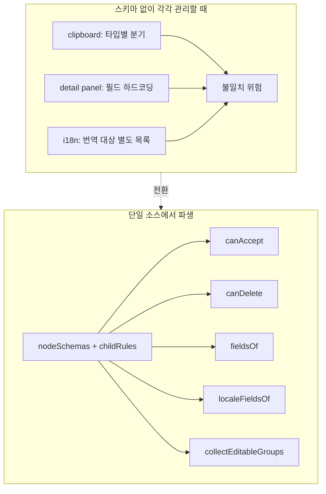
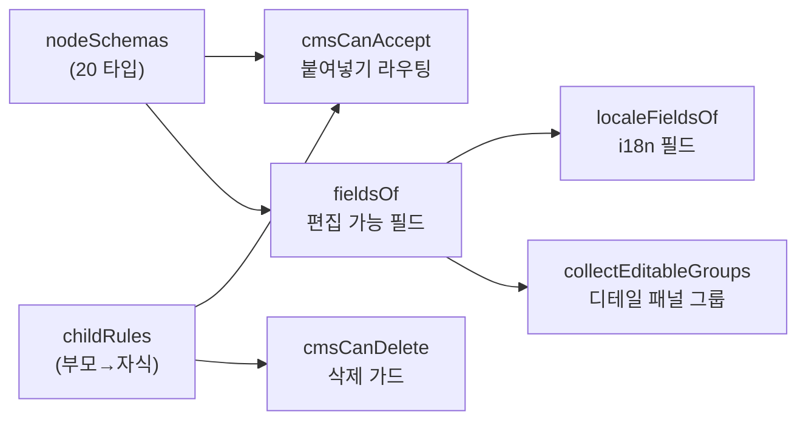
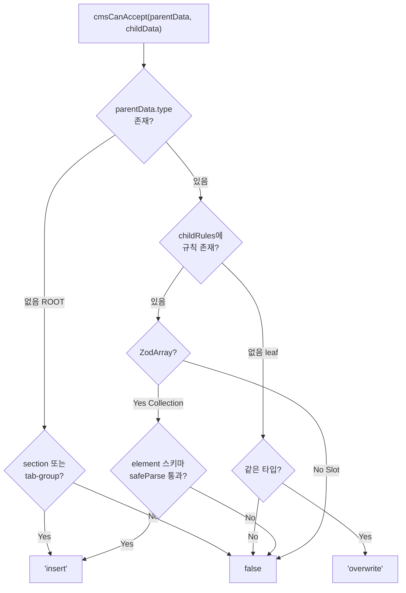

# cms-schema.ts — Zod 스키마 기반 CMS 데이터 모델 단일 소스

> 작성일: 2026-03-23
> 맥락: CMS의 타입 파생 구조가 복잡하여 Zod 스키마가 데이터 모델부터 UI 동작까지 어떻게 연결되는지 정리

> **Situation** — CMS는 20종의 노드 타입으로 구성된 트리 구조를 편집한다. 클립보드, 디테일 패널, i18n 등 여러 기능이 노드의 구조 정보를 필요로 한다.
> **Complication** — 각 기능마다 노드 타입 정보를 별도로 관리하면 불일치가 발생하고, 노드 타입 추가 시 N곳을 수정해야 한다.
> **Question** — 하나의 스키마 정의에서 모든 파생 동작을 어떻게 끌어내는가?
> **Answer** — `nodeSchemas`(노드별 Zod 스키마)와 `childRules`(부모-자식 관계 규칙) 두 테이블에서 5가지 파생물을 생성한다: canAccept(붙여넣기 라우팅), canDelete(삭제 가드), fieldsOf(편집 필드), localeFieldsOf(i18n 필드), collectEditableGroups(디테일 패널 그룹).

---

## Why — 왜 Zod 스키마가 단일 소스여야 하는가?

CMS는 정규화된 트리(`NormalizedData`)를 다루는데, 이 트리의 각 노드가 어떤 필드를 가지고, 어떤 부모-자식 관계가 허용되는지에 따라 여러 기능의 동작이 달라진다.



핵심 동기는 **노드 타입을 추가하거나 변경할 때 `cms-schema.ts` 한 파일만 수정하면 모든 기능이 자동으로 따라오는 구조**를 만드는 것이다.

---

## How — 스키마 설계와 파생 메커니즘

### 1계층: 원시 정의 (nodeSchemas + childRules)

`nodeSchemas`는 20개 노드 타입의 Zod 스키마를 정의한다. 각 필드의 `.describe()`가 UI 라벨 역할을 겸한다.

```typescript
const nodeSchemas = {
  text: z.object({
    type: z.literal('text'),
    role: z.string(),
    value: localeMapSchema.describe('Text'),  // describe = UI 라벨
  }),
  // ... 20개 타입
}
```

`childRules`는 부모 타입별로 허용하는 자식을 선언한다. **배열 여부가 Collection과 Slot을 구분**하는 핵심 판별자다.

```typescript
const childRules = {
  // Collection (z.array) — 자식 추가/삭제/재정렬 가능
  section: z.array(z.discriminatedUnion('type', [...])),
  links:   z.array(z.discriminatedUnion('type', [nodeSchemas.link])),

  // Slot (non-array) — 고정 구조, 자식 삭제 불가
  card: z.discriminatedUnion('type', [nodeSchemas.icon, nodeSchemas.text]),
  stat: z.discriminatedUnion('type', [nodeSchemas['stat-value'], nodeSchemas.text]),
}
```

### 2계층: 5개 파생물



| 파생물 | 입력 | 출력 | 소비자 |
|--------|------|------|--------|
| `cmsCanAccept` | parentData, childData | `'insert'` / `'overwrite'` / `false` | clipboard 플러그인 (CmsLayout) |
| `cmsCanDelete` | parentData | `boolean` | clipboard, CmsCanvas, CmsFloatingToolbar |
| `fieldsOf` → `getEditableFields` | node data | `EditableField[]` | CmsDetailPanel, cms-renderers |
| `localeFieldsOf` | node type | `string[]` | cmsI18nAdapter |
| `collectEditableGroups` | store, nodeId, locale | `EditableGroup[]` | CmsDetailPanel |

### canAccept 판정 로직

`cmsCanAccept`는 3단계로 판정한다:



이 함수는 clipboard 플러그인의 `findPasteTarget`에서 트리를 위로 탐색하며 호출된다. 포커스된 노드에서 시작해 첫 번째로 `'insert'`를 반환하는 조상을 찾아 거기에 붙여넣는다.

### fieldsOf와 describe() 규약

`fieldsOf`는 Zod 스키마의 shape을 순회하며 `.description`이 있는 필드만 추출한다. `type` 필드는 구조 식별자이므로 제외한다.

```typescript
function fieldsOf(type: string): EditableField[] {
  const shape = schema.shape
  return Object.entries(shape)
    .filter(([key, fieldSchema]) => key !== 'type' && fieldSchema.description !== undefined)
    .map(([key, fieldSchema]) => ({
      field: key,
      label: fieldSchema.description!,
      isLocaleMap: isLocaleMapShape(fieldSchema),
    }))
}
```

`isLocaleMap` 판별은 `localeMapSchema`(ko/en/ja 키를 가진 ZodObject)와 형태가 같은지 확인한다. 이 플래그로 디테일 패널은 일반 텍스트 입력과 다국어 입력을 구분하고, `localeFieldsOf`는 i18n 번역 대상 필드만 걸러낸다.

---

## What — 실제 타입별 파생 결과

### Collection vs Slot 분류

| 유형 | 부모 타입 | 허용 자식 | 삭제 가능 |
|------|----------|----------|----------|
| **Collection** | section | card, stat, step, pattern, badge, text, cta, section-label/title/desc, icon, link, brand, links | O |
| **Collection** | links | link | O |
| **Collection** | tab-group | tab-item | O |
| **Slot** | card | icon, text | X |
| **Slot** | step | step-num, text | X |
| **Slot** | stat | stat-value, text | X |
| **Slot** | tab-item | tab-panel | X |
| **Slot** | tab-panel | section | X |
| **Leaf** | text, badge, cta, ... | (없음) | 부모에 따라 다름 |

### 편집 가능 필드 예시

| 노드 타입 | 필드 | 라벨 | isLocaleMap |
|-----------|------|------|-------------|
| text | value | Text | true |
| cta | primary | Primary CTA | true |
| cta | secondary | Secondary CTA | true |
| link | label | Label | true |
| link | href | URL | false |
| stat-value | value | Value | false |
| tab-item | label | Label | true |
| tab-group | (없음) | - | - |

`describe()`가 없는 필드(`type`, `role`, `variant` 등)는 편집 대상에서 자동 제외된다.

---

## If — 제약과 확장 포인트

### 현재 제약

1. **childRules는 런타임 스키마 검증용이지 TypeScript 타입 추론용이 아니다.** `childRules`의 값 타입이 `z.ZodType`이라 TS 수준에서 부모-자식 관계를 추론할 수 없다. 이는 의도적이다 — 런타임 safeParse만 필요하기 때문이다.

2. **2단계 깊이 제한.** `collectEditableGroups`는 노드 → 자식 → 손자까지만 탐색한다. CMS 데이터 모델이 이 깊이를 넘지 않는 전제에 의존한다.

3. **overwrite는 같은 타입 간에만 가능.** leaf 노드끼리 타입이 다르면 붙여넣기가 거부된다. 타입 변환(예: text를 badge로)은 지원하지 않는다.

### 노드 타입 추가 시 체크리스트

1. `nodeSchemas`에 Zod 스키마 추가 (편집 필드에 `.describe()` 부여)
2. 컨테이너면 `childRules`에 규칙 추가 (Collection이면 `z.array`, Slot이면 단일 union)
3. 기존 부모의 `childRules` union에 새 타입 포함
4. 끝 — `canAccept`, `canDelete`, `fieldsOf`, `localeFieldsOf`, `collectEditableGroups`는 자동으로 새 타입을 인식한다

---

## 부록: 소비자 파일 맵

| 소비자 파일 | 사용하는 파생물 |
|------------|---------------|
| `CmsLayout.tsx` | `cmsCanAccept`, `cmsCanDelete` |
| `CmsCanvas.tsx` | `cmsCanDelete` |
| `CmsFloatingToolbar.tsx` | `cmsCanDelete` |
| `CmsDetailPanel.tsx` | `collectEditableGroups`, `EditableGroup` |
| `cms-renderers.tsx` | `getEditableFields` (re-export) |
| `cmsI18nAdapter.ts` | `localeFieldsOf` |
