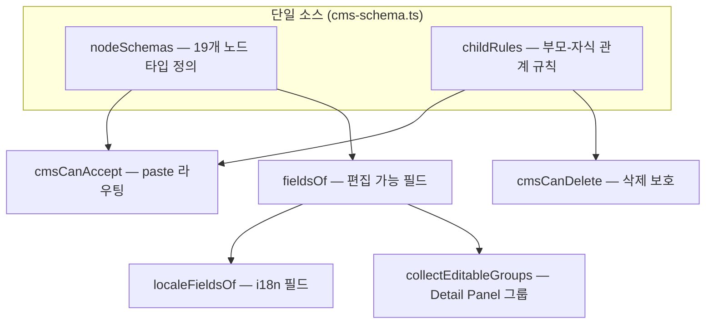
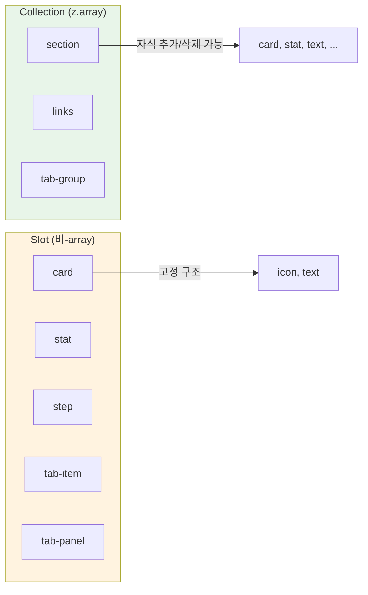
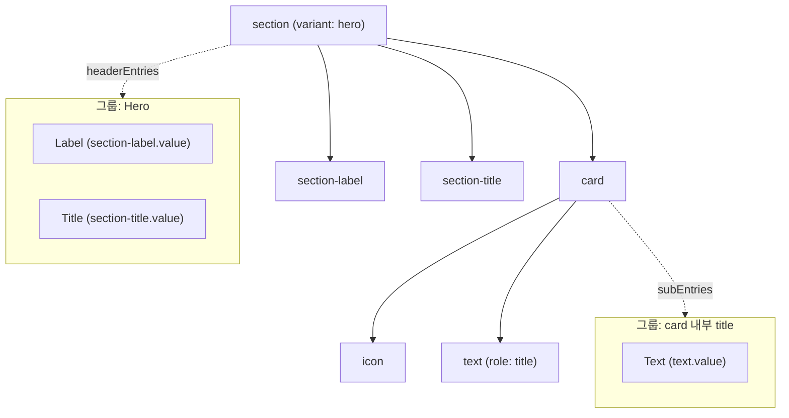

# cms-schema.ts — Zod 단일 소스에서 CMS 전체 데이터 규칙을 파생한다

> 작성일: 2026-03-23
> 맥락: CMS의 타입 파생 구조가 복잡해 전체 흐름을 정리하기 위해 작성

> **Situation** — cms-schema.ts는 CMS 데이터 모델의 단일 소스로, 19개 노드 타입과 자식 규칙을 Zod 스키마로 정의한다.
> **Complication** — 이 하나의 파일에서 paste 라우팅, 삭제 보호, 편집 필드 추출, i18n 필드 추출, 그룹화된 편집 패널까지 5가지 파생물이 나온다. 파생 경로를 모르면 스키마 변경의 영향 범위를 예측할 수 없다.
> **Question** — Zod 스키마가 어떤 구조로 정의되고, 각 파생물은 어떤 메커니즘으로 스키마에서 도출되는가?
> **Answer** — nodeSchemas(노드 형태)와 childRules(부모-자식 관계)라는 2개의 정의만으로, Zod의 런타임 introspection(safeParse, instanceof, shape, description)을 활용해 5가지 행위를 파생한다.

---

## CMS는 타입 정의와 행위 규칙을 분리하면 유지보수 비용이 폭발한다

CMS 노드는 19가지 타입이 있고, 각 노드의 paste 가능 여부, 삭제 가능 여부, 편집 가능 필드, i18n 대상 필드가 모두 다르다. 이들을 각각 별도로 관리하면 노드 타입 하나를 추가할 때마다 최소 5곳을 동기화해야 한다. cms-schema.ts는 이 문제를 "Zod 스키마 하나에서 전부 파생"하는 방식으로 해결한다.



노드 타입을 추가하려면 nodeSchemas에 한 행, childRules에 해당 규칙 한 행만 추가하면 5가지 파생물이 자동으로 갱신된다.

---

## 2개의 테이블이 전체 데이터 모델을 결정한다

cms-schema.ts의 핵심 구조는 단 2개의 객체다.

### nodeSchemas: 노드의 형태를 선언한다

`nodeSchemas`는 19개 노드 타입 각각의 Zod 객체 스키마를 담는다. 모든 스키마는 `type` 필터를 가진 `z.object()`이며, 편집 가능한 필드에는 `.describe()`로 UI 라벨을 부여한다.

```typescript
const nodeSchemas = {
  text: z.object({
    type: z.literal('text'),
    role: z.string(),
    value: localeMapSchema.describe('Text'),  // describe = "이 필드는 편집 가능"
  }),
  card: z.object({ type: z.literal('card') }),  // describe 없음 = 편집 필드 없음
  // ... 17개 더
} as const
```

핵심 규칙:
- `.describe()`가 있는 필드 = Detail Panel에서 편집 가능
- `localeMapSchema` 타입 필드 = i18n 번역 대상
- `.describe()`가 없는 `type`, `role` 등 = 구조적 필드, 편집 불가

### childRules: Collection과 Slot을 구분한다

`childRules`는 부모 타입별로 어떤 자식을 받을 수 있는지를 Zod 타입으로 정의한다. 여기서 `z.array()`와 비-array의 구분이 CMS의 핵심 설계를 결정한다.

```typescript
const childRules = {
  // Collection (z.array) — 자식 추가/삭제/재정렬 가능
  section: z.array(z.discriminatedUnion('type', [
    nodeSchemas.card, nodeSchemas.stat, /* ... */
  ])),
  links: z.array(z.discriminatedUnion('type', [nodeSchemas.link])),

  // Slot (비-array) — 고정 구조, 자식 삭제 불가
  card:  z.discriminatedUnion('type', [nodeSchemas.icon, nodeSchemas.text]),
  stat:  z.discriminatedUnion('type', [nodeSchemas['stat-value'], nodeSchemas.text]),
}
```



| 구분 | Zod 타입 | paste | delete | 예시 |
|------|----------|-------|--------|------|
| Collection | `z.array(discriminatedUnion)` | insert 허용 | 자식 삭제 허용 | section, links, tab-group |
| Slot | `discriminatedUnion` (비-array) | 거부 | 자식 삭제 불가 | card, stat, step, tab-item |
| Leaf | childRules에 없음 | 같은 타입이면 overwrite | 해당 없음 | text, badge, icon |

이 Collection/Slot 이분법이 paste, delete, 편집 그룹화의 기반이 된다.

---

## Zod의 4가지 런타임 API로 5개 파생물을 도출한다

스키마 정의 자체는 정적이지만, 파생물들은 Zod의 런타임 introspection을 활용한다. 사용되는 API는 4가지다.

| Zod API | 용도 | 사용처 |
|---------|------|--------|
| `safeParse()` | 데이터가 스키마에 부합하는지 검증 | cmsCanAccept — paste 허용 판단 |
| `instanceof z.ZodArray` | 스키마가 배열인지 확인 | cmsCanAccept/cmsCanDelete — Collection vs Slot 구분 |
| `.shape` | 객체 스키마의 필드 정의 접근 | fieldsOf — 편집 가능 필드 추출 |
| `.description` | 필드에 부여된 라벨 읽기 | fieldsOf — UI 라벨 + 편집 가능 여부 판단 |

### 파생 1: cmsCanAccept — paste 라우팅

클립보드 paste 시 "이 부모에 이 자식을 붙일 수 있는가?"를 판단한다. clipboard 플러그인에 `canAccept` 옵션으로 주입된다.

```typescript
// CmsLayout.tsx에서 주입
clipboard({ canAccept: cmsCanAccept, canDelete: cmsCanDelete })
```

판단 로직:
1. 부모 타입이 없으면(ROOT) → section 또는 tab-group만 insert 허용
2. childRules에서 부모의 규칙을 찾음
3. 규칙이 없으면(leaf) → 같은 타입이면 overwrite, 아니면 거부
4. `z.ZodArray`이면(Collection) → `element.safeParse()`로 자식 타입 검증 → insert
5. 비-array이면(Slot) → 거부

### 파생 2: cmsCanDelete — 삭제 보호

"이 부모의 자식을 삭제할 수 있는가?"를 판단한다. `rule instanceof z.ZodArray`만으로 결정된다. Slot의 자식은 구조적 요소이므로 삭제를 막는다.

### 파생 3: fieldsOf — 편집 가능 필드 추출

nodeSchemas의 `.shape`를 순회하면서 `.description`이 있는 필드만 추출한다. `type` 필드는 항상 제외된다. `isLocaleMap` 여부도 스키마 shape의 구조(`ko` 키 존재 여부)로 판단한다.

```typescript
// fieldsOf('text') 결과:
[{ field: 'value', label: 'Text', isLocaleMap: true }]

// fieldsOf('link') 결과:
[{ field: 'label', label: 'Label', isLocaleMap: true },
 { field: 'href',  label: 'URL',   isLocaleMap: false }]
```

### 파생 4: localeFieldsOf — i18n 필드 필터링

fieldsOf에서 `isLocaleMap: true`인 필드명만 추출한다. cmsI18nAdapter가 이를 사용해 번역 가능한 셀만 Grid로 변환한다.

### 파생 5: collectEditableGroups — Detail Panel 그룹화

컨테이너 노드를 선택했을 때 자식들의 편집 필드를 그룹별로 모아 Detail Panel에 표시한다. 2레벨 깊이까지 재귀하며, 그룹 라벨은 section의 variant 또는 자식 중 title/label role의 텍스트에서 유도한다.



이 구조 덕분에 Detail Panel은 스키마만 보고 자동으로 편집 폼을 생성한다. 노드 타입을 추가해도 Panel 코드를 수정할 필요가 없다.

---

## 스키마 변경 시 영향 범위는 예측 가능하지만 타입 안전성에 한계가 있다

5가지 파생물이 모두 nodeSchemas와 childRules에서 도출되므로, 노드 타입 추가/수정의 영향은 이 두 테이블의 변경으로 수렴한다. 현재 이 파일을 import하는 곳은 8곳이며, 모두 파생 함수를 통해서만 접근한다.

제약과 향후 고려 사항:

- **as const + Record 타입**: nodeSchemas는 `as const`이지만 childRules는 `Record<string, z.ZodType>`으로 타입이 느슨하다. 존재하지 않는 부모 타입을 키로 넣어도 컴파일 에러가 나지 않는다.
- **describe 의존**: 편집 가능 여부가 `.describe()` 유무에 의존한다. 라벨을 빼먹으면 필드가 Detail Panel에서 사라지는데, 이를 잡아주는 타입 수준 가드가 없다.
- **2레벨 깊이 제한**: collectEditableGroups는 2레벨까지만 재귀한다. CMS 데이터 모델이 이 깊이를 초과하면 확장이 필요하다.

이 제약들은 현재 CMS 규모에서는 문제가 되지 않으나, 노드 타입이 크게 늘어날 경우 childRules의 타입 강화를 검토할 필요가 있다.

---

## 부록: 파생물 소비 지도

| 파생물 | export 함수 | 소비자 | 역할 |
|--------|------------|--------|------|
| paste 라우팅 | `cmsCanAccept` | CmsLayout.tsx → clipboard 플러그인 | Ctrl+V 시 붙여넣기 위치/모드 결정 |
| 삭제 보호 | `cmsCanDelete` | CmsLayout.tsx, CmsCanvas.tsx, CmsFloatingToolbar.tsx | Slot 자식 삭제 방지 |
| 편집 필드 | `getEditableFields` | CmsDetailPanel.tsx (내부적으로 collectEditableGroups 경유) | 노드 선택 시 편집 폼 생성 |
| i18n 필드 | `localeFieldsOf` | cmsI18nAdapter.ts | 번역 Grid 행 생성 |
| 편집 그룹 | `collectEditableGroups` | CmsDetailPanel.tsx | 컨테이너 선택 시 그룹화된 편집 폼 |
