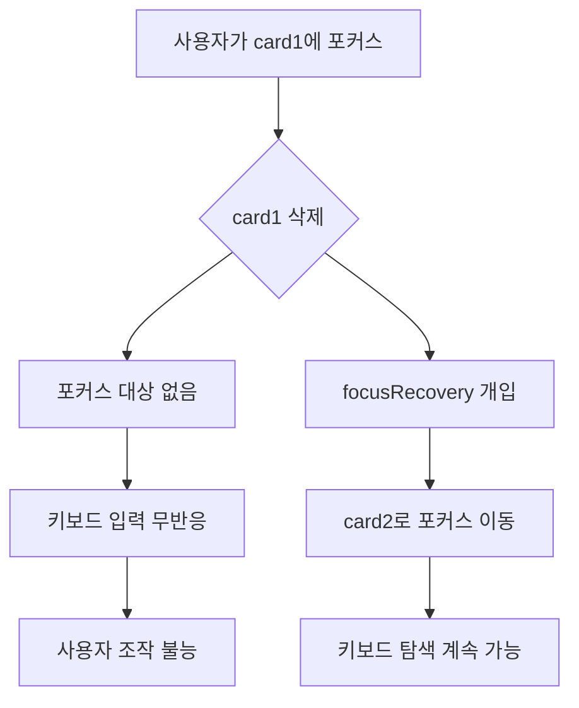
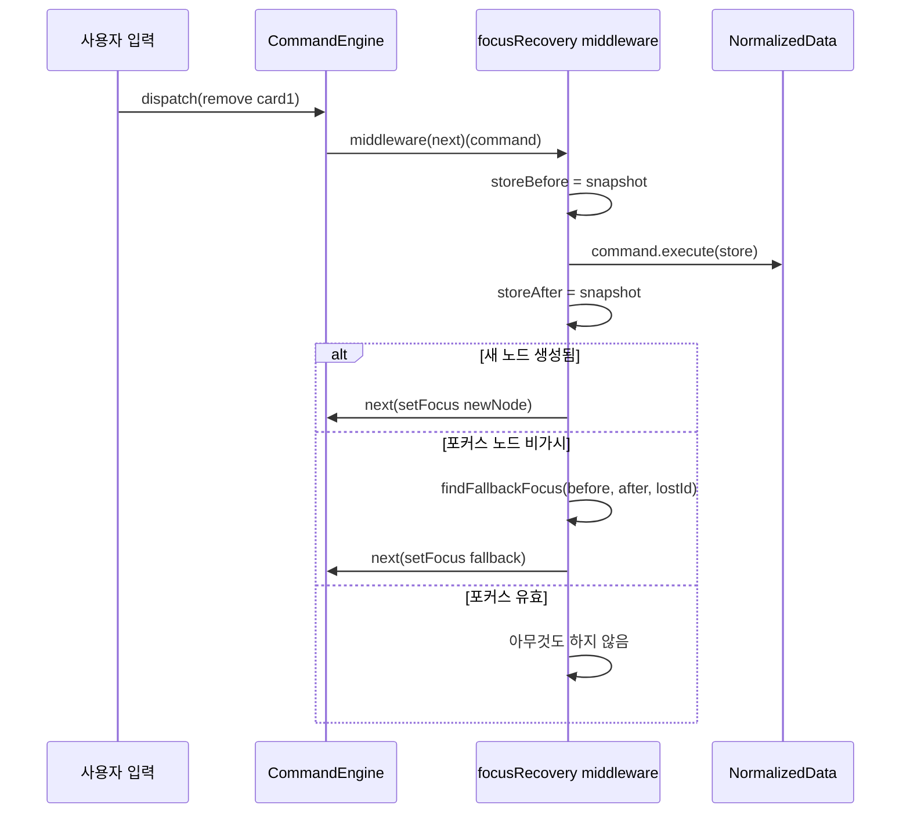
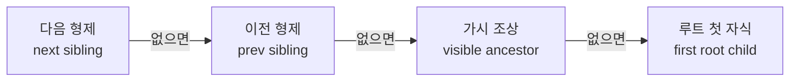

# focusRecovery 플러그인 — 포커스가 사라지면 자동으로 복구하는 불변 조건

> 작성일: 2026-03-23
> 맥락: interactive-os 엔진의 포커스 복구 메커니즘 해설

> **Situation** — interactive-os는 트리/그리드 구조의 노드를 키보드로 탐색하며, 현재 포커스된 노드가 항상 존재해야 한다.
> **Complication** — 삭제, 접기(collapse), undo/redo, 붙여넣기 등 CRUD 연산 후 포커스된 노드가 DOM에서 사라질 수 있다. 포커스가 사라지면 키보드 사용자는 조작 불능 상태에 빠진다.
> **Question** — 포커스 유실을 어떻게 자동으로, 모델에 무관하게 복구하는가?
> **Answer** — focusRecovery 플러그인은 매 커맨드 실행 후 포커스 유효성을 검사하고, 유실 시 fallback chain(다음 형제 -> 이전 형제 -> 조상 -> 루트 첫 자식)으로 포커스를 이동시킨다. `isReachable` 함수를 주입받아 트리/공간 등 모델별 가시성 판단을 분리한다.

---

## Why — 왜 포커스 복구가 불변 조건이어야 하는가?

키보드 기반 UI에서 포커스는 "커서"다. 마우스 사용자는 아무 곳이나 클릭할 수 있지만, 키보드 사용자는 포커스가 사라지면 아무것도 할 수 없다.



포커스 유실이 발생하는 상황은 다양하다:

| 상황 | 원인 |
|------|------|
| 노드 삭제 | `crud:remove` 후 해당 노드 소멸 |
| 부모 접기 | `core:collapse` 후 자식 노드 비가시 |
| Undo/Redo | 히스토리 복원 시 포커스 대상 변경 |
| 붙여넣기 | 새 노드 생성 후 포커스 대상 미지정 |
| 외부 변경 | 툴바 버튼 등 zone 외부에서 store 변경 |

이 모든 경우를 개별 커맨드에서 처리하면 누락이 불가피하다. focusRecovery는 이를 **미들웨어 단일 지점**에서 처리한다.

---

## How — 어떤 메커니즘으로 복구하는가?

### 아키텍처: 미들웨어 패턴

focusRecovery는 interactive-os의 `Plugin` 인터페이스를 구현하며, `middleware`를 통해 모든 커맨드를 가로챈다.



핵심 코드 구조:

```typescript
// focusRecovery.ts — 미들웨어 본체
middleware: (next) => (command) => {
  // core:focus는 패스스루 — 무한 재귀 방지
  if (command.type === 'core:focus') { next(command); return }

  // before/after 스냅샷 캡처
  const wrappedCommand = { ...command, execute(store) {
    storeBefore = store
    storeAfter = command.execute(store)
    return storeAfter
  }}
  next(wrappedCommand)

  // 판정: 새 노드 → 포커스, 유실 → fallback
  const newVisible = detectNewVisibleEntities(before, after, reachable)
  if (newVisible.length > 0) { next(setFocus(newVisible[0])); return }
  if (!isVisible(after, currentFocus, reachable)) {
    next(setFocus(findFallbackFocus(before, after, currentFocus, reachable)))
  }
}
```

### Fallback Chain

포커스 대상이 사라졌을 때 대체 노드를 찾는 우선순위:



이 순서는 사용자의 직관과 일치한다. 리스트에서 항목을 삭제하면 바로 아래 항목으로 포커스가 이동하는 것이 자연스럽다.

### isReachable: 모델별 가시성 분리

트리 모델과 공간(Spatial) 모델은 "노드가 보이는가"의 기준이 다르다:

| 모델 | 가시성 조건 | isReachable 구현 |
|------|------------|-----------------|
| Tree | 모든 조상이 확장(expanded)되어야 함 | `treeReachable`: 조상 체인 순회 |
| Spatial (Grid) | 항상 모든 노드가 렌더됨 | `spatialReachable`: `() => true` |

```typescript
export type IsReachable = (store: NormalizedData, nodeId: string) => boolean
export const spatialReachable: IsReachable = () => true
```

이 분리 덕분에 focusRecovery 자체는 모델을 모른다. 가시성 판단만 주입받아 동일한 fallback 로직을 재사용한다.

---

## What — 실제 동작 경로와 사용 형태

### Engine 레벨 vs Zone 레벨

focusRecovery는 두 곳에서 동작한다:

1. **Engine 레벨**: `focusRecovery()` 플러그인을 엔진에 등록. 단일 뷰일 때 사용.
2. **Zone 레벨**: `useAriaZone` 훅 내부에서 `runFocusRecovery()`로 직접 호출. 멀티뷰(같은 store, 다른 포커스)일 때 사용.

```typescript
// Engine 레벨 — 단일 뷰
const plugins = [core(), crud(), history(), focusRecovery()]

// Zone 레벨 — useAriaZone 내부 (focusRecovery 플러그인 불필요)
function runFocusRecovery(storeBefore, storeAfter) {
  const newVisible = detectNewVisibleEntities(storeBefore, storeAfter, isReachable)
  if (newVisible.length > 0) {
    setViewState(prev => ({ ...prev, focusedId: newVisible[0] }))
    return
  }
  if (!isVisible(storeAfter, vs.focusedId, isReachable)) {
    const fallback = findFallbackFocus(storeBefore, storeAfter, vs.focusedId, isReachable)
    if (fallback) setViewState(prev => ({ ...prev, focusedId: fallback }))
  }
}
```

### 테스트 검증 범위

`spatial-focus-recovery.test.ts`에서 검증하는 시나리오:

| 시나리오 | 기대 결과 |
|---------|----------|
| 포커스 노드 삭제 | 다음 형제로 이동 |
| 마지막 자식 삭제 | 이전 형제로 이동 |
| 유일한 자식 삭제 | 부모로 이동 |
| Copy + Paste | 새 노드로 포커스 |
| Cmd+D (복제) | 복제된 노드로 포커스 |
| Undo 삭제 | 복원된 노드로 포커스 |
| Redo 삭제 | fallback으로 포커스 |

### 사용 현황

프로젝트 내 거의 모든 데모 페이지에서 `focusRecovery()`를 플러그인 목록에 포함한다. CRUD 기능이 있는 곳이면 예외 없이 등록되어 있다.

---

## If — 제약과 향후 방향

### 현재 제약

- **isReachable 확장**: 현재 `treeReachable`과 `spatialReachable` 두 가지만 존재한다. 필터링/검색으로 노드를 숨기는 모델이 추가되면 새로운 isReachable 구현이 필요하다.
- **새 노드 포커스 규칙**: `detectNewVisibleEntities`는 첫 번째 새 노드에 포커스한다. 다수의 노드가 동시에 생성되는 경우(batch paste 등) "어느 노드에 포커스할 것인가"의 정책이 단순하다.

### 설계 결정 근거

- **core:focus 패스스루**: 미들웨어가 `core:focus` 커맨드를 가로채면 무한 재귀가 발생한다. 포커스 설정 커맨드 자체는 복구 대상이 아니다.
- **storeBefore 참조**: fallback chain이 삭제 전의 형제 관계를 참조해야 하므로, 커맨드 실행 전 스냅샷을 반드시 캡처한다.
- **불변 조건으로서의 위치**: 개별 커맨드(remove, collapse 등)에 포커스 복구 로직을 넣지 않는다. 미들웨어에서 일괄 처리함으로써 새 커맨드 추가 시 포커스 복구가 자동으로 적용된다.

---

## 부록

### 주요 파일

| 파일 | 역할 |
|------|------|
| `src/interactive-os/plugins/focusRecovery.ts` | 플러그인 본체, fallback chain, isReachable 타입 |
| `src/interactive-os/hooks/useAriaZone.ts` | Zone 레벨 포커스 복구 (focusRecovery 함수 직접 호출) |
| `src/interactive-os/__tests__/spatial-focus-recovery.test.ts` | 통합 테스트 |
| `docs/2-areas/plugins/focusRecovery.mdx` | API 레퍼런스 문서 |

### Export 목록

| export | 설명 |
|--------|------|
| `focusRecovery(options?)` | 플러그인 팩토리. `isReachable` 옵션으로 모델별 가시성 주입 |
| `isVisible(store, nodeId, isReachable?)` | 노드 존재 + 도달 가능 여부 |
| `findFallbackFocus(before, after, lostId, isReachable?)` | Fallback chain 실행 |
| `detectNewVisibleEntities(before, after, isReachable?)` | 새로 보이게 된 노드 ID 배열 |
| `spatialReachable` | 공간 모델용 isReachable (`() => true`) |
| `getFocusedId(store)` | 현재 포커스 ID 조회 |
| `IsReachable` | 모델별 가시성 판별 함수 타입 |
