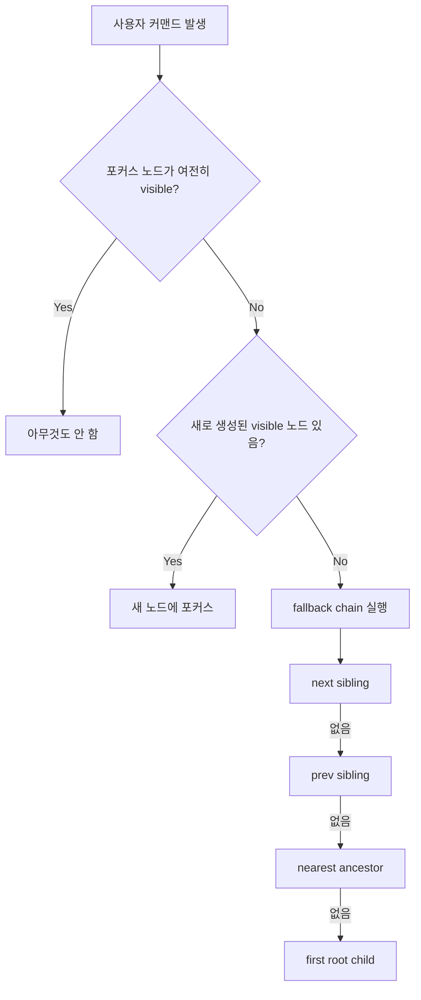
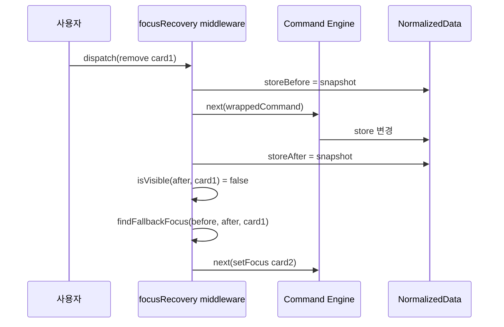
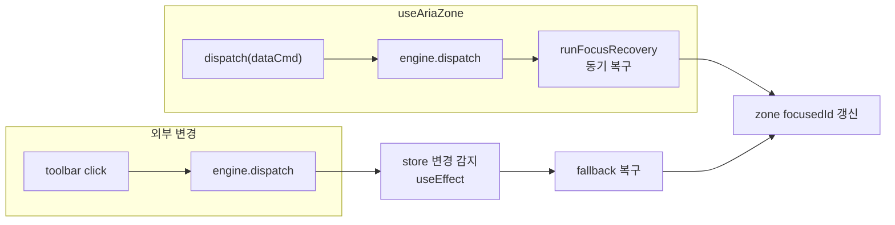

# focusRecovery -- CRUD 후 포커스가 사라지지 않는 불변 조건

> 작성일: 2026-03-23
> 맥락: interactive-os 엔진의 focusRecovery 플러그인이 무엇이고 왜 필요한지 해설

> **Situation** -- 키보드 기반 UI에서 포커스는 사용자가 "지금 어디에 있는지"를 나타내는 유일한 커서다.
> **Complication** -- 노드 삭제, 트리 접힘, 붙여넣기 등 CRUD 연산 후 포커스 대상이 DOM에서 사라지면, 포커스가 `<body>`로 빠지고 키보드 조작이 먹통이 된다.
> **Question** -- 어떤 CRUD가 발생하든 포커스를 자동으로 유효한 노드에 유지하려면?
> **Answer** -- focusRecovery는 매 커맨드 실행 후 포커스 유효성을 검사하고, 무효하면 fallback chain으로 복구하는 미들웨어 플러그인이다.

---

## 포커스 유실은 키보드 UI의 치명적 장애다

키보드 전용 인터페이스에서 포커스가 유실되면 사용자는 현재 위치를 잃고, 다음 키 입력이 어디로 갈지 예측할 수 없게 된다. 이 문제는 다음 세 가지 상황에서 발생한다:

1. **삭제** -- 포커스된 노드가 삭제되면 DOM 요소가 사라지고, 브라우저 포커스가 `<body>`로 떨어진다.
2. **접힘(collapse)** -- 트리 구조에서 부모를 접으면 포커스된 자식이 렌더링에서 빠진다.
3. **Undo/Redo** -- 히스토리 조작으로 현재 포커스 노드가 존재하지 않는 과거/미래 상태로 전환된다.

이 문제를 각 CRUD 호출부에서 개별로 처리하면 누락이 불가피하다. focusRecovery는 이 처리를 미들웨어로 중앙화해서 "CRUD가 있으면 반드시 동작하는 불변 조건"으로 만든다.



이 흐름은 커맨드 종류와 관계없이 동일하게 실행된다. 따라서 새로운 CRUD 커맨드가 추가되더라도 포커스 복구 로직을 별도로 작성할 필요가 없다.

---

## 미들웨어가 before/after 스냅샷을 비교해 자동 복구한다

focusRecovery는 interactive-os의 `Plugin` 인터페이스 중 `middleware` 슬롯을 사용한다. 커맨드 실행 전후의 store 스냅샷을 캡처하고, 실행 후 포커스 유효성을 검사한다.

핵심 메커니즘은 두 단계다:

**1단계: 새 노드 감지 (create/paste 경로)**

```typescript
const newVisibleIds = detectNewVisibleEntities(before, after, reachable)
if (newVisibleIds.length > 0) {
  next(focusCommands.setFocus(newVisibleIds[0]!))
  return
}
```

`detectNewVisibleEntities`는 `after`에만 존재하는 entity 중 `__`로 시작하지 않는(메타 entity 제외) visible 노드를 반환한다. 생성이 감지되면 첫 번째 새 노드에 포커스한다.

**2단계: 포커스 유실 감지 (delete/collapse 경로)**

```typescript
if (currentFocus && !isVisible(after, currentFocus, reachable)) {
  const fallback = findFallbackFocus(before, after, currentFocus, reachable)
  if (fallback) next(focusCommands.setFocus(fallback))
}
```

현재 포커스가 `after` store에서 invisible이면 fallback chain을 실행한다. `findFallbackFocus`는 `before` store의 형제 관계를 기준으로 next sibling -> prev sibling -> nearest ancestor -> first root child 순서로 탐색한다.



`core:focus` 커맨드는 미들웨어를 통과시키되 복구 로직을 건너뛴다. 포커스 설정 자체가 재귀적으로 복구를 트리거하는 무한 루프를 방지하기 위함이다.

---

## isReachable 주입으로 트리/그리드/공간 모델 모두 지원한다

focusRecovery의 "visible" 판정은 `isReachable` 함수에 위임된다. 기본값은 트리 모델(`treeReachable`: 모든 조상이 expanded인지 검사)이지만, 모델에 따라 주입할 수 있다.

| 모델 | isReachable | 사용처 |
|------|-------------|--------|
| 트리(TreeView) | `treeReachable` -- 조상 전부 expanded | 기본값 |
| 공간(Spatial/Grid) | `spatialReachable` -- 항상 `true` | CMS Canvas, Grid Collection |

CMS Canvas에서의 사용 예시:

```typescript
const aria = useAriaZone({
  engine,
  store,
  behavior: spatialBehavior,
  isReachable: spatialReachable,
})
```

공간 모델에서는 모든 노드가 항상 렌더링되므로 "접힘" 개념이 없다. `spatialReachable`은 단순히 `() => true`를 반환해 존재 여부(`getEntity`)만으로 가시성을 판별한다. 이 전략 분리 덕분에 focusRecovery 핵심 로직은 모델에 무관하게 동일하다.

---

## Zone 레벨 복구가 외부 변경까지 포괄한다

focusRecovery 플러그인은 엔진 미들웨어로 동작하지만, `useAriaZone` 훅 내부에서는 zone-local 포커스 상태에 대한 별도의 복구 경로가 존재한다.

zone은 `virtualEngine`을 통해 메타 커맨드(focus, selection 등)를 로컬 상태로 관리하고, 데이터 커맨드만 실제 엔진에 전달한다. 데이터 커맨드 dispatch 직후 `runFocusRecovery`로 zone-local 포커스를 복구한다. 여기에 더해, 외부(예: 툴바 버튼)에서 엔진 store를 직접 변경한 경우를 `useEffect`로 감지해 zone 포커스를 복구한다.



이 이중 경로 설계는 "포커스는 항상 유효한 노드를 가리킨다"는 불변 조건을 zone 아키텍처에서도 보장한다.

---

## 확장 시 isReachable만 구현하면 새 모델을 지원할 수 있다

focusRecovery를 새로운 렌더링 모델(예: 가상화 리스트, 필터링된 뷰)에 적용하려면 해당 모델의 `IsReachable` 함수만 구현하면 된다. 핵심 알고리즘(fallback chain, 새 노드 감지)은 변경 불필요하다.

제약 사항:
- fallback chain은 `storeBefore`의 형제 관계에 의존하므로, 구조가 크게 바뀌는 연산(예: 부모 변경과 삭제 동시 발생)에서는 fallback이 직관적이지 않을 수 있다.
- `core:focus` 커맨드는 미들웨어를 스킵하므로, 외부에서 이미 삭제된 노드로 `setFocus`를 호출하면 포커스가 무효 상태에 놓일 수 있다. 이는 호출 측의 책임이다.

---

## 부록

### fallback chain 우선순위 표

| 순위 | 대상 | 조건 |
|------|------|------|
| 1 | 다음 형제 (next sibling) | `storeAfter`에서 visible |
| 2 | 이전 형제 (prev sibling) | `storeAfter`에서 visible |
| 3 | 가장 가까운 visible 조상 | 부모부터 위로 탐색 |
| 4 | 루트의 첫 자식 | 최후 수단 |

### 주요 파일

| 파일 | 역할 |
|------|------|
| `src/interactive-os/plugins/focusRecovery.ts` | 핵심 알고리즘 + 미들웨어 플러그인 |
| `src/interactive-os/hooks/useAriaZone.ts` | zone-level 복구 (동기 + useEffect) |
| `src/interactive-os/__tests__/spatial-focus-recovery.test.ts` | 공간 모델 포커스 복구 테스트 |
| `docs/2-areas/plugins/focusRecovery.mdx` | API 레퍼런스 문서 |
