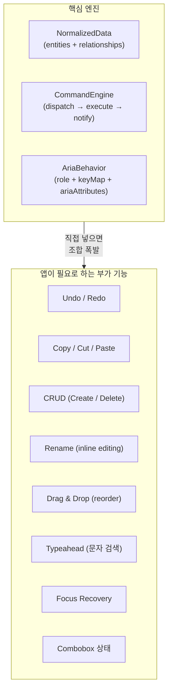
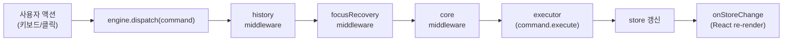
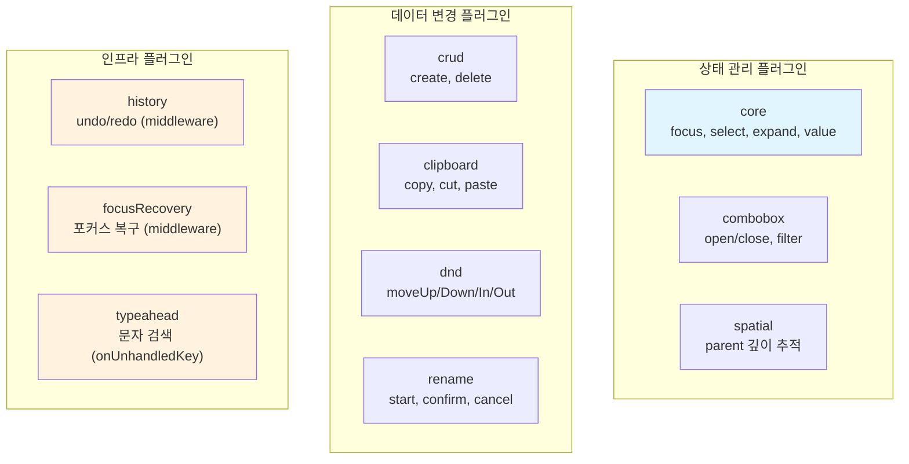
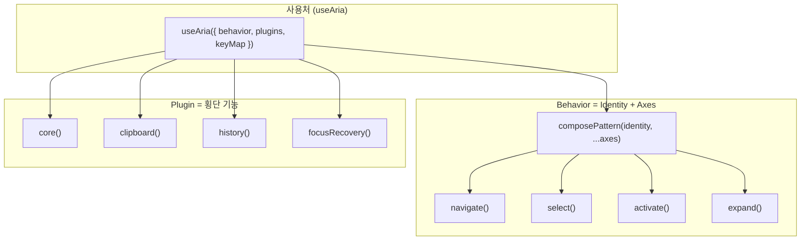

# interactive-os 플러그인 아키텍처 -- 커맨드와 미들웨어로 UI 인터랙션을 조립하는 구조

> 작성일: 2026-03-23
> 맥락: 새로 합류한 개발자가 interactive-os의 플러그인 시스템을 이해할 수 있도록 작성한 해설 문서

> **Situation** -- interactive-os는 ARIA 패턴 기반의 키보드 인터랙션 엔진이다. 정규화된 트리 데이터(NormalizedData)를 단일 store로 관리하며, Command를 dispatch하여 상태를 변경한다.
> **Complication** -- 포커스, 선택, 확장 같은 기본 동작 외에 clipboard, undo/redo, CRUD, rename, drag-and-drop, typeahead 등 다양한 부가 기능이 필요하다. 이들을 behavior(ARIA 패턴)에 직접 넣으면 조합 폭발이 발생한다.
> **Question** -- 기본 엔진을 건드리지 않고 기능을 선택적으로 조립하려면 어떤 구조가 필요한가?
> **Answer** -- Plugin 인터페이스가 middleware, commands, keyMap, onUnhandledKey 네 가지 확장 포인트를 제공한다. 각 플러그인은 이 포인트를 선택적으로 구현하여 엔진에 꽂히며, useAria가 이를 자동으로 합성한다.

---

## Why -- 왜 플러그인이 필요한가?

interactive-os의 핵심은 Behavior(ARIA 역할별 키보드 패턴)와 Engine(커맨드 디스패치)이다. 하지만 실제 앱에서는 ARIA 스펙 바깥의 기능이 필요하다.



Behavior는 ARIA 역할(listbox, tree, grid 등)마다 고정된 keyMap을 가진다. 여기에 clipboard나 history 같은 횡단 기능을 직접 넣으면 모든 behavior가 그 기능을 알아야 하고, 조합이 기하급수적으로 늘어난다. Plugin은 이 문제를 "횡단 기능을 엔진 레벨에서 주입"하는 방식으로 해결한다.

---

## How -- Plugin 인터페이스와 합성 메커니즘

### Plugin 인터페이스

모든 플러그인은 하나의 인터페이스를 구현한다. 핵심 정의는 `src/interactive-os/core/types.ts`에 있다:

```typescript
export interface Plugin {
  middleware?: Middleware
  commands?: Record<string, (...args: any[]) => Command>
  keyMap?: Record<string, (ctx: any) => Command | void>
  onUnhandledKey?: (event: KeyboardEvent, engine: any) => boolean
}
```

| 확장 포인트 | 역할 | 사용 예 |
|------------|------|---------|
| `middleware` | Command dispatch 파이프라인에 끼어들어 before/after 로직 실행 | history(undo 스냅샷), focusRecovery(포커스 복구) |
| `commands` | 새로운 Command 팩토리를 등록 | crud(create/delete), clipboard(copy/cut/paste) |
| `keyMap` | 키보드 단축키를 Command에 바인딩 | clipboard(Mod+C/X/V), history(Mod+Z) |
| `onUnhandledKey` | keyMap에 매칭되지 않은 키 이벤트 처리 | typeahead(문자 입력 → 검색) |

### Middleware 파이프라인



Middleware는 `reduceRight`로 체인된다. 각 middleware는 `(next) => (command) => void` 형태로, next를 호출하기 전후에 로직을 삽입할 수 있다. `createCommandEngine.ts`의 핵심:

```typescript
const chain = middlewares.reduceRight<(command: Command) => void>(
  (next, mw) => mw(next),
  executor
)
```

이 구조 덕분에 history 플러그인은 모든 command 실행 전에 스냅샷을 캡처하고, focusRecovery는 실행 후에 포커스 유실을 감지하여 복구한다.

### keyMap 합성 우선순위

`useAria`에서 세 가지 keyMap 소스가 병합된다:

```typescript
const mergedKeyMap = { ...behavior.keyMap, ...pluginKeyMaps, ...keyMapOverrides }
```

| 우선순위 | 소스 | 설명 |
|---------|------|------|
| 낮음 | `behavior.keyMap` | ARIA 패턴 기본 키맵 (예: ArrowDown → focusNext) |
| 중간 | `pluginKeyMaps` | 플러그인이 제공하는 키맵 (예: Mod+C → copy) |
| 높음 | `keyMapOverrides` | 사용처에서 직접 전달하는 오버라이드 |

이 병합 규칙에 의해 플러그인 키맵은 behavior 기본 키맵을 덮어쓸 수 있고, 사용처 오버라이드는 플러그인까지 덮어쓸 수 있다.

---

## What -- 현재 존재하는 10개 플러그인



각 플러그인의 확장 포인트 사용 현황:

| 플러그인 | middleware | commands | keyMap | onUnhandledKey |
|---------|-----------|----------|--------|---------------|
| `core` | O (anchorReset) | O (focus, select, expand 등) | - | - |
| `crud` | - | O (create, delete) | - | - |
| `clipboard` | - | O (copy, cut, paste) | O (Mod+C/X/V) | - |
| `history` | O (snapshot) | O (undo, redo) | O (Mod+Z, Mod+Shift+Z) | - |
| `rename` | - | O (start, confirm, cancel) | - | - |
| `dnd` | - | O (moveUp/Down/In/Out/To) | - | - |
| `focusRecovery` | O (복구 로직) | - | - | - |
| `typeahead` | - | - | - | O (문자 매칭) |
| `combobox` | - | O (open, close, filter, create) | - | - |
| `spatial` | - | - | - | - |

### Command 패턴

모든 플러그인 커맨드는 동일한 `Command` 인터페이스를 구현한다:

```typescript
export interface Command {
  type: string
  payload: unknown
  execute(store: NormalizedData): NormalizedData
  undo(store: NormalizedData): NormalizedData
}
```

`execute`와 `undo`가 쌍으로 존재하므로, history 플러그인이 별도 작업 없이 모든 커맨드의 undo/redo를 자동으로 지원한다. `createBatchCommand`로 여러 커맨드를 원자적으로 묶을 수도 있다.

### 특기할 메커니즘들

**focusRecovery의 isReachable 주입**: 트리형 UI에서는 "조상이 모두 expanded인 노드만 도달 가능"이지만, spatial UI에서는 "모든 노드가 항상 도달 가능"이다. `focusRecovery`는 `isReachable` 함수를 옵션으로 받아서 모델별로 도달 가능성 판정을 교체한다.

**clipboard의 canAccept 스키마 라우팅**: paste 대상을 결정할 때 `canAccept(parentData, childData)` 함수로 "이 부모가 이 자식을 받을 수 있는가"를 스키마 레벨에서 판정한다. insert(컬렉션에 추가), overwrite(슬롯 필드 교체), 거부 세 가지 결과를 반환한다.

**history의 snapshot 미들웨어**: 커맨드 실행 전 store 전체를 캡처한다. undo 시 개별 커맨드의 `undo()` 대신 캡처한 snapshot으로 복원하므로, 복합 커맨드나 부작용이 있는 커맨드도 안전하게 되돌릴 수 있다.

---

## If -- 사용법과 제약

### 새 플러그인 작성 방법

1. `src/interactive-os/plugins/` 에 파일을 만든다
2. commands 객체와 팩토리 함수를 export한다
3. `Plugin` 인터페이스에 맞춰 필요한 확장 포인트만 구현한다
4. 사용처의 `useAria({ plugins: [myPlugin()] })` 에 추가한다

예시 (최소 플러그인):

```typescript
import type { Command, Plugin } from '../core/types'

export const myCommands = {
  doSomething(nodeId: string): Command {
    return {
      type: 'my:do-something',
      payload: { nodeId },
      execute(store) { /* ... */ return store },
      undo(store) { /* ... */ return store },
    }
  },
}

export function myPlugin(): Plugin {
  return {
    commands: { doSomething: myCommands.doSomething },
  }
}
```

### 제약

- **Plugin은 keyMap까지 소유해야 한다**: commands만 제공하고 keyMap을 behavior에 맡기면, 바인딩 누락 버그가 발생한다. clipboard, history처럼 키 바인딩이 필요하면 플러그인이 keyMap을 직접 제공한다.
- **Middleware 순서가 중요하다**: `plugins` 배열의 순서가 middleware 체인 순서를 결정한다. history는 focusRecovery보다 먼저 와야 포커스 복구 전의 snapshot을 캡처할 수 있다.
- **Meta-entity 충돌에 주의**: 각 플러그인은 `__focus__`, `__selection__` 등 meta-entity ID로 store에 상태를 저장한다. 새 플러그인이 meta-entity를 추가하면 `useAria`의 `META_ENTITY_IDS` set에 등록해야 외부 데이터 동기화 시 유실되지 않는다.
- **Command는 반드시 execute/undo 쌍을 가져야 한다**: history 플러그인이 자동으로 undo를 지원하려면 모든 커맨드가 역연산을 구현해야 한다.

---

## 부록

### Behavior-Axis-Plugin 3계층 관계

interactive-os는 세 가지 레이어로 인터랙션을 조립한다:



- **Axis**: 단일 인터랙션 축 (navigate, select, expand, activate, value). ARIA 패턴의 keyMap 조각.
- **Behavior**: `composePattern(identity, ...axes)` 로 Identity(role, ariaAttributes)에 Axis들을 합성. ARIA 역할 하나에 대응.
- **Plugin**: 엔진 레벨의 횡단 기능. Behavior와 독립적으로 동작하며, middleware/commands/keyMap으로 엔진을 확장.

Axis는 "무엇을 할 수 있는가"(키보드 네비게이션, 선택 등)를, Plugin은 "인프라적으로 무엇을 지원하는가"(undo, clipboard, CRUD 등)를 담당한다. 이 분리 덕분에 새 ARIA 패턴을 추가할 때 기존 플러그인을 수정할 필요가 없고, 새 플러그인을 추가할 때 기존 behavior를 수정할 필요가 없다.
