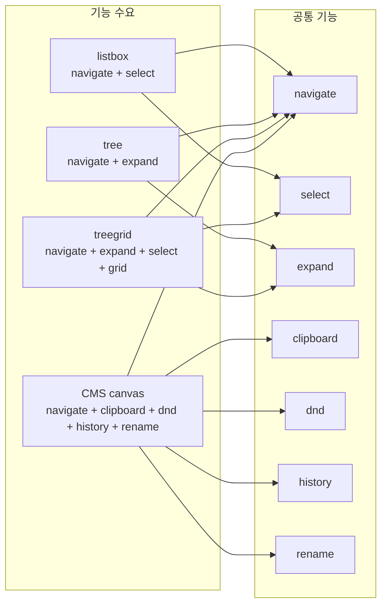
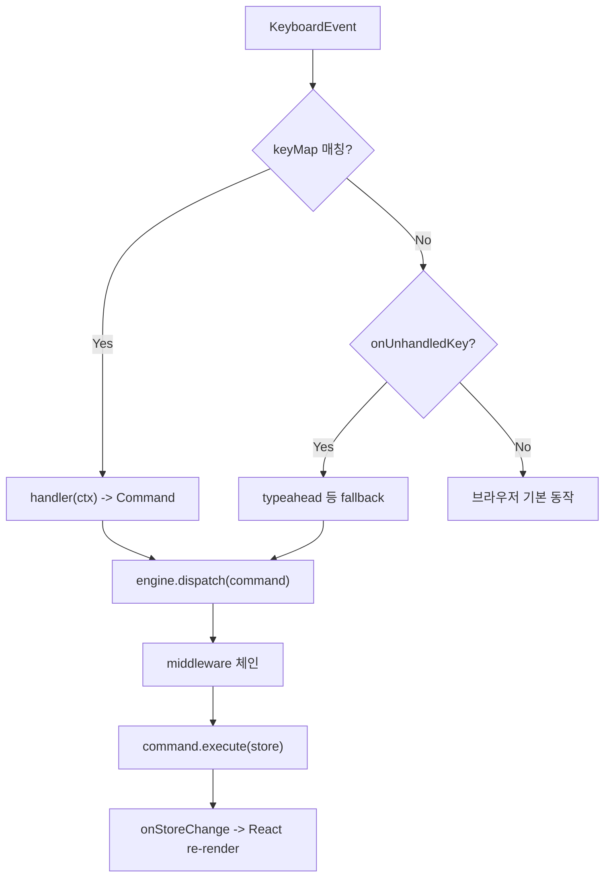
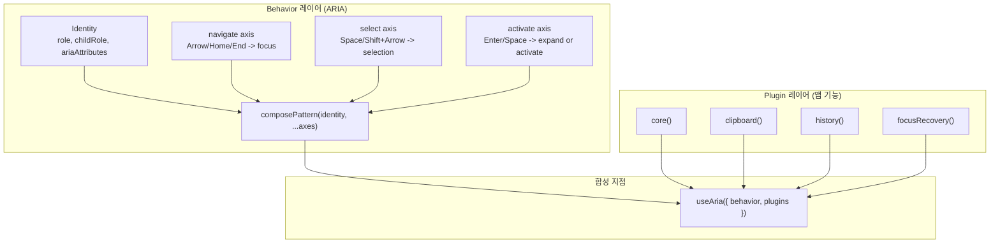

# interactive-os 플러그인 아키텍처 -- 키보드 인터랙션을 조합 가능한 단위로 분해하는 구조

> 작성일: 2026-03-23
> 맥락: 새로 합류한 개발자가 interactive-os의 플러그인 시스템을 이해하기 위한 해설

> **Situation** -- interactive-os는 ARIA 표준 키보드 인터랙션을 정규화된 데이터 모델 위에서 구현하는 엔진이다. listbox, tree, grid 등 10여 가지 behavior를 지원한다.
> **Complication** -- behavior마다 필요한 기능 조합이 다르다. clipboard는 tree에만, history는 모든 곳에, selection은 listbox와 treegrid에만 필요하다. 기능을 behavior에 하드코딩하면 조합 폭발이 발생한다.
> **Question** -- 기능을 어떤 단위로 분리하고, 어떻게 조합하는가?
> **Answer** -- Plugin 인터페이스가 commands, middleware, keyMap 세 슬롯을 제공하며, 각 플러그인은 독립적으로 개발하고 useAria에서 배열로 합성한다. Behavior(ARIA 역할)와 Plugin(앱 기능)은 별도 레이어로 분리된다.

---

## UI 위젯마다 필요한 기능 조합이 다르기 때문에 모놀리식 접근은 실패한다

interactive-os가 해결하는 근본 문제는 UI 위젯 간 기능의 비대칭이다. tree는 expand/collapse가 필요하지만 listbox는 불필요하다. CMS 편집기는 clipboard와 drag-and-drop이 필요하지만 dialog는 필요 없다. 모든 기능을 하나의 엔진에 내장하면 사용하지 않는 기능의 코드가 항상 실행되고, 새 기능 추가 시 기존 behavior 전체에 부작용이 전파된다.



이 다이어그램이 보여주듯, 기능은 위젯을 가로질러 재사용된다. 플러그인 시스템은 이 M:N 관계를 선언적 합성으로 해결한다.

---

## Plugin 인터페이스는 commands, middleware, keyMap 세 확장점을 제공한다

Plugin은 `src/interactive-os/core/types.ts`에 정의된 단일 인터페이스이며, 모든 필드가 선택적이다.

```typescript
export interface Plugin {
  middleware?: Middleware
  commands?: Record<string, (...args: any[]) => Command>
  keyMap?: Record<string, (ctx: any) => Command | void>
  onUnhandledKey?: (event: KeyboardEvent, engine: any) => boolean
}
```

세 확장점의 역할은 다음과 같다.

| 확장점 | 역할 | 예시 |
|--------|------|------|
| `commands` | Store를 변경하는 Command 팩토리를 등록한다 | `crud.create()`, `clipboard.paste()` |
| `middleware` | dispatch 파이프라인에 전/후처리를 삽입한다 | `history()`가 undo 스택 기록, `focusRecovery()`가 삭제 후 포커스 복구 |
| `keyMap` | 키 조합을 Command에 바인딩한다 | `clipboard()`이 `Mod+C`를 copy에 연결 |

`onUnhandledKey`는 keyMap에 매칭되지 않는 키 이벤트를 처리하는 fallback이다. `typeahead()` 플러그인이 이를 사용하여 인쇄 가능한 문자를 타이핑 검색으로 처리한다.



이 흐름에서 Plugin의 세 확장점이 각각 다른 단계에 개입한다. keyMap은 입력 단계, middleware는 dispatch 단계, commands는 실행 단계에서 동작한다. 이 분리 덕분에 하나의 플러그인이 다른 플러그인의 Command를 가로채거나 보강할 수 있다.

---

## 현재 10개 플러그인이 존재하며 각각 독립적 책임을 갖는다

`src/interactive-os/plugins/` 디렉토리에 10개 플러그인 파일이 있다.

| 플러그인 | 확장점 | 핵심 책임 |
|----------|--------|-----------|
| `core` | commands + middleware | focus, selection, expand, gridCol, value 관리. anchorResetMiddleware로 Shift 선택 앵커 자동 정리 |
| `crud` | commands | 엔티티 생성/삭제. 서브트리 스냅샷으로 undo 지원 |
| `clipboard` | commands + keyMap | copy/cut/paste. `canAccept` 스키마로 붙여넣기 대상 라우팅 |
| `history` | middleware + keyMap | undo/redo 스택. 모든 Command의 storeBefore를 캡처하여 스냅샷 복원 |
| `focusRecovery` | middleware | CRUD 후 포커스 소실 시 자동 복구. `isReachable` 주입으로 모델별 가시성 판단 |
| `rename` | commands | 인라인 이름 편집의 시작/확인/취소 상태 관리 |
| `dnd` | commands | 노드 이동(위/아래/안/밖). 키보드 기반 drag-and-drop |
| `spatial` | commands | 2D 공간 탐색의 부모/자식 컨텍스트 전환 |
| `typeahead` | onUnhandledKey | 문자 입력 시 라벨 prefix 매칭으로 포커스 이동 |
| `combobox` | commands | 콤보박스 열기/닫기 상태 관리 |

각 플러그인은 팩토리 함수로 인스턴스를 생성한다. `clipboard({ canAccept, canDelete })`처럼 옵션을 받아 동작을 커스터마이즈한다.

### middleware 체인의 실행 순서

`createCommandEngine`에서 middleware는 `reduceRight`로 체인을 구성한다.

```typescript
const chain = middlewares.reduceRight<(command: Command) => void>(
  (next, mw) => mw(next),
  executor
)
```

plugins 배열의 앞쪽 플러그인이 바깥쪽 middleware가 된다. 예를 들어 `[core(), focusRecovery(), history()]` 순서라면, history가 가장 안쪽에서 storeBefore를 캡처하고, focusRecovery가 그 바깥에서 포커스를 복구하며, core의 anchorReset이 가장 바깥에서 앵커를 정리한다. 이 순서가 중요한 이유는 history가 focusRecovery의 복구 결과까지 포함한 스냅샷을 기록해야 올바른 undo가 가능하기 때문이다.

---

## Behavior(ARIA 역할)와 Plugin(앱 기능)은 별도 레이어에서 합성된다

interactive-os에서 "어떤 ARIA 역할인가"와 "어떤 앱 기능이 필요한가"는 서로 다른 축이다.

**Behavior** = Identity + Axis 조합. ARIA 스펙에 따른 키보드 패턴을 정의한다.
**Plugin** = 앱 레벨 기능. ARIA 스펙과 무관한 clipboard, history, dnd 등을 담당한다.



`useAria` 내부에서 behavior의 keyMap과 plugin의 keyMap이 병합된다. 우선순위는 `behavior.keyMap < plugin.keyMap < keyMapOverrides`이다. 같은 키 조합이 여러 곳에 정의되면 나중 것이 이긴다.

실제 사용 예시 (listbox behavior + history plugin):

```typescript
const aria = useAria({
  behavior: listbox,       // navigate + select + activate 축 조합
  data: normalizedData,
  plugins: [core(), history(), focusRecovery()],
  onChange: handleChange,
})
```

이 구조에서 listbox behavior가 ArrowDown/ArrowUp/Space 등 ARIA 키보드 패턴을 제공하고, history plugin이 Mod+Z/Mod+Shift+Z를 추가하며, focusRecovery middleware가 삭제 후 포커스를 자동 복구한다. 각각의 관심사가 독립적으로 개발되고 테스트된다.

---

## 새 플러그인 추가 시 Plugin 인터페이스만 구현하면 기존 코드를 변경하지 않는다

플러그인 시스템은 열림/닫힘 원칙(OCP)을 따른다. 새 기능을 추가할 때의 절차는 다음과 같다.

1. `src/interactive-os/plugins/` 에 새 파일을 생성한다
2. `Plugin` 인터페이스를 구현하는 팩토리 함수를 export한다
3. 사용처에서 `plugins: [core(), newPlugin()]` 배열에 추가한다

기존 플러그인이나 behavior 코드를 수정할 필요가 없다.

### 주의할 제약 사항

- **Command는 순수 함수여야 한다**: `execute(store) -> store`와 `undo(store) -> store`는 외부 상태에 의존하지 않아야 한다. clipboard처럼 모듈 레벨 상태가 필요한 경우는 예외적이며, 클로저로 스냅샷을 캡처하는 패턴을 사용한다.
- **middleware 순서가 의미론적이다**: history는 다른 middleware의 효과가 반영된 후의 스냅샷을 기록해야 하므로, plugins 배열에서 가장 마지막에 위치해야 한다.
- **keyMap은 Plugin이 소유한다**: Plugin에 keyMap을 포함시키는 것이 원칙이다. commands만 노출하고 keyMap을 외부에 맡기면 바인딩 누락 버그가 발생한다.
- **focusRecovery는 불변 조건이다**: CRUD가 있는 곳에는 반드시 focusRecovery를 함께 사용해야 한다. `isReachable` 함수를 주입하여 tree 모델(조상 expanded 확인)과 spatial 모델(항상 true) 등 다른 가시성 판단을 지원한다.

---

## 부록

### A. NormalizedData 구조

모든 Plugin과 Behavior가 공유하는 단일 데이터 모델이다.

```typescript
interface NormalizedData {
  entities: Record<string, Entity>       // id -> { id, data?, ... }
  relationships: Record<string, string[]> // parentId -> [childId, ...]
}
```

UI 상태(focus, selection, expanded 등)도 `__focus__`, `__selection__` 같은 메타 엔티티로 같은 store에 저장된다. 이 설계 덕분에 Command 하나가 데이터 변경과 UI 상태 변경을 원자적으로 처리할 수 있다.

### B. 파일 위치 참조

| 경로 | 설명 |
|------|------|
| `src/interactive-os/core/types.ts` | Plugin, Command, Middleware 인터페이스 정의 |
| `src/interactive-os/core/createCommandEngine.ts` | middleware 체인 구성 + dispatch 실행 |
| `src/interactive-os/core/createStore.ts` | NormalizedData CRUD 순수 함수 |
| `src/interactive-os/plugins/` | 10개 플러그인 구현 |
| `src/interactive-os/axes/` | navigate, select, activate 등 Axis 구현 |
| `src/interactive-os/behaviors/` | listbox, tree, grid 등 Behavior 조합 |
| `src/interactive-os/hooks/useAria.ts` | Behavior + Plugin 합성 및 React 바인딩 |
