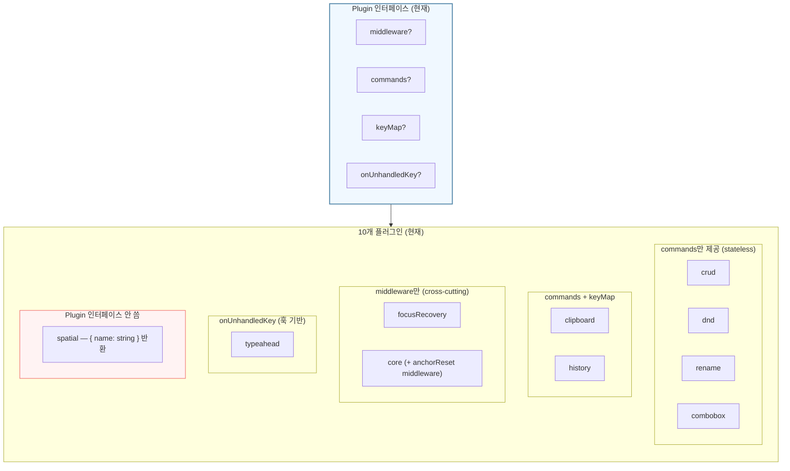
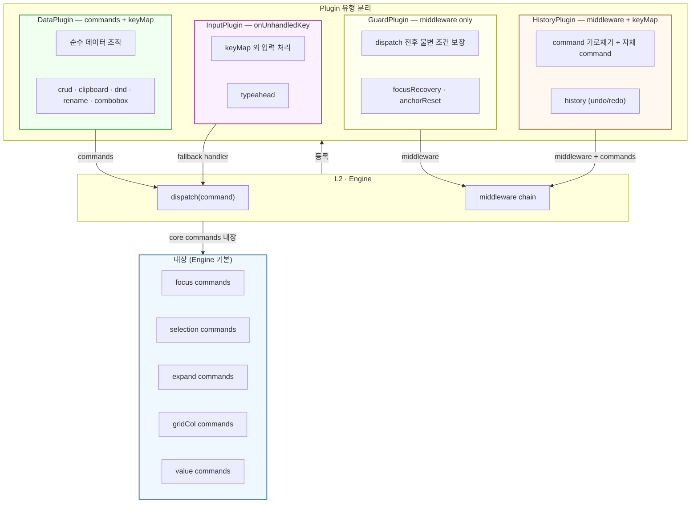
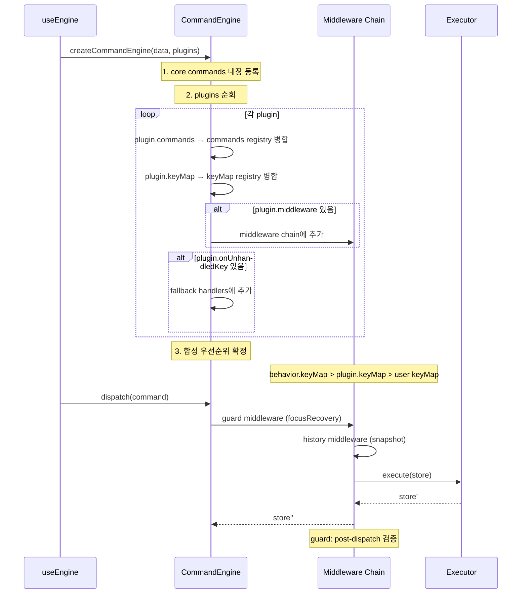
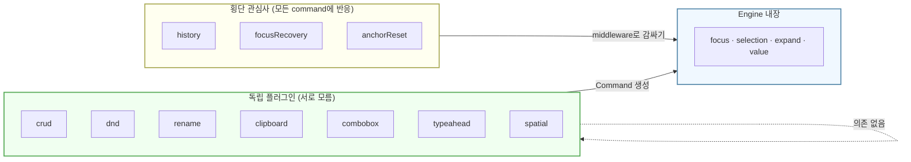

## 시뮬레이션: 설계

현재 Plugin 인터페이스와 10개 플러그인의 코드를 분석한 결과, 이상적인 플러그인 시스템 모듈 구조를 다이어그램으로 그렸다.

### 현재 상태 — 문제가 보이는 구조

위 구조에서 보이는 문제:
- **spatial**은 Plugin 인터페이스를 따르지 않는다 (`{ name: string }` 반환)
- **core**는 middleware + commands를 섞고 있는데, 사실 focus/selection/expand는 engine의 기본 연산에 가깝다
- **clipboard**은 module-level 싱글턴 상태를 갖고 있어서 다중 인스턴스 불가
- Plugin이 commands/keyMap/middleware/onUnhandledKey 4가지를 임의 조합하므로, 어떤 플러그인이 "어떤 종류"인지 인터페이스만 보고 알 수 없다

---

### 이상적 상태 — 역할별 분리

---

### 이상적인 Plugin 등록 흐름

---

### 이상적인 의존 관계

**핵심 규칙:** 독립 플러그인은 서로의 존재를 모른다. 횡단 관심사만 다른 플러그인의 command에 반응한다.

---

### 발견된 갭

- **갭 1: core가 Plugin인가 Engine인가** — `focusCommands`, `selectionCommands`, `expandCommands`는 모든 behavior/plugin이 의존하는 기본 연산이다. 현재는 Plugin으로 등록하지만, 이상적으로는 Engine에 내장되어야 한다. 그래야 "plugin 없이도 focus/selection이 동작한다"는 보장이 생긴다.

- **갭 2: anchorReset이 core plugin 안에 숨어 있다** — `anchorResetMiddleware`는 focus command 후 selection anchor를 클리어하는 횡단 관심사다. core commands와 번들링되어 있어서 분리 불가. 이상적으로는 독립 guard로 빠져야 한다.

- **갭 3: clipboard의 module-level 싱글턴 상태** — `clipboardBuffer`, `canAcceptFn` 등이 모듈 스코프에 있어서, 두 개의 독립 engine이 clipboard 상태를 공유한다. 이상적으로는 plugin 인스턴스가 상태를 소유해야 한다(클로저 내부).

- **갭 4: spatial이 Plugin 인터페이스를 안 쓴다** — `spatial()`은 `{ name: string }`을 반환하고 commands는 별도 export. Plugin 인터페이스로 정규화하면 `useEngine`의 plugin 배열에 통합된다.

- **갭 5: Plugin 유형이 타입으로 구분되지 않는다** — 4가지 역할(Data/Guard/History/Input)이 하나의 `Plugin` 인터페이스에 optional 필드로 혼재. 타입 레벨에서 "이 플러그인은 어떤 종류인가"를 표현할 수 없다. discriminated union 또는 별도 타입으로 명시하면 등록 시 검증이 가능해진다.

### 질문

제 판단: core commands를 Engine 내장으로 승격시키는 것이 가장 영향이 큰 첫 번째 리팩토링이다. 이유: 현재 모든 behavior와 plugin이 `focusCommands`/`selectionCommands`를 직접 import하고 있어서, 이것이 "Plugin"이라는 사실이 의미가 없다. Engine이 기본 제공하면 plugin 간 암묵적 의존이 명시적 계약으로 바뀐다.

리팩토링 우선순위를 어디에 두고 싶은가? (1) core 승격, (2) clipboard 싱글턴 해소, (3) Plugin 유형 분리 중에서 가장 급한 것은?
