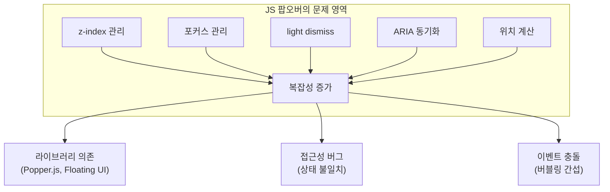
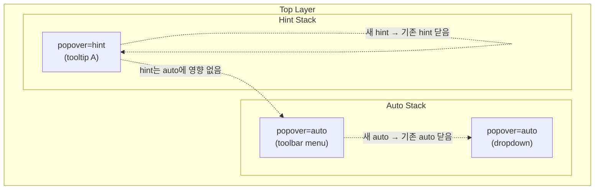

# Popover API Best Practice — 네이티브 팝오버로 tooltip/overlay 구현하기

> 작성일: 2026-03-22
> 맥락: aria 프로젝트의 tooltip 정책(engine 밖 독립, popover="hint" + interestfor 네이티브 우선, fallback 별도)을 뒷받침할 외부 근거와 실전 패턴 확보

---

## Why — JavaScript 팝오버의 구조적 문제

웹에서 tooltip, dropdown, popover는 가장 흔한 UI 패턴이면서 가장 취약한 영역이었다. JavaScript로 구현할 때 반복되는 문제들:

- **z-index 전쟁**: 팝오버끼리 겹칠 때 z-index를 수동 관리해야 한다
- **포커스 관리**: 팝오버 열릴 때 포커스 이동, 닫힐 때 복귀를 직접 구현해야 한다
- **light dismiss**: 바깥 클릭으로 닫기를 이벤트 리스너로 구현하면 이벤트 버블링 충돌이 발생한다
- **접근성 동기화**: `aria-expanded`, `aria-details` 상태를 수동으로 토글해야 한다
- **위치 계산**: Popper.js/Floating UI 같은 라이브러리에 의존해야 한다



브라우저가 이 문제들을 플랫폼 레벨에서 해결하기 위해 Popover API를 도입했다. 2024년 4월 Baseline Newly Available이 되었고, 2025년 1월 기준 모든 주요 브라우저에서 지원한다.

---

## How — Popover API 메커니즘

### 세 가지 popover 타입

Popover API는 `auto`, `hint`, `manual` 세 가지 타입을 제공한다. 각 타입은 스택 관리와 light dismiss 동작이 다르다.

| 특성 | `popover=auto` | `popover=hint` | `popover=manual` |
|------|---------------|----------------|-----------------|
| light dismiss (Esc/바깥 클릭) | O | O | X |
| 다른 auto 팝오버 닫음 | O | X | X |
| 다른 hint 팝오버 닫음 | O | O | X |
| 용도 | dropdown, menu | tooltip, 보조 정보 | toast, 상시 표시 |

핵심 구분: **hint는 auto를 닫지 않는다.** 이것이 tooltip이 toolbar 팝오버 위에 떠도 toolbar가 닫히지 않는 이유다.

### 두 개의 분리된 스택



브라우저는 auto 스택과 hint 스택을 분리 관리한다. hint 팝오버가 열려도 auto 스택에 영향이 없고, 새 hint가 열리면 기존 hint만 닫힌다.

### 브라우저가 자동 처리하는 것

1. **Top layer 승격**: z-index 없이 최상위 레이어에 표시
2. **`aria-expanded` 동기화**: `popovertarget`이 있는 버튼에 자동 설정 (Chrome, Edge, Firefox, Safari)
3. **`aria-details` 관계**: 팝오버가 invoker 바로 뒤에 없을 때 자동 설정 (Safari 제외)
4. **`role="group"` fallback**: 자체 role이 없는 팝오버에 group role 부여 (Safari 제외)
5. **포커스 복귀**: 닫힐 때 invoker로 포커스 복귀
6. **탭 순서 조정**: 팝오버 콘텐츠를 invoker 바로 뒤로 이동 (데스크톱 브라우저)

### 개발자가 직접 처리해야 하는 것

- **시맨틱 role 지정**: `popover` 속성은 동작만 추가하고 role은 제공하지 않는다
- **키보드 내비게이션**: 화살표 키 이동 등 컴포넌트별 키보드 패턴
- **위치 지정**: CSS Anchor Positioning 또는 JS 라이브러리
- **콘텐츠 구조와 라벨링**: `aria-label`, `aria-describedby` 등

---

## What — 실전 패턴과 API

### 1. 선언적 tooltip (popover=hint + interestfor)

```html
<button interestfor="my-tip">
  저장
</button>
<div id="my-tip" popover="hint" role="tooltip">
  변경사항을 저장합니다 (Ctrl+S)
</div>
```

`interestfor`는 hover, focus, long-press를 하나의 선언적 속성으로 처리한다. JavaScript 이벤트 리스너가 필요 없다.

**트리거 동작:**
- 마우스: hover 시 `interest` 이벤트 발생 (기본 0.5초 딜레이)
- 키보드: focus 시 partial interest
- 터치: long-press

**딜레이 제어:**
```css
[interestfor] {
  interest-show-delay: 300ms;
  interest-hide-delay: 200ms;
}
```

**브라우저 지원:** Chrome 139+ (실험적). Firefox, Safari 미지원 (2026-03 기준).

### 2. ARIA role 선택 가이드

popover 속성은 동작만 부여한다. 시맨틱은 용도에 따라 직접 지정해야 한다.

| 용도 | role | 연결 속성 | 주의점 |
|------|------|----------|--------|
| 텍스트 tooltip | `tooltip` | `aria-describedby` | 인터랙티브 콘텐츠 금지 |
| 리치 tooltip (링크 포함) | `dialog` | `aria-details` | 포커스 이동 필요 |
| 액션 메뉴 | `menu` | `aria-haspopup="menu"` | 화살표 키 내비게이션 필수 |
| 선택 목록 | `listbox` | `aria-haspopup="listbox"` | 선택 상태 관리 필요 |
| 비모달 대화상자 | `dialog` | `aria-haspopup="dialog"` | 모달이면 `<dialog>` + `showModal()` 사용 |

### 3. CSS Anchor Positioning

```css
.trigger {
  anchor-name: --trigger;
}

[popover] {
  position-anchor: --trigger;
  position-area: top;
  position-try-fallbacks: bottom, right, left;
  margin: 0;
  inset: auto;
}
```

`position-try-fallbacks`로 화면 밖에 나갈 때 대체 위치를 지정한다. Firefox 145부터 모든 브라우저에서 사용 가능하나, 아직 실험적 상태다.

### 4. Progressive Enhancement 패턴

```javascript
// Feature detection
if (HTMLElement.prototype.hasOwnProperty('popover')) {
  // Native popover 사용
} else {
  // Fallback: JS 기반 팝오버
}
```

```css
/* Anchor positioning feature detection */
@supports (anchor-name: --x) {
  [popover] {
    position-anchor: --trigger;
    position-area: top;
  }
}
```

### 5. Polyfill 옵션

| Polyfill | 크기 | 범위 | 제한 |
|----------|------|------|------|
| [oddbird/popover-polyfill](https://github.com/oddbird/popover-polyfill) | 3.2KB gzip | auto, hint, JS 메서드 | hint는 Chromium 전용, 부분 지원 브라우저에서 선택적 폴리필 불가 |
| [CSS Anchor Positioning polyfill](https://www.oddbird.net/2025/05/06/polyfill-updates/) | 빌드 50% 축소 | anchor(), position-area | 동적 콘텐츠에서 타이밍 이슈 (폴리필 실행 시점에 존재하는 요소만 처리) |

---

## If — aria 프로젝트에 대한 시사점

### 현재 정책과의 정합성

aria 프로젝트의 tooltip 정책 "engine 밖 독립, popover='hint' + interestfor 네이티브 우선, fallback 별도"는 Popover API의 설계 의도와 정확히 일치한다.

1. **engine 밖 독립**: Popover API의 tooltip은 `role="tooltip"`으로 독립적이다. 컴포넌트의 behavior 축(axis)에 포함되지 않으므로 engine에서 분리하는 것이 맞다.
2. **네이티브 우선**: `popover="hint"` + `interestfor`의 조합은 JS 없이 hover/focus/long-press를 모두 처리한다. 프로젝트의 키보드 우선 철학과 부합한다.
3. **fallback 별도**: `interestfor`의 브라우저 지원이 제한적(Chrome 139+)이므로 fallback 경로는 필수다.

### 구현 시 주의점

- **hint 팝오버의 두 스택 모델**: aria 프로젝트에서 toolbar 위에 tooltip을 띄우는 경우, hint가 auto를 닫지 않는 동작에 의존할 수 있다. fallback에서도 이 동작을 재현해야 한다.
- **Safari 갭**: `aria-details` 관계와 `group` role fallback이 Safari에서 누락된다. 수동 보완이 필요하다.
- **동적 콘텐츠와 폴리필**: React/SPA 환경에서 CSS Anchor Positioning 폴리필은 렌더링 타이밍 이슈가 있다. 폴리필보다 JS 기반 위치 계산이 더 안정적일 수 있다.
- **`togglePopover({force: true})`**: 이미 열린 팝오버에 `showPopover()`를 호출하면 에러가 발생한다. 상태가 불확실할 때는 `togglePopover({force: true})`를 사용한다.

---

## Insights

- **popover 속성 = tabindex와 같은 범주**: popover는 role이 아니라 동작을 부여하는 속성이다. `tabindex`나 `contenteditable`처럼 동작 레이어만 추가하고 시맨틱은 개발자 몫이다. 이 구분을 모르면 접근성 버그가 생긴다.
- **hint의 "비파괴성"이 핵심 가치**: hint가 auto 팝오버를 닫지 않는 것은 단순한 편의가 아니라, tooltip이 UI 흐름을 방해하지 않아야 한다는 설계 원칙의 구현이다. GitHub의 리치 tooltip이 부모 팝오버를 닫지 않는 것이 대표적 사례다.
- **interestfor의 "partial interest" 개념**: 키보드 포커스는 "부분적 관심"으로 분류된다. 팝오버 내부의 포커서블 요소는 기본적으로 키보드 접근 불가이며, Option+Up 같은 별도 단축키로 진입한다. 이것은 tooltip 안에 링크가 있는 리치 tooltip 패턴에서 중요하다.
- **폴리필의 구조적 한계**: OddBird의 popover 폴리필은 부분 지원 브라우저(auto는 지원하지만 hint는 미지원)에서 선택적 폴리필이 불가능하다. "전부 폴리필하거나 전부 네이티브" 둘 중 하나다. 이는 fallback을 별도로 관리하는 aria 프로젝트의 전략이 현실적으로도 올바름을 의미한다.

---

## Sources

| # | 출처 | 유형 | 핵심 내용 |
|---|------|------|----------|
| 1 | [On popover accessibility (hidde.blog)](https://hidde.blog/popover-accessibility/) | 전문가 블로그 | 브라우저가 자동 처리하는 접근성 기능과 개발자 책임 영역의 명확한 구분 |
| 2 | [Popover=hint Explainer (Open UI)](https://open-ui.org/components/popover-hint.research.explainer/) | 공식 스펙 | hint 팝오버의 두 스택 모델, auto와의 비파괴적 공존 메커니즘 |
| 3 | [Semantics and the popover attribute (hidde.blog)](https://hidde.blog/popover-semantics/) | 전문가 블로그 | popover 속성과 ARIA role의 분리, 용도별 role 선택 가이드 |
| 4 | [Interest Invoker API (CSS-Tricks)](https://css-tricks.com/a-first-look-at-the-interest-invoker-api-for-hover-triggered-popovers/) | 전문가 블로그 | interestfor 속성의 동작 메커니즘, 딜레이, 이벤트, 접근성 |
| 5 | [Getting Started with Popover API (Smashing Magazine)](https://www.smashingmagazine.com/2026/03/getting-started-popover-api/) | 전문가 블로그 | Progressive enhancement 전략, 프로덕션 주의사항 |
| 6 | [Tooltips with popover hint and interestfor (modern-css.com)](https://modern-css.com/hover-tooltips-without-javascript-events/) | 전문가 블로그 | popover=hint + interestfor 조합의 완전한 tooltip 패턴 |
| 7 | [Polyfill Updates (OddBird)](https://www.oddbird.net/2025/05/06/polyfill-updates/) | 라이브러리 | popover 폴리필과 anchor positioning 폴리필의 범위, 크기, 제한 |
| 8 | [Popover API (MDN)](https://developer.mozilla.org/en-US/docs/Web/API/Popover_API) | 공식 문서 | Popover API 전체 레퍼런스 |
| 9 | [CSS Anchor Positioning (web.dev)](https://web.dev/learn/css/anchor-positioning) | 공식 문서 | CSS Anchor Positioning 학습 가이드 |
