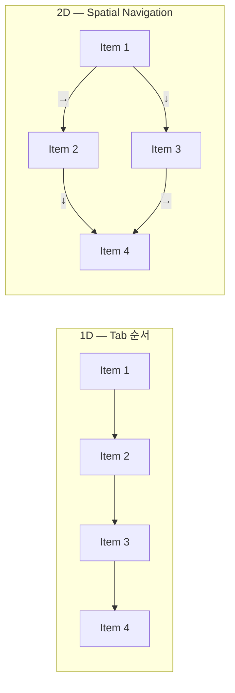
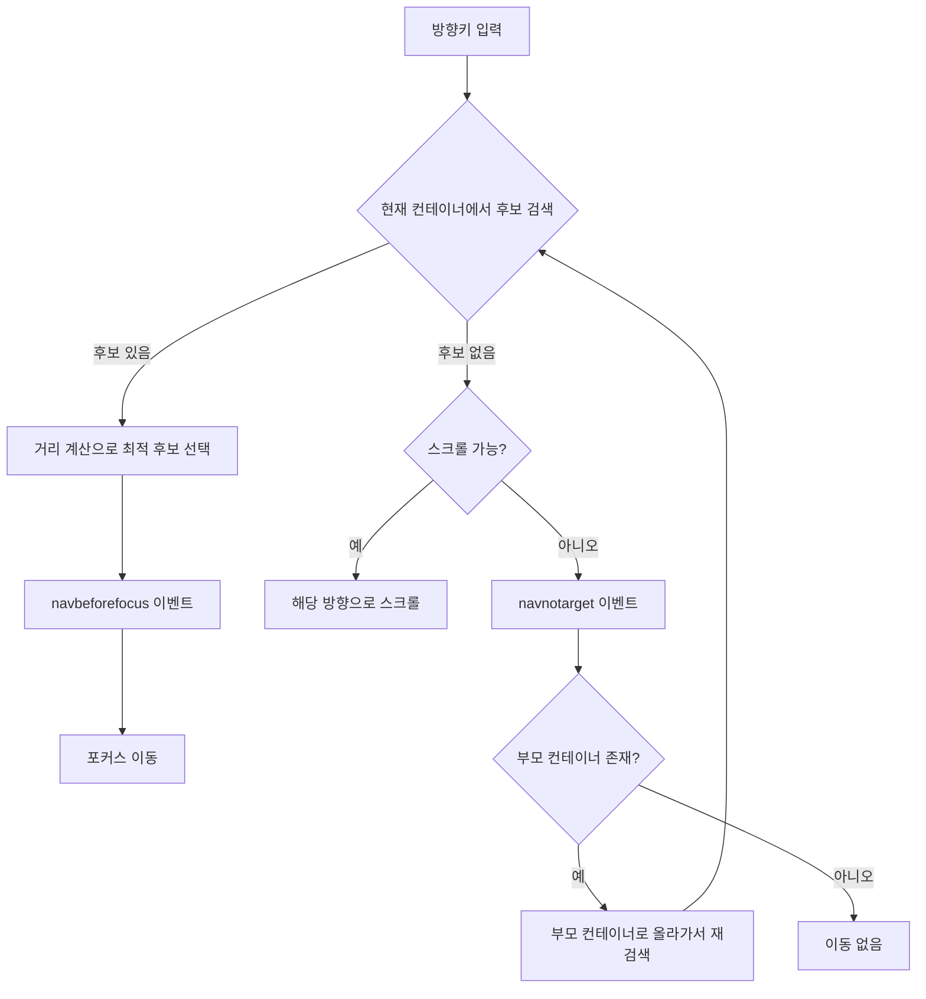
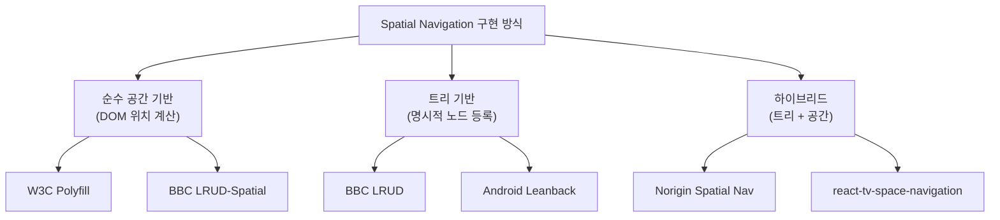

# Spatial Navigation 구현 방법론 — 방향키 기반 2D 포커스 이동의 알고리즘과 아키텍처

> 작성일: 2026-03-22
> 맥락: interactive-os의 Visual CMS에서 TV리모컨 스타일 공간 네비게이션 + Figma식 깊이 탐색을 구현하기 위한 외부 기술 조사

---

## Why — 포커스 이동에 왜 공간 알고리즘이 필요한가

전통적 웹 포커스 모델(Tab 순서)은 1차원이다. DOM 순서에 따라 선형으로 이동한다. 이 모델은 2D 레이아웃에서 직관적이지 않다. 그리드에서 "아래" 항목으로 가려면 Tab을 여러 번 눌러야 한다.

TV, 게임 콘솔, 키오스크, CMS 캔버스처럼 **마우스 없이 방향키만으로 2D 공간을 탐색**해야 하는 환경에서는 시각적 위치 기반 포커스 이동이 필수다. W3C는 이를 표준화하기 위해 CSS Spatial Navigation Level 1 스펙을 작성했고, TV 플랫폼들은 각자의 구현체를 만들어 왔다.



핵심 문제: 사용자가 "오른쪽"을 누르면 **오른쪽에 있는 것 중 가장 가까운 요소**로 이동해야 한다. "가장 가까운"의 정의가 알고리즘의 본질이다.

---

## How — 작동 원리

### 1. 전체 처리 흐름

W3C CSS Spatial Navigation 스펙이 정의하는 처리 모델은 모든 구현체의 기반이 된다.



### 2. 방향 필터링

모든 구현체의 첫 단계는 **방향 필터**다. "오른쪽"을 누르면 현재 요소보다 오른쪽에 있는 요소만 후보로 남긴다.

- 현재 요소의 bounding rect에서 이동 방향의 edge를 기준선으로 설정
- 후보 요소의 반대쪽 edge(진입 edge)가 기준선 너머에 있는지 확인
- BBC LRUD-Spatial은 여기에 **overlap threshold**(기본 30%)를 적용하여, 약간 겹치는 요소도 후보에 포함시킨다. 이로써 완전히 정렬되지 않은 레이아웃에서도 자연스러운 이동이 가능하다.

### 3. 거리 계산

방향 필터를 통과한 후보들 중 "가장 가까운" 것을 결정한다. 주요 접근 방식 3가지:

**W3C 스펙 공식:**
```
distance = euclidean + displacement - alignment - sqrt(overlap)
```
- `euclidean`: 기준점과 후보 사이 직선 거리
- `displacement`: 축 외 거리에 가중치 적용 (가로 이동 시 세로 차이에 30배 가중치)
- `alignment`: 방향 축 정렬 보너스 (가중치 5)
- `overlap`: 겹침 영역에 대한 페널티 감소

**Norigin Spatial Navigation의 3가지 모드:**
| 모드 | 측정 대상 | 적합한 상황 |
|------|----------|------------|
| `corners` (기본) | 가장 가까운 꼭짓점 간 거리 | 일반적 레이아웃 |
| `center` | 중심점 간 거리 | 크기가 다른 요소들 |
| `edges` | 가장 가까운 변 간 거리 | 인접한 요소들 |

**가중치 기반 거리 (react-unified-input 방식):**
이동 방향 축의 거리에는 낮은 가중치(1), 직교 축에는 높은 가중치(5)를 곱한다. 위로 이동할 때 세로 거리보다 가로 편차가 크면 후보에서 탈락한다.

### 4. Spatial Navigation Container (공간 네비게이션 컨테이너)

W3C 스펙의 핵심 개념. 포커스 검색의 **범위를 제한하는 논리적 그룹**이다.

기본 컨테이너:
- 뷰포트 경계
- 스크롤 컨테이너 (`overflow: auto/scroll`)

명시적 컨테이너:
- CSS: `spatial-navigation-contain: contain`
- BBC LRUD: `registerNode(id, { parent, orientation })` 트리 등록
- Norigin: `useFocusable()` Hook으로 Focus Container 선언

**컨테이너 우선 원칙**: 현재 컨테이너 내부에서 먼저 검색하고, 없으면 부모 컨테이너로 올라간다. 이것이 cross-boundary 이동의 기반이다.

### 5. Cross-Boundary 이동

컨테이너 경계를 넘는 이동은 세 단계로 발생한다:

1. 현재 컨테이너에서 후보 검색 실패
2. 부모 컨테이너로 올라가서 형제 컨테이너들을 후보에 포함
3. 형제 컨테이너가 선택되면 그 내부에서 최적 자식을 찾아 포커스

BBC LRUD에서는 `data-lrud-consider-container-distance` 속성으로 컨테이너 자체를 거리 계산에 포함시킨다. 컨테이너가 가장 가까우면 그 내부의 자식 중 하나를 반환한다.

### 6. Focus Memory (Last Focused Child)

컨테이너를 떠났다가 돌아올 때 **마지막으로 포커스된 자식을 복원**하는 패턴이다.

- Norigin: 기본 활성화. 컨테이너를 떠날 때 마지막 포커스 위치를 저장하고, 복귀 시 복원
- BBC LRUD: `activeChild` 추적. 비포커스 노드에 포커스가 할당되면 "첫 번째 active child인 focusable 후보"로 하강
- BBC TAL: "active child" 개념으로 위젯의 현재 포커스된 하위 요소를 추적

---

## What — 주요 구현체 비교

### 구현체 아키텍처 분류



### 주요 구현체 비교

| | W3C Polyfill | BBC LRUD-Spatial | BBC LRUD | Norigin |
|---|---|---|---|---|
| **접근** | DOM 위치 기반 | DOM 위치 기반 | 트리 등록 | Hook + 위치 |
| **프레임워크** | Vanilla JS | Vanilla JS | Vanilla JS | React |
| **거리 계산** | 가중 유클리드 | edge-to-edge | N/A (트리 순회) | corners/center/edges |
| **컨테이너** | CSS 속성 | data 속성 | registerNode | useFocusable |
| **Focus Memory** | 미지원 | data-focus 속성 | activeChild | 기본 활성 |
| **Cross-boundary** | 부모 컨테이너 상승 | overlap threshold | 트리 순회 | 2단계 검색 |
| **Orientation** | 방향 무관 | overlap으로 제어 | horizontal/vertical | 방향 무관 |
| **상태** | FPWD (2019) | 활성 | 유지보수 모드 | 활성 |

### W3C CSS Spatial Navigation API

```javascript
// spatialNavigationSearch — 요소의 메서드로 호출
const next = element.spatialNavigationSearch('right', {
  container: scopeElement,    // 검색 범위 제한 (선택)
  candidates: candidateList   // 후보 명시 (선택)
});
if (next) next.focus();
```

스펙은 두 가지 이벤트를 정의한다:
- `navbeforefocus`: 포커스 이동 직전 발생. `preventDefault()`로 취소 가능
- `navnotarget`: 컨테이너에서 후보를 찾지 못했을 때 발생. 커스텀 동작(루핑, 트래핑) 가능

### BBC LRUD-Spatial 핵심 로직

```javascript
// 4단계 알고리즘
// 1. keyCode → 방향 매핑
// 2. 현재 요소의 exit edge 좌표 계산
// 3. 모든 focusable 요소의 entry edge 좌표 계산
// 4. exit → entry 최단 거리 선택

// overlap threshold로 대각선 이동 허용
// data-lrud-overlap-threshold="0.0" → 순수 방향만
// data-lrud-overlap-threshold="0.3" → 30% 겹침 허용 (기본)
```

### Norigin Spatial Navigation 초기화

```javascript
import { init } from '@noriginmedia/norigin-spatial-navigation';

init({
  distanceCalculationMethod: 'center',  // 'corners' | 'center' | 'edges'
  useGetBoundingClientRect: true,       // CSS transform 반영
  // 커스텀 거리 함수도 가능
  customDistanceCalculationFunction: (layout1, layout2, direction) => number
});
```

---

## If — 프로젝트에 대한 시사점

### 현재 프로젝트 설계와의 매핑

interactive-os의 spatial behavior는 기존 구현체들과 상당 부분 일치하되, **깊이 탐색(Enter/Escape)**이라는 독자적 축을 추가한다.

| 프로젝트 개념 | 대응하는 외부 개념 |
|---|---|
| `useSpatialNav` | Norigin `useFocusable` + W3C `spatialNavigationSearch` |
| `__spatial_parent__` | W3C Spatial Navigation Container |
| Enter → 자식 포커스 | Figma의 Tab으로 자식 진입 (유사하나 Enter 사용) |
| Escape → 부모 복귀 | Figma의 Escape로 부모 복귀 |
| sticky cursor | LRUD `data-focus` + Norigin Focus Memory |
| cross-boundary 이동 | W3C 부모 컨테이너 상승 + LRUD container distance |

### 구현 시 고려사항

1. **거리 계산**: W3C의 가중 유클리드 공식이 가장 정교하지만 복잡하다. Norigin의 `center` 모드가 CMS 그리드 레이아웃에 적합할 수 있다. 크기가 균일하지 않은 CMS 블록에서는 center 기반이 직관적이다.

2. **overlap threshold**: BBC LRUD-Spatial의 30% 기본 threshold는 실전에서 검증된 값이다. 완전히 정렬되지 않은 레이아웃에서 자연스러운 이동을 제공한다. `__spatial_parent__` 자식 필터링에 적용 가능하다.

3. **컨테이너 탈출 전략**: W3C 스펙의 "컨테이너 내부 우선 → 실패 시 부모로 상승" 모델이 프로젝트의 cross-boundary 설계와 정확히 일치한다. `navnotarget` 이벤트 패턴으로 커스텀 탈출 로직을 구현할 수 있다.

4. **Focus Memory vs Sticky Cursor**: 기존 구현체들의 Focus Memory는 "마지막 포커스 자식 복원"이다. 프로젝트의 sticky cursor는 이를 확장하여 **방향별 기억**(`Map<parentId, childId>`)과 **리셋 조건**(클릭, Enter, Escape만)을 추가한다. 이 확장은 기존 구현체에 없는 독자적 기여다.

5. **DOM 기반 vs 모델 기반**: 대부분의 구현체는 `getBoundingClientRect`로 실제 DOM 위치를 측정한다. interactive-os는 engine 모델에서 포커스를 관리하므로, 렌더링된 DOM 위치를 알고리즘 입력으로 사용하되 포커스 상태는 모델에서 관리하는 하이브리드가 적합하다.

---

## Insights

- **W3C displacement 가중치의 비대칭**: 가로 이동 시 세로 편차 가중치(30)가 세로 이동 시 가로 편차 가중치(2)보다 15배 크다. 이유: 가로 레이아웃이 세로보다 흔하므로, 가로 이동에서 "줄 점프"를 강하게 억제한다. CMS 레이아웃에서도 이 비대칭이 필요한지 검토가 필요하다.

- **LRUD-Spatial의 30% overlap threshold는 경험적 값**: 0%면 약간의 정렬 오차에도 후보에서 탈락하고, 50%면 의도하지 않은 대각선 이동이 발생한다. BBC가 TV 앱 실전에서 도출한 30%는 좋은 시작점이다.

- **Focus Memory의 리셋 타이밍이 UX를 결정**: 대부분 구현체는 Focus Memory를 항상 유지하지만, 프로젝트의 "명시적 의도(클릭, Enter, Escape)에서만 리셋" 정책이 더 정교하다. CRUD로 요소가 삭제되어도 메모리를 유지하면 focusRecovery가 대체 위치를 찾아주므로, 두 시스템이 상호 보완된다.

- **W3C 스펙은 FPWD(2019) 이후 진전이 느리다**: 브라우저 네이티브 구현은 아직 없다. 그러나 `spatialNavigationSearch` API 디자인과 이벤트 모델(`navbeforefocus`, `navnotarget`)은 JavaScript polyfill 또는 커스텀 구현의 인터페이스 설계에 좋은 참고가 된다.

- **Figma의 깊이 탐색 모델은 Tab/Enter/Escape 조합**: 프로젝트와 유사하지만, Figma는 Tab으로 형제 순회 + Enter로 자식 진입이고, 프로젝트는 화살표로 공간 이동 + Enter로 깊이 진입이다. 프로젝트 모델이 공간 네비게이션에 더 자연스럽다.

---

## Sources

| # | 출처 | 유형 | 핵심 내용 |
|---|------|------|----------|
| 1 | [CSS Spatial Navigation Level 1](https://www.w3.org/TR/css-nav-1/) | W3C 스펙 | 가중 유클리드 거리 공식, 컨테이너 모델, 처리 흐름 정의 |
| 2 | [WICG Spatial Navigation](https://wicg.github.io/spatial-navigation/) | W3C 커뮤니티 | spatialNavigationSearch API, polyfill, 데모 컬렉션 |
| 3 | [spatialNavigationSearch Explainer](https://github.com/WICG/spatial-navigation/blob/main/docs/spatialNavigationSearch_explainer.md) | 스펙 문서 | spatialNavigationSearch(dir, options) API 설계 |
| 4 | [BBC LRUD-Spatial](https://github.com/bbc/lrud-spatial) | 라이브러리 | edge-to-edge 거리, 30% overlap threshold, data 속성 기반 |
| 5 | [BBC LRUD](https://github.com/bbc/lrud) | 라이브러리 | 트리 기반 노드 등록, orientation, activeChild 추적 |
| 6 | [Norigin Spatial Navigation](https://github.com/NoriginMedia/Norigin-Spatial-Navigation) | 라이브러리 | React Hook 기반, corners/center/edges 거리 모드, Focus Memory |
| 7 | [Focus and Spatial Navigation in React](https://whoisryosuke.com/blog/2024/focus-and-spatial-navigation-in-react) | 블로그 | 3가지 아키텍처(index/weight/hierarchical) 비교, 가중치 기반 거리 |
| 8 | [Figma Keyboard Navigation](https://help.figma.com/hc/en-us/articles/360040328653-Use-Figma-products-with-a-keyboard) | 공식 문서 | Tab/Enter/Escape 깊이 탐색, 화살표 캔버스 패닝 |
| 9 | [Norigin — React Smart TV Navigation](https://noriginmedia.com/spatial-navigation/) | 공식 사이트 | distanceCalculationMethod, getBoundingClientRect 옵션 |
