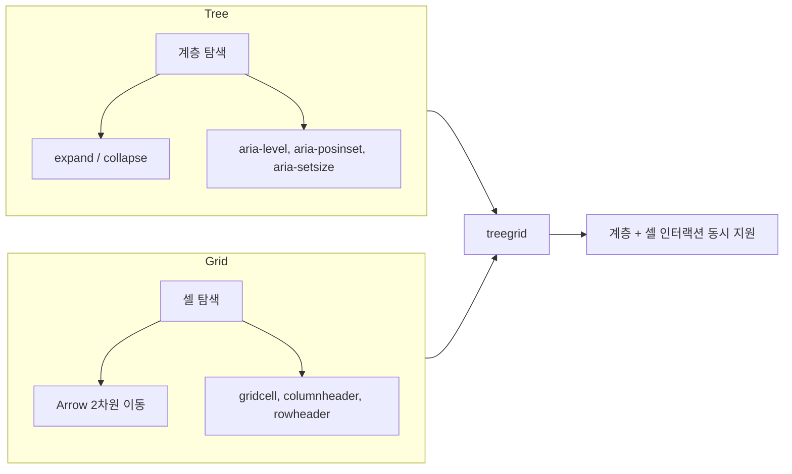
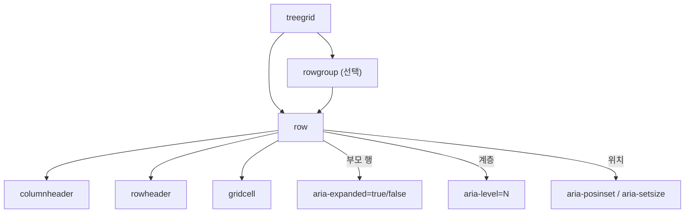

# WAI-ARIA TreeGrid Pattern -- 계층 데이터 그리드의 접근성 패턴

> 작성일: 2026-03-22
> 맥락: aria 프로젝트가 interactive-os의 핵심 behavior로 treegrid를 구현하고 있으며, W3C 공식 스펙 기반의 정확한 키보드 인터랙션과 ARIA 속성 체계를 참고 자료로 정리할 필요가 있다.

---

## Why -- Tree와 Grid가 결합해야 했던 이유

파일 탐색기, 이메일 받은편지함, 프로젝트 관리 도구 등은 두 가지 요구를 동시에 충족해야 한다: (1) 계층 구조를 펼치고 접는 트리 탐색, (2) 각 행 안에서 여러 열의 데이터를 편집하거나 인터랙션하는 그리드 조작. ARIA 1.0 시점에는 `tree`와 `grid`가 별도 역할이었고, 둘을 결합하면 스크린 리더가 어떤 인터랙션 모델을 적용해야 할지 모호했다. `treegrid` 역할은 이 둘을 하나의 위젯으로 합쳐, 보조 기술에 "이 위젯은 트리처럼 확장/축소되면서 그리드처럼 셀 탐색도 된다"고 선언하는 역할이다.



W3C APG는 treegrid를 "a hierarchical data grid consisting of tabular information that is editable or interactive"로 정의한다. 핵심 판단 기준은 명확하다: **행이 `aria-expanded`를 지원하거나, `aria-posinset`/`aria-setsize`/`aria-level`이 필요하면 `grid`가 아닌 `treegrid`를 사용한다.**

단, Adrian Roselli는 ARIA grid 자체가 anti-pattern이 되는 경우를 경고한다. 레이아웃 목적의 grid(링크/버튼 그룹)는 네이티브 HTML 리스트로 충분하며, 스프레드시트급 셀 조작이 실제로 필요할 때만 grid/treegrid를 사용해야 한다. 불필요한 grid 역할은 스크린 리더 사용자에게 인지 부하를 가중시킨다.

---

## How -- 작동 원리

### DOM 구조와 역할 모델

treegrid는 엄격한 역할 계층을 요구한다.



| 역할 | 위치 | 필수 여부 |
|------|------|----------|
| `treegrid` | 최상위 컨테이너 | 필수 |
| `row` | treegrid 또는 rowgroup의 자식 | 필수 |
| `rowgroup` | treegrid의 자식, row를 그룹핑 | 선택 |
| `gridcell` | row의 자식 (일반 셀) | 필수 (하나 이상) |
| `columnheader` | row의 자식 (열 헤더) | 선택 |
| `rowheader` | row의 자식 (행 헤더) | 선택 |

### 키보드 인터랙션

treegrid의 키보드 모델은 Tree의 확장/축소와 Grid의 2차원 셀 이동을 하나의 키맵에 통합한다. 포커스 대상이 **행(row)**인지 **셀(cell)**인지에 따라 같은 키가 다르게 동작하는 것이 핵심이다.

| 키 | 행 포커스 | 셀 포커스 |
|----|----------|----------|
| **Right Arrow** | 펼쳐진 행: 첫 번째 셀로 이동. 접힌 행: 확장. | 오른쪽 셀로 이동. 마지막 셀이면 정지. |
| **Left Arrow** | 펼쳐진 행: 축소. 접힌 행: 부모 행으로 이동. | 왼쪽 셀로 이동. 첫 셀이면 행으로 이동(행 포커스 지원 시). |
| **Down Arrow** | 다음 행으로 이동 | 아래 셀로 이동 |
| **Up Arrow** | 이전 행으로 이동 | 위 셀로 이동 |
| **Enter** | 셀 전용 모드에서 첫 셀이 `aria-expanded`를 가지면 토글. 아니면 기본 동작. | 셀의 기본 동작 수행 |
| **Tab** | 행 내 다음 포커스 가능 요소. 마지막이면 그리드 탈출. | 동일 |
| **Home** | 첫 번째 행 | 현재 행의 첫 번째 셀 |
| **End** | 마지막 행 | 현재 행의 마지막 셀 |
| **Ctrl+Home** | 첫 번째 행 | 첫 행 첫 열 셀 |
| **Ctrl+End** | 마지막 행 | 마지막 행 마지막 열 셀 |
| **Page Down/Up** | 작성자 정의 행 수만큼 이동 | 동일 |

**선택 키 (다중 선택 지원 시):**

| 키 | 동작 |
|----|------|
| **Ctrl+Space** | 행 포커스: 전체 선택. 셀 포커스: 열 선택. |
| **Shift+Space** | 전체 행 선택 |
| **Ctrl+A** | 전체 셀 선택 |
| **Shift+Arrow** | 선택 영역 확장 |

### 포커스 관리

treegrid에서 포커스 관리는 특히 중요하다. 스크린 리더는 treegrid 내에서 **application reading mode**를 사용하므로, 포커스 가능한 요소만 음성으로 전달된다. 따라서:

- 모든 행과 셀은 포커스 가능하거나, 포커스 가능한 요소를 포함해야 한다
- 기능 없는 열 헤더(정렬/필터 없음)는 예외적으로 포커스 불필요
- 포커스 구현 방식: roving tabindex(`tabindex="0"` / `tabindex="-1"`) 또는 `aria-activedescendant`

### 계층 속성: aria-posinset/setsize vs aria-rowcount/rowindex

W3C Working Group 논의(#1442)에서 Matt King은 treegrid에서는 **`aria-posinset`과 `aria-setsize`를 사용하고, `aria-rowcount`와 `aria-rowindex`는 불필요**하다고 권고했다. 이유:

- `aria-rowcount/rowindex`는 평탄한 그리드용이며, 중첩 행의 의미가 모호하다 (전체 행? 루트 행만?)
- `aria-posinset/setsize`는 각 계층 수준 내에서의 위치를 정확히 표현한다
- 지연 로딩 트리에서 `aria-rowcount`는 산정이 비현실적이다

ARIA 1.1에서는 `row`에 `aria-posinset/setsize`가 허용되지 않는 스펙 오류가 있었으나, ARIA 1.2에서 수정되었다.

---

## What -- ARIA 속성 전체 목록과 구현 사례

### 속성 체계

**treegrid 컨테이너에 설정하는 속성:**

| 속성 | 용도 | 필수 |
|------|------|------|
| `aria-labelledby` 또는 `aria-label` | 접근 가능한 이름 | 필수 (택 1) |
| `aria-multiselectable` | 다중 선택 지원 | 선택 |
| `aria-describedby` | 설명 참조 | 선택 |
| `aria-readonly` | 전체 읽기 전용 | 선택 (기본값: 편집 가능) |
| `aria-disabled` | 비활성 상태 | 선택 |
| `aria-colcount` | 전체 열 수 (가상화 시) | 선택 |
| `aria-rowcount` | 전체 행 수 (비권장, setsize 우선) | 선택 |
| `aria-activedescendant` | 현재 포커스 대상 ID (컨테이너 포커스 방식) | 선택 |

**row에 설정하는 속성:**

| 속성 | 용도 |
|------|------|
| `aria-expanded` | 부모 행의 확장/축소 상태 (`true`/`false`) |
| `aria-level` | 계층 깊이 (1-based) |
| `aria-posinset` | 같은 레벨 내 위치 (1-based) |
| `aria-setsize` | 같은 레벨 내 형제 수 |
| `aria-selected` | 선택 상태 |
| `aria-owns` | DOM 외부 자식 행 참조 |

**셀에 설정하는 속성:**

| 속성 | 용도 |
|------|------|
| `aria-readonly` | 개별 셀 읽기 전용 |
| `aria-sort` | 정렬 상태 (`ascending`, `descending`, `none`, `other`) -- columnheader에만 |
| `aria-colindex` | 열 위치 (가상화 시) |
| `aria-colspan` / `aria-rowspan` | 셀 병합 (비테이블 DOM에서만) |
| `aria-expanded` | 셀 전용 포커스 모드에서 확장 상태 대리 |

### 세 가지 포커스 모드

W3C APG 예제는 세 가지 포커스 구성을 제시한다:

1. **행 + 셀 포커스**: 화살표로 행과 셀 모두 이동 가능. Right Arrow가 행에서 셀로 전환.
2. **행 전용 포커스**: Tab으로 행 내 위젯 순회. 셀 자체는 포커스 불가.
3. **셀 전용 포커스**: `aria-expanded`를 행 대신 첫 번째 셀에 설정. 행은 포커스 대상 아님.

### 구현 예시: HTML 구조

```html
<table role="treegrid" aria-label="이메일 받은편지함">
  <thead>
    <tr>
      <th>제목</th>
      <th>보낸 사람</th>
      <th>날짜</th>
    </tr>
  </thead>
  <tbody>
    <tr role="row" aria-level="1" aria-posinset="1" aria-setsize="3"
        aria-expanded="true" tabindex="0">
      <td role="gridcell">프로젝트 업데이트</td>
      <td role="gridcell">김개발</td>
      <td role="gridcell">2026-03-20</td>
    </tr>
    <tr role="row" aria-level="2" aria-posinset="1" aria-setsize="2"
        tabindex="-1">
      <td role="gridcell">RE: 프로젝트 업데이트</td>
      <td role="gridcell">박디자인</td>
      <td role="gridcell">2026-03-21</td>
    </tr>
    <!-- aria-level="2" 자식 행들... -->
  </tbody>
</table>
```

---

## If -- aria 프로젝트에 대한 시사점

### 현재 구현 상태

aria 프로젝트의 `src/interactive-os/behaviors/treegrid.ts`는 `composePattern`으로 네 개 축을 조합한다:

- `select` (multiple, extended)
- `activate` (onClick)
- `expand` (arrow 모드)
- `navigate` (vertical)

`ariaAttributes`에서 `aria-selected`, `aria-posinset`, `aria-setsize`, `aria-expanded`, `aria-level`을 설정하고 있다. 이는 W3C 권고와 정확히 일치한다.

### 스펙 대비 확인 포인트

1. **포커스 모드**: 현재 구현이 행 전용/셀 전용/혼합 중 어떤 모드인지 명시적으로 결정해야 한다. 스펙은 세 가지 모두 허용하지만, 모드에 따라 Left/Right Arrow의 의미가 완전히 달라진다.

2. **aria-readonly 기본값**: treegrid는 기본적으로 편집 가능으로 간주된다. 읽기 전용이면 명시적으로 `aria-readonly="true"`를 설정해야 한다. CMS처럼 편집이 핵심인 곳에서는 생략이 맞지만, Viewer 같은 읽기 전용 화면에서는 설정이 필요하다.

3. **aria-rowcount 미사용**: 현재 `aria-posinset/setsize`만 사용하는 것은 W3C 권고에 정확히 부합한다. `aria-rowcount/rowindex`를 추가할 필요 없다.

4. **navigate가 vertical만 지원**: treegrid 스펙에서 수평 이동은 셀 간 이동이지 행 간 이동이 아니다. 현재 `navigate({ orientation: 'vertical' })`은 행 수준 탐색이며, 셀 수준 수평 이동은 별도 축이 필요할 수 있다.

5. **columnheader/rowheader 역할**: `childRole: 'row'`만 선언되어 있는데, 셀 수준에서 gridcell/columnheader/rowheader 구분이 필요하다면 추가 설정이 필요하다.

---

## Insights

- **aria-expanded 위치가 포커스 모드를 결정한다**: `aria-expanded`를 row에 두면 행 포커스, 첫 번째 gridcell에 두면 셀 전용 포커스다. 이 하나의 속성 위치가 전체 키보드 인터랙션 모델을 규정한다. 현재 aria 프로젝트는 행에 두고 있으므로 행 포커스 또는 혼합 모드에 해당한다.

- **treegrid는 기본 편집 가능**: 대부분의 ARIA 역할은 기본 읽기 전용이지만, treegrid(와 grid)는 반대다. `aria-readonly`를 생략하면 "이 위젯은 편집할 수 있다"는 의미가 된다. 이는 보조 기술 사용자에게 편집 모드 진입을 시도하게 만들 수 있어, 읽기 전용 컨텍스트에서는 반드시 명시해야 한다.

- **aria-posinset/setsize가 rowcount/rowindex를 대체한다**: W3C Working Group의 공식 입장이다. 특히 지연 로딩 트리에서 전체 행 수를 알 수 없으므로, 로컬 계층 내 위치만 표현하는 posinset/setsize가 실용적이다. ARIA 1.1의 스펙 오류로 한동안 row에 사용 불가했으나 1.2에서 수정되었다.

- **"No ARIA is better than Bad ARIA"**: Adrian Roselli의 경고는 treegrid에 특히 해당한다. 계층이 없는 평탄한 데이터에 treegrid를 사용하면, 스크린 리더 사용자에게 존재하지 않는 확장/축소 기능을 기대하게 만든다.

---

## Sources

| # | 출처 | 유형 | 핵심 내용 |
|---|------|------|----------|
| 1 | [Treegrid Pattern - APG - W3C](https://www.w3.org/WAI/ARIA/apg/patterns/treegrid/) | 공식 스펙 | 키보드 인터랙션, 역할/속성/상태 전체 정의 |
| 2 | [Treegrid Email Inbox Example - APG - W3C](https://www.w3.org/WAI/ARIA/apg/patterns/treegrid/examples/treegrid-1/) | 공식 예제 | 세 가지 포커스 모드 구현, 키보드 동작 참조 구현 |
| 3 | [ARIA: treegrid role - MDN](https://developer.mozilla.org/en-US/docs/Web/Accessibility/ARIA/Reference/Roles/treegrid_role) | 공식 문서 | 전체 속성 목록, DOM 구조 요구사항, 구현 노트 |
| 4 | [ARIA Grid as an Anti-Pattern - Adrian Roselli](https://adrianroselli.com/2020/07/aria-grid-as-an-anti-pattern.html) | 전문가 블로그 | grid/treegrid 오남용 경고, 네이티브 HTML 우선 원칙 |
| 5 | [aria-rowcount vs aria-setsize for treegrid - w3c/aria-practices #1442](https://github.com/w3c/aria-practices/issues/1442) | 커뮤니티 논의 | treegrid에서 posinset/setsize 사용 권고, rowcount/rowindex 불필요 |
| 6 | [aria-posinset/setsize on row in treegrid - w3c/html-aria #190](https://github.com/w3c/html-aria/issues/190) | 스펙 논의 | ARIA 1.1 스펙 오류 보고, 1.2에서 row에 posinset/setsize 허용 |
| 7 | [Grid and Table Properties - APG - W3C](https://w3c.github.io/wai-website/ARIA/apg/practices/grid-and-table-properties/) | 공식 스펙 | aria-colcount, aria-sort 등 그리드/테이블 공통 속성 가이드 |
