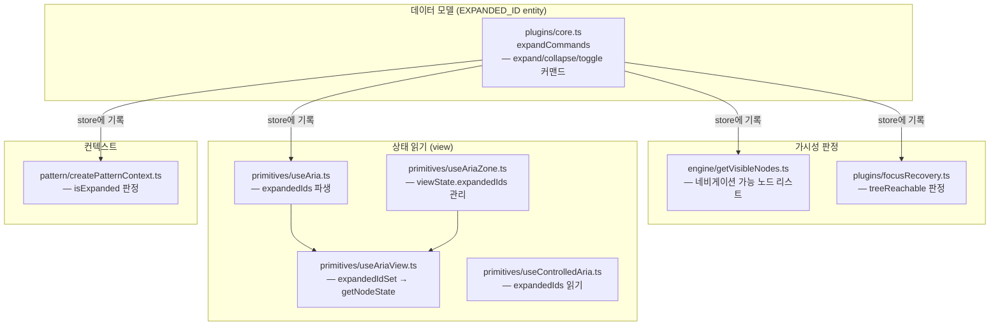
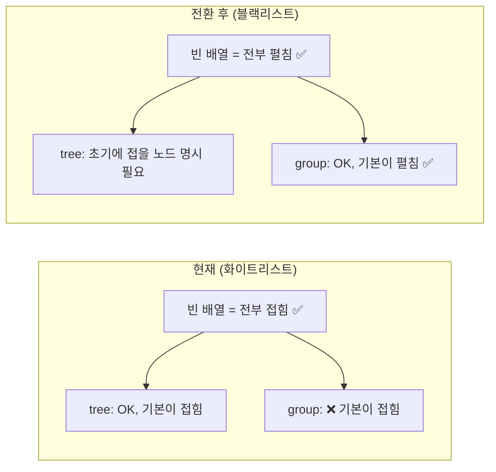

# expand()

> 확장 축. 트리 깊이 탐색(arrow) 또는 공간 진입/탈출(enter-esc).

## 스펙

### mode: 'arrow' (기본)

| 키 | 동작 | 조건 |
|---|---|---|
| ArrowRight | expand 또는 focusChild | expanded 상태에 따라 분기 |
| ArrowLeft | collapse 또는 focusParent | expanded 상태에 따라 분기 |

### mode: 'enter-esc'

| 키 | 동작 | 조건 |
|---|---|---|
| Enter | enterChild (spatial) 또는 startRename (fallback) | — |
| Escape | exitToParent (spatial) | — |

### 옵션

| 옵션 | 타입 | 기본값 | 설명 |
|------|------|--------|------|
| mode | `'arrow' \| 'enter-esc'` | `'arrow'` | 확장 모드 |

## 관계

- **navigate**와 ←→ 키 충돌 → expand가 우선, expanded 상태 아니면 void → navigate로 fallback
- **spatial** 플러그인 의존 → enter-esc 모드에서 enterChild/exitToParent 커맨드 사용
- **rename** 플러그인 의존 → enter-esc 모드에서 Enter의 fallback으로 startRename
- **trap**과 Escape 공유 가능 → compose 순서로 해결

## 데모

```tsx render
<ExpandDemo />
```

## 관련

- 사용 패턴: tree (arrow), menu (arrow), spatial (enter-esc), accordion (via activate.toggleExpand)

## expandedIds→collapsedIds Migration

> 작성일: 2026-03-25
> 맥락: NavList 그룹 버그에서 출발, getVisibleNodes의 가시성 모델을 화이트리스트→블랙리스트로 전환하기로 결정

> **Situation** — `expandedIds` (화이트리스트)가 engine, core plugin, view, focusRecovery 등 8개 파일에 걸쳐 사용된다.
> **Complication** — `collapsedIds` (블랙리스트)로 전환하면 기본값이 "보임"으로 바뀌므로, "기본 접힘"을 전제하는 코드가 전부 깨진다.
> **Question** — 어디가 닿고, 어디가 위험한가?
> **Answer** — 8개 파일이 닿지만 대부분 기계적 rename. 진짜 제약은 2개: tree 초기 상태와 focusRecovery의 reachability 판정.

---

### 변경이 닿는 8개 파일과 각각의 역할



| 파일 | 현재 동작 | 전환 후 변경 | 난이도 |
|------|----------|-------------|--------|
| `core.ts` | expand = 배열에 추가, collapse = 배열에서 제거 | **반전**: expand = 배열에서 제거, collapse = 배열에 추가 | 기계적 |
| `getVisibleNodes.ts` | `expandedIds.includes(id)` → walk | `!collapsedIds.includes(id)` → walk | 기계적 |
| `createPatternContext.ts` | `expandedIds.includes(id)` → isExpanded | `!collapsedIds.includes(id)` → isExpanded | 기계적 |
| `useAria.ts` | `store.entities['__expanded__']?.expandedIds` 읽기 | 필드명 변경 | 기계적 |
| `useAriaView.ts` | `expandedIdSet.has(id)` → expanded 상태 | `!collapsedIdSet.has(id)` → expanded 상태 | 기계적 |
| `useAriaZone.ts` | viewState에서 expandedIds 관리 | collapsedIds로 rename + 로직 반전 | 기계적 |
| `useControlledAria.ts` | `expandedIds.includes(id)` | `!collapsedIds.includes(id)` | 기계적 |
| **`focusRecovery.ts`** | `expandedIds.includes(parentId)` → reachable | `!collapsedIds.includes(parentId)` → reachable | **제약** |

---

### 제약 1: Tree 패턴의 초기 상태가 반전된다

현재 tree-view의 초기 상태:
- `expandedIds = []` → 모든 노드가 접혀 있음 (root 자식만 보임)
- 사용자가 펼치면 expandedIds에 추가

전환 후:
- `collapsedIds = []` → **모든 노드가 펼쳐져 있음** (전체 트리 노출)
- tree-view가 "기본 접힘"을 원하면, 초기화 시 접을 노드를 collapsedIds에 넣어야 함



**영향받는 패턴:**

| 패턴 | 파일 | 필요한 조치 |
|------|------|------------|
| tree | `pattern/tree.ts` | 초기 collapsedIds에 자식 있는 노드를 넣는 초기화 |
| treegrid | `pattern/treegrid.ts` | 동일 |
| spatial | `pattern/spatial.ts` | `spatialReachable`은 `() => true`이므로 **영향 없음** |
| accordion | `pattern/accordion.ts` | 초기 상태를 accordion 소비자가 결정 — 현재도 동일 |
| disclosure | `pattern/disclosure.ts` | 동일 |

---

### 제약 2: focusRecovery의 treeReachable이 같은 가정을 공유한다

`focusRecovery.ts:22-33`의 `treeReachable` 함수:

```typescript
function treeReachable(store, nodeId): boolean {
  // 모든 조상이 expandedIds에 있어야 reachable
  while (current !== ROOT_ID) {
    if (!expandedIds.includes(parentId)) return false  // ← 여기
  }
}
```

이 함수는 "포커스된 노드가 사라졌을 때 복구 대상을 찾는" 핵심 로직이다. 전환 후:

```typescript
if (collapsedIds.includes(parentId)) return false  // 반전
```

기계적 반전이지만, **focusRecovery는 CRUD가 있는 모든 패턴에서 불변 조건**이다. 이 함수가 잘못되면 포커스가 사라진 노드에 남아버린다. 테스트 필수.

기존에 `isReachable` 인터페이스가 주입 가능하게 설계되어 있어서(`spatialReachable`, `treeReachable`), 함수 내부만 바꾸면 인터페이스는 그대로.

---

### 닿지 않는 것: 이름(EXPANDED_ID)

entity key `'__expanded__'`를 `'__collapsed__'`로 바꿀지는 별개 판단. 데이터 의미가 반전되니 이름도 바꾸는 게 맞지만, 마이그레이션 범위가 넓어짐. entity key 변경은 선택.

---

### Walkthrough

1. `src/interactive-os/plugins/core.ts:203-291` — expand/collapse/toggleExpand 커맨드 3개, 여기가 데이터 모델의 원점
2. `src/interactive-os/engine/getVisibleNodes.ts` — 27줄, 가시성 판정의 단일 지점
3. `src/interactive-os/plugins/focusRecovery.ts:22-33` — treeReachable, 제약의 핵심
4. 나머지 5개 파일 — store에서 읽기만 하므로 기계적 반전
