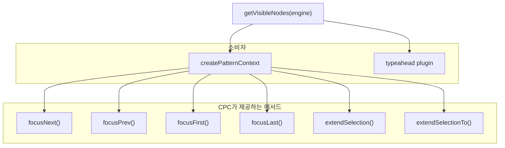
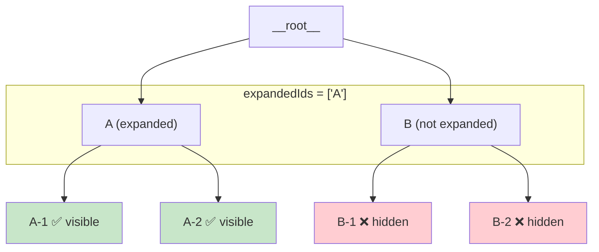
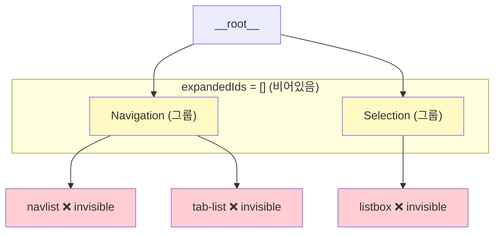

# Engine (L2)

> Command 기반 상태 변환 엔진.

## 주기율표

| 모듈 | 함수/타입 | 역할 | 상태 |
|------|----------|------|------|
| types | `Command`, `BatchCommand`, `createBatchCommand`, `Middleware` | 실행 타입 정의 | 🟢 |
| createCommandEngine | `createCommandEngine()` | Command 파이프라인 실행, 플러그인 체인 | 🟢 |
| dispatchLogger | `dispatchLogger`, `Logger` | 디스패치 로깅 | 🟢 |
| useEngine | `useEngine()` | React 바인딩 | 🟢 |

## 핵심 개념

- **Command**: `(store) => store` — 순수 함수로 상태 변환
- **Middleware**: Command 실행 전후에 개입하는 체인
- **BatchCommand**: 다중 커맨드 원자 실행

## 의존 방향

```
store/types (Entity, NormalizedData)
  ↓
engine/types (Command, Middleware)
  ↓
createCommandEngine (Command 실행)
  ↓
plugins, pattern (소비자)
```

## 갭

(없음 — engine은 안정)

## getVisibleNodes Dependency Analysis

> 작성일: 2026-03-25
> 맥락: NavList 사이드바에서 ArrowDown이 동작하지 않는 버그를 추적하다, getVisibleNodes의 설계 한계를 발견

> **Situation** — `getVisibleNodes`는 engine에서 "지금 사용자에게 보이는 노드 목록"을 반환하는 유일한 함수다. focusNext, focusPrev, typeahead 등 모든 네비게이션이 이 함수에 의존한다.
> **Complication** — 이 함수는 expand/collapse를 전제한 tree 모델로 설계되었다. 그룹이 있지만 expand 개념이 없는 패턴(listbox group, toolbar group)에서 자식 노드를 건너뛴다.
> **Question** — getVisibleNodes가 어디에서, 어떤 전제로 쓰이고 있으며, 그 전제가 깨지는 지점은 어디인가?
> **Answer** — 2개 소비자(createPatternContext, typeahead)가 있고, 둘 다 "반환된 리스트 = 네비게이션 가능한 전체 노드"라고 가정한다. 하지만 함수 내부는 "expanded가 아니면 자식을 숨긴다"는 tree 전제를 갖고 있어서, 투명 그룹이 있는 패턴에서 불일치가 발생한다.

---

### getVisibleNodes는 모든 키보드 네비게이션의 단일 소스다

이 함수의 반환값이 곧 "키보드로 도달 가능한 노드 목록"이다. 프로젝트 내 모든 네비게이션 로직은 이 리스트를 기반으로 동작한다.



| 소비자 | 파일 | 사용 방식 |
|--------|------|----------|
| `createPatternContext` | `pattern/createPatternContext.ts:41` | lazy 캐시 후 6개 메서드에서 참조 |
| `typeahead` | `plugins/typeahead.ts:107` | 타이핑으로 항목 검색 시 대상 리스트 |

> getVisibleNodes가 잘못된 리스트를 반환하면, **키보드 네비게이션 전체**가 깨진다.

---

### 내부 로직은 expand/collapse tree를 전제한다

```typescript
// engine/getVisibleNodes.ts — 전체 코드
const walk = (parentId: string) => {
  const children = getChildren(store, parentId)
  for (const childId of children) {
    visible.push(childId)                    // 자식 ID push
    if (expandedIds.includes(childId)) {     // expanded일 때만
      walk(childId)                          // 손자를 walk
    }
  }
}
walk(ROOT_ID)
```

이 로직의 전제: **자식이 있는 노드는 expanded 상태일 때만 자식을 보여준다.** 이것은 tree-view, accordion 등 expand/collapse 패턴에서는 정확하다.



| 범례 | 의미 |
|------|------|
| 초록 | visible (키보드 도달 가능) |
| 빨강 | hidden (키보드 도달 불가) |

반환값: `['A', 'A-1', 'A-2', 'B']` — B의 자식은 숨겨진다.

---

### 전제가 깨지는 지점: 투명 그룹

Listbox의 그룹(`role="group"`)은 시각적 분류 컨테이너일 뿐, expand/collapse 개념이 없다. 자식은 **항상** 보인다.

쇼케이스 사이드바 데이터:
```
ROOT → ['Navigation', 'Selection', 'Data', 'Input', 'Feedback']  ← 그룹
'Navigation' → ['navlist', 'tab-list', 'menu-list', ...]         ← 실제 항목
```

getVisibleNodes 반환값: `['Navigation', 'Selection', 'Data', 'Input', 'Feedback']`
기대값: `['navlist', 'tab-list', 'menu-list', ..., 'dialog', 'alert-dialog', ...]`



| 범례 | 의미 |
|------|------|
| 노랑 | 그룹 노드 — visible이지만 DOM에 `data-node-id` 없음 (포커스 불가) |
| 빨강 | 실제 항목 — invisible 처리됨 (getVisibleNodes가 반환 안 함) |

> `focusNext`에서 `visible.indexOf('navlist')` = -1. 포커스 이동 불가.

---

### 두 가지 자식 가시성 모델이 존재한다

| 모델 | 설명 | 사용 패턴 | expandable |
|------|------|----------|------------|
| **Gated** | expanded일 때만 자식 보임 | tree-view, accordion, disclosure | `true` |
| **Transparent** | 자식이 항상 보임, 부모는 시각적 컨테이너 | listbox group, toolbar group | `false` 또는 미설정 |

현재 getVisibleNodes는 Gated 모델만 지원한다. Transparent 모델을 표현할 방법이 없다.

핵심: `AriaPattern.expandable` 필드가 이미 존재한다 (`pattern/types.ts:26`). 이 필드가 **설정되지 않은** 패턴에서 자식이 있는 노드는 투명 그룹일 가능성이 높다. 하지만 getVisibleNodes는 이 정보를 받지 않는다 — engine만 받고 pattern을 모른다.

---

### Walkthrough

1. `src/interactive-os/engine/getVisibleNodes.ts` — 27줄, 함수 하나
2. `src/interactive-os/pattern/createPatternContext.ts:40-42` — lazy 캐시로 호출
3. 쇼케이스에서 재현: `http://localhost:5173/ui/NavList` → Tab으로 사이드바 진입 → ArrowDown → 이동 안 됨
4. 정상 동작 시: ArrowDown → `navlist` → `tab-list` → `menu-list` 순서로 포커스 이동
