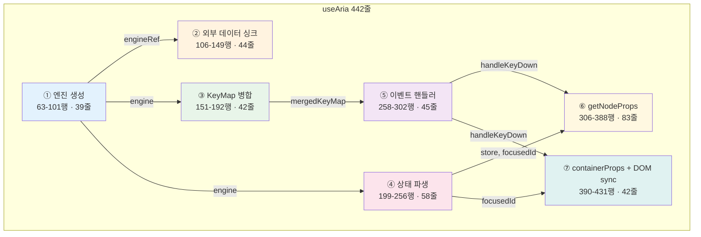
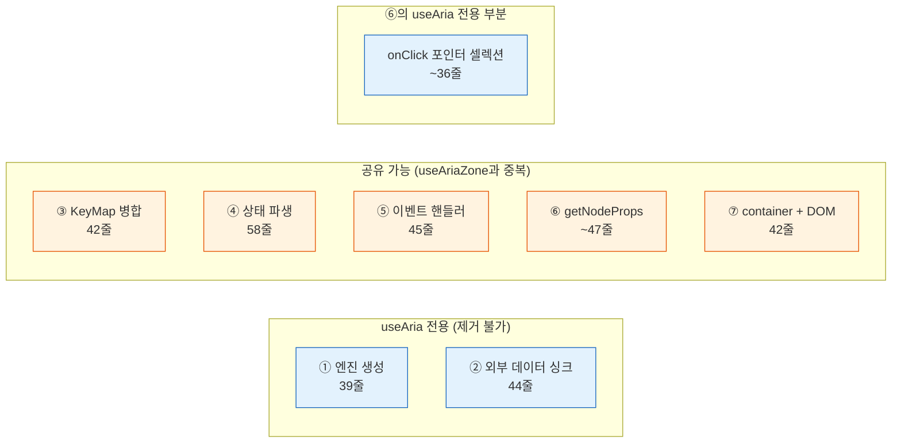
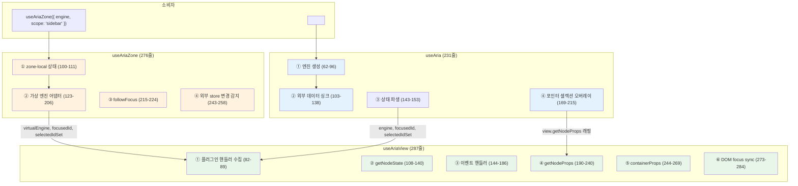
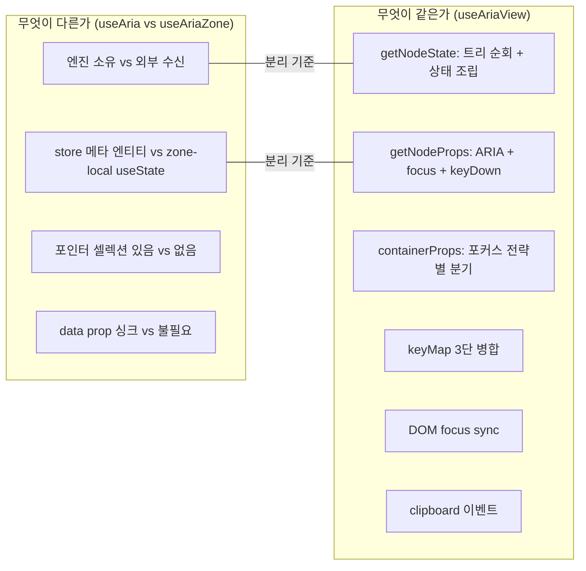

# useAria()

> 완전한 ARIA 통합 훅

## API

| 파라미터 | 타입 | 설명 |
|---------|------|------|
| behavior? | AriaBehavior | ARIA 패턴 정의 (생략 시 EMPTY_BEHAVIOR = keyMap-only 모드) |
| data | NormalizedData | 정규화된 트리 데이터 |
| plugins? | Plugin[] | 플러그인 배열 |
| keyMap? | KeyMap | keyMap 오버라이드 (last wins) |
| onChange? | (data: NormalizedData) => void | 데이터 변경 콜백 |
| onActivate? | (id: string) => void | 항목 활성화 콜백 |
| initialFocus? | string | 초기 포커스 대상 ID |

## 반환값

| 필드 | 타입 | 설명 |
|------|------|------|
| dispatch | (command: Command) => void | 커맨드 디스패치 |
| getNodeProps | (id: string) => object | 노드별 ARIA 속성 |
| getNodeState | (id: string) => NodeState | 노드 상태 조회 |
| focused | string \| null | 현재 포커스된 노드 ID |
| selected | Set\<string\> | 선택된 노드 ID 집합 |
| getStore | () => NormalizedData | 현재 store 스냅샷 |
| containerProps | object | 컨테이너 요소에 바인딩할 props |

## 핵심 동작

- behavior.keyMap + plugin.keyMap + keyMapOverrides 병합 (last wins 우선순위)
- 메타 엔티티 보존하며 외부 data sync
- 포커스 복구: stale focus 감지 시 first child로 이동
- DOM 포커스 동기화: 모델 포커스 변경 → DOM focus() 호출
- followFocus와 onActivate 분리 (포커스 이동 ≠ 활성화)
- behavior optional: 생략 시 EMPTY_BEHAVIOR 적용 (keyMap-only 모드)
- **Pointer Interaction**: selectOnClick (plain/Shift/Ctrl+Click), activateOnClick, onPointerDown ctx 캡처 (anchor 보존)

## 관계

- useEngine 위에 구축
- useAriaZone의 sugar 버전 (단일 zone 시나리오)

## Internal Architecture

> 작성일: 2026-03-23
> 맥락: 중간 점검에서 "접착층(L5-L6)이 1,501 LOC로 무겁다"는 지적. useAria 442줄이 커져야 할 이유가 있는지 해부.

> **Situation** — useAria는 os의 유일한 진입점 hook으로, 7계층을 React에 바인딩한다. 442줄.
> **Complication** — useAriaZone과 920줄을 공유하며, 접착층이 라이브러리 전체의 17%를 차지한다.
> **Question** — 442줄 각각이 존재해야 할 이유가 있는가? 어디를 줄일 수 있는가?
> **Answer** — 442줄은 **7개 독립 관심사**가 한 함수에 섞여 있다. 각 관심사는 정당하지만, 합쳐진 이유는 정당하지 않다.

---

### useAria는 7개의 서로 다른 일을 한다

442줄을 역할별로 색칠하면 7개 블록이 나온다. 각 블록은 독립적인 관심사이며, 서로 다른 이유로 변경된다.



| # | 블록 | 행 | LOC | 역할 | 변경 이유 |
|---|------|-----|-----|------|----------|
| ① | 엔진 생성 | 63-101 | 39 | createCommandEngine + 초기 포커스 | 엔진 API 변경 |
| ② | 외부 데이터 싱크 | 106-149 | 44 | data prop → engine 동기화, 메타 엔티티 보존 | 양방향 바인딩 요구 |
| ③ | KeyMap 병합 | 151-192 | 42 | behavior + plugin + override 병합 | 플러그인 추가 |
| ④ | 상태 파생 | 199-256 | 58 | store → focusedId, selectedIds, getNodeState | 새 메타 엔티티 추가 |
| ⑤ | 이벤트 핸들러 | 258-302 | 45 | handleClipboardEvent, handleKeyDown | 입력 방식 추가 |
| ⑥ | getNodeProps | 306-388 | 83 | ARIA 속성 + onClick/onFocus/onKeyDown 생성 | 포인터 인터랙션 추가 |
| ⑦ | container + DOM sync | 390-431 | 42 | containerProps + DOM focus sync | 포커스 전략 변경 |

---

### ① 엔진 생성 (63-101행 · 39줄) — useAria 전용

```typescript
if (engineRef.current == null) {
  const middlewares = plugins.map(p => p.middleware).filter(Boolean)
  let initializing = true
  engineRef.current = createCommandEngine(data, middlewares, (newStore) => {
    if (initializing) return
    // followFocus → onActivate
    // onChange callback
    // forceRender
  })
  // 초기 포커스: external > initialFocus > first child
  initializing = false
}
```

**왜 여기 있나:** useAria는 자체 engine을 **소유**한다. useAriaZone은 외부 engine을 **수신**한다. 이 39줄이 두 hook의 핵심 차이.

**정당성:** ✅ useAria 전용. 공유 불가.

---

### ② 외부 데이터 싱크 (106-149행 · 44줄) — useAria 전용

```typescript
useEffect(() => {
  // data prop이 바뀌면 engine 내부 store와 동기화
  // 1. 콘텐츠 엔티티가 바뀌었는지 diff
  // 2. 내부 메타 엔티티(__focus__ 등) 보존
  // 3. 삭제된 노드에 대한 포커스/셀렉션 정리
  engine.syncStore(merged)
}, [data, engine])
```

**왜 여기 있나:** useAria는 `data` prop을 받아 engine에 밀어넣는 **one-way binding**을 한다. useAriaZone은 engine.getStore()를 직접 읽으니 이 싱크가 불필요.

**정당성:** ✅ useAria 전용. "외부 데이터 → 내부 엔진" 브리지.

그러나 44줄 중 **메타 엔티티 보존 + stale reference 정리**가 30줄을 차지한다. 이건 엔진 레이어(L2)가 해야 할 일이 hook에 새어나온 것.

---

### ③ KeyMap 병합 (151-192행 · 42줄) — 공유 가능

```typescript
const pluginKeyMaps = useMemo(() => /* plugin들의 keyMap 병합 */)
const pluginUnhandledKeyHandlers = useMemo(() => /* onUnhandledKey 수집 */)
const pluginClipboardHandlers = useMemo(() => /* onCopy/Cut/Paste 수집 */)
const mergedKeyMap = useMemo(() => ({ ...behavior.keyMap, ...pluginKeyMaps, ...keyMapOverrides }))
```

**왜 여기 있나:** 3개 소스(behavior, plugin, override)를 병합. **useAriaZone에도 거의 동일한 코드가 있다.**

**정당성:** ⚠️ 공유 가능. 두 hook에서 복사-붙여넣기된 블록.

---

### ④ 상태 파생 (199-256행 · 58줄) — 공유 가능

```typescript
const store = engine.getStore()
const focusedId = store.entities['__focus__']?.focusedId
const selectedIdSet = useMemo(() => new Set(store.__selection__.selectedIds))
const expandedIds = store.__expanded__.expandedIds
const renameEntity = store.entities[RENAME_ID]
const valueMeta = store.entities[VALUE_ID]

const getNodeState = useCallback((id) => ({
  focused, selected, disabled, index, siblingCount, expanded, level, renaming, valueCurrent
}))

const behaviorCtxOptions = useMemo(() => ({ expandable, selectionMode, colCount, valueRange }))
```

**왜 여기 있나:** store에서 UI가 필요한 상태를 추출. **useAriaZone에도 동일한 getNodeState가 있다** (renaming, valueCurrent 빠진 버전).

**정당성:** ⚠️ 공유 가능. getNodeState는 두 hook에서 복사-붙여넣기. useAriaZone 버전이 기능이 적은 이유는 "나중에 추가 안 한 것"일 뿐, 구조적 차이가 아님.

---

### ⑤ 이벤트 핸들러 (258-302행 · 45줄) — 공유 가능

```typescript
const handleClipboardEvent = useCallback((event: ClipboardEvent) => {
  // defaultPrevented 가드
  // editable 요소 스킵
  // ctx 생성 → handler 실행 → dispatch
})

const handleKeyDown = useCallback((event: KeyboardEvent) => {
  // keyMap에서 매칭 → ctx 생성 → dispatch
  // 매칭 없으면 → pluginUnhandledKeyHandlers fallback
})
```

**왜 여기 있나:** keyMap과 clipboard를 이벤트로 연결. **useAriaZone은 handleKeyDown을 getNodeProps 안에 인라인**으로 구현. 로직은 동일.

**정당성:** ⚠️ 공유 가능. 구현이 다를 뿐 관심사가 동일.

---

### ⑥ getNodeProps (306-388행 · 83줄) — 부분 공유 가능

```typescript
const getNodeProps = useCallback((id) => {
  // ARIA 속성 생성 (role, data-node-id, aria-*)
  // data-focused 마커
  // onPointerDown — Shift+Click range select를 위한 ctx 캡처
  // onClick — select + activate (7가지 분기)
  // onFocus — 데이터 포커스 동기화
  // tabIndex — roving tabindex vs natural-tab-order
  // onKeyDown — handleKeyDown 위임
})
```

**왜 여기 있나:** 이 블록이 **useAria의 핵심 가치**. "props를 스프레드하면 ARIA 위젯이 된다."

83줄 중:
- ARIA 속성 생성: 10줄 — **공유 가능**
- onClick (select + activate): 36줄 — **useAria 전용** (pointerDownCtxRef, Shift/Ctrl/Meta 분기)
- onFocus: 5줄 — **공유 가능**
- tabIndex + onKeyDown: 8줄 — **공유 가능**

**정당성:** ⚠️ 부분 공유 가능. onClick의 포인터 셀렉션 로직이 useAria에만 있고 useAriaZone에는 없다 — 이것도 "나중에 추가 안 한 것".

---

### ⑦ containerProps + DOM focus sync (390-431행 · 42줄) — 공유 가능

```typescript
const containerProps = useMemo(() => {
  // keyMap-only 모드: onKeyDown만
  // aria-activedescendant 모드: tabIndex=0, onKeyDown, aria-activedescendant
  // roving tabindex 모드: tabIndex=-1 (컨테이너는 비포커스)
  // + clipboard 이벤트 핸들러
})

useEffect(() => {
  // 데이터 포커스 → DOM 포커스 동기화
  // querySelector로 찾아서 .focus()
  // 소유권 체크: container.contains(activeElement)
})
```

**왜 여기 있나:** React 바인딩의 마지막 단계. **useAriaZone에도 거의 동일한 코드** (scopeAttr만 다름).

**정당성:** ⚠️ 공유 가능. `data-node-id` vs `data-{scope}-id` 차이만.

---

### 7블록의 공유 가능성 요약



| 구분 | LOC | 비율 |
|------|-----|------|
| useAria 전용 (①②⑥일부) | ~119줄 | 27% |
| 공유 가능 (③④⑤⑥일부⑦) | ~234줄 | 53% |
| 빈 줄/import/interface | ~89줄 | 20% |

**442줄 중 234줄(53%)이 useAriaZone과 중복.** 이것이 "커진 이유"의 절반이다.

---

### 커져야 할 이유 vs 커진 이유

| 커져야 할 이유 (정당) | 커진 이유 (부당) |
|---------------------|-----------------|
| 7개 관심사가 실재함 | 7개를 한 함수에 평면으로 나열 |
| 포인터 셀렉션이 복잡함 (Shift/Ctrl/Meta) | useAriaZone과 234줄 중복 |
| 외부 데이터 싱크가 필요함 | 메타 엔티티 정리가 hook에 새어나옴 |
| keyMap 3단 병합이 필요함 | pluginClipboard를 별도 useMemo로 처리 |

---

### 줄일 수 있는 곳

1. **공유 블록 추출 (~234줄 → 공통 모듈)**
   - getNodeState, mergedKeyMap, handleKeyDown, containerProps, DOM focus sync
   - useAria와 useAriaZone 모두 이 공통 모듈을 사용

2. **메타 엔티티 싱크를 엔진으로 이동 (~30줄)**
   - `engine.syncStore()`가 메타 엔티티 보존을 내장하면 hook에서 제거

3. **포인터 셀렉션을 별도 hook으로 분리 (~36줄)**
   - `usePointerSelection(engine, behavior)` → onClick 핸들러 반환

**결과 예상:**

```
현재:
  useAria.ts        442줄
  useAriaZone.ts    478줄
  합계              920줄

추출 후:
  useAriaShared.ts  ~250줄  (공통 블록)
  useAria.ts        ~150줄  (엔진 생성 + 데이터 싱크 + 공통 호출)
  useAriaZone.ts    ~170줄  (zone state + virtual engine + 공통 호출)
  합계              ~570줄  (38% 감소)
```

---

### Walkthrough

> useAria의 7블록을 직접 확인하려면:

1. `src/interactive-os/hooks/useAria.ts`를 열고 63행부터 읽는다
2. ① 엔진 생성(63-101) → ② 외부 싱크(106-149) → ③ KeyMap(151-192) → ④ 상태(199-256) → ⑤ 이벤트(258-302) → ⑥ props(306-388) → ⑦ container(390-431) 순서로 색이 바뀌는 것을 확인
3. `src/interactive-os/hooks/useAriaZone.ts`를 나란히 놓고, ③④⑤⑥⑦이 거의 복사된 것을 확인
4. 두 파일에서 `getNodeState`를 검색하면 — 동일한 트리 순회 로직이 양쪽에 있다

## Hook Triad

> 작성일: 2026-03-23
> 맥락: useAria 리팩터 후 3개 hook의 역할 분담을 라인 단위로 해설

> **Situation** — useAria(442줄)와 useAriaZone(478줄)에서 53% 중복을 추출하여 useAriaView(287줄)로 분리.
> **Complication** — 3개 hook이 각각 무엇을 하고 왜 분리되었는지 명확해야 미래 수정자가 올바른 파일을 건드린다.
> **Question** — 각 라인이 왜 그 파일에 있는가?
> **Answer** — useAria = 엔진 소유 + 데이터 싱크 + 포인터 셀렉션, useAriaZone = zone-local 상태 + 가상 엔진, useAriaView = 렌더링 공통(props/state/keyMap/DOM).

---

### 아키텍처 — 3개 hook의 관계



---

### useAria.ts — 231줄

> **역할**: 엔진을 소유하고, 외부 데이터를 동기화하고, 포인터 셀렉션을 추가한다.
> **소비자**: `<Aria>` 컴포넌트, `useAria()` 직접 호출

#### 14-15: META_ENTITY_IDS — 내부 메타 엔티티 식별자

```typescript
const META_ENTITY_IDS = new Set([FOCUS_ID, SELECTION_ID, ...])
```

외부 데이터 싱크(②)에서 "이 키는 내부 상태이니 외부 데이터로 덮어쓰지 말 것"을 판단하는 화이트리스트. `__focus__`, `__selection__`, `__expanded__` 등 os가 내부적으로 사용하는 메타 엔티티들.

#### 17-22: EMPTY_BEHAVIOR — keyMap-only 모드의 센티넬

```typescript
const EMPTY_BEHAVIOR: AriaBehavior = {
  role: '', focusStrategy: { type: 'natural-tab-order', ... }, ariaAttributes: () => ({}), keyMap: {},
}
```

behavior를 안 넘기면 이 센티넬이 기본값. `behavior === EMPTY_BEHAVIOR`로 비교하여 "keyMap-only 모드"를 감지. 이 모드에서는 getNodeProps가 빈 객체를 반환하고, containerProps는 onKeyDown만 제공한다. CmsPresentMode 같은 앱 전역 단축키 용도.

#### 47-58: hook 진입부 — refs 초기화

```typescript
const [, forceRender] = useState(0)              // 49: 엔진 상태 변경 시 강제 리렌더
const engineRef = useRef<CommandEngine | null>(null) // 50: 엔진 인스턴스 (마운트 시 1회 생성)
const onActivateRef = useRef(onActivate)          // 51: 최신 콜백 추적 (클로저 stale 방지)
const behaviorRef = useRef(behavior)              // 54: subscriber에서 최신 behavior 접근
const prevFocusRef = useRef<string>('')           // 57: followFocus에서 "이전 포커스"와 비교
const pointerDownCtxRef = useRef(null)            // 58: Shift+Click range select 위한 ctx 캡처
```

`forceRender`가 useState인 이유: 엔진은 React 외부의 mutable 객체. 엔진 내부 상태가 바뀌면 React에게 "리렌더 해라"고 알려야 한다. `forceRender(n => n + 1)`이 그 신호.

#### 60-96: ① 엔진 생성 (useAria 전용)

```typescript
if (engineRef.current == null) {                  // 62: 마운트 시 1회만 실행
  const middlewares = plugins                      // 63-65: 플러그인에서 미들웨어 수집
    .map(p => p.middleware).filter(Boolean)

  let initializing = true                          // 67: 초기화 중 subscriber 억제
  engineRef.current = createCommandEngine(         // 69: 엔진 생성
    data, middlewares,
    (newStore) => {                                 // subscriber: store 변경 시 호출
      if (initializing) return                     // 70: 초기화 중이면 무시
      // followFocus 처리 (71-77)
      const newFocusedId = ...
      if (behavior.followFocus && newFocusedId !== prevFocusRef.current) {
        onActivateRef.current(newFocusedId)        // 포커스 이동 시 자동 activate (탭 패턴)
      }
      onChange?.(newStore)                         // 79: 외부 콜백
      forceRender(n => n + 1)                      // 80: React 리렌더 트리거
    }
  )

  // 초기 포커스 결정 (83-93)
  // 우선순위: data.__focus__ > initialFocus prop > 첫 번째 자식
  const focusTarget = ...
  engineRef.current.dispatch(focusCommands.setFocus(focusTarget))

  initializing = false                             // 95: subscriber 활성화
}
```

**왜 if문 안에서?** `useRef`의 초기값은 `null`이고, 이 블록은 첫 렌더에서만 실행된다. `useEffect`가 아닌 이유: 엔진은 첫 렌더의 `getStore()`에서 이미 필요하므로, 렌더 중에 동기적으로 생성해야 한다.

**initializing 플래그**: 엔진 생성 시 `setFocus`를 dispatch하면 subscriber가 호출되는데, 이때 `forceRender`가 React 렌더 중에 setState를 호출하면 에러. initializing=true 동안 subscriber를 무시한다.

#### 101-138: ② 외부 데이터 싱크 (useAria 전용)

```typescript
useEffect(() => {
  const currentStore = engine.getStore()

  // 변경 감지 (105-111): 메타 엔티티를 제외한 콘텐츠만 비교
  const contentChanged = ...
    data.relationships !== currentStore.relationships ||           // 참조 비교
    Object.keys(data.entities).some(key =>
      !META_ENTITY_IDS.has(key) && data.entities[key] !== currentStore.entities[key])  // 추가/변경
    Object.keys(currentStore.entities).some(key =>
      !META_ENTITY_IDS.has(key) && !(key in data.entities))       // 삭제

  // 병합 (113-118): 외부 데이터 + 내부 메타 엔티티 보존
  const mergedEntities = { ...data.entities }
  for (const [key, value] of currentStore.entities) {
    if (META_ENTITY_IDS.has(key)) {
      if (key === FOCUS_ID && FOCUS_ID in data.entities) continue // 양방향 바인딩 예외
      mergedEntities[key] = value                                  // 내부 메타 유지
    }
  }

  // stale 참조 정리 (121-134)
  // 포커스된 노드가 삭제됐으면 → 첫 자식으로 복구
  // 선택된 노드가 삭제됐으면 → 해당 ID 제거

  engine.syncStore(merged)                         // 136: 엔진에 밀어넣기
  forceRender(n => n + 1)                          // 137: 리렌더
}, [data, engine])
```

**왜 필요한가:** `useAria`는 `data` prop을 받는 controlled 패턴. 부모가 data를 바꾸면(CRUD 후 새 store 전달) 엔진 내부도 업데이트해야 한다. 하지만 엔진 안에는 `__focus__` 등 내부 상태가 있으므로 단순 교체가 아니라 "병합"이 필요.

#### 140-163: 상태 파생 + useAriaView 호출

```typescript
const store = engine.getStore()                    // 143: 현재 store 스냅샷
const focusedId = store.entities['__focus__']...   // 144: 포커스 ID 추출
const selectedIdSet = useMemo(() => new Set(...))  // 145-148: 선택 ID를 Set으로
const expandedIds = useMemo(() => ...)             // 150-153: 확장 ID 배열

const isKeyMapOnly = behavior === EMPTY_BEHAVIOR   // 155: 센티넬 비교

const view = useAriaView({                         // 159-163: 공유 로직 위임
  engine, store, behavior, plugins, keyMap,
  onActivate, focusedId, selectedIdSet, expandedIds,
  isKeyMapOnly,
})
```

**왜 여기서 파생?** focusedId/selectedIdSet/expandedIds는 "엔진의 store에서 추출"이다. useAriaZone은 "zone-local useState에서 추출"한다. 추출 소스가 다르므로 각 hook에서 파생하고, 파생된 값을 useAriaView에 전달한다.

#### 165-215: ④ 포인터 셀렉션 오버레이 (useAria 전용)

```typescript
const { behaviorCtxOptions } = view               // 167: useAriaView에서 공유

const getNodeProps = useCallback((id) => {
  const baseProps = view.getNodeProps(id)           // 171: 기본 props (ARIA + onFocus + onKeyDown)
  if (isKeyMapOnly) return baseProps
  if (!behavior.selectOnClick) return baseProps     // 셀렉션 없으면 그대로

  // ── 포인터 셀렉션 추가 ──
  baseProps.onPointerDown = () => {                 // 176: 클릭 전에 ctx 캡처
    pointerDownCtxRef.current = createBehaviorContext(engine, behaviorCtxOptions)
  }
  // 왜 pointerDown에서? onClick 시점에서는 이미 onFocus→setFocus가 발동하여
  // selection anchor가 리셋된다. Shift+Click range select를 위해
  // "포커스 이동 전의 anchor"를 캡처해야 한다.

  baseProps.onClick = (event: MouseEvent) => {      // 180: 클릭 시 셀렉션 처리
    if (event.defaultPrevented) return               // 181: 중첩 aria 버블링 가드

    if (event.shiftKey && multiple) {                // 183: Shift+Click = range select
      engine.dispatch(pointerDownCtxRef.current.extendSelectionTo(id))
    } else if ((event.ctrlKey || event.metaKey) && multiple) {  // 187: Ctrl+Click = toggle
      engine.dispatch(selectionCommands.toggleSelect(id))
    } else {                                         // 189: plain click = 단일 선택 + anchor 설정
      engine.dispatch(createBatchCommand([
        selectionCommands.select(id),
        selectionCommands.setAnchor(id),
      ]))
    }

    // activate (modifier 없을 때만)
    if (behavior.activateOnClick && !hasModifier) {  // 199
      onActivateRef.current(id)                      // 또는 ctx.activate()
    }
  }
  return baseProps
}, [...])
```

**왜 useAria 전용?** 포인터 셀렉션(Shift/Ctrl+Click)은 `pointerDownCtxRef`가 필요한데, 이건 "마우스로 클릭한다"는 물리적 상호작용이다. useAriaZone은 sidebar처럼 단순한 위젯용이라 이 복잡한 셀렉션이 불필요하다.

#### 217-231: 반환

```typescript
return {
  dispatch,                    // engine.dispatch 래핑
  getNodeProps,                // 포인터 셀렉션이 추가된 버전
  getNodeState: view.getNodeState,  // 공유 로직에서 가져옴
  focused: focusedId,
  selected: selectedIds,
  getStore: () => engine.getStore(),
  containerProps: view.containerProps,  // 공유 로직에서 가져옴
}
```

---

### useAriaZone.ts — 276줄

> **역할**: 공유 엔진 위에 zone-local 상태(포커스/셀렉션/확장)를 얹어, 같은 store를 보는 2개 위젯이 독립 포커스를 가지게 한다.
> **소비자**: CmsSidebar처럼 "다른 위젯과 같은 데이터를 보지만 독립 네비게이션이 필요한" 경우

#### 13-25: META_COMMAND_TYPES — zone이 가로챌 커맨드

```typescript
const META_COMMAND_TYPES = new Set([
  'core:focus', 'core:toggle-select', 'core:select-range',
  'core:set-anchor', 'core:clear-anchor', 'core:clear-selection',
  'core:expand', 'core:collapse', 'core:toggle-expand',
  'core:set-col-index',
])
```

이 커맨드들은 "뷰 상태"(어떤 노드를 보고 있는가)를 변경한다. 데이터 자체를 변경하지 않는다. zone은 이 커맨드들을 엔진에 보내지 않고 자체 useState에서 처리한다.

#### 41-87: ZoneViewState + applyMetaCommand — zone-local 리듀서

```typescript
interface ZoneViewState {
  focusedId: string          // 이 zone이 보고 있는 노드
  selectedIds: string[]      // 이 zone의 선택
  selectionAnchor: string    // Shift+클릭 range의 기준점
  expandedIds: string[]      // 이 zone에서 펼친 노드들
  gridCol: number            // Grid에서 현재 열 인덱스
}

function applyMetaCommand(state, command): ZoneViewState {
  switch (command.type) {
    case 'core:focus': return { ...state, focusedId: ... }
    case 'core:toggle-select': // Set으로 토글
    case 'core:expand': // 배열에 추가
    case 'core:collapse': // 배열에서 제거
    // ... 10개 커맨드 각각 처리
  }
}
```

**왜 리듀서?** 엔진의 store에 `__focus__` 등을 넣으면 두 zone이 같은 엔진을 공유할 때 포커스가 충돌한다. 그래서 zone-local useState로 분리하고, 커맨드를 직접 해석하는 미니 리듀서를 만들었다.

#### 91-119: hook 진입부 — 초기 상태 + refs

```typescript
const [viewState, setViewState] = useState<ZoneViewState>(() => ({
  focusedId: initialFocus ?? getChildren(store, ROOT_ID)[0] ?? '',
  selectedIds: [], selectionAnchor: '', expandedIds: [], gridCol: 0,
}))

const viewStateRef = useRef(viewState)
viewStateRef.current = viewState               // 동기 접근용 (dispatch 안에서 사용)
```

**viewStateRef**: `virtualEngine.dispatch` 안에서 `viewState`를 읽어야 하는데, useMemo로 만든 virtualEngine은 클로저를 캡처하므로 stale될 수 있다. ref로 항상 최신 값을 읽는다.

#### 121-206: ② 가상 엔진 어댑터 (useAriaZone 핵심)

```typescript
const virtualEngine = useMemo<CommandEngine>(() => {
  // getVirtualStore: 실제 엔진의 엔티티 + zone-local 메타 엔티티를 합성
  function getVirtualStore(): NormalizedData {
    const realStore = engine.getStore()
    const vs = viewStateRef.current
    return {
      entities: {
        ...realStore.entities,                     // 실제 데이터
        __focus__: { focusedId: vs.focusedId },    // zone의 포커스
        __selection__: { selectedIds: vs.selectedIds },
        // ... 나머지 zone-local 상태
      },
      relationships: realStore.relationships,       // 관계는 공유
    }
  }

  return {
    getStore: getVirtualStore,                     // createBehaviorContext가 이걸 읽음
    dispatch(command) {
      // batch 커맨드 분리 (143-169)
      if (command.type === 'batch') {
        const metaCmds = []  // zone-local로 처리할 것
        const dataCmds = []  // 실제 엔진에 보낼 것
        for (const sub of command.commands) {
          if (META_COMMAND_TYPES.has(sub.type)) metaCmds.push(sub)
          else dataCmds.push(sub)
        }
        if (metaCmds.length > 0) setViewState(prev => /* applyMetaCommand */)
        if (dataCmds.length > 0) {
          engine.dispatch(...)                      // 데이터 커맨드만 실제 엔진에
          runFocusRecovery(before, after)           // CRUD 후 포커스 복구
        }
        return
      }

      // 단일 커맨드 (172-187)
      if (META_COMMAND_TYPES.has(command.type)) {
        setViewState(prev => applyMetaCommand(prev, command))
        // core:focus일 때 anchor 리셋 (175-176)
        return
      }

      // 데이터 커맨드 (182-187)
      engine.dispatch(command)
      runFocusRecovery(before, after)
    },
    syncStore() { /* no-op */ },                   // zone은 엔진 store를 소유하지 않음
  }

  // focusRecovery (192-205): CRUD 후 삭제된 노드에 포커스가 있었으면 복구
  function runFocusRecovery(before, after) {
    const newVisible = detectNewVisibleEntities(before, after)
    if (newVisible.length > 0) { setViewState({ focusedId: newVisible[0] }); return }
    if (!isVisible(after, vs.focusedId)) {
      const fallback = findFallbackFocus(before, after, vs.focusedId)
      if (fallback) setViewState({ focusedId: fallback })
    }
  }
}, [engine, isReachable])
```

**왜 이렇게 복잡한가:** "zone이 공유 엔진 위에 독립 뷰를 얹는다"는 개념 자체가 복잡하다. batch 커맨드에서 meta와 data를 분리하는 로직, focusRecovery를 zone 레벨에서 직접 실행하는 로직 — 이 두 가지가 가상 엔진의 핵심이고, useAria에서는 엔진이 알아서 처리하는 것을 zone이 직접 해야 한다.

#### 208-258: 파생 상태 + followFocus + 외부 store 감지

```typescript
const { focusedId, selectedIds, expandedIds } = viewState  // 210: zone-local에서 파생
const selectedIdSet = useMemo(() => new Set(selectedIds))   // 211

// followFocus (215-224): 포커스 변경 시 onActivate 호출
// useAria에서는 엔진 subscriber에서 하지만, zone은 viewState 변경으로 감지

// 외부 store 감지 (243-258): 다른 곳(toolbar 버튼 등)이 엔진을 직접 변경했을 때
// zone의 dispatch를 거치지 않으므로 runFocusRecovery가 안 돈다
// → useEffect로 store 참조 변경을 감지하여 수동 recovery
```

#### 226-275: useAriaView 호출 + 반환

```typescript
const view = useAriaView({
  engine: virtualEngine,      // ← 실제 엔진이 아닌 가상 엔진!
  store,                      // 렌더링에는 실제 store의 엔티티 데이터 사용
  behavior,
  plugins: zonePlugins,
  focusedId,                  // zone-local 상태에서 온 값
  selectedIdSet,
  expandedIds,
  nodeIdAttr: `data-${scope}-id`,  // scope로 DOM 네임스페이스 분리
})

return {
  dispatch: virtualEngine.dispatch,  // zone의 가상 엔진을 통해 dispatch
  getNodeProps: view.getNodeProps,    // 포인터 셀렉션 없이 그대로 사용
  getNodeState: view.getNodeState,
  focused: focusedId,
  selected: selectedIds,
  getStore: () => virtualEngine.getStore(),  // 합성된 store 반환
  containerProps: view.containerProps,
}
```

---

### useAriaView.ts — 287줄

> **역할**: useAria와 useAriaZone이 공유하는 "렌더링 관심사"를 모은 hook.
> **소비자**: useAria, useAriaZone만. 외부에서 직접 호출하지 않는다.

#### 14-45: 플러그인 핸들러 수집 — 순수 함수 3개

```typescript
// collectPluginKeyMaps: 플러그인들의 keyMap을 하나로 병합
// → 나중에 behavior.keyMap + override와 3단 병합됨
function collectPluginKeyMaps(plugins) {
  const merged = {}
  for (const p of plugins) if (p.keyMap) Object.assign(merged, p.keyMap)
  return Object.keys(merged).length > 0 ? merged : undefined
}

// collectPluginUnhandledKeyHandlers: keyMap에 매칭 안 된 키를 처리하는 fallback
// → typeahead(printable key → 검색)가 여기 해당
function collectPluginUnhandledKeyHandlers(plugins) { ... }

// collectPluginClipboardHandlers: native copy/cut/paste 이벤트 처리
// → Cmd+C/V가 keyMap이 아닌 브라우저 native clipboard event로 올 때
function collectPluginClipboardHandlers(plugins) { ... }
```

**왜 순수 함수로 추출?** useMemo 안에서 호출되지만, 로직 자체는 plugins 배열만 받는 순수 함수. 테스트 가능하고, useAria/useAriaZone 밖에서도 재사용 가능.

#### 49-68: UseAriaViewOptions — 공유 hook의 입력

```typescript
interface UseAriaViewOptions {
  engine: CommandEngine       // useAria: 실제 엔진 / useAriaZone: 가상 엔진
  store: NormalizedData       // 엔티티 데이터 (렌더링용)
  behavior: AriaBehavior      // APG 패턴 (role, keyMap, focusStrategy 등)
  plugins?: Plugin[]
  keyMap?: Record<...>        // 소비자의 keyMap override
  onActivate?: (nodeId: string) => void

  // 뷰 상태 (호출자가 파생해서 전달)
  focusedId: string           // useAria: store에서 / useAriaZone: viewState에서
  selectedIdSet: Set<string>
  expandedIds: string[]

  // 커스터마이즈
  nodeIdAttr?: string         // default 'data-node-id' / zone은 'data-sidebar-id' 등
  isKeyMapOnly?: boolean      // EMPTY_BEHAVIOR 센티넬 여부
}
```

**왜 focusedId를 prop으로 받나?** "어디서 포커스 상태를 가져오는가"가 useAria(엔진 store)와 useAriaZone(zone useState)의 핵심 차이. 이 차이를 호출자에게 맡기고, view hook은 "이미 파생된 값"만 받는다.

#### 70-101: hook 본체 시작 — 플러그인 + keyMap 병합

```typescript
const pluginKeyMaps = useMemo(() => collectPluginKeyMaps(plugins), [plugins])
const pluginUnhandledKeyHandlers = useMemo(() => collectPluginUnhandledKeyHandlers(plugins), [plugins])
const pluginClipboardHandlers = useMemo(() => collectPluginClipboardHandlers(plugins), [plugins])

// 3단 병합: behavior 기본 keyMap < plugin keyMap < 소비자 override
const mergedKeyMap = useMemo(
  () => ({ ...behavior.keyMap, ...pluginKeyMaps, ...keyMapOverrides }),
  [behavior.keyMap, pluginKeyMaps, keyMapOverrides],
)

// createBehaviorContext에 전달할 옵션
const behaviorCtxOptions = useMemo(() => ({
  expandable, selectionMode, colCount, valueRange,
}), [...])
```

#### 103-140: getNodeState — 노드의 현재 상태 계산

```typescript
const renameEntity = store.entities[RENAME_ID]    // 105: rename 중인 노드 정보
const valueMeta = behavior.valueRange ? store.entities[VALUE_ID] : undefined  // 106: slider 값

const getNodeState = useCallback((id: string): NodeState => {
  const parentId = getParent(store, id)            // 110: 부모 찾기
  const siblings = getChildren(store, parentId)    // 111: 형제 목록
  const children = getChildren(store, id)          // 112: 자식 목록

  // 트리 깊이 계산 (115-122)
  let level = 0, current = id
  while (true) {
    const parent = getParent(store, current)
    if (!parent || parent === ROOT_ID) break
    level++; current = parent
  }

  return {
    focused: id === focusedId,                     // 128: 포커스 여부
    selected: selectedIdSet.has(id),               // 129: 선택 여부
    disabled: false,                               // 130: 항상 false (permissions 미구현)
    index: siblings.indexOf(id),                   // 131: 형제 중 순서
    siblingCount: siblings.length,                 // 132: 형제 총 수
    expanded: isExpandable ? expandedIds.includes(id) : undefined,  // 133: 확장 여부
    level: level + 1,                              // 134: 1-based 깊이
    renaming: !!(renameEntity?.active && renameEntity?.nodeId === id),  // 135
    ...(behavior.valueRange && { valueCurrent: ... }),  // 136: slider 현재 값
  }
}, [store, focusedId, selectedIdSet, expandedIds, ...])
```

**왜 이전에 useAriaZone에 renaming이 없었나:** 추출 전 useAriaZone은 getNodeState를 복사할 때 renaming/valueCurrent를 빼먹었다. 이제 공유 hook에서 한 곳에서만 관리되므로 기능 누락이 불가능.

#### 142-186: 이벤트 핸들러

```typescript
// handleClipboardEvent (144-165): native copy/cut/paste
// 브라우저의 Cmd+C가 keyDown이 아닌 clipboard event로 올 때
// editable 요소(input, contenteditable)에서는 무시 — 브라우저 기본 동작 우선

// handleKeyDown (167-186): 키보드 입력 처리
// 1. mergedKeyMap에서 매칭 시도 → ctx 생성 → dispatchKeyAction
// 2. 매칭 없으면 → pluginUnhandledKeyHandlers (typeahead 등)
```

#### 188-240: getNodeProps — 노드에 스프레드할 props 생성

```typescript
const getNodeProps = useCallback((id: string) => {
  if (isKeyMapOnly) return {}                      // 192: keyMap-only 모드

  // ARIA 속성 (193-204)
  const state = getNodeState(id)
  const ariaAttrs = behavior.ariaAttributes(entity, state)
  const baseProps = {
    role: behavior.childRole ?? 'row',             // 199: ARIA role
    [nodeIdAttr]: id,                              // 200: data-node-id 또는 data-sidebar-id
    ...ariaAttrs,                                  // 201: aria-selected, aria-expanded 등
  }
  if (state.focused) baseProps['data-focused'] = '' // 204: CSS 셀렉터용

  // onClick (206-218): activate on click (modifier 키 없을 때만)
  // Shift/Ctrl+Click은 useAria의 포인터 셀렉션이 오버라이드함

  // onFocus (221-226): DOM focus → 데이터 focus 동기화
  // target !== currentTarget 가드: 자식에서 버블링된 focus 무시

  // tabIndex + onKeyDown (228-235):
  // roving tabindex: 포커스된 노드만 tabIndex=0, 나머지 -1
  // natural-tab-order: 전부 tabIndex=0
  // onKeyDown: handleKeyDown에 위임 (target 가드 포함)

  return baseProps
}, [...])
```

#### 242-269: containerProps — 컨테이너 요소에 스프레드할 props

```typescript
const containerProps = useMemo(() => {
  const clipboardProps = pluginClipboardHandlers
    ? { onCopy, onCut, onPaste: handleClipboardEvent }
    : {}

  // 3가지 모드:
  if (isKeyMapOnly) {                              // 249: keyMap-only (앱 전역 단축키)
    return { onKeyDown: ..., ...clipboardProps }    // role/tabIndex 없음
  }
  if (roving) {                                    // 258: roving tabindex
    return { tabIndex: -1, ...clipboardProps }      // 컨테이너는 비포커스
  }
  // aria-activedescendant (259-268):              // 컨테이너가 포커스 소유
  return {
    tabIndex: 0,
    'aria-activedescendant': focusedId,
    onKeyDown: ...,                                 // editable 요소 가드 포함
    ...clipboardProps,
  }
}, [...])
```

#### 271-284: DOM focus sync

```typescript
useEffect(() => {
  if (isKeyMapOnly) return                         // 274: keyMap-only는 focus 관리 안 함
  if (!focusedId) return                           // 275: 포커스 없으면 스킵
  if (activedescendant) return                     // 276: 컨테이너가 focus 소유하면 스킵

  const el = document.querySelector(`[${nodeIdAttr}="${focusedId}"]`)  // 277: DOM 요소 찾기
  if (!el || el === document.activeElement) return  // 278: 이미 포커스면 스킵

  // 소유권 체크 (279-282):
  const container = el.closest('[data-aria-container]')
  const ownsActiveFocus = container?.contains(document.activeElement)
  const focusIsOrphaned = document.activeElement === document.body
  if (!ownsActiveFocus && !focusIsOrphaned) return // 다른 위젯이 포커스 소유 → 훔치지 않음

  el.focus({ preventScroll: false })               // 283: DOM focus 이동
}, [isKeyMapOnly, focusedId, behavior.focusStrategy.type, nodeIdAttr])
```

**왜 소유권 체크?** 사용자가 검색 input에 타이핑 중인데, 다른 위젯의 데이터가 바뀌어서 focusedId가 변경되면 → 검색 input에서 focus가 빼앗길 수 있다. `container.contains(activeElement)`로 "이 위젯이 현재 focus를 갖고 있을 때만" DOM focus를 이동한다.

#### 286: 반환

```typescript
return { getNodeProps, getNodeState, containerProps, behaviorCtxOptions }
```

`behaviorCtxOptions`를 반환하는 이유: useAria의 포인터 셀렉션 오버레이에서 `createBehaviorContext(engine, behaviorCtxOptions)`를 호출해야 하는데, 같은 값을 두 번 useMemo하지 않기 위해.

---

### 3개 hook 분리 원칙 요약



| 수정해야 할 때 | 건드릴 파일 |
|---|---|
| 엔진 생성/초기화 로직 | useAria.ts |
| 외부 데이터 동기화 | useAria.ts |
| 포인터 셀렉션 (Shift/Ctrl+Click) | useAria.ts |
| zone 상태 관리, 가상 엔진 | useAriaZone.ts |
| zone focus recovery | useAriaZone.ts |
| ARIA 속성 생성 | useAriaView.ts |
| 키보드 핸들링 | useAriaView.ts |
| DOM focus sync | useAriaView.ts |
| 새 NodeState 필드 추가 | useAriaView.ts |
| containerProps 모드 추가 | useAriaView.ts |
