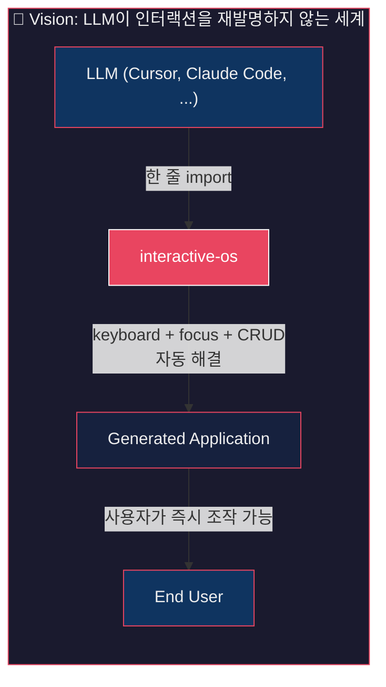
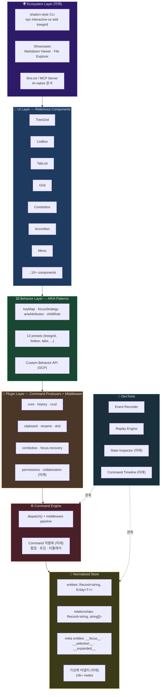
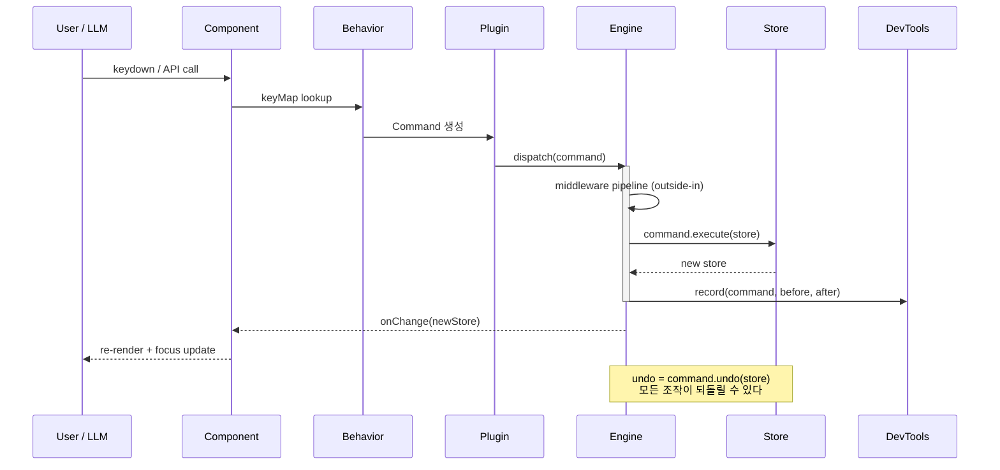
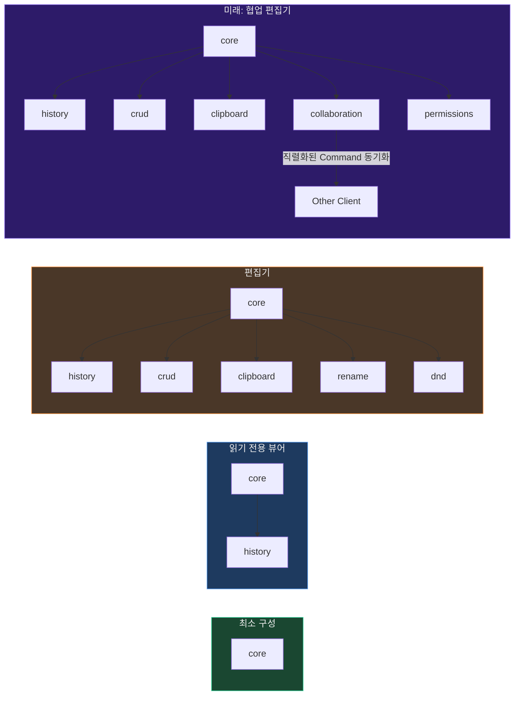
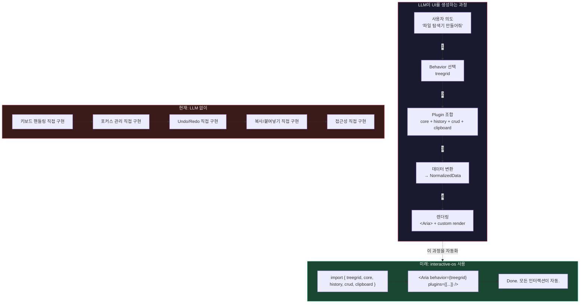
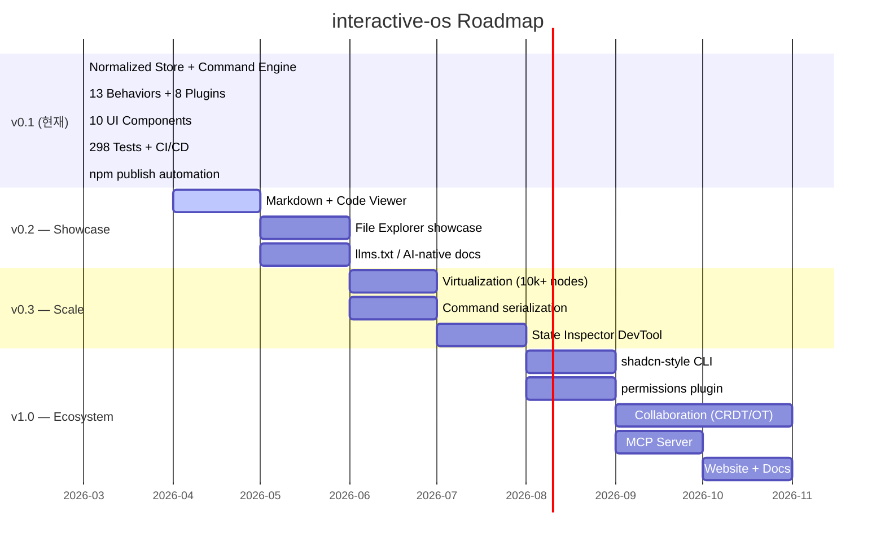

# interactive-os — Architecture Vision

> 작성일: 2026-03-17
> 현재 상태가 아닌, 프로젝트의 이상적 완성 형태를 그린 로드맵 구조도

---

## 1. 전체 비전 — Gen UI 시대의 인터랙션 빌딩블록



---

## 2. 레이어 아키텍처 — 현재 + 미래



---

## 3. 데이터 흐름 — Command Lifecycle



---

## 4. Plugin Composition — 조합의 힘



---

## 5. Gen UI Integration — LLM 워크플로우



---

## 6. 로드맵 타임라인



---

## 7. 경쟁 포지셔닝

```mermaid
quadrantChart
  title ARIA Libraries — 인터랙션 깊이 vs LLM 친화도
  x-axis "낮은 인터랙션 깊이" --> "높은 인터랙션 깊이"
  y-axis "낮은 LLM 친화도" --> "높은 LLM 친화도"

  React Aria: [0.7, 0.3]
  Radix: [0.4, 0.5]
  Headless UI: [0.3, 0.6]
  Zag.js: [0.5, 0.4]
  interactive-os (now): [0.8, 0.5]
  interactive-os (vision): [0.9, 0.9]
```

> **인터랙션 깊이** = navigation뿐 아니라 CRUD, undo/redo, clipboard, DnD까지 포함
> **LLM 친화도** = 하나의 패턴으로 수렴하는 API, llms.txt, CLI scaffolding
