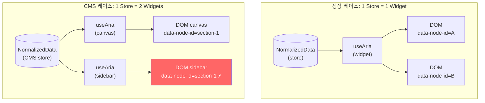
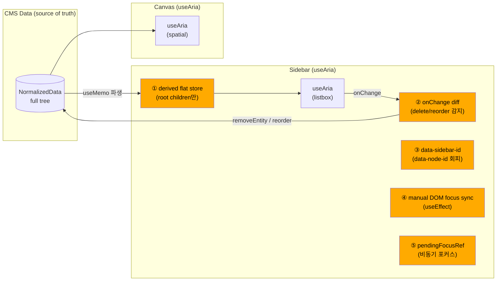
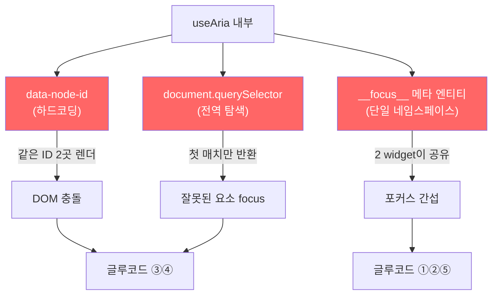
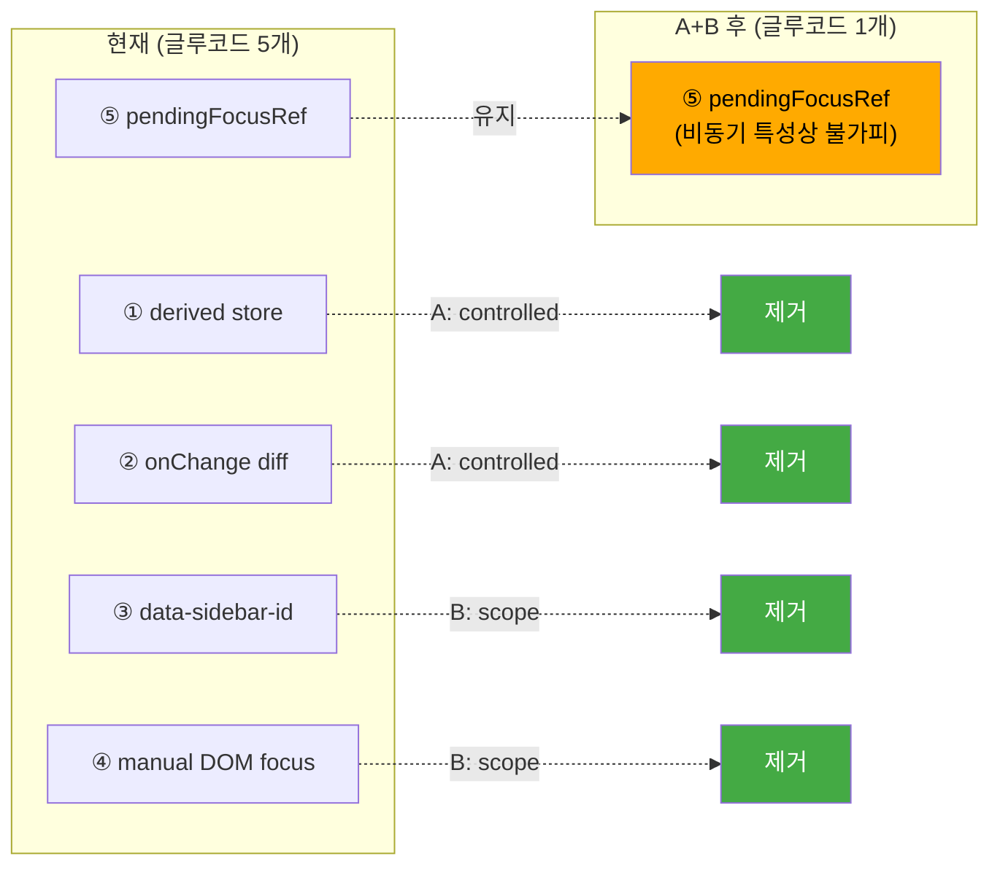

# os multi-view gap — 1 Store, 2 Widgets 충돌 해설

> 작성일: 2026-03-20
> 맥락: CMS sidebar를 os aria로 전환하면서 드러난 구조적 갭. 수동 구현보다 글루코드가 오히려 증가하여 "세련되지 않다"는 문제 제기.

---

## Why — 왜 이 문제가 발생했는가?

### 전제: os의 "1 widget = 1 store" 모델

interactive-os는 **하나의 `useAria` 인스턴스가 하나의 store를 완전히 소유**하는 모델이다. 이 모델에서 store는:

- `__focus__` 메타 엔티티로 **단일 포커스** 관리
- `data-node-id` 속성으로 **DOM 요소와 1:1 매핑**
- `document.querySelector('[data-node-id="..."]')` 로 **전역 DOM 탐색**



| 구성 요소 | 1 Widget 모델 | CMS 2 Widget 모델 | 충돌 |
|-----------|-------------|-------------------|------|
| Store | 1개, widget 소유 | 1개, 공유 | `__focus__` 충돌 |
| `data-node-id` | 유일 | 동일 ID 2곳에 렌더 | DOM 탐색 실패 |
| DOM focus sync | `querySelector` 첫 매치 | 잘못된 요소에 focus | 포커스 오작동 |

### 트리거: CMS sidebar를 os로 전환

CMS는 **같은 NormalizedData를 sidebar(섹션 리스트)와 canvas(전체 콘텐츠)가 동시에 보여주는** 구조다. sidebar를 os `useAria`로 전환하면서 위 3가지 충돌이 전면에 드러났다.

---

## How — 현재 어떻게 우회하고 있는가?

충돌을 피하기 위해 5가지 글루코드가 추가되었다:



### ① Derived flat store

sidebar는 root children만 보여주지만, `useAria`는 전체 store를 소유한다. CMS data에서 root children만 추출한 별도 store를 매번 파생:

```typescript
const sidebarData = useMemo((): NormalizedData => {
  const ids = getChildren(data, ROOT_ID)
  const entities: Record<string, unknown> = {}
  for (const id of ids) entities[id] = data.entities[id]
  return { entities, relationships: { [ROOT_ID]: [...ids] } }
}, [data])
```

### ② onChange diff sync

sidebar의 useAria가 내부 store를 변경하면(delete, reorder), 그 변경을 CMS store에 역반영해야 한다. onChange 콜백에서 old vs new children을 diff:

```typescript
const handleChange = useCallback((newStore: NormalizedData) => {
  const oldIds = getChildren(cur, ROOT_ID)
  const newIds = getChildren(newStore, ROOT_ID)
  const deleted = oldIds.filter(id => !newIds.includes(id))
  if (deleted.length > 0) { /* removeEntity from CMS */ }
  else if (oldIds.join(',') !== newIds.join(',')) { /* reorder CMS */ }
}, [])
```

### ③ data-sidebar-id (DOM 충돌 회피)

`useAria`의 `getNodeProps`는 `data-node-id={id}`를 반환한다. canvas도 같은 section ID로 `data-node-id`를 렌더한다. 같은 값이 2곳에 존재하면 `document.querySelector`가 잘못된 요소를 찾는다.

**해결**: sidebar에서 `data-node-id`를 strip하고 `data-sidebar-id`로 대체:

```typescript
const { 'data-node-id': _nodeId, onClick: _click, ...restProps } = nodeProps
// <div data-sidebar-id={sectionId} ...>
```

### ④ Manual DOM focus sync

`data-node-id`를 제거했으므로 `useAria` 내부의 DOM focus sync가 동작하지 않는다 (querySelector가 sidebar 요소를 찾지 못함). 별도 useEffect로 대체:

```typescript
useEffect(() => {
  const el = listRef.current?.querySelector(`[data-sidebar-id="${aria.focused}"]`)
  if (!el || el === document.activeElement) return
  if (!listRef.current?.contains(document.activeElement)) return
  el.focus({ preventScroll: false })
}, [aria.focused])
```

### ⑤ pendingFocusRef (비동기 포커스)

duplicate/add 시 새 section은 CMS data → sidebarData 재파생 후에야 sidebar store에 나타난다. `focusCommands.setFocus(newId)`를 즉시 dispatch할 수 없으므로 ref에 저장하고 useEffect로 대기:

```typescript
useEffect(() => {
  const id = pendingFocusRef.current
  if (!id) return
  if (!getChildren(sidebarData, ROOT_ID).includes(id)) return
  pendingFocusRef.current = null
  aria.dispatch(focusCommands.setFocus(id))
}, [sidebarData])
```

---

## What — 수동 구현 대비 결과

### 코드 복잡도 비교

| 항목 | 수동 구현 | os 구현 | 변화 |
|------|---------|---------|------|
| 키보드 핸들링 | `handleKeyDown` switch | `sidebarKeyMap` + useAria | ≈ 동등 |
| 포커스 관리 | `focusIdx` useState | `aria.focused` + derived store + onChange diff | 🔴 더 복잡 |
| DOM 포커스 | 없음 (container에 tabIndex) | manual useEffect (data-sidebar-id) | 🔴 더 복잡 |
| 비동기 포커스 | requestAnimationFrame | pendingFocusRef + useEffect | 🔴 더 복잡 |
| CRUD | 직접 store 조작 | command → sidebar engine → onChange diff → CMS store | 🔴 더 복잡 |
| ARIA 속성 | 수동 role/aria-selected | getNodeProps 자동 | 🟢 개선 |

**정리**: ARIA 속성 자동화라는 이득은 있지만, 글루코드 5개가 그 이득을 압도한다.

### 근본 원인: useAria의 3가지 하드코딩



1. **`data-node-id` 하드코딩** (`useAria.ts:197`) — 커스터마이즈 불가
2. **`document.querySelector` 전역 탐색** (`useAria.ts:266`) — widget scope 미지원
3. **`__focus__` 단일 네임스페이스** — 두 widget이 독립 포커스를 가질 수 없음

---

## If — 해결 방향

### 방향 A: useControlledAria 확장

`useControlledAria`에 `keyMap` + `plugins` 지원을 추가. sidebar가 CMS data를 직접 읽고 command만 위임.

- **제거되는 글루코드**: ① derived store, ② onChange diff
- **남는 글루코드**: ③ data-node-id 충돌, ④ DOM focus sync
- **os 변경 범위**: `useControlledAria.ts` 1개 파일

### 방향 B: useAria에 scope 옵션

`data-node-id` → `data-{scope}-id`로 네임스페이스 분리. DOM focus sync도 scope 내부로 한정.

```typescript
useAria({
  behavior: listbox,
  data: sidebarData,
  scope: 'sidebar', // data-sidebar-id 사용, DOM focus도 scope 내 탐색
})
```

- **제거되는 글루코드**: ③ data-sidebar-id workaround, ④ manual DOM focus sync
- **남는 글루코드**: ① derived store, ② onChange diff
- **os 변경 범위**: `useAria.ts`, `useControlledAria.ts`의 getNodeProps/focus sync

### 방향 A+B 결합

useControlledAria에 keyMap/plugin + scope 모두 추가하면 글루코드 5개 중 4개 제거:



### 방향 C: sidebar를 os widget에서 제외

sidebar는 canvas의 "navigator"로 본다. 자체 ARIA widget이 아니라 canvas focus를 조종하는 컨트롤러.

- **제거되는 글루코드**: 전부
- **비용**: sidebar 독립 키보드 네비게이션 포기. 접근성 후퇴.

### 판단

| 방향 | 글루코드 제거 | os 변경량 | 접근성 | 재사용성 |
|------|-------------|----------|--------|---------|
| A (controlled 확장) | 2/5 | 소 | 유지 | 중 (CMS만) |
| B (scope 옵션) | 2/5 | 중 | 유지 | 높음 (모든 multi-view) |
| **A+B (결합)** | **4/5** | **중** | **유지** | **높음** |
| C (navigator) | 5/5 | 없음 | 후퇴 | 없음 |

**A+B 결합이 가장 유력.** os가 multi-view를 지원하는 범용 메커니즘이 되며, CMS 외에도 같은 패턴(한 store, 두 view)이 나타날 때 재사용 가능.

---

## 부록: `useAria` DOM focus sync 코드 경로

```
useAria.ts:266  document.querySelector(`[data-node-id="${focusedId}"]`)
useAria.ts:268  el.closest('[data-aria-container]')
useAria.ts:269  container?.contains(document.activeElement)
useAria.ts:272  el.focus({ preventScroll: false })
```

`data-aria-container`로 소유권을 확인하지만, `querySelector`가 전역이므로 **다른 container의 요소를 먼저 찾으면 소유권 체크 자체가 잘못된 대상에서 실행**된다. scope 옵션은 이 탐색을 container 내부로 한정함으로써 근본적으로 해결한다.
