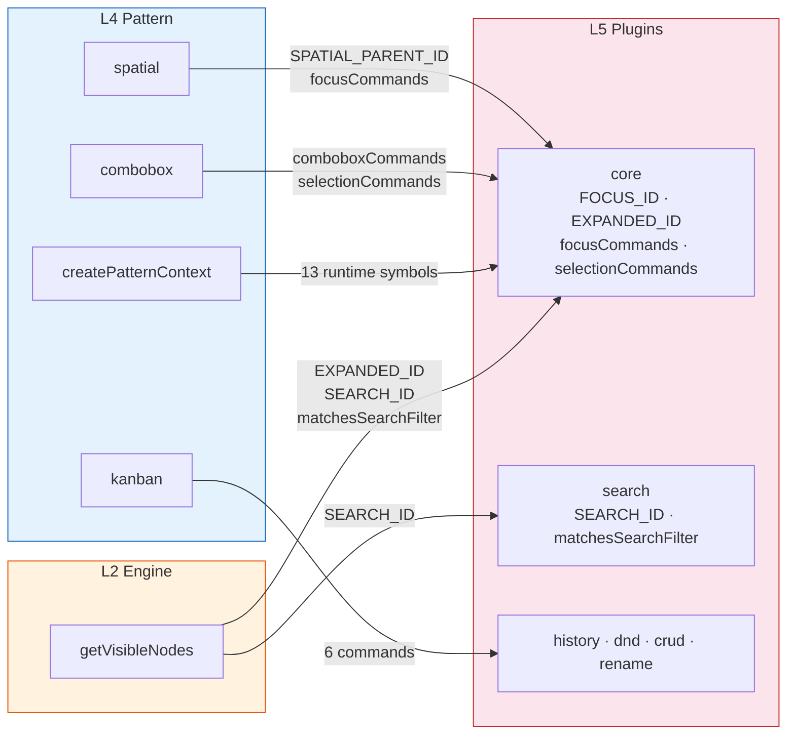
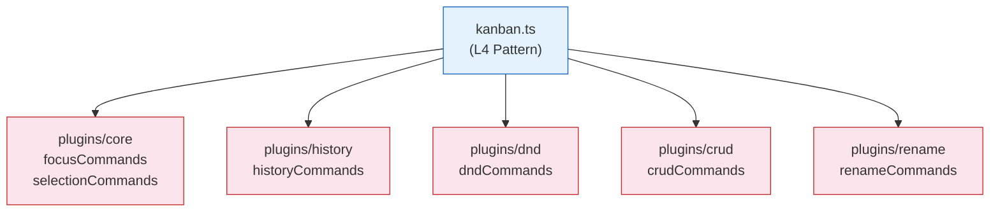

# 레이어 의존 위반 — L4 Pattern ↔ L5 Plugins 순환과 L2 Engine 점프

> 작성일: 2026-03-26
> 맥락: 도메인 개념 순서(L1→L7) 확정 후 코드 import와의 정합성 검증

> - L1 Store → L2 Engine → L3 Axis → L4 Pattern → L5 Plugins → L6 Primitives → L7 UI 순서를 확정했다
> - 코드 import를 검증한 결과, **L4↔L5 순환 의존**과 **L2→L5 점프**가 발견됐다
> - 왜 이 구조가 생겼고, 어떤 심볼이 경계를 넘는가?
> - **26개 런타임 심볼이 레이어 경계를 위반하며, 핵심 원인은 "well-known entity ID"와 "command 객체"가 plugins/에 갇혀 있기 때문이다**

---

## commands와 entity ID가 plugins/에만 존재해서 모든 레이어가 plugins/를 향한다



| 색상 | 의미 |
|------|------|
| 주황 L2 | Engine — 가장 심각한 위반 (3레벨 점프) |
| 파랑 L4 | Pattern — 아래 레이어에 26개 runtime 의존 |
| 빨강 L5 | Plugins — 모든 화살표의 목적지 |

Pattern(L4)은 Axis(L3)를 조합하여 완성된 ARIA 패턴을 만드는 레이어다. 그런데 Pattern의 6개 파일 중 5개가 Plugins(L5)의 **runtime 심볼**을 직접 import한다. Engine(L2)의 `getVisibleNodes`는 아예 3레벨을 건너뛰어 L5에 도달한다.

→ **레이어 경계가 코드에서 강제되지 않고, "필요하면 import"하는 관행이 위반의 원인이다.**

---

## createPatternContext가 13개 runtime 심볼로 plugins/core에 결합되어 있다

createPatternContext.ts는 Pattern 레이어의 **핵심 팩토리**로, 모든 패턴이 이것을 통해 컨텍스트를 생성한다.

```typescript
// pattern/createPatternContext.ts — 13 runtime imports from L5
import {
  focusCommands, selectionCommands, expandCommands, gridColCommands,
  FOCUS_ID, SELECTION_ID, SELECTION_ANCHOR_ID, EXPANDED_ID,
  GRID_COL_ID, valueCommands, VALUE_ID
} from '../plugins/core'
import { spatialCommands, SPATIAL_PARENT_ID } from '../plugins/spatial'
import { renameCommands } from '../plugins/rename'
```

이 심볼들은 두 종류다:

| 종류 | 심볼 | 개수 | 역할 |
|------|------|------|------|
| **Entity ID 상수** | `FOCUS_ID`, `SELECTION_ID`, `EXPANDED_ID`, `GRID_COL_ID`, `VALUE_ID`, `SPATIAL_PARENT_ID`, `SELECTION_ANCHOR_ID` | 7 | Store의 well-known entity 식별자 |
| **Command 팩토리** | `focusCommands`, `selectionCommands`, `expandCommands`, `gridColCommands`, `valueCommands`, `spatialCommands`, `renameCommands` | 7 | Engine에 dispatch할 명령 생성 |

→ **Entity ID는 Store(L1)의 관심사이고, Command 팩토리는 Engine(L2)의 관심사다.** 둘 다 Plugins(L5)에 있을 이유가 없다.

---

## kanban.ts는 5개 플러그인에 직접 의존하는 "패턴이 아닌 패턴"이다



kanban은 APG 표준 패턴이 아니라, **여러 플러그인을 조합한 앱 레벨 프리셋**에 가깝다. 6개 runtime 심볼이 5개 플러그인에서 온다.

다른 APG 패턴(listbox, treegrid, accordion 등)은 `composePattern`으로 axis만 조합한다. kanban은 이 패턴에서 벗어나 plugin command를 직접 호출한다.

→ **kanban과 spatial은 "Pattern" 레이어보다는 "Preset" 또는 상위 레이어에 더 적합하다.**

---

## getVisibleNodes가 L2에서 L5로 3레벨 점프한다

```typescript
// engine/getVisibleNodes.ts — L2 → L5
import { EXPANDED_ID } from '../plugins/core'
import { SEARCH_ID, matchesSearchFilter } from '../plugins/search'
```

Engine은 Store 위의 상태 변환 레이어다. 어떤 플러그인이 존재하는지 몰라야 한다. 그런데 `getVisibleNodes`는:

1. `EXPANDED_ID` — "어떤 노드가 펼쳐져 있는가"를 플러그인 상수로 직접 조회
2. `SEARCH_ID`, `matchesSearchFilter` — 검색 필터 로직을 플러그인에서 직접 가져옴

이건 Engine이 **특정 플러그인의 존재를 전제**하는 것이다.

→ **EXPANDED_ID 같은 well-known entity ID를 Store(L1)로 내리거나, getVisibleNodes가 "확장 여부를 판단하는 함수"를 매개변수로 받아야 한다.**

---

## 위반 심볼 전수 목록

| 파일 (레이어) | → 대상 (레이어) | 심볼 | Runtime? |
|-------------|---------------|------|----------|
| createPatternContext (L4) | plugins/core (L5) | FOCUS_ID, SELECTION_ID, SELECTION_ANCHOR_ID, EXPANDED_ID, GRID_COL_ID, VALUE_ID, focusCommands, selectionCommands, expandCommands, gridColCommands, valueCommands | ✅ 11 |
| createPatternContext (L4) | plugins/core (L5) | ValueRange | type-only |
| createPatternContext (L4) | plugins/spatial (L5) | spatialCommands, SPATIAL_PARENT_ID | ✅ 2 |
| createPatternContext (L4) | plugins/rename (L5) | renameCommands | ✅ 1 |
| combobox (L4) | plugins/combobox (L5) | comboboxCommands | ✅ 1 |
| combobox (L4) | plugins/core (L5) | selectionCommands | ✅ 1 |
| kanban (L4) | plugins/core (L5) | focusCommands, selectionCommands | ✅ 2 |
| kanban (L4) | plugins/history (L5) | historyCommands | ✅ 1 |
| kanban (L4) | plugins/dnd (L5) | dndCommands | ✅ 1 |
| kanban (L4) | plugins/crud (L5) | crudCommands | ✅ 1 |
| kanban (L4) | plugins/rename (L5) | renameCommands | ✅ 1 |
| spatial (L4) | plugins/spatial (L5) | SPATIAL_PARENT_ID | ✅ 1 |
| spatial (L4) | plugins/core (L5) | focusCommands | ✅ 1 |
| spatial (L4) | plugins/rename (L5) | renameCommands | ✅ 1 |
| types (L4) | plugins/core (L5) | ValueRange | type-only |
| edit (L5) | pattern/composePattern (L4) | StructuredAxis | type-only |
| getVisibleNodes (L2) | plugins/core (L5) | EXPANDED_ID | ✅ 1 |
| getVisibleNodes (L2) | plugins/search (L5) | SEARCH_ID, matchesSearchFilter | ✅ 2 |

**총계: 26 runtime 위반 + 3 type-only 위반**

→ 이 중 **Entity ID 상수 8종**과 **Command 팩토리 9종**이 핵심이다. 이 17개를 올바른 레이어로 옮기면 26개 runtime 위반 중 대부분이 해소된다.
