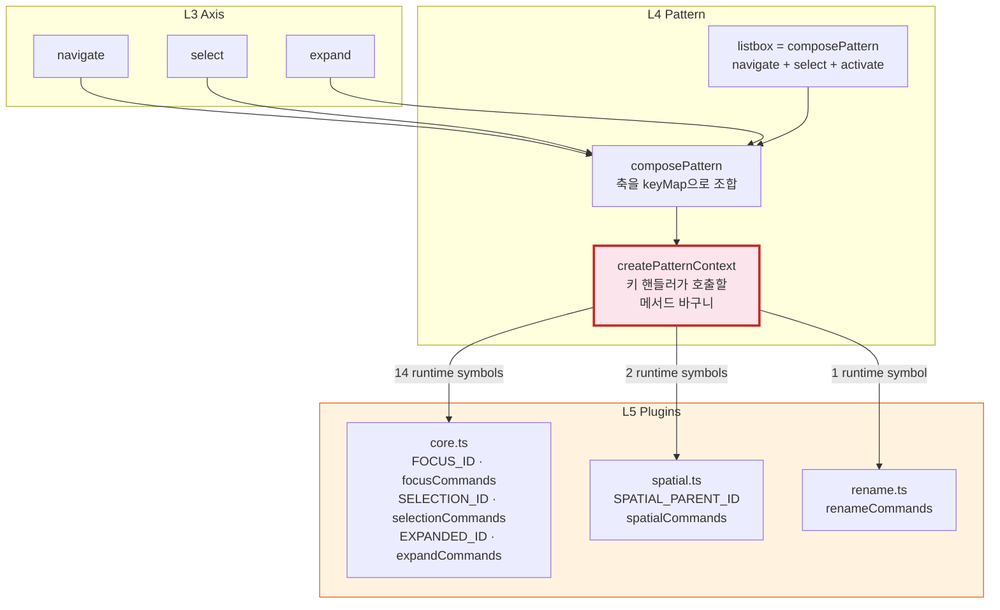
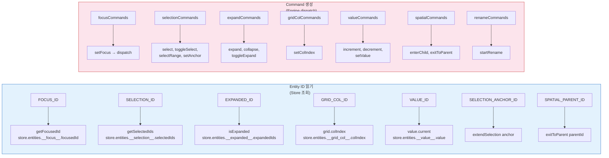
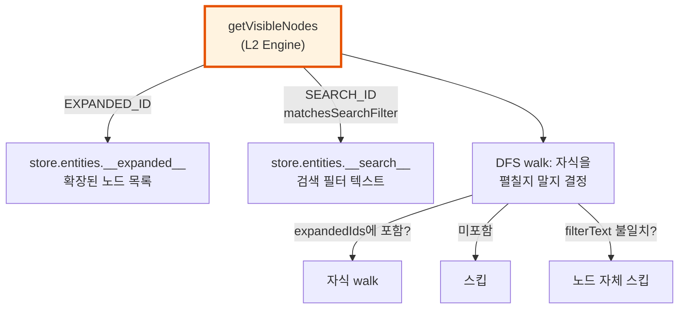
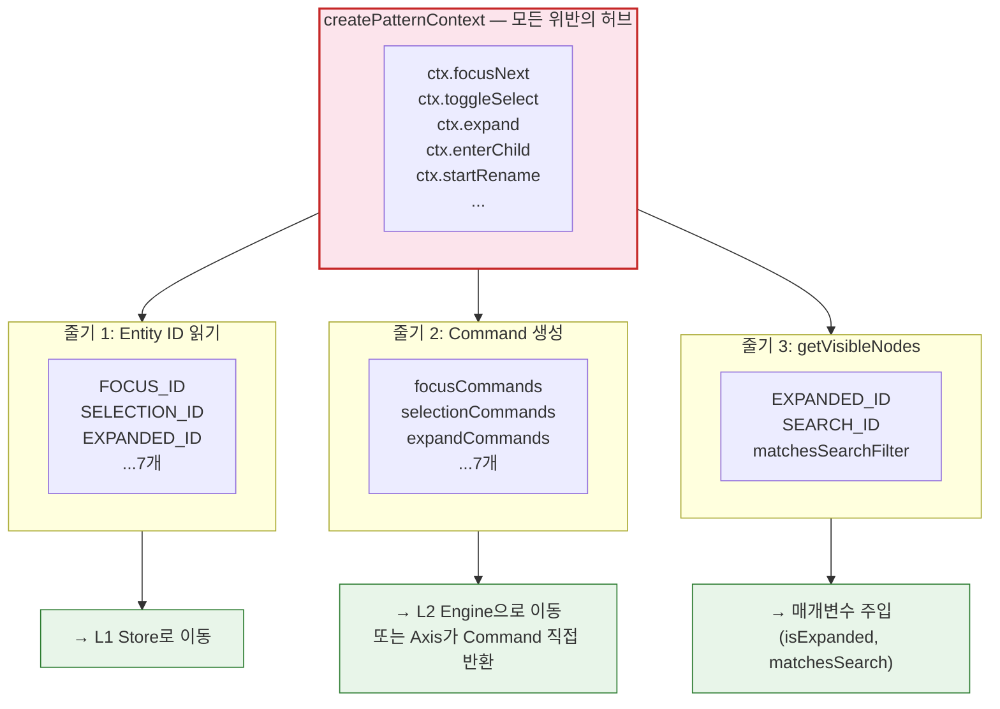

# Pattern→Plugin 의존 구조 — createPatternContext가 모든 위반의 허브다

> 작성일: 2026-03-26
> 맥락: L4 Pattern이 L5 Plugins를 runtime import하는 구조적 위반 분석

> - createPatternContext.ts 하나가 plugins/core, plugins/spatial, plugins/rename에서 14개 심볼을 import한다
> - 이 파일이 **모든 APG 패턴의 유일한 컨텍스트 팩토리**이므로, 이 파일의 위반이 Pattern 레이어 전체를 오염시킨다
> - 왜 이 구조가 생겼고, 어떤 심볼이 어떤 용도로 쓰이는가?
> - **Plugin이 소유하는 것 중 "well-known entity ID"와 "command 팩토리"는 Pattern이 아닌 더 낮은 레이어의 관심사다**

---

## Pattern은 "무엇을 할지"를 정의하고, Plugin은 "어떻게 할지"를 소유한다 — 그런데 "어떻게"가 "무엇"에 박혀있다



| 색상 | 의미 |
|------|------|
| 빨강 테두리 | 위반 허브 — createPatternContext |
| 주황 배경 | 의존 대상 — plugins/ |

Axis(L3)는 "ArrowDown을 누르면 focusNext를 호출한다"를 선언한다. `navigate()` 같은 축이 keyMap을 반환하고, `composePattern`이 이 keyMap들을 합친다.

**문제는 keyMap의 핸들러가 호출하는 `ctx.focusNext()`가 내부에서 `focusCommands.setFocus(nextId)`를 호출한다는 것이다.** 이 `focusCommands`가 `plugins/core.ts`에 있다.

→ Axis는 "무엇을 할지"만 선언하지만, 그 선언이 실행되려면 createPatternContext가 Plugin의 Command를 알아야 한다.

---

## 14개 runtime 심볼은 "Entity ID 읽기"와 "Command 생성" 두 역할로 나뉜다

createPatternContext가 plugins/에서 가져오는 심볼을 역할별로 분류하면:



| 역할 | 심볼 수 | 본질적 레이어 | 현재 위치 |
|------|---------|-------------|----------|
| Entity ID 읽기 | 7개 상수 | L1 Store — well-known entity의 ID는 데이터 스키마 | L5 plugins/core |
| Command 생성 | 7개 팩토리 | L2 Engine — 상태 변환 명령은 엔진의 어휘 | L5 plugins/core, spatial, rename |

**Entity ID 예시:**

```typescript
// plugins/core.ts에서 정의
export const FOCUS_ID = '__focus__'

// createPatternContext.ts에서 사용 — Store 조회
function getFocusedId(engine: CommandEngine): string {
  return (engine.getStore().entities[FOCUS_ID]?.focusedId as string) ?? ''
}
```

`FOCUS_ID`는 `'__focus__'`라는 **문자열 상수**다. Store의 entities에서 특정 entity를 찾기 위한 키. 이건 Plugin의 "기능"이 아니라 Store의 "스키마"다.

**Command 팩토리 예시:**

```typescript
// plugins/core.ts에서 정의
export const focusCommands = {
  setFocus(nodeId: string): Command {
    return {
      type: 'core:focus',
      payload: { nodeId },
      execute(store) { /* store.entities.__focus__ 갱신 */ },
      undo(store) { /* 이전 focusedId 복원 */ },
    }
  },
}

// createPatternContext.ts에서 사용 — Command 생성
focusNext(): Command {
  return focusCommands.setFocus(nextId)
}
```

`focusCommands.setFocus`는 **Command 객체를 생성하는 팩토리**다. Command는 Engine이 dispatch하는 것이니 Engine의 어휘에 가깝다.

→ 두 역할 모두 plugins/에 있을 이유가 없다. Entity ID는 Store로, Command 팩토리는 Engine으로 (또는 Axis 자체가 Command를 반환하도록) 재배치하면 Pattern→Plugin 의존이 사라진다.

---

## getVisibleNodes는 Engine이 Plugin의 "확장 여부"를 직접 물어보는 구조다



```typescript
// engine/getVisibleNodes.ts
import { EXPANDED_ID } from '../plugins/core'        // L2 → L5!
import { SEARCH_ID, matchesSearchFilter } from '../plugins/search'  // L2 → L5!

const expandedEntity = store.entities[EXPANDED_ID]
const expandedIds = expandedEntity
  ? (expandedEntity.expandedIds as string[]) ?? []
  : null  // null = expand axis 없음 → 전부 walk
```

getVisibleNodes는 **"어떤 노드가 보이는가"를 계산**한다. 이 계산에 "확장 상태"와 "검색 필터"가 필요한데, 이 정보를 Plugin의 entity ID를 직접 import해서 읽는다.

Engine이 "어떤 Plugin이 설치되어 있는가"를 알아야 하는 구조. Plugin을 안 쓰면 `EXPANDED_ID` entity가 없고, 그때 `null`로 fallback하는 로직이 코드에 박혀있다.

→ **getVisibleNodes가 `isExpanded: (id: string) => boolean` 같은 함수를 매개변수로 받으면, Plugin 상수를 import하지 않아도 된다.** 호출자(createPatternContext)가 Plugin을 알고 있으니 거기서 주입하면 된다. 하지만 createPatternContext 자체도 Plugin에 의존하니, 이건 연쇄적으로 풀어야 한다.

---

## 정리: 의존 경로는 세 줄기이고, 허브는 하나다



→ **세 줄기를 독립적으로 풀 수 있다.** 줄기 1(Entity ID)이 가장 단순하고, 줄기 3(getVisibleNodes)이 가장 격리된 변경이고, 줄기 2(Command 팩토리)가 가장 구조적인 변경이다.
