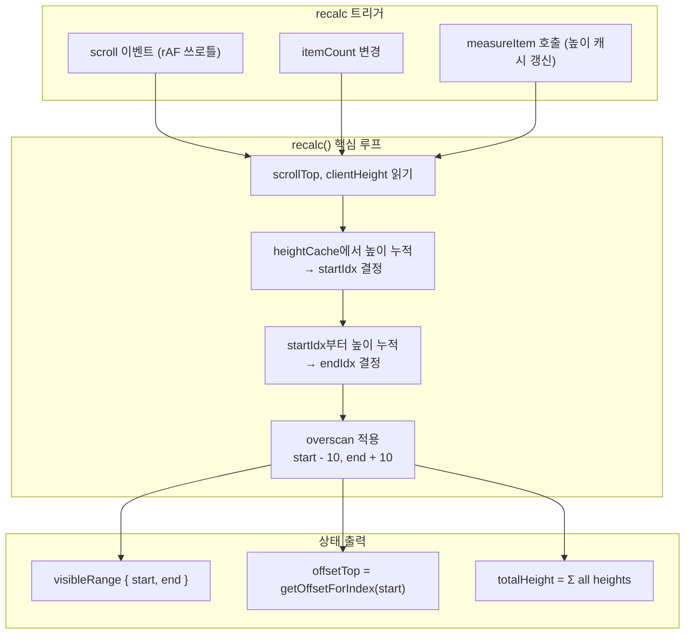
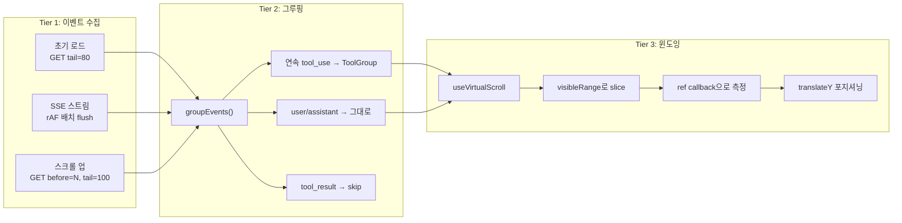
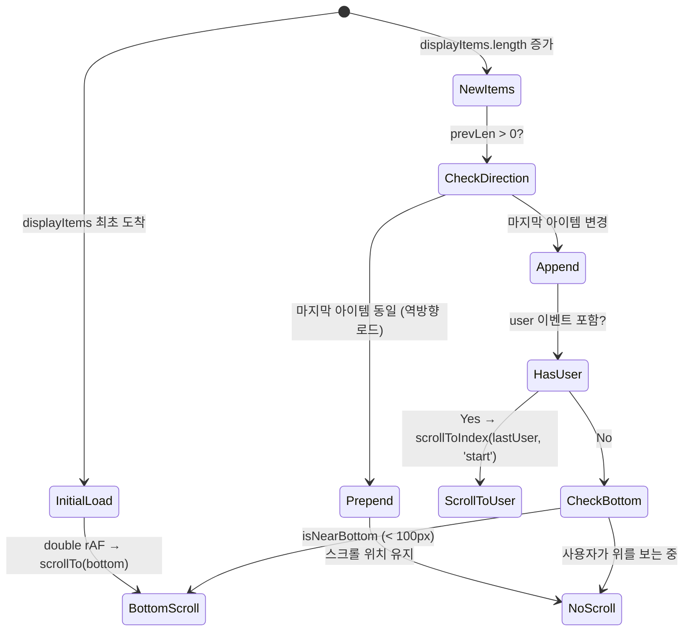

# Agent Viewer 가상스크롤 — height cache + linear scan 기반 윈도잉

> 작성일: 2026-03-23
> 맥락: Agent Viewer의 타임라인 렌더링 성능 메커니즘 해설

> **Situation** — Agent Viewer는 SSE 스트림으로 수백~수천 개의 타임라인 이벤트를 실시간 수신한다.
> **Complication** — 모든 이벤트를 DOM에 올리면 메시지가 쌓일수록 렌더 비용이 선형 증가한다. 특히 Markdown 렌더링(react-markdown + remark)이 포함된 assistant 메시지는 개당 비용이 높다.
> **Question** — 어떻게 가변 높이 아이템을 윈도잉하면서, 실시간 스트림 + 역방향 페이징 + 자동 스크롤을 동시에 지원하는가?
> **Answer** — `useVirtualScroll` 훅이 height cache + linear scan으로 visible range를 계산하고, `TimelineColumn`이 3단계 데이터 파이프라인(fetch → group → window)과 smart auto-scroll 정책을 조합한다.

---

## 라이브러리 없이 직접 구현한 이유는 가변 높이 + SSE 스트림의 조합 때문이다

react-window, tanstack-virtual 같은 라이브러리는 고정 높이나 사전 측정 가능한 아이템에 최적화되어 있다. Agent Viewer의 아이템은:

- **assistant 메시지**: Markdown 렌더링 결과에 따라 높이가 수십~수백 px까지 가변
- **tool_group**: 묶인 tool_use 개수에 따라 높이 변동
- **SSE 실시간 추가**: 아이템이 끊임없이 append되므로 사전 측정 불가

이런 조건에서 "렌더 후 측정 → 캐시 → 다음 recalc에 반영"하는 단순한 사이클이 가장 안정적이다.

→ 복잡한 추상화 대신 162줄의 자체 훅으로 프로젝트 요구에 정확히 맞춘 윈도잉을 구현했다.

---

## useVirtualScroll은 height cache + linear scan으로 visible range를 결정한다

핵심 메커니즘은 `useVirtualScroll.ts`의 `recalc()` 함수(60-104행)에 있다.



**동작 순서:**

1. **높이 조회**: `getItemHeight(index)` — 캐시 hit이면 실측값, miss이면 `estimatedItemHeight`(40px) 반환
2. **startIdx 결정**: index 0부터 높이를 누적하며 `accumulated + h > scrollTop`인 첫 index가 startIdx
3. **endIdx 결정**: startIdx부터 다시 누적하며 뷰포트 하단(`scrollTop + viewportHeight`)을 넘는 지점이 endIdx
4. **overscan**: start에서 10개 앞, end에서 10개 뒤를 버퍼로 추가 렌더링
5. **offsetTop**: `getOffsetForIndex(start)` — index 0부터 start까지 높이 합산 = translateY 값

**성능 특성:**
- 시간복잡도: `O(N)` (N = 전체 아이템 수). 아이템 수천 개 수준에서 충분히 빠르다.
- rAF 쓰로틀: 프레임당 최대 1회 recalc. passive scroll listener로 메인 스레드 차단 없음.
- 캐시 변경 감지: `prev === height`이면 recalc 스킵 → 불필요한 재계산 방지

→ 이 방식은 O(N) linear scan이므로 만 단위 아이템에서는 binary search나 prefix sum 최적화가 필요할 수 있지만, 현재 사용 규모(수백~수천)에서는 과잉 없는 적정 복잡도다.

---

## 3단계 데이터 파이프라인이 원시 이벤트를 윈도잉 가능한 DisplayItem으로 변환한다



### Tier 1: 이벤트 수집 — 3가지 경로

| 경로 | 트리거 | API | 방향 |
|------|--------|-----|------|
| 초기 로드 | 컴포넌트 마운트 | `GET /timeline?tail=80` | 최신 80개 backward |
| 역방향 페이징 | `scrollTop < 200` | `GET /timeline?tail=100&before={loadedFrom}` | 과거 방향 prepend |
| SSE 스트림 | live 세션 | `EventSource /timeline-stream` | 실시간 append |

SSE 이벤트는 `pendingEvents` 배열에 모았다가 rAF 콜백에서 한 번에 flush한다. 프레임당 최대 1회 setState로 배치 렌더링.

### Tier 2: 그루핑 — groupEvents()

`groupEvents.ts`(47행)의 상태 머신이 연속 `tool_use` 이벤트를 하나의 `ToolGroup` 카드로 묶는다:

```
user → assistant → [Read, Edit, Bash, Grep] → assistant
                    ^^^^^^^^^^^^^^^^^^^^^^^^
                    하나의 ToolGroupCard로 렌더링
```

`tool_result`는 건너뛰되 그룹 연속성을 끊지 않는다. 결과: `DisplayItem[] = (TimelineEvent | ToolGroup)[]`

### Tier 3: 윈도잉 — visible slice + 측정

```tsx
// TimelineColumn.tsx:429-444
<div style={{ height: contentHeight, position: 'relative' }}>
  <div style={{ transform: `translateY(${offsetTop}px)` }}>
    {displayItems.slice(visibleRange.start, visibleRange.end).map((item, i) => {
      const actualIndex = visibleRange.start + i
      return (
        <div ref={makeMeasureRef(actualIndex)}>
          {/* TimelineItem 또는 ToolGroupCard */}
        </div>
      )
    })}
  </div>
</div>
```

- **외부 div**: `height: contentHeight` — 전체 콘텐츠 높이로 스크롤바 형성
- **내부 div**: `translateY(offsetTop)` — visible slice를 정확한 Y 위치에 배치
- **ref callback**: `makeMeasureRef(index)` → `getBoundingClientRect().height` → `measureItem(index, h)` → heightCache 갱신

→ 이 3단계 분리 덕분에 각 계층을 독립적으로 변경할 수 있다. SSE 프로토콜이 바뀌어도 그루핑 로직은 그대로이고, 그루핑 규칙이 바뀌어도 윈도잉은 영향받지 않는다.

---

## Smart auto-scroll은 "누가 말했는가"에 따라 스크롤 목적지를 결정한다

가상스크롤에서 가장 까다로운 문제는 "새 아이템이 추가될 때 어디로 스크롤할 것인가"다.



| 상황 | 스크롤 동작 | 이유 |
|------|------------|------|
| 초기 로드 | `scrollTo(0, scrollHeight)` (double rAF) | 최신 대화부터 보여야 함 |
| user 메시지 도착 | `scrollToIndex(lastUser, 'start')` | 새 대화 턴의 시작점을 뷰포트 상단에 |
| assistant/tool 도착 + 하단 근처 | `scrollTo(0, scrollHeight)` | 실시간 추적 UX |
| assistant/tool 도착 + 위를 보는 중 | 스크롤 유지 | 과거 내용 읽기 방해하지 않음 |
| 역방향 페이징 (prepend) | 스크롤 유지 | 과거 로드 시 점프 방지 |

**2000px spacer**: 마지막 user 메시지 아래에 2000px 여백을 추가하여 `scrollToIndex(lastUser, 'start')`가 user 메시지를 뷰포트 상단에 배치할 수 있는 공간을 확보한다.

→ "하단 고정"만 하는 단순 auto-scroll과 달리, 대화 턴 기준으로 스크롤 목적지를 분기하여 에이전트 모니터링에 최적화된 UX를 제공한다.

---

## 라이브 세션은 SSE + 상태 머신으로 에이전트 동작 상태를 추적한다

가상스크롤 자체는 아니지만, 스크롤 동작에 직접 영향을 미치는 agent status 시스템:

| 이벤트 타입 | 상태 전이 | 효과 |
|------------|----------|------|
| `user`, `tool_use`, `tool_result` | → `running` | spinner bar + 경과 시간 표시 |
| `assistant` | → 3초 후 `idle` | spinner 숨김, chat input 표시 |
| 비라이브 세션 | `done` (고정) | input 없음 |

→ `running` 상태에서는 새 이벤트가 계속 append되므로 auto-scroll이 활성화되고, `idle`에서는 사용자가 자유롭게 스크롤할 수 있다.

---

## 현재 구현의 제약과 개선 가능 지점

1. **O(N) linear scan**: `recalc()`의 startIdx/endIdx 탐색과 `computeTotalHeight()`가 모두 O(N). 아이템 1만 개 이상에서 프레임 드롭 가능성이 있으며, prefix sum array나 binary search로 O(log N)에 가능하다.
2. **makeMeasureRef 재생성**: `useCallback` 안에서 클로저를 반환하므로 매 렌더마다 새 함수가 생성된다. 아이템 수가 적어 실질적 영향은 미미하지만, WeakMap 기반 캐싱으로 개선 가능.
3. **prepend 시 스크롤 위치 보존**: 현재는 역방향 로드 시 "마지막 아이템이 동일하면 스크롤 안 함"으로 처리하지만, content height 변화로 인한 미세 점프가 발생할 수 있다.
4. **SSE 재연결**: `onerror` 시 전체 재fetch하는데, EventSource 자체의 자동 재연결과 겹칠 수 있다.

→ 현재 사용 규모(세션당 수백 이벤트)에서는 이 제약들이 문제가 되지 않지만, 장시간 세션 모니터링으로 확장 시 prefix sum이 첫 번째 개선 대상이다.

---

## Walkthrough

> 이 가상스크롤을 직접 확인하려면:

1. **진입점**: 로컬 서버 실행 후 `/viewer` 경로 접속 → `PageAgentViewer` 마운트
2. **활성 세션 선택**: 좌측 archive 패널에서 live 세션 클릭 → `TimelineColumn` 추가됨
3. **핵심 시나리오**: 에이전트가 작업 중인 세션을 열면 SSE 스트림으로 이벤트가 실시간 append되고, 하단에 고정된 상태로 자동 스크롤됨. 위로 스크롤하면 자동 추적이 멈추고, `scrollTop < 200`이 되면 과거 이벤트가 자동 로드됨.
4. **확인 포인트**: 브라우저 DevTools Performance 탭에서 스크롤 시 렌더되는 DOM 노드 수가 visible range + overscan(20개 내외)으로 제한되는 것을 확인. 수백 개 이벤트가 있어도 DOM 노드 수는 일정.
