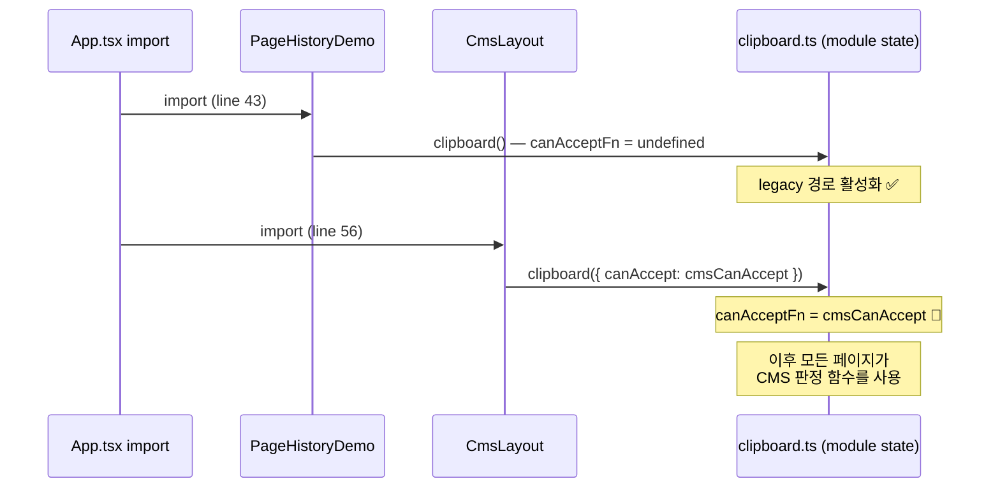
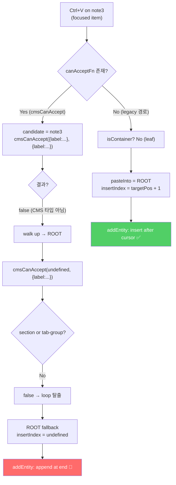
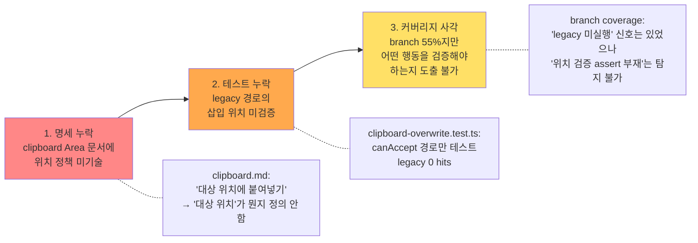

# Clipboard Singleton 오염 — module-level 전역 상태가 paste 동작을 페이지 간 오염시킨다

> 작성일: 2026-03-23
> 맥락: `/plugin/history` 페이지에서 paste가 항상 리스트 마지막에 삽입되는 현상을 추적하다 발견한 구조적 결함

> **Situation** — clipboard 플러그인은 module-level singleton으로 설계되어 `canAcceptFn`을 전역 변수에 저장한다.
> **Complication** — SPA에서 모든 페이지가 static import되므로, 마지막으로 `clipboard()`을 호출한 페이지의 옵션이 전체 앱의 paste 동작을 결정한다.
> **Question** — 왜 `/plugin/history` 페이지에서 paste가 커서 뒤가 아니라 마지막에 삽입되는가?
> **Answer** — CmsLayout의 `clipboard({ canAccept: cmsCanAccept })`가 마지막에 import되면서 전역 `canAcceptFn`을 CMS 스키마 판정으로 덮어쓴다. 비-CMS 데이터는 이 판정을 통과하지 못해 ROOT fallback(마지막 append)으로 빠진다.

---

## CMS import가 전체 앱의 paste 경로를 납치한다

clipboard 플러그인의 `canAcceptFn`은 module scope 변수다. `clipboard()` 팩토리를 호출할 때마다 이 전역 변수를 덮어쓴다.

```typescript
// clipboard.ts — module-level state
let canAcceptFn: CanAcceptFn | undefined   // ← 전역

export function clipboard(options?: ClipboardOptions): Plugin {
  canAcceptFn = options?.canAccept          // ← 호출할 때마다 덮어씀
  // ...
}
```

App.tsx의 static import 순서가 이 변수의 최종 값을 결정한다.



→ import 순서라는 **암묵적 의존**이 런타임 동작을 결정한다. 코드를 읽어서는 발견할 수 없는 유형의 버그다.

---

## 비-CMS 데이터가 CMS 판정을 만나면 ROOT fallback으로 빠진다

`/plugin/history` 페이지의 데이터는 `{ label: 'Meeting notes' }` 같은 단순 구조다. `cmsCanAccept`는 이 데이터를 CMS 타입(section, tab-group 등)이 아니므로 모든 레벨에서 거부한다.



| 경로 | insertIndex | 결과 |
|------|-------------|------|
| Legacy (canAcceptFn 없음) | `targetPos + 1` | 커서 뒤에 삽입 ✅ |
| canAccept fallback | `undefined` | 마지막에 append 🔴 |

→ `addEntity`는 `index === undefined`일 때 배열 끝에 추가한다. 이것이 "마지막에 붙여넣기"의 직접 원인이다.

---

## 이 버그는 명세 누락 → 테스트 누락 → 커버리지 사각의 연쇄로 숨어 있었다

발견 과정에서 드러난 세 겹의 방어 실패:



| 방어선 | 상태 | 이 버그를 잡을 수 있었는가? |
|--------|------|--------------------------|
| Area 문서 (명세) | "대상 위치에 붙여넣기" — 위치 정책 미정의 | ❌ 명세가 없으니 검증 기준도 없음 |
| Unit 테스트 | canAccept 경로만 커버, legacy 0 hits | △ 커버리지 갭 추적하면 도달 가능했으나, 관심사가 달랐음 |
| Branch 커버리지 | 55.26% — legacy 미실행은 탐지 | △ "미실행" 신호는 있었으나 "singleton 오염"은 탐지 불가 |
| Integration 테스트 | 없음 (engine 직접 호출만) | ❌ 실제 import 순서 + UI 흐름 미검증 |

→ 근본 원인은 **singleton 전역 상태**라는 설계 결정이다. 이 설계가 "페이지 간 격리"라는 SPA의 기본 가정과 충돌한다.

---

## singleton을 유지하되 오염을 막으려면 인스턴스 바인딩이 필요하다

현재 singleton 설계의 의도는 "앱 전체에서 하나의 클립보드"다(OS의 시스템 클립보드와 동일한 모델). 이 의도 자체는 맞다 — 사용자는 CMS에서 복사하고 다른 페이지에서 붙여넣을 수 있어야 한다.

문제는 `canAcceptFn`이 클립보드 **데이터**가 아니라 **판정 로직**이라는 점이다. 데이터(buffer)는 전역이어야 하지만, 판정 로직은 붙여넣기 시점의 컨텍스트에 따라 달라야 한다.

| 상태 | 전역이어야 하는가? | 이유 |
|------|-----------------|------|
| `clipboardBuffer` | ✅ 전역 | 페이지 간 복사-붙여넣기 지원 |
| `clipboardMode` | ✅ 전역 | copy/cut 모드는 복사 시점에 결정 |
| `cutSourceIds` | ✅ 전역 | cut 소스 추적은 앱 전역 |
| `canAcceptFn` | ❌ 인스턴스별 | 판정 로직은 붙여넣기 대상 컨텍스트에 의존 |
| `canDeleteFn` | ❌ 인스턴스별 | 삭제 판정도 컨텍스트 의존 |

해결 방향: `canAcceptFn`과 `canDeleteFn`을 plugin 인스턴스에 바인딩하고, keyMap 핸들러가 자신의 인스턴스 옵션을 사용하도록 클로저로 캡처하거나, paste command 실행 시 engine에서 해당 옵션을 조회하는 구조로 변경한다.

→ 이 변경의 범위는 clipboard.ts 내부에 한정되며, 외부 인터페이스(`ClipboardOptions`, `CanAcceptFn`)는 변경 없다.

---

## Walkthrough

> 이 버그를 직접 재현하고 확인하는 경로

1. **진입**: `http://localhost:5173/plugin/history`
2. **복사**: 리스트 중간 항목 (예: "Bug triage list")에 포커스 후 `Ctrl+C`
3. **붙여넣기**: 같은 항목에서 `Ctrl+V`
4. **관찰**: 새 항목이 리스트 **마지막**에 추가됨 (커서 뒤가 아님)
5. **대조**: `http://localhost:5173/plugin/clipboard`에서 같은 동작 → 역시 마지막에 추가됨 (동일 버그)
6. **원인 확인**: 브라우저 콘솔에서 `clipboard.ts`의 `canAcceptFn`이 `cmsCanAccept` 함수인지 확인
