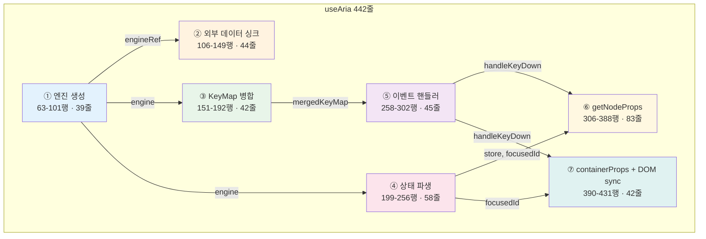
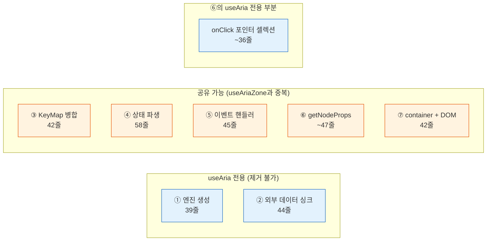

# useAria.ts — 442줄의 해부

> 작성일: 2026-03-23
> 맥락: 중간 점검에서 "접착층(L5-L6)이 1,501 LOC로 무겁다"는 지적. useAria 442줄이 커져야 할 이유가 있는지 해부.

> **Situation** — useAria는 os의 유일한 진입점 hook으로, 7계층을 React에 바인딩한다. 442줄.
> **Complication** — useAriaZone과 920줄을 공유하며, 접착층이 라이브러리 전체의 17%를 차지한다.
> **Question** — 442줄 각각이 존재해야 할 이유가 있는가? 어디를 줄일 수 있는가?
> **Answer** — 442줄은 **7개 독립 관심사**가 한 함수에 섞여 있다. 각 관심사는 정당하지만, 합쳐진 이유는 정당하지 않다.

---

## useAria는 7개의 서로 다른 일을 한다

442줄을 역할별로 색칠하면 7개 블록이 나온다. 각 블록은 독립적인 관심사이며, 서로 다른 이유로 변경된다.



| # | 블록 | 행 | LOC | 역할 | 변경 이유 |
|---|------|-----|-----|------|----------|
| ① | 엔진 생성 | 63-101 | 39 | createCommandEngine + 초기 포커스 | 엔진 API 변경 |
| ② | 외부 데이터 싱크 | 106-149 | 44 | data prop → engine 동기화, 메타 엔티티 보존 | 양방향 바인딩 요구 |
| ③ | KeyMap 병합 | 151-192 | 42 | behavior + plugin + override 병합 | 플러그인 추가 |
| ④ | 상태 파생 | 199-256 | 58 | store → focusedId, selectedIds, getNodeState | 새 메타 엔티티 추가 |
| ⑤ | 이벤트 핸들러 | 258-302 | 45 | handleClipboardEvent, handleKeyDown | 입력 방식 추가 |
| ⑥ | getNodeProps | 306-388 | 83 | ARIA 속성 + onClick/onFocus/onKeyDown 생성 | 포인터 인터랙션 추가 |
| ⑦ | container + DOM sync | 390-431 | 42 | containerProps + DOM focus sync | 포커스 전략 변경 |

---

## ① 엔진 생성 (63-101행 · 39줄) — useAria 전용

```typescript
if (engineRef.current == null) {
  const middlewares = plugins.map(p => p.middleware).filter(Boolean)
  let initializing = true
  engineRef.current = createCommandEngine(data, middlewares, (newStore) => {
    if (initializing) return
    // followFocus → onActivate
    // onChange callback
    // forceRender
  })
  // 초기 포커스: external > initialFocus > first child
  initializing = false
}
```

**왜 여기 있나:** useAria는 자체 engine을 **소유**한다. useAriaZone은 외부 engine을 **수신**한다. 이 39줄이 두 hook의 핵심 차이.

**정당성:** ✅ useAria 전용. 공유 불가.

---

## ② 외부 데이터 싱크 (106-149행 · 44줄) — useAria 전용

```typescript
useEffect(() => {
  // data prop이 바뀌면 engine 내부 store와 동기화
  // 1. 콘텐츠 엔티티가 바뀌었는지 diff
  // 2. 내부 메타 엔티티(__focus__ 등) 보존
  // 3. 삭제된 노드에 대한 포커스/셀렉션 정리
  engine.syncStore(merged)
}, [data, engine])
```

**왜 여기 있나:** useAria는 `data` prop을 받아 engine에 밀어넣는 **one-way binding**을 한다. useAriaZone은 engine.getStore()를 직접 읽으니 이 싱크가 불필요.

**정당성:** ✅ useAria 전용. "외부 데이터 → 내부 엔진" 브리지.

그러나 44줄 중 **메타 엔티티 보존 + stale reference 정리**가 30줄을 차지한다. 이건 엔진 레이어(L2)가 해야 할 일이 hook에 새어나온 것.

---

## ③ KeyMap 병합 (151-192행 · 42줄) — 공유 가능

```typescript
const pluginKeyMaps = useMemo(() => /* plugin들의 keyMap 병합 */)
const pluginUnhandledKeyHandlers = useMemo(() => /* onUnhandledKey 수집 */)
const pluginClipboardHandlers = useMemo(() => /* onCopy/Cut/Paste 수집 */)
const mergedKeyMap = useMemo(() => ({ ...behavior.keyMap, ...pluginKeyMaps, ...keyMapOverrides }))
```

**왜 여기 있나:** 3개 소스(behavior, plugin, override)를 병합. **useAriaZone에도 거의 동일한 코드가 있다.**

**정당성:** ⚠️ 공유 가능. 두 hook에서 복사-붙여넣기된 블록.

---

## ④ 상태 파생 (199-256행 · 58줄) — 공유 가능

```typescript
const store = engine.getStore()
const focusedId = store.entities['__focus__']?.focusedId
const selectedIdSet = useMemo(() => new Set(store.__selection__.selectedIds))
const expandedIds = store.__expanded__.expandedIds
const renameEntity = store.entities[RENAME_ID]
const valueMeta = store.entities[VALUE_ID]

const getNodeState = useCallback((id) => ({
  focused, selected, disabled, index, siblingCount, expanded, level, renaming, valueCurrent
}))

const behaviorCtxOptions = useMemo(() => ({ expandable, selectionMode, colCount, valueRange }))
```

**왜 여기 있나:** store에서 UI가 필요한 상태를 추출. **useAriaZone에도 동일한 getNodeState가 있다** (renaming, valueCurrent 빠진 버전).

**정당성:** ⚠️ 공유 가능. getNodeState는 두 hook에서 복사-붙여넣기. useAriaZone 버전이 기능이 적은 이유는 "나중에 추가 안 한 것"일 뿐, 구조적 차이가 아님.

---

## ⑤ 이벤트 핸들러 (258-302행 · 45줄) — 공유 가능

```typescript
const handleClipboardEvent = useCallback((event: ClipboardEvent) => {
  // defaultPrevented 가드
  // editable 요소 스킵
  // ctx 생성 → handler 실행 → dispatch
})

const handleKeyDown = useCallback((event: KeyboardEvent) => {
  // keyMap에서 매칭 → ctx 생성 → dispatch
  // 매칭 없으면 → pluginUnhandledKeyHandlers fallback
})
```

**왜 여기 있나:** keyMap과 clipboard를 이벤트로 연결. **useAriaZone은 handleKeyDown을 getNodeProps 안에 인라인**으로 구현. 로직은 동일.

**정당성:** ⚠️ 공유 가능. 구현이 다를 뿐 관심사가 동일.

---

## ⑥ getNodeProps (306-388행 · 83줄) — 부분 공유 가능

```typescript
const getNodeProps = useCallback((id) => {
  // ARIA 속성 생성 (role, data-node-id, aria-*)
  // data-focused 마커
  // onPointerDown — Shift+Click range select를 위한 ctx 캡처
  // onClick — select + activate (7가지 분기)
  // onFocus — 데이터 포커스 동기화
  // tabIndex — roving tabindex vs natural-tab-order
  // onKeyDown — handleKeyDown 위임
})
```

**왜 여기 있나:** 이 블록이 **useAria의 핵심 가치**. "props를 스프레드하면 ARIA 위젯이 된다."

83줄 중:
- ARIA 속성 생성: 10줄 — **공유 가능**
- onClick (select + activate): 36줄 — **useAria 전용** (pointerDownCtxRef, Shift/Ctrl/Meta 분기)
- onFocus: 5줄 — **공유 가능**
- tabIndex + onKeyDown: 8줄 — **공유 가능**

**정당성:** ⚠️ 부분 공유 가능. onClick의 포인터 셀렉션 로직이 useAria에만 있고 useAriaZone에는 없다 — 이것도 "나중에 추가 안 한 것".

---

## ⑦ containerProps + DOM focus sync (390-431행 · 42줄) — 공유 가능

```typescript
const containerProps = useMemo(() => {
  // keyMap-only 모드: onKeyDown만
  // aria-activedescendant 모드: tabIndex=0, onKeyDown, aria-activedescendant
  // roving tabindex 모드: tabIndex=-1 (컨테이너는 비포커스)
  // + clipboard 이벤트 핸들러
})

useEffect(() => {
  // 데이터 포커스 → DOM 포커스 동기화
  // querySelector로 찾아서 .focus()
  // 소유권 체크: container.contains(activeElement)
})
```

**왜 여기 있나:** React 바인딩의 마지막 단계. **useAriaZone에도 거의 동일한 코드** (scopeAttr만 다름).

**정당성:** ⚠️ 공유 가능. `data-node-id` vs `data-{scope}-id` 차이만.

---

## 7블록의 공유 가능성 요약



| 구분 | LOC | 비율 |
|------|-----|------|
| useAria 전용 (①②⑥일부) | ~119줄 | 27% |
| 공유 가능 (③④⑤⑥일부⑦) | ~234줄 | 53% |
| 빈 줄/import/interface | ~89줄 | 20% |

**442줄 중 234줄(53%)이 useAriaZone과 중복.** 이것이 "커진 이유"의 절반이다.

---

## 커져야 할 이유 vs 커진 이유

| 커져야 할 이유 (정당) | 커진 이유 (부당) |
|---------------------|-----------------|
| 7개 관심사가 실재함 | 7개를 한 함수에 평면으로 나열 |
| 포인터 셀렉션이 복잡함 (Shift/Ctrl/Meta) | useAriaZone과 234줄 중복 |
| 외부 데이터 싱크가 필요함 | 메타 엔티티 정리가 hook에 새어나옴 |
| keyMap 3단 병합이 필요함 | pluginClipboard를 별도 useMemo로 처리 |

---

## 줄일 수 있는 곳

1. **공유 블록 추출 (~234줄 → 공통 모듈)**
   - getNodeState, mergedKeyMap, handleKeyDown, containerProps, DOM focus sync
   - useAria와 useAriaZone 모두 이 공통 모듈을 사용

2. **메타 엔티티 싱크를 엔진으로 이동 (~30줄)**
   - `engine.syncStore()`가 메타 엔티티 보존을 내장하면 hook에서 제거

3. **포인터 셀렉션을 별도 hook으로 분리 (~36줄)**
   - `usePointerSelection(engine, behavior)` → onClick 핸들러 반환

**결과 예상:**

```
현재:
  useAria.ts        442줄
  useAriaZone.ts    478줄
  합계              920줄

추출 후:
  useAriaShared.ts  ~250줄  (공통 블록)
  useAria.ts        ~150줄  (엔진 생성 + 데이터 싱크 + 공통 호출)
  useAriaZone.ts    ~170줄  (zone state + virtual engine + 공통 호출)
  합계              ~570줄  (38% 감소)
```

---

## Walkthrough

> useAria의 7블록을 직접 확인하려면:

1. `src/interactive-os/hooks/useAria.ts`를 열고 63행부터 읽는다
2. ① 엔진 생성(63-101) → ② 외부 싱크(106-149) → ③ KeyMap(151-192) → ④ 상태(199-256) → ⑤ 이벤트(258-302) → ⑥ props(306-388) → ⑦ container(390-431) 순서로 색이 바뀌는 것을 확인
3. `src/interactive-os/hooks/useAriaZone.ts`를 나란히 놓고, ③④⑤⑥⑦이 거의 복사된 것을 확인
4. 두 파일에서 `getNodeState`를 검색하면 — 동일한 트리 순회 로직이 양쪽에 있다
