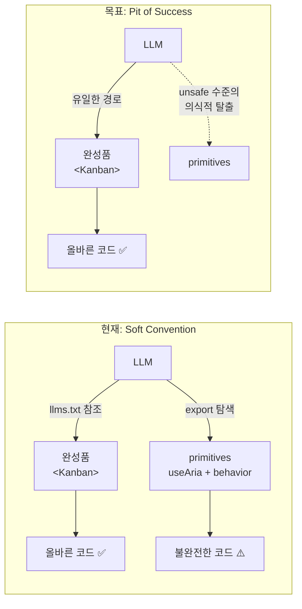
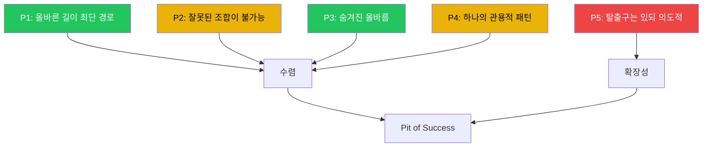
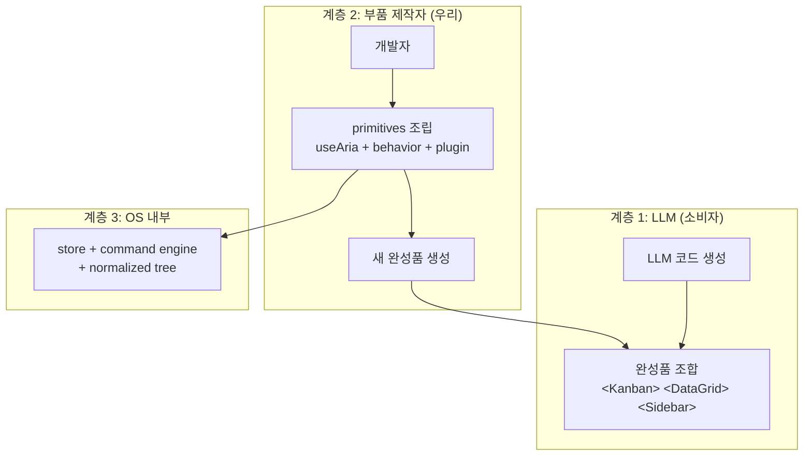
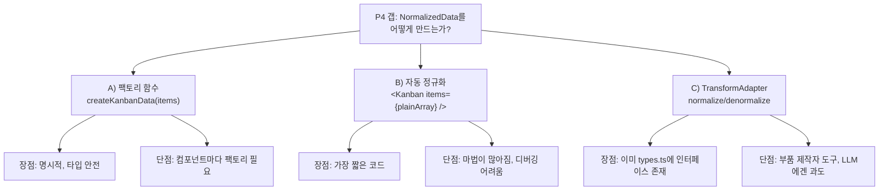

# interactive-os Pit of Success — LLM이 올바른 코드로 수렴하는 설계 원리

> 작성일: 2026-03-23
> 맥락: interactive-os를 "LLM이 위에서 개발하면 올바른 형태의 코드로 수렴할 수밖에 없는" 프레임워크로 만들기 위한 설계 원리 정립과 현재 상태 감사

> **Situation** — interactive-os는 28개 UI 완성품, 13개 behavior, 11개 plugin을 갖춘 headless ARIA 프레임워크다. LLM이 이 위에서 UI를 생성하는 것이 목표.
> **Complication** — 완성품이 존재하지만, LLM이 primitives를 직접 조립하는 잘못된 코드를 생성해도 아무런 저항이 없다. "올바른 길"과 "잘못된 길"의 구조적 구분이 없다.
> **Question** — 어떤 설계 원리가 충족되어야 LLM이 자연스럽게 올바른 코드로 수렴하는가? 현재 어디까지 달성했고, 어디가 부족한가?
> **Answer** — 5개 원리(최단 경로, 잘못된 조합 불가, 숨겨진 올바름, 관용적 패턴, 의도적 탈출구) 중 2개(P1, P3)는 달성, 3개(P2, P4, P5)는 미달. 가장 큰 갭은 P4(data 준비의 관용적 패턴 부재)이다.

---

## LLM 시대의 프레임워크는 "쓰기 편한" 것이 아니라 "잘못 쓰기 어려운" 것이어야 한다

Java가 LLM 코드 생성에서 높은 정확도를 보이는 이유는 타입 시스템이 아니다. **학습 데이터에 올바른 패턴만 압도적으로 많기 때문이다.** 클래스 밖에 메서드를 둘 수 없고, `public static void main` 없이 실행할 수 없으니, 모든 Java 코드가 동일한 구조로 수렴한다. LLM은 이 패턴을 "선택"하는 게 아니라 "그것밖에 모른다."

interactive-os의 목표는 같은 효과를 UI 프레임워크 레벨에서 달성하는 것이다. "칸반 보드 만들어줘"라고 하면 `<Kanban data={data} />`가 나오고, ARIA 키보드/포커스/CRUD/undo가 자동으로 올바르게 동작하며, 잘못된 코드를 생성하기가 오히려 어려운 구조.



→ 현재는 두 경로가 동등하게 열려 있어서 LLM이 잘못된 길을 "선택"할 수 있다. 목표는 올바른 길이 유일한 기본 경로가 되는 것.

---

## 5개 원리: Pit of Success를 만드는 필요충분 조건

역사적으로 pit of success를 달성한 시스템들(Java, Go, Rails, Rust, React)에서 공통된 5개 원리를 추출했다.



| 범례 | 의미 |
|------|------|
| 🟢 녹색 | 달성 |
| 🟡 노란색 | 부분 달성 |
| 🔴 빨간색 | 미달 |

### P1: 올바른 길이 최단 경로

올바르게 쓰는 코드가 가장 짧다. 우회하면 오히려 코드가 길어진다.

| 선례 | 메커니즘 |
|------|----------|
| React `useState` | raw DOM 조작보다 짧음 |
| Rails ActiveRecord | SQL 직접 작성보다 짧음 |

### P2: 잘못된 조합이 불가능

API가 잘못 끼울 수 없는 형태. 타입이든 구조든.

| 선례 | 메커니즘 |
|------|----------|
| LEGO | 물리적으로 안 맞는 블록 |
| TypeScript strict | 타입 불일치 컴파일 에러 |

### P3: 숨겨진 올바름

사용자가 의식하지 않아도 올바른 동작이 내장됨.

| 선례 | 메커니즘 |
|------|----------|
| HTML `<a>` | 접근성 자동 |
| React `<StrictMode>` | 이중 렌더링으로 부수효과 감지 |

### P4: 하나의 관용적 패턴

같은 목적에 같은 코드. 10명(또는 10개 LLM 세션)이 써도 같은 모양.

| 선례 | 메커니즘 |
|------|----------|
| Go `gofmt` | 포매팅이 하나 |
| Go 에러 처리 | `if err != nil` 외 방법 없음 |

### P5: 탈출구는 있되 의도적

완전히 막으면 확장 불가(v1 실패 반복). 탈출은 가능하되, 의식적 선택이어야 함.

| 선례 | 메커니즘 |
|------|----------|
| Rust `unsafe` | 명시적 블록 선언 필요 |
| React `dangerouslySetInnerHTML` | 이름 자체가 경고 |

---

## 2계층 사용자 모델: LLM은 완성품, 부품 제작자는 primitives

이 프레임워크의 사용자는 두 계층으로 나뉜다.



| 계층 | 사용자 | 하는 일 | 비유 |
|------|--------|---------|------|
| 완성품 | LLM | `<Kanban>`, `<DataGrid>`, `<Sidebar>` 조합 | LEGO 완제품 세트 조립 |
| 부품 제작 | 우리 | useAria + behavior + plugin 조립 → 새 완성품 | LEGO Technic으로 새 블록 제작 |
| OS 내부 | 엔진 | store, command engine, normalized tree | LEGO 플라스틱 원료 |

→ Java 대응: stdlib = 완성품 카탈로그, language = primitives. LLM이 `ArrayList`를 쓰지 자체 링크드리스트를 구현하지 않듯, os에서 LLM은 `<Kanban>`을 쓰지 `useAria + kanbanBehavior`를 직접 조립하지 않는다.

---

## 감사 결과: P1과 P3은 달성, P2·P4·P5는 미달

### P1 🟢 달성 — 완성품이 최단 경로

28개 UI 완성품 중 대부분이 1~2줄 사용:

```tsx
// 올바른 길: 1줄
<Kanban data={data} />

// 잘못된 길: 35줄+ (useAria + kanbanBehavior + store 직접 조립)
const aria = useAria({ behavior: kanbanBehavior, data, plugins })
const store = aria.getStore()
const columns = getChildren(store, ROOT_ID)
// ... 30줄 더
```

모든 완성품이 `data` prop 하나로 동작. plugins, onChange, renderItem은 optional. 올바른 길이 압도적으로 짧다.

### P3 🟢 달성 — ARIA/키보드/포커스가 자동

완성품 내부에서 behavior의 `ariaAttributes()` 호출로 role, aria-expanded, aria-selected 등이 자동 주입된다. 사용자가 ARIA 스펙을 몰라도 올바른 접근성이 보장.

```tsx
// listbox behavior 내부 — 사용자는 이 코드를 볼 필요 없음
ariaAttributes: (_node, state) => ({
  'aria-selected': String(state.selected),
  'aria-posinset': String(state.index + 1),
  'aria-setsize': String(state.siblingCount),
})
```

### P2 🟡 부분 달성 — 잘못된 조합이 가능함

behavior + plugin 조합은 엔진 내부에서만 일어나므로 완성품 내부는 안전. 그러나 **LLM이 동일 패키지에서 primitives를 직접 import할 수 있다:**

```tsx
// 이 코드가 컴파일되고 실행됨 — 하지만 불완전
import { useAria } from 'interactive-os/hooks/useAria'
import { listbox } from 'interactive-os/behaviors/listbox'
// focusRecovery 빠짐, history 빠짐, selection anchor 빠짐...
```

### P4 🟡 부분 달성 — data 준비가 관용적이지 않음

완성품 사용 패턴(`<Component data={data} />`)은 일관적. 그러나 **`data`(NormalizedData)를 만드는 관용적 방법이 없다:**

```tsx
// NormalizedData 직접 구성 — LLM마다 다른 코드가 나옴
const data: NormalizedData = {
  entities: {
    '__root__': { id: '__root__' },
    'col-1': { id: 'col-1', data: { label: 'To Do' } },
    'card-1': { id: 'card-1', data: { label: 'Task 1' } },
  },
  relationships: {
    '__root__': ['col-1'],
    'col-1': ['card-1'],
  }
}
```

### P5 🔴 미달 — 탈출과 정상 경로의 구분 없음

`useAria`, `createCommandEngine`, `store` 모두 완성품과 같은 수준으로 접근 가능. Rust의 `unsafe`처럼 "지금 탈출하고 있다"는 의식적 신호가 없다.

---

## 가장 큰 갭은 P4: data 준비의 관용적 패턴 부재

P2, P5는 export 분리(패키지 엔트리포인트 + 서브패스)로 한 번에 해결 가능한 구조적 문제. 그러나 P4는 **설계 결정**이 필요하다.



→ 이 결정이 pit of success의 완성도를 좌우한다. LLM이 data를 만드는 코드까지 "하나의 패턴"으로 수렴해야 P4가 달성된다.

---

## P2·P4·P5 갭이 해소되면, 이 프레임워크 위에서 "다르게 쓸 방법이 없다"

| 원리 | 현재 | 목표 상태 |
|------|------|----------|
| P1 | 🟢 1~2줄 사용 | 유지 |
| P2 | 🟡 primitives import 가능 | 🟢 완성품 패키지에서 primitives 미노출 |
| P3 | 🟢 ARIA 자동 | 유지 |
| P4 | 🟡 data 준비 패턴 부재 | 🟢 `<Kanban items={[...]} />`처럼 유일한 방법 |
| P5 | 🔴 경계 없음 | 🟢 `interactive-os/unsafe` 서브패스로 의식적 탈출 |

5개 원리가 모두 달성되면: LLM이 interactive-os 위에서 코드를 생성할 때, **Java에서 class 안에 method를 넣듯** 완성품을 조합하는 코드만 나온다. 이것이 pit of success.

---

## Walkthrough

> 이 원리들이 현재 코드에서 어떻게 작동하는지 직접 확인하려면:

1. **진입점**: `src/interactive-os/ui/` 디렉토리의 아무 컴포넌트 열기 (예: `Kanban.tsx`)
2. **P1 확인**: Props 인터페이스를 보면 `data` 하나만 필수. 나머지 전부 optional
3. **P3 확인**: 컴포넌트 내부에서 `behavior.ariaAttributes()` 호출 → ARIA 속성 자동 주입 확인
4. **P2 갭 확인**: `src/interactive-os/hooks/useAria.ts`가 같은 패키지에서 직접 import 가능 — 경계 없음
5. **P4 갭 확인**: 아무 쇼케이스 페이지에서 `NormalizedData` 구성 코드를 보면, 파일마다 다른 방식으로 데이터를 만들고 있음
