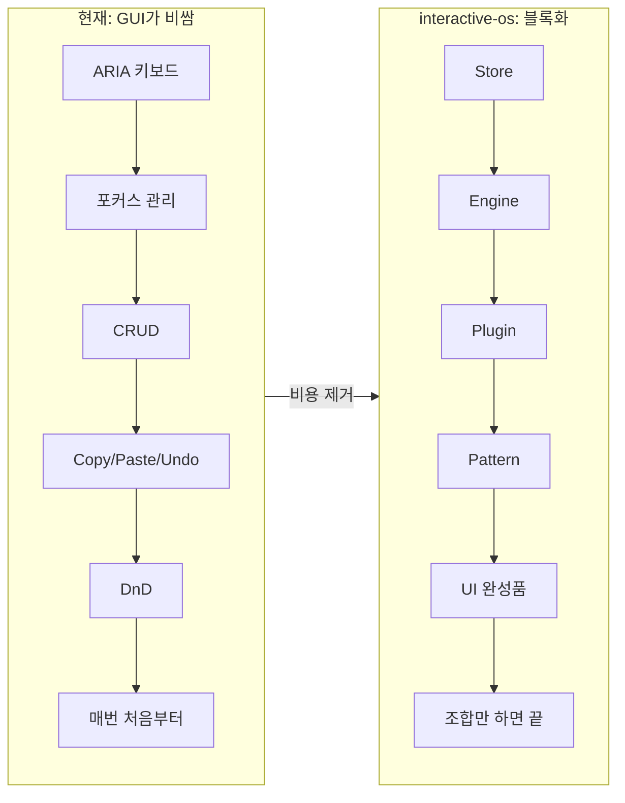
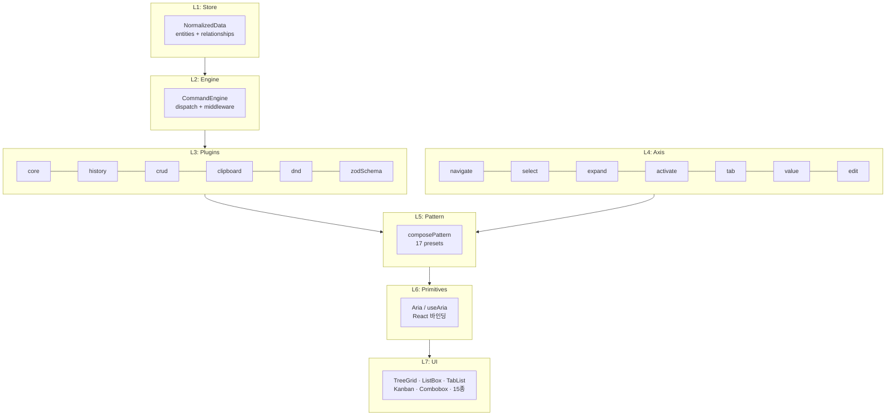
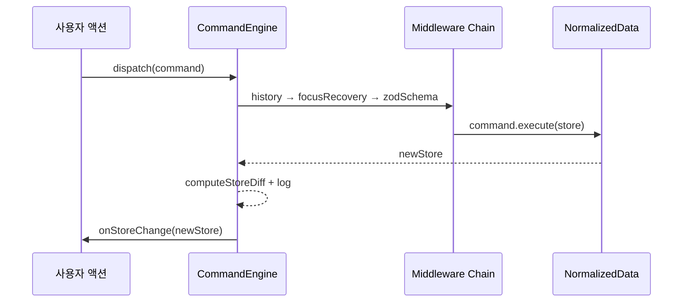
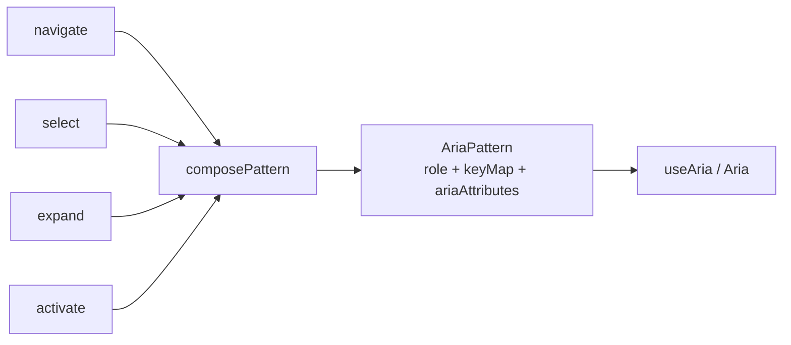
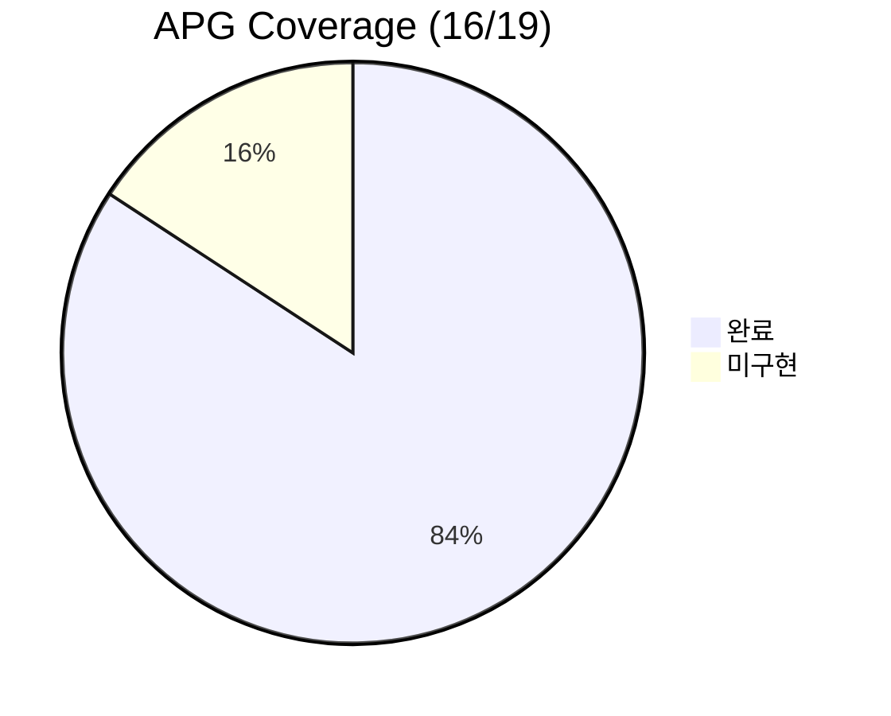

# interactive-os — GUI 구축 비용을 0으로 만드는 ARIA 프레임워크

> 작성일: 2026-03-24
> 맥락: 프로젝트 전체 아키텍처 해설. 디자인 시스템 구축과 UI 완성품 양산을 앞두고, 현재까지의 설계 의도와 구조를 정리한다.

> **Situation** — ARIA 키보드 인터랙션, 포커스 관리, CRUD는 모든 웹 앱에 필요하지만, 매번 처음부터 구현한다.
> **Complication** — 기존 라이브러리는 탐색/표시만 지원. copy/paste/undo/redo/dnd는 앱마다 직접 구현 → GUI 구축 비용이 CLI 대비 높아 GUI가 nice-to-have로 밀림.
> **Question** — 어떻게 하면 ARIA 패턴 전체를 블록화하여 GUI 구축 비용을 제거할 수 있는가?
> **Answer** — 정규화 Store + Command Engine + Plugin + Axis/Pattern 4계층으로, 모든 ARIA 인터랙션을 조합 가능한 블록으로 만든다. 렌더러 독립 모델이므로 웹에서 증명 후 멀티플랫폼 확산이 가능하다.

---

## GUI의 가치는 사라지지 않았다 — 비용이 가치를 가렸을 뿐이다

CLI+LLM이 GUI 조작을 대체하면서 GUI는 사치로 밀려났다. 하지만 "보고 판단하는 것"은 시각적 UI가 압도적이다. CLI가 이긴 이유는 "더 좋아서"가 아니라 "더 싸서"다.

interactive-os는 이 비용 구조를 뒤집는다. ARIA 패턴 16/19종을 블록화하여 GUI 구축 비용을 제거하면, nice-to-have가 기본값이 된다. LLM도 이 블록 위에서 일하면 토큰 비용, 검증 비용, 시간 모두 이긴다.



v1은 과도한 추상화로 실패했다. "범용적일수록 좋다"는 착각이 아무 용도에도 맞지 않는 구조를 만들었다. v2는 교훈을 반영하여 "실제 제품에서 쓰는 용도를 그대로 추출"하는 전략을 택했다. CMS 개밥먹기로 검증하고, NavList처럼 작고 구체적인 완성품 여러 개가 올바른 방향임을 확인했다.

---

## 7개 레이어가 관심사를 분리하고, 아래에서 위로 쌓인다

핵심은 렌더러가 아니라 모델(Store + Command + Plugin + Pattern)이다. React는 현재의 렌더러일 뿐이고, 모델은 렌더러 독립이다.



| 레이어 | 역할 | 핵심 타입 | 렌더러 의존 |
|--------|------|-----------|-------------|
| **L1 Store** | 정규화 트리 데이터 | `NormalizedData`, `Entity<T>` | 없음 |
| **L2 Engine** | Command dispatch + middleware | `Command`, `Middleware`, `CommandEngine` | 없음 |
| **L3 Plugin** | 확장 메커니즘 (keyMap, clipboard, CRUD) | `Plugin`, `definePlugin` | 없음 |
| **L4 Axis** | 원자적 ARIA 행동 (탐색, 선택, 확장) | `KeyMap`, `PatternContext` | 없음 |
| **L5 Pattern** | 축 조합 → ARIA 위젯 행동 | `AriaPattern`, `composePattern` | 없음 |
| **L6 Primitives** | React 훅/컴포넌트 바인딩 | `useAria`, `Aria` | React |
| **L7 UI** | 소비자용 완성품 | `TreeGrid`, `ListBox` 등 | React + CSS |

L1~L5는 렌더러 독립이다. 웹에서 증명한 뒤 React Native, Swift, Kotlin, 심지어 Rust TUI(ratatui)로 확산할 수 있다.

---

### L1: Store — 모든 트리는 두 개의 flat map이다

```typescript
interface NormalizedData {
  entities: Record<string, Entity<unknown>>      // id → 노드
  relationships: Record<string, string[]>         // parentId → [childId, ...]
}
```

어떤 외부 데이터든 `entities` + `relationships` 두 맵으로 정규화한다. JSON 트리, 배열, GraphQL 응답 — 형태가 달라도 내부는 하나다. 메타 엔티티(`__focus__`, `__selection__`, `__expanded__` 등)는 UI 상태를 같은 store에 동거시켜 Command로 일괄 관리한다.

모든 mutation은 새 객체를 반환하는 순수 함수다. `removeEntity`는 재귀적으로 자손을 수집(O(n))하고, `moveNode`는 같은 부모 내 순서 변경과 cross-parent 이동을 모두 처리한다.

### L2: Engine — 모든 변경은 Command이고, 되돌릴 수 있다

```typescript
interface Command {
  type: string
  payload: unknown
  execute(store: NormalizedData): NormalizedData
  undo(store: NormalizedData): NormalizedData
}
```

사용자의 모든 액션은 `execute()`와 `undo()`를 가진 Command 객체다. Engine은 이 Command를 middleware 체인에 통과시키고, store를 갱신하고, diff를 로깅한다. BatchCommand로 여러 Command를 원자적으로 묶을 수 있다.



middleware는 `reduceRight`로 합성된다. 바깥에서 안쪽으로 감싸고, 실행은 안에서 바깥으로. history가 실행 전 스냅샷을 찍고, focusRecovery가 실행 후 포커스를 복원하고, zodSchema가 실행 전 유효성을 검증한다.

### L3: Plugin — keyMap부터 clipboard까지 소유하는 확장 단위

```typescript
interface Plugin {
  name: string
  middleware?: Middleware
  commands?: Record<string, Command>
  keyMap?: KeyMap
  onCopy?: (ctx) => DataTransfer | void
  onCut?: (ctx) => DataTransfer | void
  onPaste?: (ctx, data) => Command | void
  intercepts?: string[]
  requires?: Plugin[]
}
```

Plugin은 keyMap까지 소유한다. commands만 제공하면 소비자가 keyMap을 직접 연결해야 하므로 복붙과 누락 버그가 생긴다. `definePlugin` 팩토리가 `requires` 의존성의 middleware를 자동 수집하여 합성한다.

현재 11개 Plugin: core, focusRecovery, history, crud, clipboard, zodSchema, rename, dnd, spatial, typeahead, definePlugin(팩토리).

### L4: Axis — ARIA 행동의 원자 단위

```typescript
// navigate axis
function navigate(options?): StructuredAxis {
  return {
    keyMap: {
      ArrowDown: (ctx) => ctx.focusNext(),
      ArrowUp: (ctx) => ctx.focusPrev(),
      Home: (ctx) => ctx.focusFirst(),
      End: (ctx) => ctx.focusLast(),
    },
    config: { focusStrategy: 'roving-tabindex', orientation }
  }
}
```

7개 축: navigate, select, expand, activate, tab, value, edit. 각 축은 `KeyMap`(키 → Command 매핑)과 `AxisConfig`(focusStrategy, orientation 등)를 반환한다. 축은 순수 ARIA 행동만 담당하고, CRUD/clipboard 같은 앱 로직은 Plugin에 속한다.

### L5: Pattern — 축을 조합하면 위젯이 된다

```typescript
const treegridPattern = composePattern(
  { role: 'treegrid', childRole: 'row', ariaAttributes },
  select({ mode: 'multiple', extended: true }),
  activate({ onClick: true }),
  expand({ mode: 'arrow' }),
  navigate({ orientation: 'vertical' }),
)
```

`composePattern`이 N개 축의 keyMap을 합성한다. 같은 키에 여러 핸들러가 있으면 chain of responsibility — 위에서부터 순회하여 첫 non-void Command가 승리한다. 17개 preset이 있다: listbox, treegrid, tabs, accordion, menu, dialog, toolbar, grid, combobox, radiogroup, slider, spinbutton 등.



### L6: Primitives — React와 연결하는 다리

`useAria`가 Engine + Pattern + Plugin을 React 상태로 연결한다. 3단계:
1. Engine 생성 (한 번, useState)
2. 외부 데이터 동기화 (meta-entity 보존하며 merge)
3. View 레이어 위임 (useAriaView)

`useAriaView`가 keyMap 합성, ARIA 속성 계산, DOM 이벤트 바인딩을 처리한다. `Aria` 컴포넌트는 useAria의 선언적 래퍼다.

### L7: UI — 소비자가 쓰는 완성품

```tsx
<TreeGrid
  data={myData}
  plugins={[crud(), clipboard()]}
  onChange={setData}
  renderItem={(node, state) => <span>{node.data.label}</span>}
/>
```

L7은 L1~L6을 조합한 완성품이다. 현재 15종. v2의 핵심 교훈에 따라 "범용 hook 하나"가 아니라 "용도별 완성품 여러 개"가 올바른 방향이다. 이 층이 현재 가장 큰 갭 — 데모 수준이지 제품 수준이 아니다.

---

## 705개 테스트, 16/19 APG 패턴, CMS 개밥먹기까지 완료

정량적 현황:

| 지표 | 값 |
|------|-----|
| 테스트 | 705 (Vitest + axe-core) |
| APG 커버리지 | 16/19 (미구현: Menubar, Carousel, Feed) |
| Plugin | 11종 (전부 Integrated) |
| Axis | 7축 (전부 Integrated) |
| Pattern preset | 17종 (전부 Integrated) |
| UI 컴포넌트 | 15종 (Integrated) + 3종 미구현 |
| 데모 커버리지 | 85% (axes 100%, hooks 63%) |

CMS 개밥먹기에서 7개 갭을 발견하고 6개를 해결했다. Engine/Plugin/Axis 층은 안정적(OCP 검증 완료)이고, Plugin 교체 시 소비자 코드 변경 0, Axis 교체 시에도 소비자 무영향.



---

## UI 완성품 양산과 디자인 시스템이 다음 전환점이다

Engine~Pattern 층은 Integrated로 안정화됐다. 남은 병목:

1. **UI 완성품 (L7)** — 현재 데모 수준 → 제품 수준으로 전환. NavList hook-first 패턴을 확립 중이고, 확인되면 11개 완성품으로 확산.
2. **디자인 시스템** — claude.ai 레퍼런스 기반으로 5개 번들(surface, shape, type, tone, motion) 체계 확립 완료. tokens.css 교체 완료.
3. **Homepage (라우트 restructure)** — 내부 아키텍처 노출 → 외부 소비자 관점으로 전환. IA 설계 진행 중.

Pit of Success 5원리 중 P1(올바른 길이 최단 경로)과 P3(숨겨진 올바름)은 달성. P2(잘못된 조합 불가능), P4(관용적 패턴), P5(의도적 탈출구)는 미달 — UI 완성품이 양산되면 자연스럽게 해결되는 구조다.

LLM이 이 프레임워크 위에서 코드를 생성할 때, 완성품 1줄이 primitives 30줄+을 대체한다. 이것이 interactive-os의 존재 이유다.

---

## Walkthrough

> 이 프로젝트를 직접 만져보려면:

1. **진입점**: `pnpm dev` → `http://localhost:5173`
2. **전체 구조 파악**: ActivityBar 좌측 아이콘으로 5개 앱(CMS, UI Docs, Viewer, Agent, Theme) + 6개 내부(Store, Engine, Axis, Plugin, Components, Area) 탐색
3. **핵심 체감**: `/internals/engine/command` → ListBox에서 ↑↓ 탐색, Enter 생성, Del 삭제, ⌘Z undo — Dispatch Log에서 모든 command가 실시간 기록되는 것 확인
4. **ARIA 축 체감**: `/internals/axis/navigate` → 각 축의 키바인딩과 ARIA 속성 변화를 개별 확인
5. **실전 조합**: `/cms` → TreeGrid + spatial + clipboard + history + zodSchema가 조합된 Visual CMS
6. **확인 포인트**: 아무 데모에서 키보드만으로 CRUD + undo/redo + copy/paste가 전부 동작하면 정상
