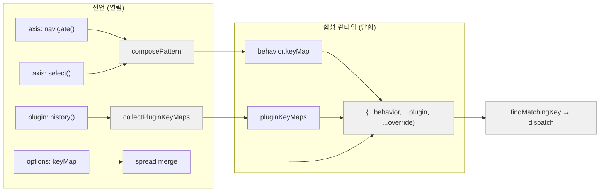
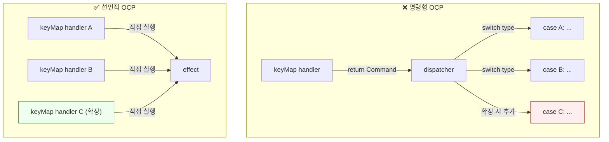
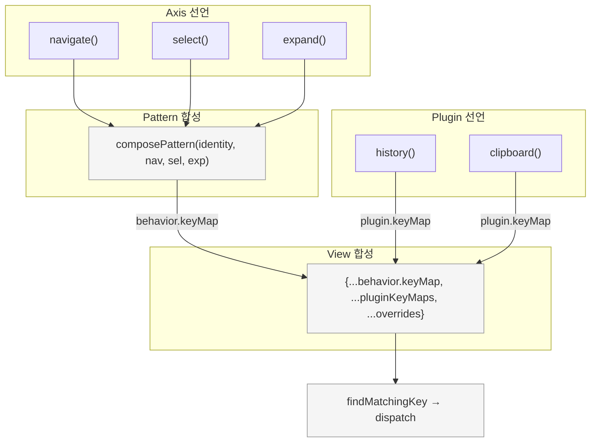

# 선언적 OCP — interactive-os의 확장 설계 철학

> 작성일: 2026-03-25
> 맥락: CMS 전역 단축키(Cmd+\) 설계 중 "명령형 switch-case vs 선언적 확장"이 쟁점이 되어, 프로젝트를 관통하는 설계 철학을 명시적으로 정립한다.

> **Situation** — interactive-os는 axis, pattern, plugin, keyMap 4계층으로 UI 행동을 합성하는 프레임워크다.
> **Complication** — 확장 시 기존 코드를 수정해야 하는 명령형 분기(switch-case, if-else)가 배관 레이어에 잔존하며, 새 전역 단축키를 추가하려니 Command dispatcher를 만들어야 하는 압력이 생겼다.
> **Question** — "확장에 열리고 수정에 닫힌다"를 이 프로젝트에서 어떤 형태로 실현하는가?
> **Answer** — **선언이 곧 등록이다.** Record 객체에 키-핸들러를 추가하면 런타임이 자동 합성한다. 중간 해석 계층(dispatcher, enum, switch)은 존재하지 않는다.

---

## 전통적 OCP는 상속으로 확장하지만, 이 프로젝트는 데이터 선언으로 확장한다

전통적 OCP는 "기반 클래스를 수정하지 않고 하위 클래스를 추가하라"는 상속 기반 원칙이다. 하지만 React + 함수형 컴포지션 환경에서 상속은 자연스럽지 않다.

이 프로젝트의 OCP는 **선언적**이다:

- **확장 = 데이터 행 추가**. 새 키바인딩, 새 축, 새 플러그인은 모두 Record 객체에 항목을 추가하는 것이다.
- **수정 = 기존 데이터 행을 건드리는 것**. 기존 항목의 핸들러를 바꾸거나, dispatcher에 case를 추가하는 것이다.
- **닫힘 = 합성 런타임이 불변**. `composePattern`, `collectPluginKeyMaps`, `mergedKeyMap` 스프레드는 입력이 바뀌어도 자기 자신은 바뀌지 않는다.



| 범례 | 의미 |
|------|------|
| 흰 박스 | 선언 — 확장 시 여기만 건드린다 |
| 회색 박스 | 합성 런타임 — 수정하지 않는다 |

→ 새 축이든 새 플러그인이든 새 keyMap override든, 합성 런타임 코드는 한 줄도 바뀌지 않는다.

---

## 세 가지 원칙: 선언=등록, 합성=불변, 중간해석=없음

선언적 OCP를 구성하는 세 가지 원칙이다.

### 원칙 1: 선언이 곧 등록이다

별도의 `register()` 호출이나 enum 매핑 없이, 객체 리터럴에 항목을 추가하면 그것이 곧 런타임에 등록된다.

```typescript
// Axis — keyMap 객체에 키를 추가하면 곧 동작
export function navigate(): StructuredAxis {
  return {
    keyMap: {
      ArrowDown: (ctx) => ctx.focusNext(),
      ArrowUp:   (ctx) => ctx.focusPrev(),
      Home:      (ctx) => ctx.focusFirst(),
      End:       (ctx) => ctx.focusLast(),
    },
    config: { focusStrategy: { type: 'roving-tabindex', orientation: 'vertical' } },
  }
}

// Plugin — definePlugin에 keyMap을 넣으면 곧 동작
export function history() {
  return definePlugin({
    name: 'history',
    keyMap: {
      'Mod+Z':       () => historyCommands.undo(),
      'Mod+Shift+Z': () => historyCommands.redo(),
    },
    middleware: ...
  })
}

// View — keyMap override를 넣으면 곧 동작
<Aria keyMap={{ 'Mod+\\': () => togglePresenting() }}>
```

세 계층 모두 동일한 패턴: `Record<string, handler>`에 행을 추가하면 끝.

### 원칙 2: 합성 런타임은 불변이다

선언을 수집하고 병합하는 코드는 입력의 종류나 개수에 무관하게 동일한 로직을 실행한다.

```typescript
// composePattern — axis가 3개든 7개든 동일한 루프
for (const key of allKeys) {
  const handlers = keyMaps.map(km => km[key]).filter(Boolean)
  keyMap[key] = handlers.length === 1
    ? handlers[0]
    : (ctx) => { for (const h of handlers) { const r = h(ctx); if (r) return r } }
}

// mergedKeyMap — plugin이 0개든 10개든 동일한 스프레드
const mergedKeyMap = { ...behavior.keyMap, ...pluginKeyMaps, ...keyMapOverrides }
```

이 코드들은 새 axis나 plugin이 추가되어도 수정할 필요가 없다.

### 원칙 3: 중간 해석 계층이 없다

Command 타입을 enum으로 정의하고 dispatcher에서 switch-case로 분기하는 패턴을 사용하지 않는다. 핸들러가 직접 효과를 선언한다.

```typescript
// ❌ 중간 해석 — Command 타입 정의 → dispatcher → handler
const keyMap = { 'Mod+\\': () => ({ type: 'TOGGLE_PRESENT' }) }
function handleCommand(cmd: Command) {
  switch (cmd.type) {
    case 'TOGGLE_PRESENT': setPresenting(prev => !prev); break  // ← 여기를 수정해야 확장
  }
}

// ✅ 선언적 — 핸들러가 곧 행동
const keyMap = { 'Mod+\\': () => togglePresenting() }
// dispatcher 없음. 새 키 추가 시 기존 코드 수정 0.
```



| 범례 | 의미 |
|------|------|
| 빨간 배경 | 확장 시 수정이 필요한 지점 |
| 초록 배경 | 확장 시 추가만 하는 지점 |

→ 명령형은 dispatcher에 case를 추가해야 한다. 선언적은 handler를 선언하면 끝이다.

---

## 프로젝트의 네 계층이 모두 같은 패턴을 따른다

선언적 OCP는 단일 계층의 기법이 아니라, 프로젝트 전체를 관통하는 구조 원칙이다.

| 계층 | 선언 단위 | 합성 런타임 | 확장 방법 |
|------|----------|-----------|----------|
| **Axis (L4)** | `navigate()`, `select()` → `{ keyMap, config }` | `composePattern(...axes)` | axis 함수 추가 |
| **Pattern (L5)** | `listbox()`, `treegrid()` → `AriaPattern` | `composePattern(identity, ...axes)` | pattern 함수 추가 |
| **Plugin (L3)** | `history()`, `clipboard()` → `Plugin` | `collectPluginKeyMaps(plugins)` | plugin 함수 추가 |
| **View** | `keyMap={{ 'Mod+\\': handler }}` | `{ ...behavior, ...plugin, ...override }` | keyMap 항목 추가 |



→ 4계층 모두 "Record에 선언 → 런타임이 자동 수집·병합"이라는 동일한 메커니즘이다.

---

## 배관 레이어에 명령형 분기가 잔존한다: 현재 위반 지점

선언적 OCP가 외부 인터페이스에서는 잘 지켜지지만, 내부 배관(core plugin ↔ pattern context, zone meta-state)에서 명령형 분기가 남아 있다.

| 위치 | 위반 내용 | 심도 |
|------|----------|------|
| `createPatternContext.ts:9-11` | `FOCUS_ID`, `SELECTION_ID` 등 11개 entity ID를 직접 import하여 하드코딩 | 높음 |
| `useAriaZone.ts:17-91` | `META_COMMAND_TYPES` Set + `applyMetaCommand` switch-case 이중 관리 | 중간 |
| `history.ts:42-53` | 자체 command type을 if-else로 분기 | 낮음 (자기 영역) |

이들은 core plugin이 "프레임워크의 일부"로 간주되어 하드코딩이 허용된 trade-off이지만, 선언적 OCP의 관점에서는 개선 여지가 있다.

→ 이 위반들의 개선은 별도 논의 대상이며, 현재 keyMap-only Aria 설계에서는 이 패턴을 따르지 않도록 주의해야 한다.

---

## 선언적 OCP의 판정 기준: "새 기능 추가 시 기존 파일을 열어야 하는가?"

이 철학의 실용적 리트머스 테스트는 하나다:

> **새 기능(키바인딩, 플러그인, 축)을 추가할 때, 기존 파일을 수정해야 하면 위반이다.**

| 상황 | 선언적 OCP 준수 | 위반 |
|------|:---:|:---:|
| 새 전역 단축키 추가: keyMap 객체에 행 추가 | ✅ | |
| 새 플러그인 추가: definePlugin() 호출 | ✅ | |
| 새 axis 추가: axis 함수 작성 + pattern에서 사용 | ✅ | |
| 새 meta command 추가: useAriaZone switch에 case 추가 | | ❌ |
| 새 plugin entity 추가: createPatternContext에 import 추가 | | ❌ |

---

## 앞으로: keyMap-only Aria가 이 철학의 시금석이다

keyMap-only `<Aria>`는 engine 없이 keyMap 선언만으로 동작하는 가장 단순한 형태다. 이것이 선언적 OCP를 완벽히 따르면, 프로젝트의 모든 확장 패턴에 대한 참조 구현(reference implementation)이 된다.

이상적 사용:

```typescript
// CmsLayout.tsx — 확장 = 행 추가, dispatcher 0개
const cmsGlobalKeyMap: KeyMap = {
  'Mod+\\':       () => togglePresenting(),
  'Mod+Shift+\\': () => toggleSidebar(),
  'Mod+,':        () => openSettings(),
}

<Aria keyMap={cmsGlobalKeyMap}>
  {children}
</Aria>
```

새 전역 단축키 추가 시 건드리는 파일: 0개 (keyMap 객체에 행만 추가).

---

## Walkthrough

> 이 철학이 코드에서 어떻게 작동하는지 직접 추적하려면:

1. **진입점**: `src/interactive-os/pattern/listbox.ts` — axis 3개를 선언하고 `composePattern`에 전달
2. **합성 추적**: `src/interactive-os/pattern/composePattern.ts:27-54` — axis들의 keyMap을 자동 병합
3. **Plugin 추가**: `src/interactive-os/plugins/history.ts:81-84` — `definePlugin`에 keyMap 선언
4. **최종 병합**: `src/interactive-os/primitives/useAriaView.ts:92-95` — `{ ...behavior, ...plugin, ...override }`
5. **확인**: 어느 단계에서든 기존 코드를 수정하지 않고 새 항목만 추가해도 동작한다
