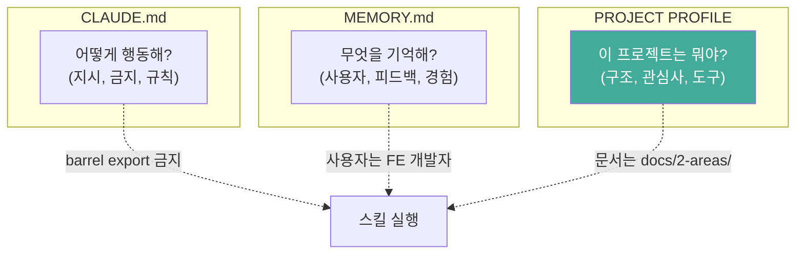
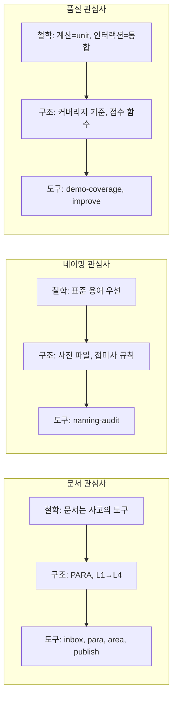
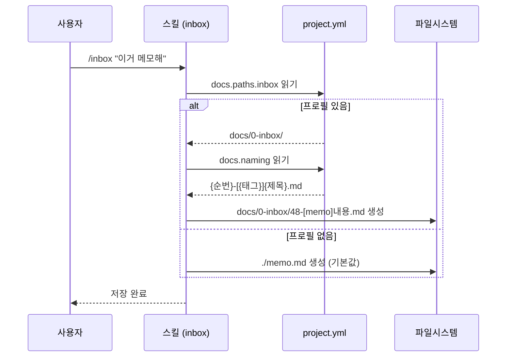
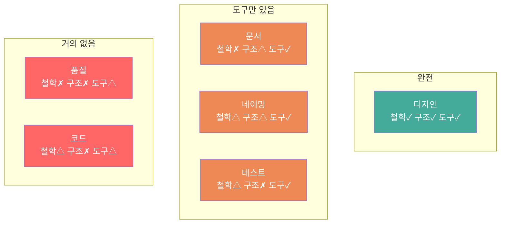
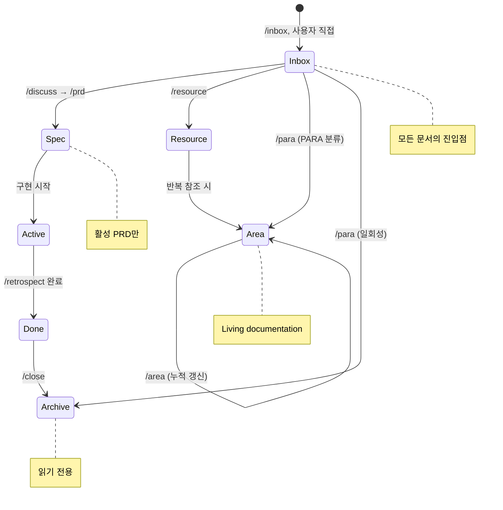

# 범용 프로젝트 프로필의 이상적 모습

> 작성일: 2026-03-25
> 맥락: 스킬 에코시스템 범용화를 위해, "프로젝트 설정 레이어"가 어떤 모습이어야 하는지를 시뮬레이션

> **Situation** — 26개 스킬이 12개의 설정 항목을 각자 하드코딩하고 있다.
> **Complication** — 스킬을 범용화하려면 설정이 스킬 밖으로 나와야 하는데, CLAUDE.md(행동 지시)도 MEMORY.md(대화 기억)도 적절한 그릇이 아니다.
> **Question** — 스킬이 프로젝트에 적응하기 위해 읽는 "프로젝트 프로필"은 어떤 형태여야 하는가?
> **Answer** — 프로젝트의 관심사(문서, 네이밍, 테스트, 디자인, 품질)별로 철학→구조→도구를 선언하는 단일 파일.

---

## 세 파일의 역할이 명확히 분리된다

CLAUDE.md, MEMORY.md, 그리고 새 프로필은 각각 다른 질문에 답한다.



| | CLAUDE.md | MEMORY.md | Project Profile |
|---|---|---|---|
| **질문** | "어떻게 해?" | "뭘 기억해?" | "여긴 뭐야?" |
| **성격** | 명령형 | 서술형 | 선언형 |
| **변경 빈도** | 낮음 (원칙) | 중간 (대화마다) | 낮음 (프로젝트 설정 시) |
| **소비자** | LLM 직접 | LLM 직접 | **스킬이 읽어서 적응** |
| **예시** | "mock 검증 금지" | "focus = 결과물" | "inbox: docs/0-inbox/" |

---

## 프로젝트 프로필의 이상적 구조

### 관심사별 3-layer 선언

모든 프로젝트 관심사는 **철학(why) → 구조(what) → 도구(how)** 3계층으로 선언된다.



### 이상적 프로필 파일

```yaml
# .claude/project.yml (또는 .claude/profile.md의 YAML frontmatter)

# ── 문서 ──
docs:
  philosophy: "문서는 사고의 부산물이 아니라 사고의 도구"
  system: PARA                    # or "flat", "wiki", "custom"
  paths:
    inbox: docs/0-inbox/
    projects: docs/1-projects/    # PARA의 P
    areas: docs/2-areas/          # PARA의 A
    resources: docs/3-resources/  # PARA의 R
    archive: docs/4-archive/      # PARA의 A
    backlogs: docs/5-backlogs/
  naming: "{순번}-[{태그}]{제목}.md"
  progress: docs/PROGRESS.md     # 없으면 null
  architecture: docs/ARCHITECTURE.md

  # 문서 수명 주기
  lifecycle:
    spec_active: docs/1-projects/    # 활성 PRD
    spec_done: docs/4-archive/       # 완료 → 아카이브
    area_format: markdown             # or "mdx"
    area_levels: [L1, L2, L3, L4]    # 줌 레벨

# ── 네이밍 ──
naming:
  philosophy: "표준 용어 우선, 자체 발명 금지"
  standard: ARIA                  # or "REST", "DDD", "GraphQL", null
  dictionary: docs/naming-dictionary.md  # 없으면 null
  file_convention: camelCase      # 파일명 = 주 export
  audit_axes: [consistency, aptness]

# ── 테스트 ──
testing:
  philosophy: "계산은 unit, 인터랙션은 통합"
  runner: vitest                  # or "jest", "playwright"
  selector_priority: [role, data-attr]  # CSS class 금지
  mock_policy: "no-mock-verification"

# ── 디자인 ──
design:
  system: DESIGN.md               # 디자인 시스템 파일, 없으면 null
  bundles: [surface, shape, type, tone, motion]
  token_policy: "all-values-must-be-tokens"
  extract_tool: browser           # design-extract가 사용하는 도구

# ── 품질 ──
quality:
  score_scripts:
    design: "pnpm score:design"
    # coverage: "pnpm test -- --coverage"
  pre_commit: [simplify]          # 커밋 전 필수 스킬
  verify_phase: [naming-audit, simplify]  # go의 verify에서 실행

# ── 코드 ──
code:
  architecture: FSD               # or "clean", "hexagonal", "flat"
  barrel_export: false
  css_approach: design-system     # or "tailwind", "css-modules", "vanilla"
```

---

## 스킬이 프로필을 소비하는 방식

### Before (현재)

```
# inbox 스킬 (하드코딩)
"docs/0-inbox/에 저장한다"
"파일명: {순번}-[{태그}]{제목}.md"
```

### After (이상)

```
# inbox 스킬 (프로필 참조)
"project.yml의 docs.paths.inbox에 저장한다"
"파일명: project.yml의 docs.naming 규칙을 따른다"
"docs 설정이 없으면 → 현재 디렉토리에 {제목}.md로 저장"
```



### 핵심 원칙: 프로필 없어도 동작한다

| 상황 | 동작 |
|------|------|
| project.yml 있음 | 프로필 설정에 따라 적응 |
| project.yml 없음 | 합리적 기본값으로 동작 |
| 일부만 설정 | 설정된 것만 적용, 나머지 기본값 |

이것이 "글로벌 플러그인"이 가능한 이유다. 프로필이 없는 프로젝트에서도 discuss→prd→go→retrospect→improve 코어 루프는 완전히 동작한다. 프로필이 있으면 문서 위치, 네이밍 규칙 등이 프로젝트에 맞게 조정된다.

---

## 관심사별 현황과 이상의 갭

현재 aria 프로젝트에서 각 관심사의 3-layer가 어디에 있는지.

| 관심사 | 철학 (why) | 구조 (what) | 도구 (how) | 빈 곳 |
|--------|-----------|------------|-----------|-------|
| **문서** | 없음 (암묵적) | CLAUDE.md에 1줄 | inbox/para/area/publish/close | **철학 없음** |
| **네이밍** | memory에 파편적 | CLAUDE.md에 1줄 | naming-audit | **구조 불완전** |
| **테스트** | CLAUDE.md에 2줄 | 없음 (암묵적) | demo-coverage | **구조 없음** |
| **디자인** | memory에 파편적 | DESIGN.md 존재 | design-extract/implement | 비교적 완전 |
| **품질** | 없음 | 없음 | simplify, improve | **철학+구조 없음** |
| **코드** | CLAUDE.md에 파편적 | 없음 | debugging, go | **구조 없음** |



### 패턴: 도구(스킬)부터 만들고 철학/구조를 나중에 — 이게 "체계 없이 성장"의 구조

aria에서는 **"필요한 스킬을 만든다 → 잘 되니까 계속 쓴다 → 왜 이렇게 하는지(철학)와 어떤 규칙인지(구조)는 CLAUDE.md에 한 줄씩 추가"** 패턴이 반복됐다.

이상적으로는 반대 방향이다:
1. **철학** — 이 프로젝트에서 문서란/네이밍이란/테스트란 무엇인가
2. **구조** — 그 철학을 실현하는 규칙과 분류 체계
3. **도구** — 규칙을 자동화하는 스킬

프로젝트 프로필(project.yml)이 1+2를 담고, 스킬이 3을 담는다.

---

## 문서 관심사의 이상적 모습 (상세)

가장 많은 스킬(5개)이 관여하는 문서 관심사를 깊이 시뮬레이션한다.

### 문서 수명 주기



### 이상적 문서 철학 선언

```markdown
## 문서 철학

1. **문서는 사고의 도구다** — 부산물이 아니라 사고를 구조화하는 수단
2. **모든 문서는 inbox에서 시작한다** — 분류는 나중에, 생성의 마찰을 0으로
3. **문서는 수명이 있다** — spec은 완료되면 archive, area는 살아있는 문서
4. **하나의 문서에는 하나의 역할** — spec ≠ area ≠ resource
5. **문서 간 참조는 파일명으로** — 상대 경로, ID 없음
```

이 5가지 원칙이 project.yml의 `docs.philosophy`에 선언되면, inbox/para/area/publish/close 스킬이 각각 하드코딩할 필요가 없다. 스킬은 "docs.lifecycle에 따라 이동한다"만 알면 된다.

---

## Walkthrough

> 이 이상적 모습을 직접 체험하려면?

1. **진입점**: `.claude/project.yml` 파일을 aria 프로젝트에 만든다
2. **첫 번째 조작**: inbox 스킬에서 경로 하드코딩을 `project.yml 참조`로 교체
3. **핵심 시나리오**: 새 프로젝트(project.yml 없음)에서 `/inbox` 실행 → 기본값으로 동작 확인
4. **확인 포인트**: 같은 스킬이 aria에서는 `docs/0-inbox/`에, 빈 프로젝트에서는 `./`에 저장
