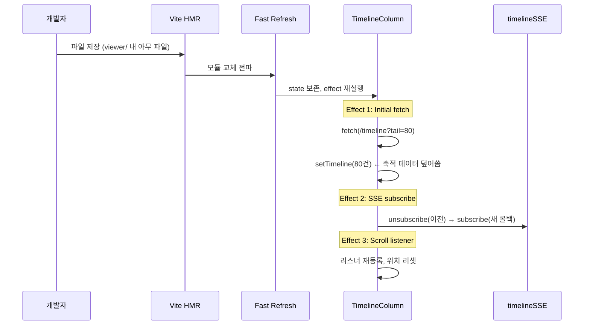
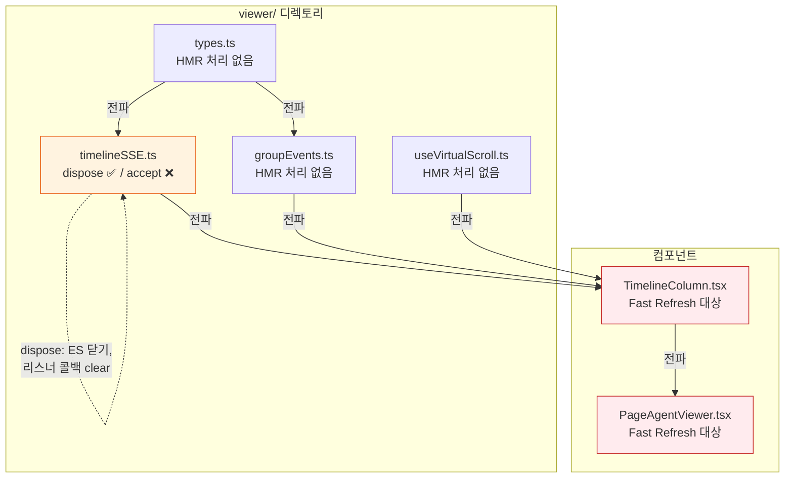
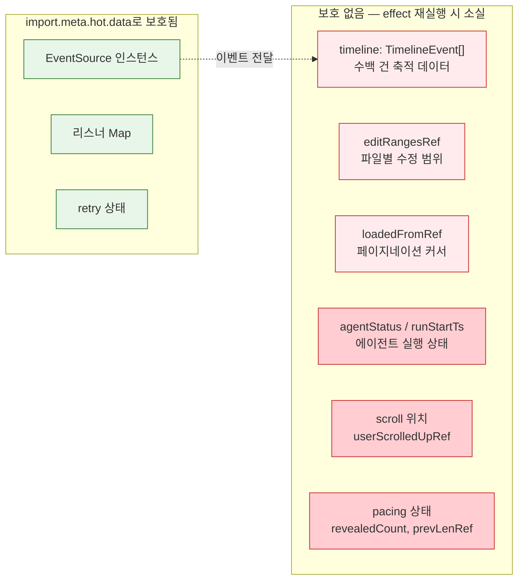
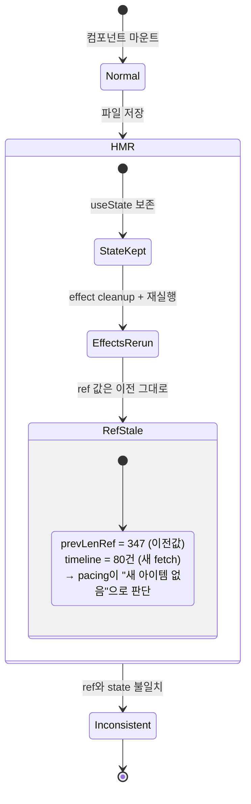
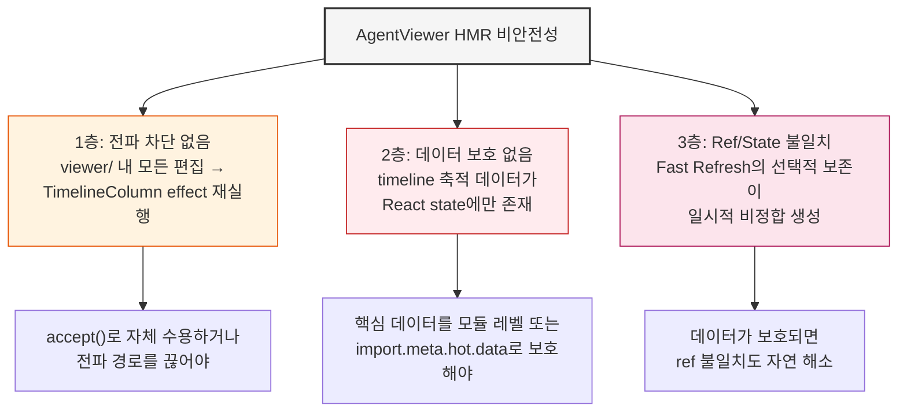

# AgentViewer HMR 비안전성 — 왜 코드 수정 시 타임라인이 날아가는가

> 작성일: 2026-03-26
> 맥락: agentViewer 개발 중 파일 수정 시 축적된 타임라인 데이터와 스크롤 위치가 소실된다

> - viewer/ 디렉토리의 어떤 파일을 수정해도 React Fast Refresh가 TimelineColumn의 모든 effect를 재실행한다
> - effect 재실행은 80건 tail fetch를 다시 트리거하여 수백 건의 축적 데이터를 덮어쓴다
> - timelineSSE.ts만 `import.meta.hot.data`로 보호되어 있고, 나머지 상태는 무방비다
> - SSE **커넥션**은 살아남지만 **데이터**는 살아남지 못하는 구조적 비대칭이 원인이다

---

## React Fast Refresh의 effect 재실행이 파괴의 기점이다

React Fast Refresh는 컴포넌트 state(useState)를 보존하지만, **모든 useEffect를 cleanup → 재실행**한다. 이것이 문제의 시작점이다.



| 범례 | 의미 |
|------|------|
| state 보존 | useState 값은 Fast Refresh가 유지 |
| effect 재실행 | cleanup 호출 후 body 재실행 — 이것이 파괴 경로 |

TimelineColumn.tsx:400-413의 initial fetch effect가 핵심:

```typescript
useEffect(() => {
  fetch(`/api/agent-ops/timeline?session=${sessionId}&tail=${INITIAL_TAIL}`)
    .then(data => {
      setTimeline(data.events)        // ← 축적된 수백 건이 80건으로 교체
      loadedFromRef.current = ...     // ← 페이지네이션 커서 리셋
    })
}, [sessionId, trackEditRanges])     // ← trackEditRanges는 매번 새 참조
```

`trackEditRanges`가 `useCallback`이지만 deps에 `onModifiedFilesChange`가 있고, 이 콜백은 부모(`PageAgentViewer`)에서 `handleModifiedFilesChange`로 전달된다. Fast Refresh가 부모를 재평가하면 이 참조가 바뀔 수 있어, effect가 트리거된다.

→ **어떤 파일을 수정하든 fetch effect가 재실행되어 타임라인이 리셋된다**

---

## HMR 전파 경로: viewer/ 내 모든 편집이 TimelineColumn에 도달한다

`timelineSSE.ts`에는 `import.meta.hot.dispose`가 있지만 `import.meta.hot.accept()`가 **없다**. 이 모듈은 자체적으로 HMR을 수용하지 않고, 변경을 상위 모듈로 전파한다.



| 범례 | 의미 |
|------|------|
| 주황 (SSE) | 부분적 HMR 보호 — 커넥션 상태만 |
| 빨강 (TC, PA) | HMR 보호 없음 — 모든 상태 리셋 위험 |

**전파 체인**: `types.ts` 수정 → `groupEvents.ts` 재평가 → `TimelineColumn.tsx` Fast Refresh → 모든 effect 재실행

→ viewer/ 내 **어떤 파일을 수정해도** TimelineColumn의 effect가 재실행된다

---

## 커넥션은 살아남고 데이터는 죽는 구조적 비대칭

`timelineSSE.ts`는 `import.meta.hot.data`에 SSE 상태를 보존하는 올바른 패턴을 구현했다:

```typescript
// timelineSSE.ts:20-37 — SSE 상태는 HMR을 넘겨 생존
function getState(): SSEState {
  if (import.meta.hot?.data?.sseState) {
    return import.meta.hot.data.sseState as SSEState  // 이전 모듈의 상태 재사용
  }
  // ... 초기 생성
  if (import.meta.hot) {
    import.meta.hot.data.sseState = state  // 다음 HMR을 위해 저장
  }
}
```

하지만 이 보호는 **EventSource 커넥션 관리**에만 적용된다. 실제 사용자가 보는 데이터는 React 컴포넌트 안에 있다:



| 범례 | 의미 |
|------|------|
| 초록 | `import.meta.hot.data`로 보호 |
| 진한 빨강 | 핵심 데이터 — 소실 시 re-fetch 필요 |
| 연한 빨강 | 파생 상태 — 핵심 데이터에서 복원 가능 |

SSE 파이프라인은 "수도관"이고 timeline 데이터는 "수도관을 통해 채운 물탱크"다. HMR이 수도관을 보호하지만, 물탱크를 비우고 다시 채운다.

→ 보호 대상의 선정이 잘못된 것이 아니라, **보호 범위가 반쪽**이다

---

## Ref 보존 + State 리셋 = 불일치 창

Fast Refresh는 useState는 보존하고 effect를 재실행한다. 그런데 useRef도 보존된다. 이 조합이 미묘한 불일치를 만든다.



구체적 시나리오:

| Ref | HMR 전 값 | HMR 후 state | 결과 |
|-----|----------|-------------|------|
| `prevLenRef` (usePacedReveal) | 347 | displayItems.length = 52 (80건 → 그룹화) | `total <= prev` → 즉시 전부 표시, pacing 스킵 |
| `loadedFromRef` | 0 (전부 로드됨) | re-fetch로 재계산 | 정상 복구되지만 이전 스크롤 히스토리 소실 |
| `totalRef` | 500 | re-fetch 후 갱신 | 잠깐 동안 stale 값 |
| `userScrolledUpRef` | true (스크롤 올림) | effect가 scroll 리스너 재등록 | 값은 보존되나 DOM 스크롤 위치와 불일치 가능 |

→ ref 보존은 "이전 세계의 기억"이 "새 세계의 현실"과 충돌하는 시간 창을 만든다

---

## 요약: 3층 문제 구조



1층(전파)과 2층(데이터)을 해결하면 3층(불일치)은 부수적으로 해소된다. 핵심은 **timeline 데이터를 React state 밖으로 꺼내는 것**이다.
