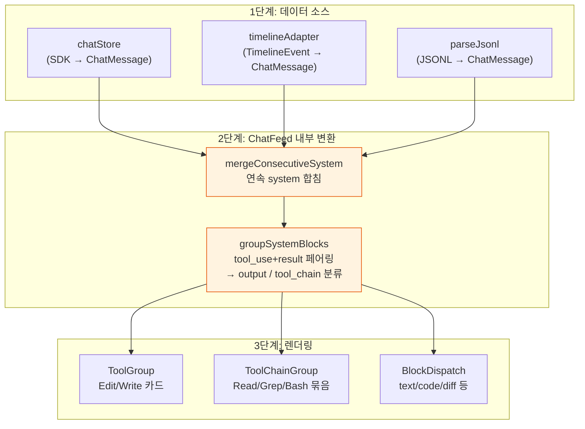
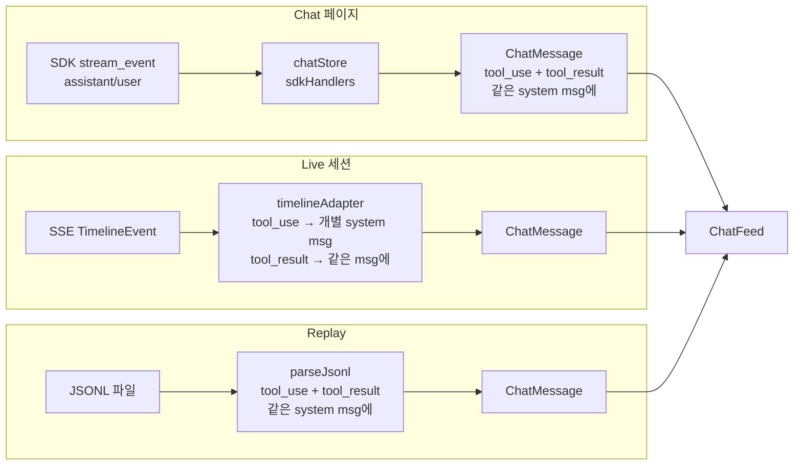
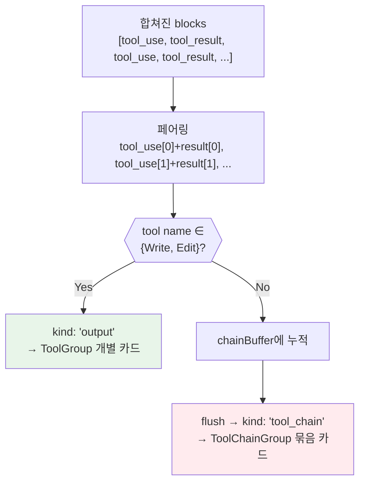
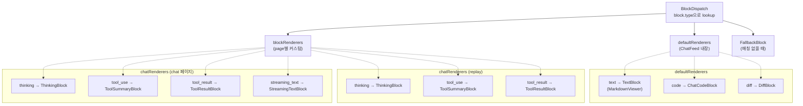
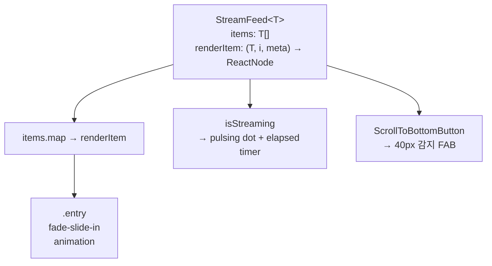
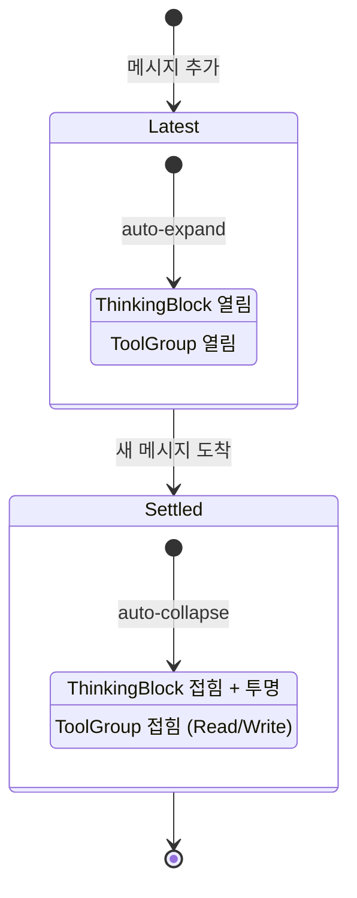
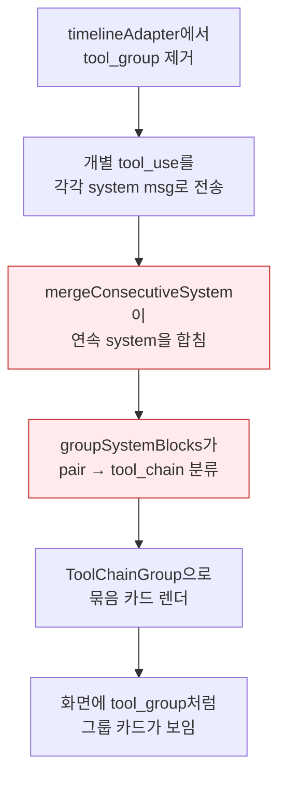

# Chat 렌더링 파이프라인 — 3계층 변환이 tool_group을 재생산한다

> 작성일: 2026-04-03
> 맥락: timelineAdapter에서 tool_group을 제거했지만 ChatFeed 내부에서 재그룹핑이 발생하여 여전히 그룹 카드가 보임

> - ChatMessage → 화면 DOM까지 **3단계 변환**(adapter → ChatFeed merge/group → BlockDispatch)을 거친다
> - 2단계(ChatFeed)에 **mergeConsecutiveSystem + groupSystemBlocks**가 하드코딩되어 있어서, 1단계에서 아무리 풀어 보내도 다시 묶인다
> - 이 문서는 "왜 tool_group이 사라지지 않는가?"와 "파이프라인 전체 구조"에 답한다
> - 핵심: ChatFeed의 system 메시지 처리는 범용 로직이 아니라 **chat 페이지 전용 가정**이 섞여 있다

---

## ChatFeed는 범용 피드가 아니라 chat 페이지의 가정을 품고 있다

ChatFeed가 "범용 채팅 피드"로 설계되었지만, system 메시지 처리에 chat 페이지 전용 로직이 박혀 있다:



| 색상 | 의미 |
|------|------|
| 주황 | 문제 지점 — 소비측이 제어할 수 없는 하드코딩 변환 |

→ 1단계에서 개별 tool_use를 각각의 system 메시지로 보내도, `mergeConsecutiveSystem`이 연속 system을 합치고, `groupSystemBlocks`가 다시 ToolChainGroup으로 묶는다.

---

## 파이프라인 전체: ChatMessage 생성부터 DOM까지

### 소스별 ChatMessage 생성 경로



**3개 소스가 모두 ChatMessage[]를 만들지만 블록 배치 방식이 다르다:**

| 소스 | tool_use 배치 | tool_result 배치 |
|------|-------------|-----------------|
| chatStore | assistant 메시지의 content에서 추출 → system msg | 다음 user msg의 content에서 추출 → 같은 system msg에 push |
| timelineAdapter | 개별 system msg (`tool_use` 후 연속 `tool_result`를 같은 msg에) | tool_use 직후 결합 |
| parseJsonl | system msg에 tool_use block | 같은 system msg에 tool_result block |

### ChatFeed 내부 2단계 변환

**Step 1: `mergeConsecutiveSystem`** (ChatFeed.tsx:36-50)

```
[system(Read), system(Edit), system(Grep)] → [system(Read + Edit + Grep)]
```

연속 system 메시지를 블록 배열을 합쳐서 하나로. **이 시점에서 개별 tool_use가 다시 하나의 메시지로 합쳐진다.**

**Step 2: `groupSystemBlocks`** (ChatFeed.tsx:68-110)

합쳐진 블록을 3-tier로 분류:



| tier | 조건 | 렌더러 | 표시 |
|------|------|--------|------|
| output | Write, Edit | `ToolGroup` | 개별 카드 (diff/code 포함) |
| tool_chain | 나머지 (Read, Grep, Bash, Glob...) | `ToolChainGroup` | **묶음 카드** (접힌 상태) |
| single | 나머지 block | `BlockDispatch` | 일반 렌더링 |

→ **Read 3번 + Grep 2번이 연속으로 오면 "Read 3, Grep 2"로 묶인 ToolChainGroup 하나가 된다.** 이것이 "tool_group처럼 보이는" 원인.

### 블록 렌더링 — BlockDispatch + blockRenderers



**핵심:** `blockRenderers`는 user/assistant 메시지에서만 동작한다. **system 메시지는 `groupSystemBlocks`가 가로채서** ToolGroup/ToolChainGroup으로 직접 렌더링하기 때문에, blockRenderers의 `tool_use`/`tool_result` 렌더러가 system 메시지에서는 **사용되지 않는다.**

---

## StreamFeed는 순수 컨테이너다



StreamFeed 자체는 타입 파라미터 `<T>`를 받는 **범용 피드 컨테이너**로, 채팅 로직 없음. ChatFeed가 `StreamFeed<ChatMessage>`로 사용하면서 `renderItem`에 MessageBubble을 넣는 구조. 95줄, 순수.

---

## Feature Flag 시스템 — isLatest가 블록 행동을 제어한다



`ChatFeaturesOverride` context로 메시지별 `{isLatest, expandByDefault}` 주입. ChatFeed의 `renderItem`에서 마지막 메시지만 `isLatest: true`.

| flag | true | false |
|------|------|-------|
| isLatest | 블록 자동 열림, 라이브 표시 | 자동 접힘, settled 스타일 |
| expandByDefault | 모든 블록 기본 열림 | 기본 접힘 |

---

## 소비처 3곳의 렌더러 차이

| 소비처 | 파일 | blockRenderers | 특이사항 |
|--------|------|----------------|----------|
| Chat 페이지 | `ChatPane.tsx` | thinking, tool_use, tool_result, tool_summary, streaming_text | streaming_text로 실시간 타이핑 |
| Replay/Live | `replayRenderers.ts` | thinking, tool_use, tool_result, tool_summary | streaming 없음 |
| Viewer (과거) | `TimelineColumn.tsx` | tool_group → ToolGroupBlock | **삭제됨** |

→ replay/live의 blockRenderers에 `tool_use: ToolSummaryBlock`이 등록되어 있지만, system 메시지에서는 **groupSystemBlocks가 먼저 가로채므로** 실제로 ToolSummaryBlock이 아닌 ToolGroup/ToolChainGroup이 렌더된다. blockRenderers의 tool_use 등록은 user/assistant 메시지에 tool_use 블록이 올 때만 의미가 있다.

---

## 왜 tool_group이 사라지지 않는가 — 원인 체인



**해결 지점:** ChatFeed의 `mergeConsecutiveSystem`과 `groupSystemBlocks`를 제어할 수 있어야 한다. 현재 하드코딩이라 소비측(replay/live)이 이 동작을 끌 수 없다.

→ ChatFeed에 `grouping?: boolean` prop을 추가하거나, system 메시지 렌더링 전략을 blockRenderers처럼 주입 가능하게 바꾸면 해결된다.
