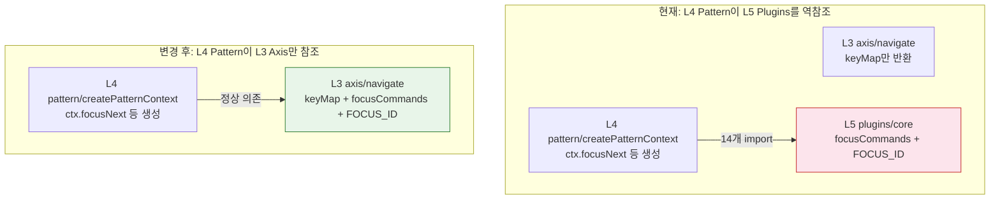
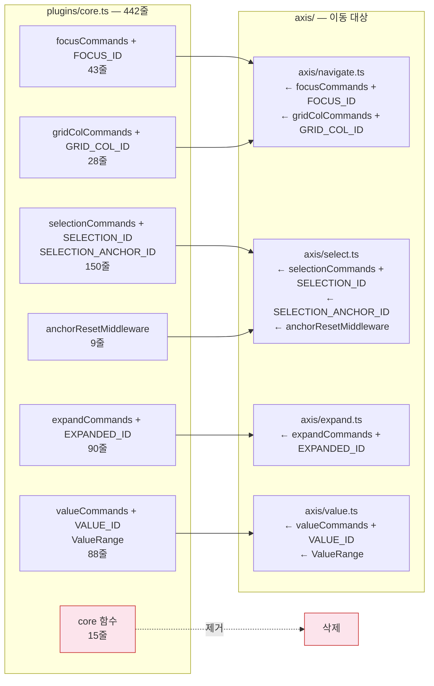
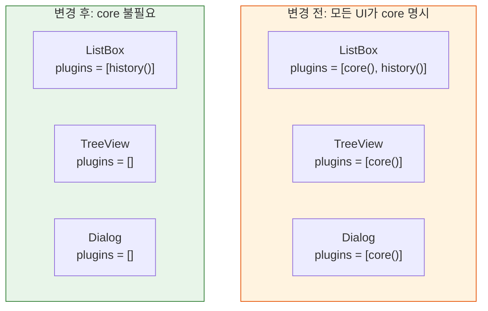

# 레이어 v2: core 흡수 — 구체적 변경 계획

> 작성일: 2026-03-26
> 맥락: plugins/core.ts의 commands+entities를 axis/로 이동하여 L4→L5 역참조 제거

> - plugins/core.ts는 442줄이며 focusCommands, selectionCommands, expandCommands 등 7개 command 그룹 + 6개 entity ID + 1개 middleware를 가진다
> - 이 심볼들은 모든 UI 컴포넌트에서 필수 — "선택적 plugin"이 아니라 axis의 나머지 절반이다
> - core()를 axis에 흡수하면 L4 Pattern → L5 Plugins 역참조가 정상 의존(L4→L3)으로 바뀐다
> - 변경의 본질은 파일 이동 + import 경로 변경이며, 아키텍처 재설계가 아니다

---

## core()가 plugin인데 필수인 모순이 이 리팩토링을 강제한다



| 색상 | 의미 |
|------|------|
| 빨강 | 역참조 원인 — 제거 대상 |
| 초록 | 이동 대상 — axis에 흡수 |

core()가 plugin으로 분류되어 있지만, 23개 UI 컴포넌트 + 30개 테스트에서 예외 없이 사용된다. `plugins: []`인 케이스는 ARIA 속성 렌더링만 테스트하는 5개 단위 테스트뿐. "선택적 확장"이 아니라 시스템의 기본 어휘다.

→ core의 위치가 잘못됐다. plugin이 아니라 axis에 있어야 한다.

---

## core.ts 442줄은 6개 axis 파일에 관심사별로 분배된다

core.ts의 내용물을 역할별로 분류하면, 각각이 대응하는 axis 파일에 정확히 매핑된다.



| core.ts 내용 | 줄 수 | 이동 대상 | 이유 |
|-------------|-------|----------|------|
| focusCommands + FOCUS_ID | 43 | axis/navigate.ts | navigate가 focus를 이동한다 |
| gridColCommands + GRID_COL_ID | 28 | axis/navigate.ts | grid navigate의 열 이동 |
| selectionCommands + SELECTION_ID + ANCHOR + middleware | 159 | axis/select.ts | select가 선택을 관리한다 |
| expandCommands + EXPANDED_ID | 90 | axis/expand.ts | expand가 확장을 관리한다 |
| valueCommands + VALUE_ID + ValueRange | 88 | axis/value.ts | value가 연속값을 관리한다 |
| core() 함수 | 15 | **삭제** | axis에 흡수되면 존재 이유 없음 |

→ 442줄이 4개 axis 파일에 관심사 단위로 분배된다. 새 파일 0개, 새 개념 0개.

---

## createPatternContext의 import 출처만 바뀌고 로직은 그대로다

createPatternContext.ts 9~12행의 import가 변경의 핵심이다.

```typescript
// 변경 전 (L4 → L5 역참조)
import { focusCommands, selectionCommands, expandCommands, gridColCommands,
         FOCUS_ID, SELECTION_ID, SELECTION_ANCHOR_ID, EXPANDED_ID, GRID_COL_ID,
         valueCommands, VALUE_ID } from '../plugins/core'
import { spatialCommands, SPATIAL_PARENT_ID } from '../plugins/spatial'
import { renameCommands } from '../plugins/rename'

// 변경 후 (L4 → L3 정상 의존)
import { focusCommands, FOCUS_ID, gridColCommands, GRID_COL_ID } from '../axis/navigate'
import { selectionCommands, SELECTION_ID, SELECTION_ANCHOR_ID } from '../axis/select'
import { expandCommands, EXPANDED_ID } from '../axis/expand'
import { valueCommands, VALUE_ID } from '../axis/value'
import type { ValueRange } from '../axis/value'
import { spatialCommands, SPATIAL_PARENT_ID } from '../plugins/spatial'  // spatial은 진짜 plugin
import { renameCommands } from '../plugins/rename'                       // rename도 진짜 plugin
```

createPatternContext의 나머지 238줄(ctx 객체 생성 로직)은 **한 줄도 변경 없이** 그대로 동작한다.

→ spatial/rename은 선택적 plugin이므로 plugins/에 남는다. 이 두 import는 L4→L5이지만, Pattern이 Plugins보다 아래(L4 < L5)이므로 정상 의존.

---

## getVisibleNodes의 L2→L5 역참조도 동시에 해소된다

engine/getVisibleNodes.ts 4~5행:

```typescript
// 변경 전 (L2 → L5 역참조)
import { EXPANDED_ID } from '../plugins/core'
import { SEARCH_ID, matchesSearchFilter } from '../plugins/search'

// 변경 후
import { EXPANDED_ID } from '../axis/expand'     // L2 → L3 정상
import { SEARCH_ID, matchesSearchFilter } from '../plugins/search'  // 이건 별도 해결 필요
```

EXPANDED_ID가 axis/expand.ts로 이동하면 L2→L3 정상 의존. SEARCH_ID는 search plugin 고유이므로 별도 과제로 남긴다.

→ core 흡수로 2개 역참조 중 1.5개가 해소된다 (EXPANDED_ID 해소, SEARCH_ID 잔존).

---

## UI 컴포넌트 23개 + 테스트 30개에서 core() import 제거



| 변경 유형 | 파일 수 | 내용 |
|----------|---------|------|
| `plugins = [core()]` → `plugins = []` 또는 기본값 제거 | 23개 UI | 기계적 치환 |
| `import { core } from '../plugins/core'` 제거 | 23개 UI + 30개 테스트 | import 삭제 |
| `import { focusCommands }` 경로 변경 | 8개 (Combobox, TreeView 등) | `../plugins/core` → `../axis/navigate` |
| `import { core }` → 삭제 | 30개 테스트 | `plugins: [core()]` → `plugins: []` |

anchorResetMiddleware가 select.ts로 이동하면, 이 middleware를 Pattern 레이어에서 자동으로 적용하는 메커니즘이 필요하다. composePattern이 select axis를 감지하면 middleware를 합성하는 방식.

→ 총 61개 파일 수정이지만 패턴이 단순하여 기계적 치환 가능.

---

## APG 파일은 pattern/roles/로 이동한다

```
pattern/
  composePattern.ts          ← 합성 기계 (본문)
  createPatternContext.ts    ← ctx 생성
  types.ts
  examples/                  ← APG 레퍼런스 구현
    listbox.ts
    tree.ts
    treegrid.ts
    grid.ts
    menu.ts
    tabs.ts
    accordion.ts
    dialog.ts
    alertdialog.ts
    combobox.ts
    radiogroup.ts
    toolbar.ts
    switch.ts
    slider.ts
    spinbutton.ts
    disclosure.ts
```

18개 APG 파일이 examples/로 이동. import 경로 변경: `../pattern/listbox` → `../pattern/roles/listbox`.

→ pattern/의 본문(composePattern, createPatternContext, types)과 사용 예시(APG)가 분리된다.
