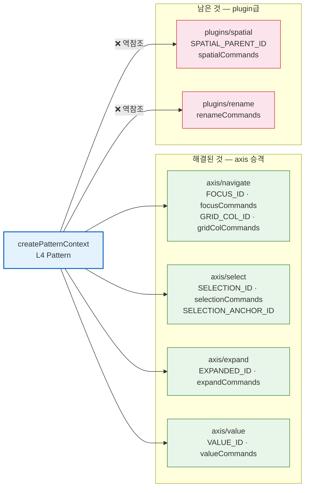
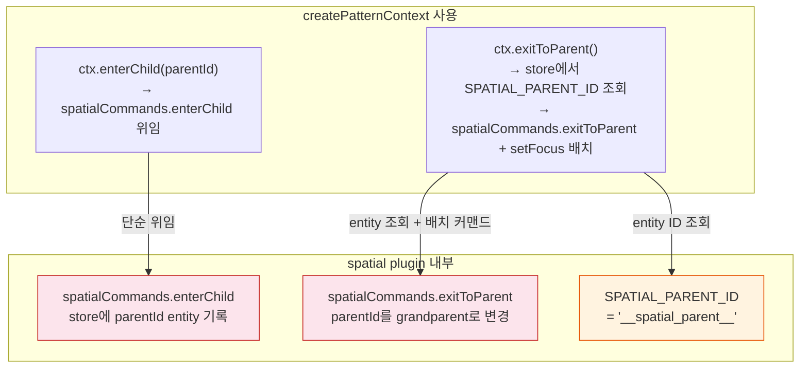
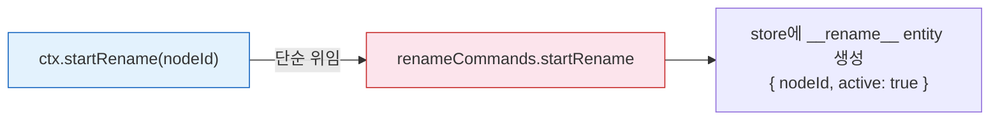
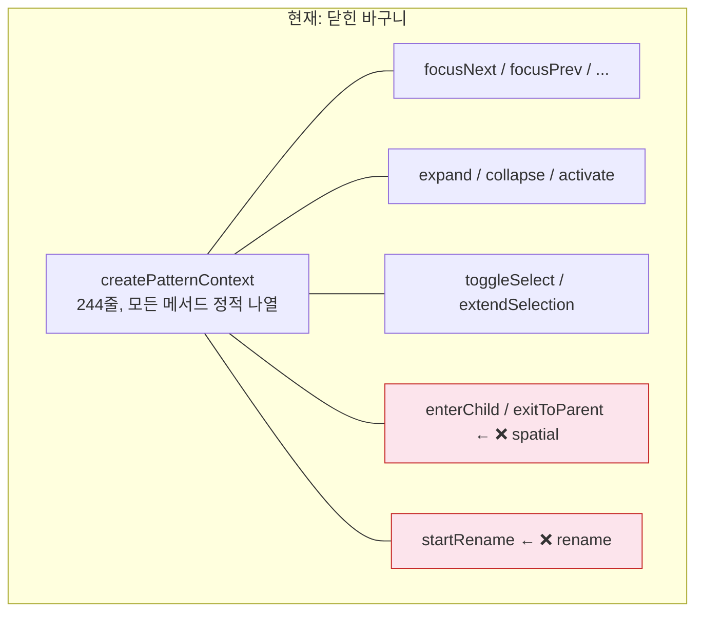

# L4→L5 잔존 위반 2개 — createPatternContext가 spatial·rename plugin을 직접 import한다

> 작성일: 2026-03-26
> 맥락: 26개 역참조를 정리하여 2개까지 줄였으나, spatial·rename의 command 팩토리가 여전히 L4에서 직접 import됨

> - `checkLayerDeps.mjs`가 역참조 2개를 보고한다
> - 둘 다 `createPatternContext.ts`(L4) → `plugins/`(L5) 방향이다
> - 왜 이 2개만 남았고, 이전에 해결한 것들과 무엇이 다른가?
> - **focus·select·expand는 "모든 ARIA 패턴의 본질적 축"이라 axis/로 승격할 수 있었지만, spatial·rename은 "특정 앱이 선택적으로 쓰는 plugin급 기능"이라 같은 패턴이 적용되지 않는다**

---

## 이전 해결은 "axis 승격"이었고, 남은 2개는 그 전략이 안 통한다

26개 runtime 위반의 대부분은 `focusCommands`, `selectionCommands`, `expandCommands` 같은 **핵심 축의 command 팩토리**였다. 이것들은 ARIA 패턴이라면 반드시 사용하는 보편적 축이므로 `plugins/core` → `axis/`로 승격하여 해결했다.



| 색상 | 의미 |
|------|------|
| 초록 | axis로 승격되어 해결된 import (L3, 정방향) |
| 빨강 | 여전히 plugins/에서 오는 역참조 (L5, 역방향) |
| 파랑 | 위반의 허브 — createPatternContext |

→ 해결된 4개(navigate, select, expand, value)는 **모든 ARIA 패턴이 쓰는 보편 축**이라 axis/로 올릴 수 있었다. spatial과 rename은 그렇지 않다.

---

## spatial — "공간 네비게이션"은 트리/리스트 밖의 선택적 기능이다

`plugins/spatial.ts`(89줄)는 **다계층 공간 네비게이션**을 구현한다. "현재 zone에서 자식 zone으로 진입"하거나 "부모 zone으로 복귀"하는 기능이다.

createPatternContext에서의 사용처 (3개 심볼):

```typescript
// createPatternContext.ts:16
import { spatialCommands, SPATIAL_PARENT_ID } from '../plugins/spatial'

// :211-213 — 자식 zone 진입
enterChild(parentId: string): Command {
  return spatialCommands.enterChild(parentId)
}

// :215-223 — 부모 zone 복귀
exitToParent(): Command | undefined {
  const spatialParent = getEntity(store, SPATIAL_PARENT_ID)
  const parentId = spatialParent?.parentId as string | undefined
  if (!parentId || parentId === ROOT_ID) return undefined
  return createBatchCommand([
    spatialCommands.exitToParent(),
    focusCommands.setFocus(parentId),
  ])
}
```



| 심볼 | 종류 | 역할 |
|------|------|------|
| `SPATIAL_PARENT_ID` | Entity ID 상수 | store에서 "현재 어느 zone에 있는가"를 조회하는 키 |
| `spatialCommands.enterChild` | Command 팩토리 | `__spatial_parent__` entity를 생성/갱신 |
| `spatialCommands.exitToParent` | Command 팩토리 | parentId를 grandparent로 올리거나 entity 제거 |

→ spatial은 **칸반, 대시보드 같은 다중 zone UI에서만 사용**된다. listbox, treegrid, accordion 같은 표준 APG 패턴은 이 기능이 필요 없다.

---

## rename — "이름 편집 시작"은 CRUD 앱 전용 기능이다

`plugins/rename.ts`(140줄)는 **인라인 이름 편집**을 구현한다. `startRename` → `confirmRename`/`cancelRename` 3단계 워크플로우.

createPatternContext에서의 사용처 (1개 심볼):

```typescript
// createPatternContext.ts:17
import { renameCommands } from '../plugins/rename'

// :225-227 — 이름 편집 시작
startRename(nodeId: string): Command {
  return renameCommands.startRename(nodeId)
}
```



rename은 3개 command를 가지지만, createPatternContext는 `startRename`만 사용한다 (`confirmRename`, `cancelRename`은 UI 컴포넌트가 직접 호출).

→ rename은 **CMS, 파일 탐색기 같은 CRUD 앱에서만 사용**된다. 읽기 전용 UI에는 필요 없다.

---

## 문제의 본질: createPatternContext는 "닫힌 바구니"다

createPatternContext는 244줄짜리 단일 팩토리로, **모든 가능한 ctx 메서드를 정적으로 나열**한다. axis든 plugin이든 새 기능이 추가되면 이 파일에 import를 추가하고 메서드를 하드코딩해야 한다.



이전에 해결된 getVisibleNodes(줄기 3)는 `VisibilityFilter` 인터페이스를 도입해서 **열린 구조(OCP)**로 전환했다. axis/plugin이 `shouldShow`/`shouldDescend` 함수를 선언하면, engine은 그걸 순회만 한다.

```typescript
// engine/getVisibleNodes.ts — OCP로 해결된 현재 코드
export function getVisibleNodes(
  store: NormalizedData,
  filters?: VisibilityFilter[]  // ← plugin이 주입
): string[] {
  // filters를 순회만 한다 — 어떤 plugin이 있는지 모른다
}
```

→ **createPatternContext도 동일한 OCP 패턴이 필요하다.** plugin이 ctx 메서드를 선언하고, createPatternContext는 그것을 합성만 하면 된다.

---

## 대비: getVisibleNodes는 해결됐고, createPatternContext는 아직이다

| 비교 | getVisibleNodes (줄기 3) | createPatternContext (줄기 1+2) |
|------|------------------------|-------------------------------|
| 이전 상태 | `EXPANDED_ID`, `SEARCH_ID` 직접 import | `spatialCommands`, `renameCommands` 직접 import |
| 해결 방법 | `VisibilityFilter` 인터페이스 주입 | 미해결 |
| 현재 plugins/ import | **0개** | **2개** (spatial, rename) |
| 핵심 전환 | engine이 "어떤 plugin이 있는지" 몰라도 됨 | 아직 "spatial이 있다", "rename이 있다"를 알아야 함 |

→ getVisibleNodes의 성공 패턴이 createPatternContext에도 적용 가능하다. **plugin이 ctx 확장을 선언하고, createPatternContext는 합성만 하는 구조.**
