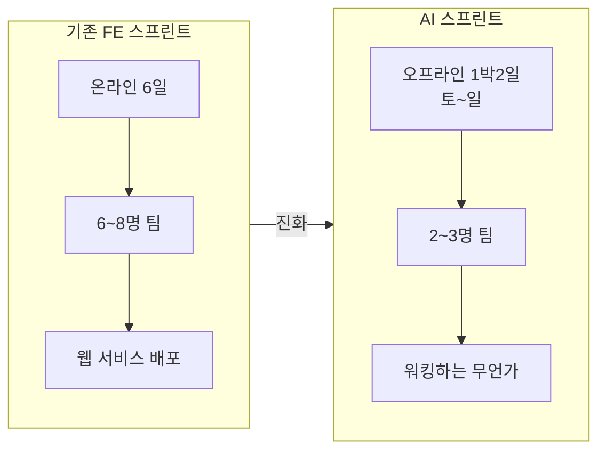
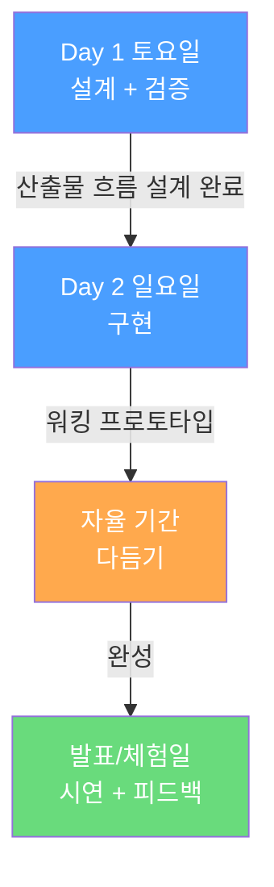
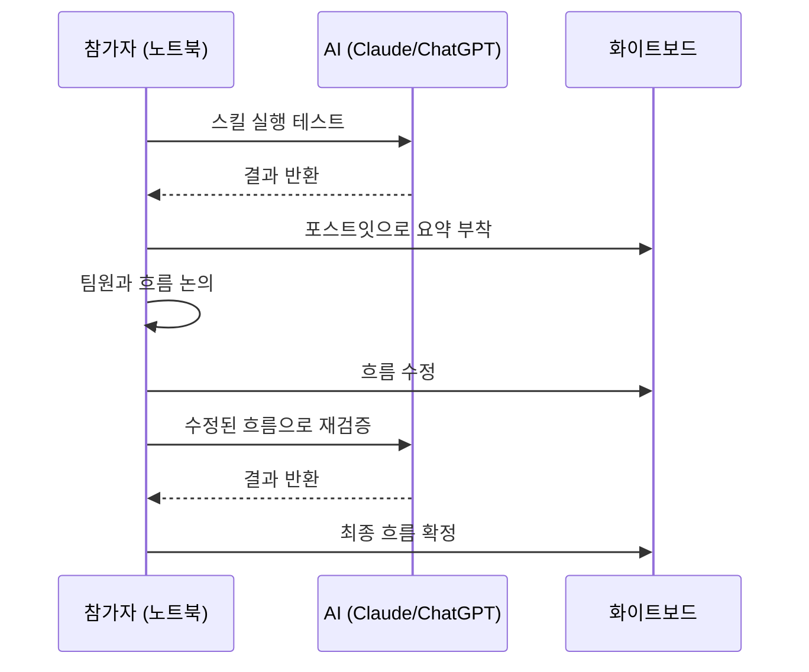
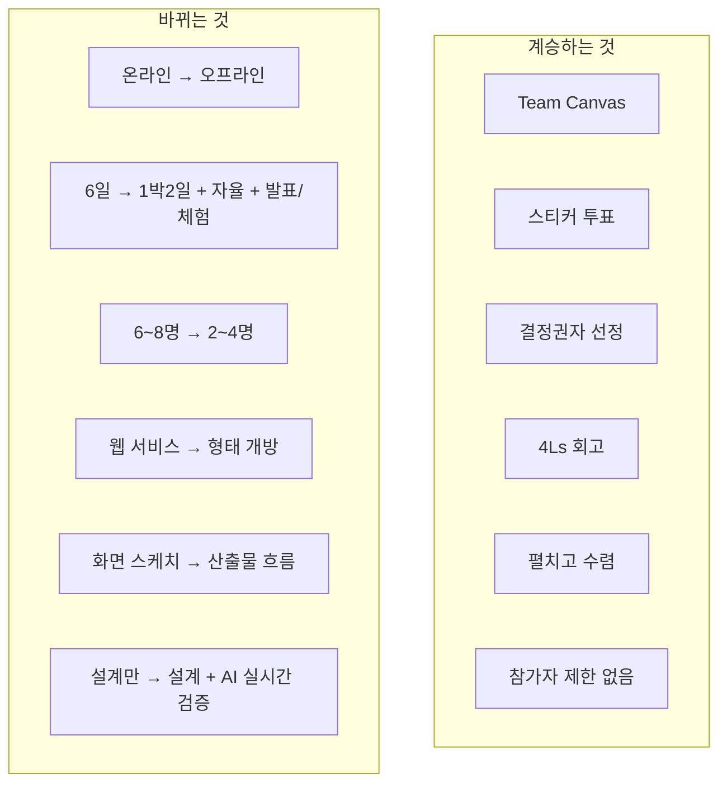

# AI 스프린트 — 테오의 스프린트 AI 버전 행사 기획안

> 작성일: 2026-03-19
> 맥락: 7월 AI 스프린트 행사를 위해 행사 담당자와의 미팅 준비 자료

---

## Why — 왜 AI 스프린트를 하려는가?

테오의 스프린트는 15기 이상 운영되며 "누구나 참여하는 온라인 협업 해커톤"으로 자리잡았다. 기존 스프린트는 **프론트엔드 웹 서비스**가 산출물이었고, 6~8명 팀이 온라인에서 6일간 기획→개발→데모를 진행했다.

이번에는 **AI라는 새 도메인**으로 스프린트 포맷을 확장한다. 단순히 주제만 AI로 바꾸는 게 아니라, AI 시대에 맞게 **프로세스 자체를 재설계**한다.

**핵심 동기:**
- AI 프로젝트는 화면이 아니라 **데이터 흐름(파이프라인)**이 설계의 핵심
- 프롬프트만 쓸 줄 알아도 기여 가능 → 참가자 풀이 더 넓어짐
- AI를 돌려보면서 실시간 이터레이션하려면 **오프라인이 유리**

---

## How — 어떤 구조로 진행하는가?

### 전체 흐름

| 단계 | 시간 | 형태 | 핵심 목표 |
|------|------|------|----------|
| **Day 1** | 토요일 | 오프라인 | 아이디어 → 팀 빌딩 → AI 돌려보며 산출물 흐름 설계 완료 |
| **Day 2** | 일요일 | 오프라인 | 설계한 흐름대로 구현 (밤새지 않아도 됨) |
| **자율 기간** | 평일 | 각자/팀 | 다듬기, 퀄리티 올리기 |
| **발표/체험일** | 다음주 1일 | 모임 | 워킹하는 결과물 시연 + 다른 팀 결과물 체험 + 피드백 |

### 1박2일 프로세스

기존 테오의 스프린트에서 검증된 프로세스 요소를 **전부 계승**하되, 오프라인에 맞게 도구를 변환한다:

| 프로세스 요소 | FE 스프린트 (온라인) | AI 스프린트 (오프라인) |
|-------------|-------------------|---------------------|
| Team Canvas | 피그잼 | 포스트잇 + 전지 |
| 아이디어 투표 | 스티커 투표 (피그잼) | 스티커 투표 (실물) |
| 의견 수집 | 피그잼 실시간 작성 | 포스트잇에 쓰고 붙이기 |
| 설계 대상 | 화면 스케치/스토리보드 | **산출물 흐름 (데이터 플로우)** |
| 설계 검증 | 없음 (개발 때 확인) | **AI 실시간 실행으로 검증** |
| 결정권자 | UX/PL 투표 | 동일 |
| 회고 | 4Ls | 동일 |

### Day 1 토요일 — 아이디어 + 팀 + 설계

#### 팀 빌딩 방식 (FE 스프린트와 다른 점)

1. **무기명 아이디어 제출** — 전원이 아이디어를 낸다 (발표자 영향력 배제)
   - **"어떻게"는 쓰지 않는다** — 기술 구현 방법 금지
   - **쓰는 것**: 문제 정의 + 이 문제가 풀리면 해결될 모습
   - → 비개발자도 아이디어를 낼 수 있고, 선택 기준이 "기술적 화려함"이 아니라 "문제의 공감"이 됨
2. **전체 아이디어 공개** — 누가 냈는지 모른 채 아이디어만 본다
3. **각자 하고 싶은 아이디어 선택** — 하나의 아이디어는 반드시 선택됨
4. **같은 아이디어를 선택한 사람 = 같은 팀** (2~4명, 자연 매칭)
5. **"어떻게 풀지"는 팀이 함께 설계** — 이게 토요일 설계 시간의 목적

이후 팀별로 AI 돌려보며 산출물 흐름 설계 완료.

#### 설계의 핵심: 산출물 정의

LLM의 본질은 **산출물을 정의하는 것**이다. Claude 스킬, 프롬프트, 에이전트 등은 산출물을 실현하는 수단일 뿐.

토요일에 팀이 하는 일:
1. **문제에서 필요한 산출물들을 나열**한다
2. **산출물 간의 흐름(순서, 의존관계)을 정의**한다
3. **AI로 각 산출물이 실제로 나오는지 검증**한다
4. 안 되면 산출물 정의를 수정하고 다시 검증한다

기존 스프린트의 MAP + Sketch + Decide를 하루에 압축하되, AI 실시간 검증으로 보완한다.

### Day 2 일요일 — 구현

설계한 파이프라인을 실제로 구현한다. 밤새지 않아도 되는 구조 — Day 1에서 설계가 끝났으므로 Day 2는 각자 페이스로 구현에 집중.

### 오프라인의 독특한 풍경

참가자는 **노트북과 포스트잇을 동시에** 사용한다:
1. 노트북에서 AI를 돌린다
2. 결과를 확인한다
3. 포스트잇에 요약해서 보드에 붙인다
4. 팀이 보드를 보면서 흐름을 조정한다

AI 자체가 협업 도구로 참여하는 것도 가능하다:
- AI에게 설계를 시키는 것도 OK
- 해커톤 진행을 위한 스킬(도구)을 만들면서 해커톤을 하는 것도 OK

---

## What — 구체적 스펙

### 규모

| 항목 | 내용 |
|------|------|
| 참가자 | 30~40명 |
| 팀 규모 | 2~4명 (아이디어 선택 기반 자연 매칭) |
| 팀 수 | 유동적 (아이디어 선택 결과에 따라) |
| 참가 자격 | **제한 없음** (개발자 아니어도 OK) |
| 시기 | 2026년 7월 |

### 산출물 정의

**형태: 개방.** 웹 서비스, AI 에이전트, 자동화 파이프라인, 챗봇 등 형태 무관.

**"워킹"의 기준:**
- 제3자가 직접 써볼 수 있다 (링크든 CLI든 봇이든)
- 문제가 실제로 줄어든 걸 before/after로 보여줄 수 있다

### 발표/체험일 형식

- **부스형 체험**: 각 팀 테이블에서 다른 참가자가 직접 돌려보는 시간
- **참여형**: 일부 산출물은 참가자가 직접 참여하며 체험
- 순서대로 발표만 하는 게 아니라, 오프라인의 장점을 살린 혼합 형식

### FE 스프린트와의 차이 요약

---

## If — 행사 담당자와 결정해야 할 것

### 확정 필요 항목

| 항목 | 질문 | 비고 |
|------|------|------|
| **날짜** | 7월 몇째 주 토~일? | 발표/체험일도 함께 확정 |
| **시간** | 토요일 시작/종료, 일요일 시작/종료 | |
| **장소** | 30~40명 수용, 팀별 테이블 배치 | 팀 수 유동적, 1박 가능 여부 |
| **숙박** | 같은 장소? 근처 숙소? | 밤새지 않아도 되는 구조 |
| **인프라** | 와이파이 + 전원 콘센트 | 전원 노트북 사용, AI 실행 필수 |
| **비품** | 포스트잇, 마커, 화이트보드/전지 | 팀당 1세트 |
| **발표/체험일** | 다음주 언제? 온라인/오프라인? | 다른 팀 결과물 직접 체험 시간 포함 |
| **예산** | 식사(2~3끼), 장소 대관, 숙박, 비품 | |
| **모집** | 채널, 신청 방식, 마감일 | |
| **성격** | 1회 실험 (시리즈 아님) | AI 변화 속도 + 오프라인 부담 고려 |

### 담당자에게 설명할 핵심 포인트

**"이게 기존 스프린트와 뭐가 다른 건데?"에 대한 답:**

1. **왜 AI인가** — FE가 아닌 AI 도메인으로 확장. 코드 없이 프롬프트만으로도 참여 가능
2. **왜 오프라인인가** — 설계를 강제하기 위해. AI를 같이 돌려보며 흐름 잡는 건 옆에 있어야 함
3. **왜 2~4명 소규모인가** — AI 프로젝트는 역할 분담보다 함께 이터레이션이 핵심. 무기명 아이디어 선택으로 자연 매칭
4. **왜 1박2일인가** — 토요일 설계, 일요일 구현, 다음주 발표/체험. 밤새지 않아도 되는 여유 있는 구조
5. **왜 아무나인가** — 프롬프트만 써도 기여 가능. "AI로 뭔가 만드는 체험" 자체가 가치
