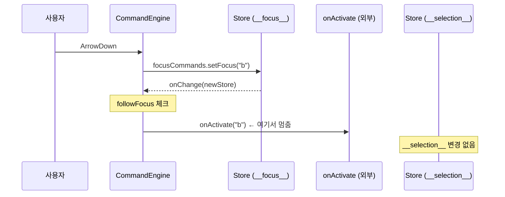
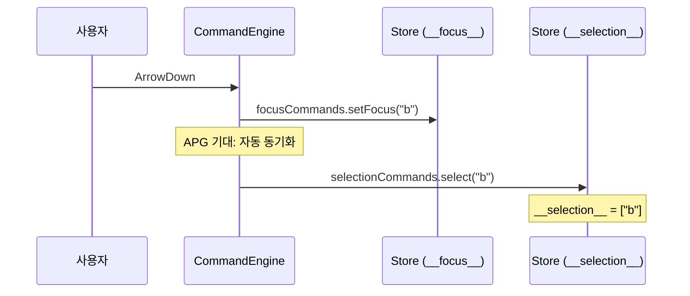
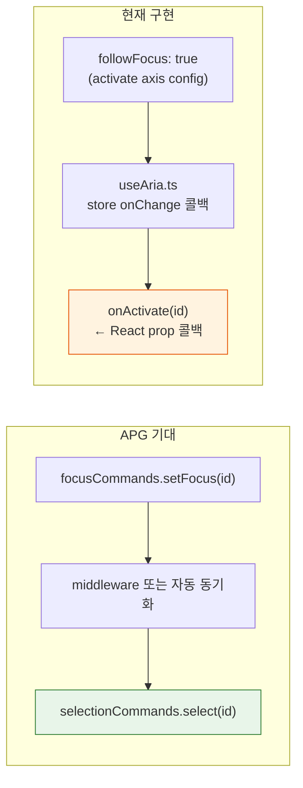
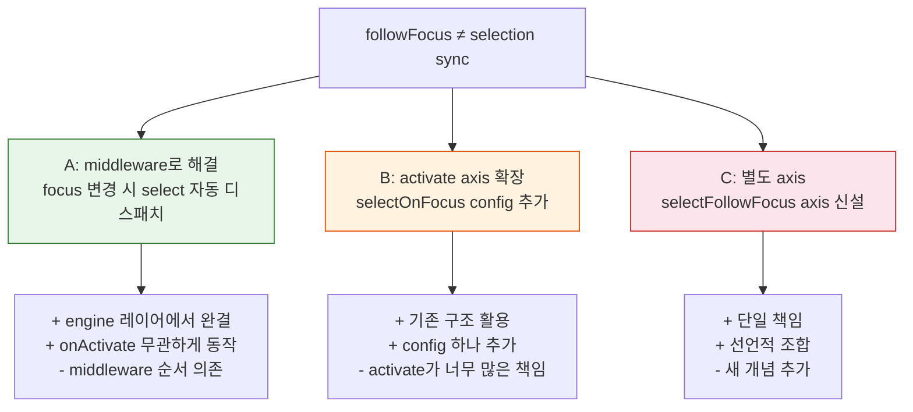

# followFocus Selection Gap — APG "selection follows focus"와 우리 구현의 구조적 불일치

> 작성일: 2026-03-28
> 맥락: APG Conformance Phase 1에서 RadioGroup, Tabs 두 패턴이 🟡 판정

> - followFocus는 포커스 변경 시 외부 콜백(onActivate)만 호출한다
> - APG RadioGroup/Tabs(automatic)는 포커스 이동 = 내부 selection 자동 변경을 요구한다
> - 두 메커니즘은 같은 이름("selection follows focus")이지만 작동 레이어가 다르다
> - 갭의 본질: followFocus는 engine 밖으로 나가는 출구이고, APG가 요구하는 것은 engine 안에서 완결되는 동기화다

---

## followFocus는 "외부 통보"로 설계됐다 — 내부 상태 변경이 아니다

followFocus의 현재 구현은 useAria.ts:83에서 engine의 store 변경 콜백 안에 있다.



핵심 코드 (useAria.ts:83-87):
```typescript
if (cb.behavior.followFocus && cb.onActivate && newFocusedId !== cb.prevFocus) {
  const entityData = getEntityData(newStore, newFocusedId)
  if (entityData?.followFocus !== false) {
    cb.onActivate(newFocusedId)  // 외부 콜백만 호출
  }
}
```

3가지 조건이 모두 참이어야 발동한다: (1) behavior.followFocus가 true, (2) onActivate 콜백이 등록됨, (3) focusedId가 변경됨. 이 중 **(2) onActivate가 없으면 아무 일도 안 일어난다** — 이것이 갭의 핵심이다.

→ followFocus는 "포커스가 바뀌면 외부에 알려라"이지, "포커스가 바뀌면 내부 selection을 동기화하라"가 아니다.

---

## APG가 요구하는 것은 engine 내부에서 완결되는 자동 동기화다

APG "selection follows focus"의 정의:



RadioGroup(APG): Arrow 키 → 포커스 이동 + aria-checked 자동 변경
Tabs Automatic(APG): Arrow 키 → 포커스 이동 + aria-selected 자동 변경

두 패턴 모두 **별도의 키 입력(Space/Enter) 없이** 포커스 이동만으로 selection이 바뀌어야 한다.

→ APG의 "selection follows focus"는 engine 레이어에서 `__focus__` 변경 시 `__selection__`이 자동으로 따라오는 메커니즘이다.

---

## 두 레이어의 구조적 단절이 갭을 만든다



| 측면 | 현재 (followFocus) | APG 기대 |
|------|-------------------|---------|
| 트리거 | focus 변경 | focus 변경 |
| 작동 위치 | useAria (React 레이어) | engine (store 레이어) |
| 출력 | 외부 콜백 호출 | 내부 __selection__ 변경 |
| onActivate 없으면 | **아무 일 없음** | **selection은 여전히 따라와야 함** |
| per-item opt-out | entity.data.followFocus=false | N/A (패턴 전체가 결정) |

→ 단절의 핵심: 현재 구현은 React prop(onActivate)에 의존하지만, APG 동작은 React prop 유무와 무관해야 한다.

---

## 해결 경로는 3가지, 각각 트레이드오프가 다르다



**A. Middleware** — select axis가 이미 `anchorResetMiddleware`를 가지고 있다. 같은 패턴으로 `selectOnFocusMiddleware`를 만들면 된다:

```typescript
// 개념 코드 — 실제 구현이 아님
function selectOnFocusMiddleware(): Middleware {
  return (next) => (command) => {
    next(command)
    if (command.type === 'core:focus') {
      next(selectionCommands.select(command.payload.nodeId))
    }
  }
}
```

**B. Activate axis config** — `activate({ selectOnFocus: true })`를 추가하고 useAria에서 처리. 하지만 이러면 activate가 select의 관심사를 침범한다.

**C. 별도 axis** — `selectFollowFocus()` axis를 만들어 composePattern에서 조합. 새 개념 추가의 비용.

→ **A(middleware)가 가장 자연스럽다**: engine 레이어에서 완결되고, onActivate 유무와 무관하며, 기존 anchorResetMiddleware와 동일한 패턴이다. activate axis의 followFocus는 "외부 통보"용으로 그대로 두고, selection 동기화는 select axis의 middleware가 담당하면 관심사가 분리된다.
