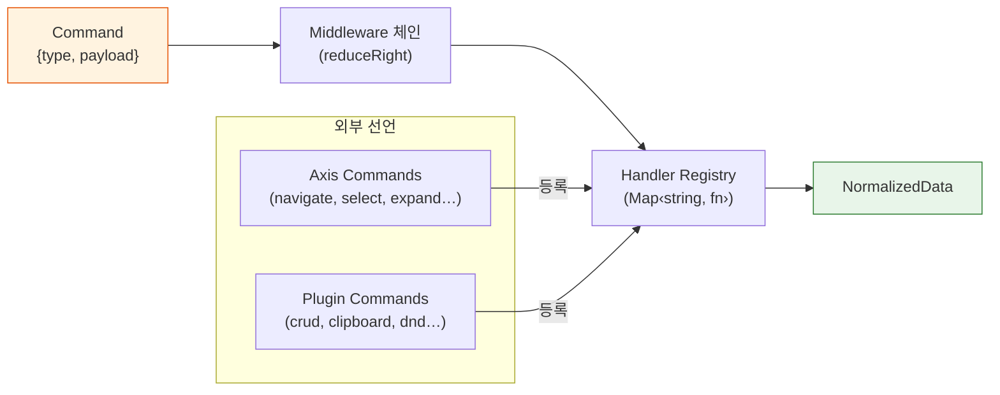
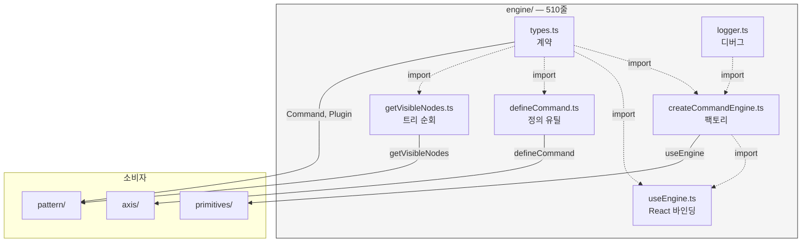
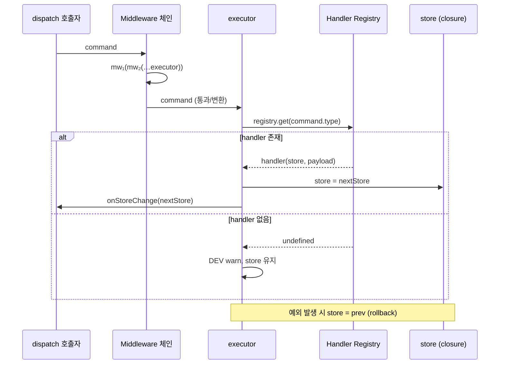
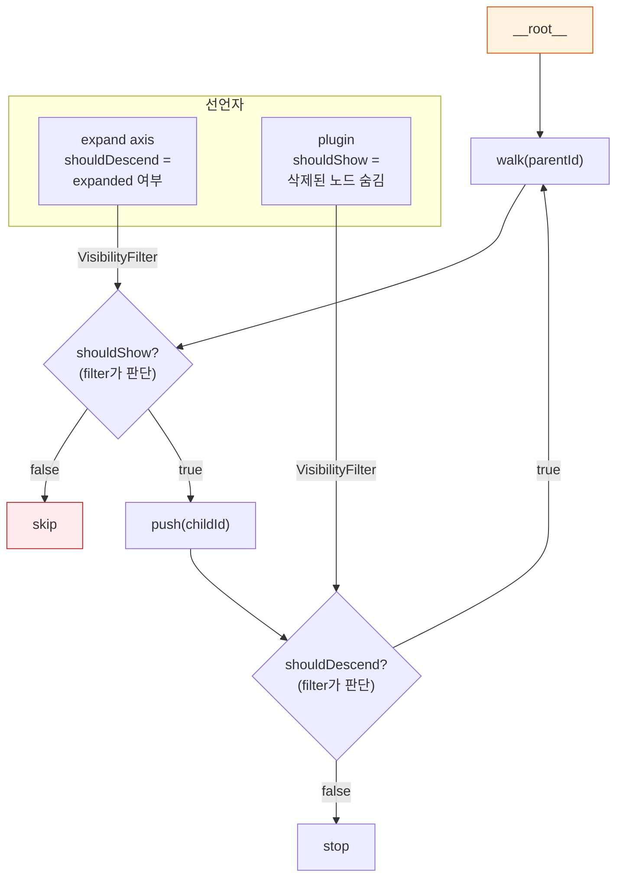
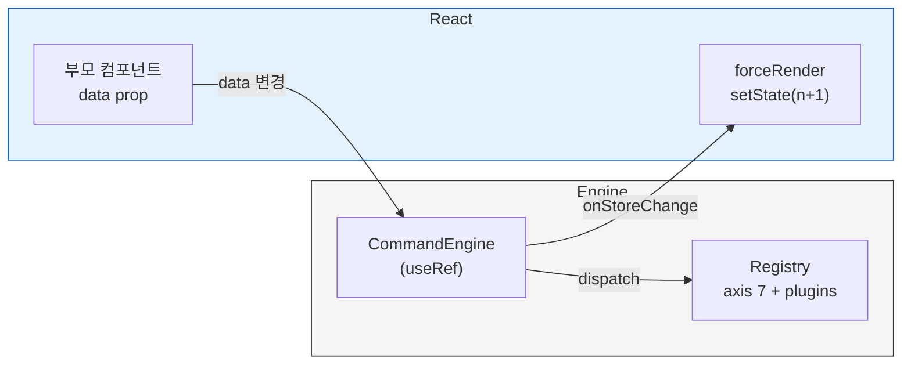

# Engine — 빈 껍데기가 모든 인터랙션을 실행하는 방법

> 작성일: 2026-03-31
> 맥락: interactive-os의 두 번째 레이어(store → **engine** → axis)

> - Engine은 510줄, 6파일로 interactive-os에서 가장 작은 레이어다
> - 스스로는 어떤 UI 행위도 모른다 — Command를 받아 store를 바꾸는 디스패치 루프만 존재한다
> - 왜 이렇게 작을 수 있는가?
> - 행위 지식을 axis/plugin으로 완전히 추출했기 때문이다 — engine은 합성 런타임이지 행위 컨테이너가 아니다

---

## Engine이 행위를 모르는 것이 설계의 핵심이다

Engine은 "무엇을 하느냐"를 전혀 모른다. 알고 있는 것은 세 가지뿐이다:

1. **Command가 들어온다** → type 문자열로 handler를 찾는다
2. **Handler가 store를 변환한다** → 불변 업데이트, 실패 시 rollback
3. **Middleware 체인이 Command를 감싼다** → history, logging 등 관심사 주입

이 세 가지를 빼면 engine에 남는 코드는 없다. 이것이 510줄의 이유다.



| 노드 | 역할 |
|------|------|
| Command | 의도를 표현하는 데이터 객체 (type + payload) |
| Middleware 체인 | Command 전후에 관심사를 끼워넣는 래퍼 |
| Handler Registry | type → pure function 매핑 |
| NormalizedData | 플랫 맵 기반 정규화 트리 (store 레이어) |

→ Engine이 행위를 모르므로, 새 축이나 플러그인을 추가해도 engine 코드는 변하지 않는다 (OCP).

---

## 6파일이 각각 하나의 책임을 갖는다

| 파일 | 줄 수 | 책임 |
|------|-------|------|
| `types.ts` | 99 | 계약 정의 — Command, Plugin, Middleware, VisibilityFilter 등 모든 인터페이스 |
| `createCommandEngine.ts` | 123 | 엔진 팩토리 — middleware 합성 + handler resolve + dispatch loop |
| `useEngine.ts` | 95 | React 바인딩 — 엔진 생성 + 외부 데이터 동기화 + 리렌더 트리거 |
| `defineCommand.ts` | 94 | Command 정의 유틸 — action creator + handler를 한 객체에 co-locate |
| `getVisibleNodes.ts` | 48 | 트리 순회 — VisibilityFilter를 적용하여 보이는 노드만 수집 |
| `logger.ts` | 51 | 디버그 로거 — dispatch seq + diff 기반 변경 시각화 |



→ `types.ts`가 모든 계약의 SSOT이고, 나머지 5파일은 각각 하나의 메커니즘을 구현한다.

---

## createCommandEngine: dispatch 루프의 전체 생명주기

엔진의 핵심인 `createCommandEngine`은 4단계로 동작한다.



**핵심 메커니즘**:

1. **Middleware 합성** (109행): `reduceRight`로 체인을 구성한다. 가장 바깥 middleware가 먼저 실행되고, 가장 안쪽의 `executor`가 최종 실행자다.

2. **Batch 해소** (75행): `resolve` 함수가 BatchCommand를 재귀적으로 풀어낸다. 각 sub-command를 순서대로 실행하여 store를 누적 변환한다.

3. **Rollback** (96행): handler 실행 중 예외가 발생하면 `store = prev`로 즉시 복원한다. 부분 적용은 없다.

4. **변경 감지** (102행): `store !== prev` 참조 비교만으로 변경을 판단한다. 불변 업데이트이므로 가능하다.

→ createCommandEngine은 123줄이지만, 이 안에 디스패치 루프의 모든 단계(합성 → 해소 → 실행 → rollback → 통지)가 담겨 있다.

---

## defineCommand: action과 reducer를 한 곳에 co-locate한다

Redux에서 action creator와 reducer가 분리되어 발생하는 drift를 방지하기 위해, `defineCommand`는 둘을 하나의 객체로 묶는다.

```typescript
// 호출: focusFirst() → { type: 'core:focus:first', meta: true }
// 등록: registry.set('core:focus:first', focusFirst.handler)
// 테스트: focusFirst.reduce(store) → nextStore
const focusFirst = defineCommand('core:focus:first', {
  meta: true,
  handler: (store) => /* ... */
})
```

반환 객체는 세 가지 역할을 동시에 수행한다:

| 프로퍼티 | 역할 | 소비자 |
|---------|------|--------|
| `()` (함수 호출) | action creator — Command 객체 생성 | keyMap, inputMap |
| `.handler` | reducer — store 변환 | engine registry |
| `.reduce` | create + handler 합성 — 테스트용 단축 | unit test |

→ type 문자열이 하나이므로 action-reducer 불일치가 구조적으로 불가능하다.

---

## getVisibleNodes: 보이는 것만 순회하되, 규칙은 외부가 정한다

`getVisibleNodes`는 48줄의 DFS walker다. 하지만 "무엇이 보이는가"의 판단은 자신이 하지 않는다.



**두 가지 필터 슬롯**:
- `shouldShow(nodeId, store)` → false면 노드 자체를 건너뜀
- `shouldDescend(nodeId, store)` → false면 자식을 walk하지 않음

가장 대표적인 사용자는 **expand axis**다: `shouldDescend`에서 `__expanded__` entity를 확인하여 접힌 노드의 자식을 숨긴다.

→ 순회 로직과 가시성 규칙이 분리되어 있으므로, 새 필터를 추가해도 getVisibleNodes는 변하지 않는다 (OCP).

---

## useEngine: React 세계와 engine 세계의 경계

`useEngine`은 두 세계를 연결하는 95줄의 브릿지다. 핵심 역할 3가지:

1. **엔진 생성** (32행): 최초 렌더 시 `createCommandEngine`을 호출하고 `useRef`로 보관한다. axis 7종의 command를 registry에 등록하고, plugin의 command와 middleware를 합성한다.

2. **외부 데이터 동기화** (77행): controlled 모드에서 부모가 `data`를 변경하면 `syncStore`로 엔진 내부를 교체한다. 단, entity/relationship 실제 변경이 있을 때만.

3. **리렌더 트리거** (69행): `onStoreChange` 콜백에서 `forceRender(n => n+1)`로 React 리렌더를 발생시킨다.



→ useEngine은 엔진의 수명을 React 컴포넌트 수명에 바인딩하면서, 양방향 데이터 흐름(외부→엔진, 엔진→리렌더)을 처리한다.

---

## Plugin 인터페이스: engine이 소비하는 유일한 확장 계약

`Plugin` 인터페이스는 engine이 외부 확장을 받아들이는 유일한 문이다. 8개 슬롯이 있지만, engine이 직접 소비하는 것은 3개뿐이다:

| 슬롯 | engine 소비 | 소비 위치 |
|------|-----------|----------|
| `middleware` | ✅ | createCommandEngine — 체인 합성 |
| `commands` | ✅ | useEngine — registry 등록 |
| `visibilityFilter` | ✅ | pattern → getVisibleNodes에 전달 |
| `keyMap` | ❌ | primitives(useAria)가 소비 |
| `onCopy/Cut/Paste` | ❌ | primitives가 소비 |
| `renderer` | ❌ | ui 레이어가 소비 |
| `intercepts` | ❌ | DEV 경고용 (useEngine 초기화) |

→ Plugin은 engine의 인터페이스이지만, 실제 슬롯의 대부분은 상위 레이어(primitives, ui)가 소비한다. Engine은 "등록"만 하고, "사용"은 각 레이어의 몫이다.
