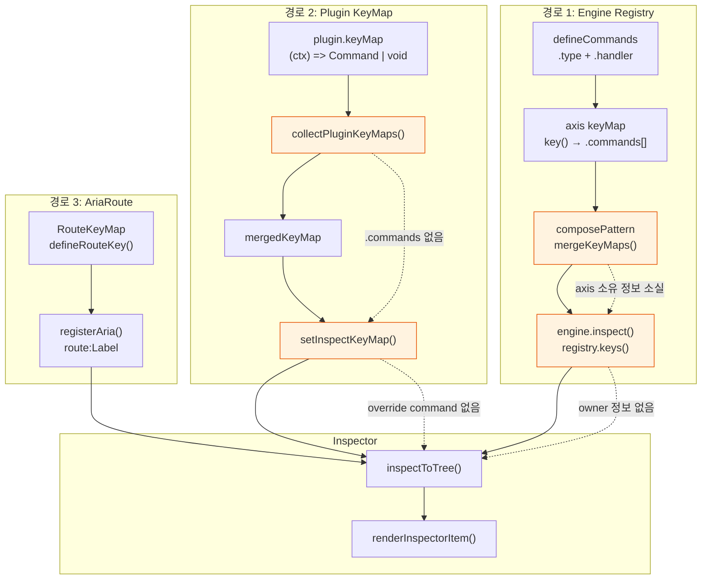
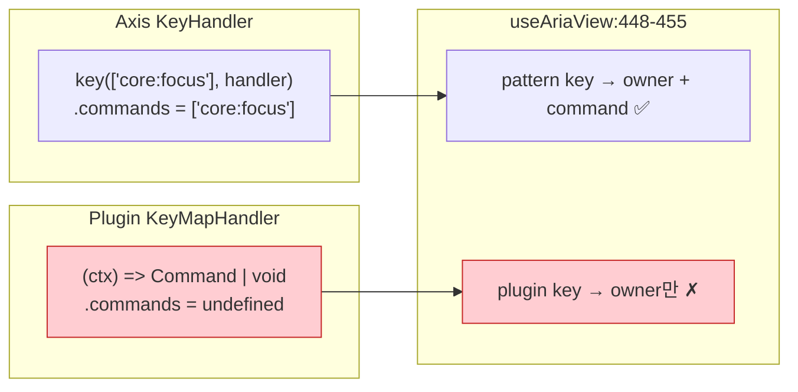
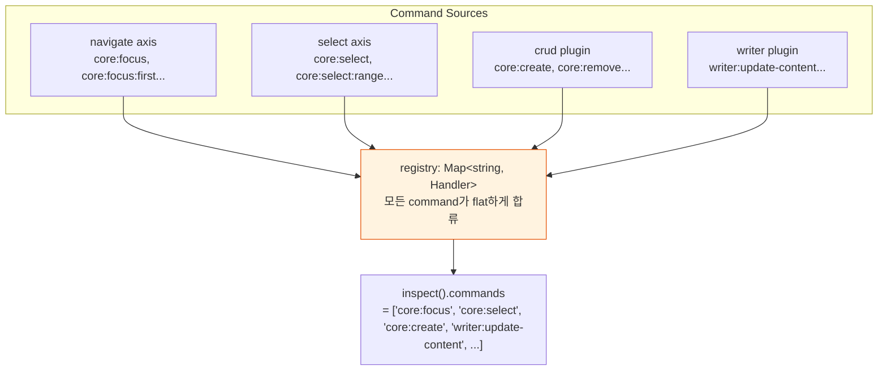
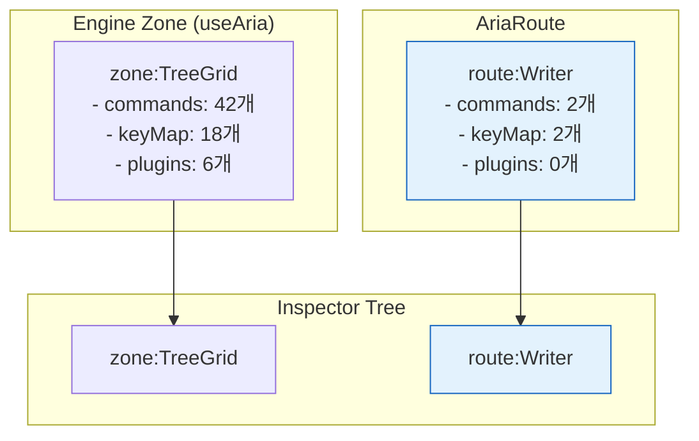
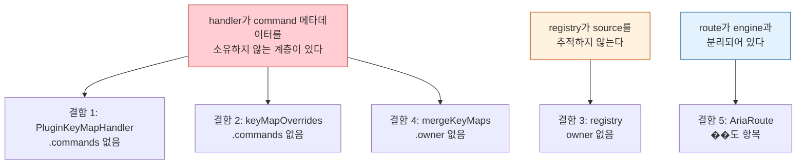

# Inspector Blind Spots — command/keyMap이 inspector에 도달하지 못하는 5가지 구조적 결함

> 작성일: 2026-04-05
> 맥락: inspector가 route:Writer의 Mod+\ command를 빈칸으로 표시���는 버그를 수정하면서, 동일한 패턴의 구조적 결함이 더 있는지 전수 조사

> - inspector는 command와 keyMap을 3가지 경로로 수집한다: engine registry, pattern keyMap, AriaRoute
> - 이 3경로 모두에서 메타데이터가 유실되는 지점이 존재한다
> - 유실의 공통 원인은 무엇인가?
> - **handler가 command 메타데이터를 소유하지 않는 계층이 있으면, inspector는 반드시 blind spot을 갖는다**

---

## inspector는 3개의 독립된 등록 경로를 갖고, 경로마다 유실 지점이 다르다

inspector가 command/keyMap 정보를 수집하는 전체 데이터 흐름이다.



| 색상 | 의미 |
|------|------|
| 주황 | 메타데이터 유실 지점 |

→ 3경로가 독립적이라서 결함도 독립적으로 발생한다. 아래에서 각 유실 지점을 개별 분석한다.

---

## 결함 1: plugin keyMap handler에 `.commands`가 없어서 inspector가 command를 모른다

가장 심각한 blind spot이다. pattern keyMap의 `KeyHandler`는 `.commands: string[]` 속성을 갖지만, plugin keyMap의 `PluginKeyMapHandler`는 순수 함수여서 어떤 command를 반환하는지 정적으로 알 수 없다.



**코드 증거** — `useAriaView.ts:444-455`:

```typescript
// pattern keyMap — .commands 있음 ✅
for (const [k, handler] of Object.entries(pattern.keyMap)) {
  desc[k] = { owner: 'pattern', command: handler.commands.join(' | ') }
}
// plugin keyMap — .commands 없음 ✗
if (pluginKeyMaps) {
  for (const k of Object.keys(pluginKeyMaps)) {
    if (desc[k]) {
      desc[k] = { ...desc[k]!, owner: `${desc[k]!.owner} + plugin` }
    } else {
      desc[k] = { owner: 'plugin' }  // ← command 필드 자체가 없다
    }
  }
}
```

**영향 범위**: Writer의 writerKeys plugin이 14개 키바인딩을 등록하지만(`Enter`, `Mod+Enter`, `Tab`, `Shift+Tab`, `Alt+ArrowUp/Down`, `Backspace`, `Mod+l`, `Mod+Shift+l`, `Mod+Digit0`, `Mod+Shift+h`, `Mod+Shift+Enter`), pattern keyMap과 겹치지 않는 키는 inspector에서 command가 비어있다.

**근본 원인**: `PluginKeyMapHandler` 타입(`useAriaView.ts:18`)이 `(ctx, original?) => Command | void`로 정의되어 `.commands` 속성을 갖지 않는다. `definePlugin`의 `keyMap`(`definePlugin.ts:12`)도 `Record<string, (ctx) => any>`로, command 메타데이터를 선언할 채널이 타입에 없다.

→ plugin keyMap도 axis keyMap처럼 `key()` 팩토리를 거�� `.commands`를 붙이거나, `definePlugin`에서 keyMap entry에 command type을 선언하는 구조가 필요하다.

---

## 결함 2: keyMapOverrides가 command 정보 없이 'override'로만 등록된다

`useAriaView.ts:457-460`:

```typescript
if (keyMapOverrides) {
  for (const k of Object.keys(keyMapOverrides)) {
    desc[k] = { owner: 'override' }  // ← command 없음
  }
}
```

keyMapOverrides는 `Aria.Root`의 `keyMapOverrides` prop으로 전달되는 소비자 커스텀 키바인딩이다. 이것도 handler가 순수 함수라서 command type을 정적으로 알 수 없다.

→ 결함 1과 동일한 구조적 원인. handler에 command 메타데이터가 없다.

---

## 결함 3: engine registry가 command의 owner�� 추적하지 않는다

`createCommandEngine.ts:137`:

```typescript
commands: [...registry.keys()],  // type 목록만 반환
```

registry는 `Map<string, CommandHandler>`다. 어떤 command가 어떤 axis/plugin에서 왔���지 알 수 없다.



**영향**: inspector Commands 그룹에 모든 command가 나열되지만, "이 command는 어디서 왔는가?"를 알 수 없다. `core:` prefix로 axis/plugin을 구분할 수는 있지만, 이건 네이밍 컨벤션�� 의존하는 것이지 구조적 보장이 아니다.

→ registry를 `Map<string, { handler, owner }>`로 확장하거나, `buildRegistry`에서 source를 태깅하면 해결된다.

---

## 결함 4: axis keyMap이 mergeKeyMaps에서 합류하면서 소유 axis를 잃는다

`composePattern.ts:38-57`:

```typescript
function mergeKeyMaps(keyMaps: KeyMap[]): KeyMap {
  for (const k of allKeys) {
    const handlers = keyMaps.map((km) => km[k]).filter(Boolean)
    if (handlers.length === 1) {
      result[k] = handlers[0]!  // ← 어떤 axis에서 왔는지 모른다
    } else if (handlers.length > 1) {
      const allCommands = [...new Set(handlers.flatMap(h => h.commands))]
      result[k] = keyFn(allCommands, ...)  // ← commands만 합치고 axis 정보는 사라진다
    }
  }
}
```

inspect에서 `handler.commands`로 command 이름은 보이지만, "이 키가 navigate 축에서 왔는지 select 축에서 왔는지"는 `useAriaView.ts:445`에서 일괄 `owner: 'pattern'`으로 표시된다.

**영향**: inspector keyMap 섹션에서 모든 axis 키가 `pattern → core:focus` 형태로 표시되지만, `pattern`이 어떤 axis 조합인지 보이지 않는다.

→ `KeyHandler`에 `.owner` 속성을 추가하거나, `key()` 팩토리에서 axis 이름을 태깅하면 해결된다.

---

## 결�� 5: AriaRoute가 engine과 분리된 별도 registry 항목으로 존재한다

`AriaRoute.tsx`는 `registerAria(registryKey, ...)`로 별도 항목을 등록한다. 이 항목은 engine의 inspect 결과와 병합되지 않고 독립적으로 존재한다.



이건 현재 `defineRouteKey` 도입으로 command 표시는 해결되었지만, **route의 command가 engine의 command 목록에 포함되지 않는다**는 구조적 분리는 남아있다. route command(`writer:save`, `writer:toggle-prose`)는 engine dispatch를 거치지 않으므로 history(undo/redo), middleware, plugin intercept의 대상이 아니다.

→ 이건 결함이라기보다 설계 경계에 가깝다. route command�� engine을 거쳐야 하는지는 별도 판단이 필요하다.

---

## 5가지 결함의 공통 원인은 하나다



| 원인 계층 | 결함 | 해결 방향 |
|----------|------|----------|
| **handler에 메타데이터 없음** (1,2,4) | plugin keyMap, override, axis 소유 정보 유실 | handler 생성 시 `.commands`/`.owner`를 필수로 부착 |
| **registry에 source 없음** (3) | command owner 유실 | registry value에 owner 태깅 |
| **route-engine 분리** (5) | route command가 engine 밖 | 설계 판단 필요 |

결함 1,2,4는 **동일한 해결 패턴**으로 풀린다: axis의 `key()` 팩토리처럼, plugin keyMap과 override도 command 메타데이터를 선언하는 팩토리를 거치게 하면 된다. `definePlugin`의 keyMap entry가 `key('writer:insert-after', handler)` 형태가 되면 `.commands`가 자동으로 붙는다.
