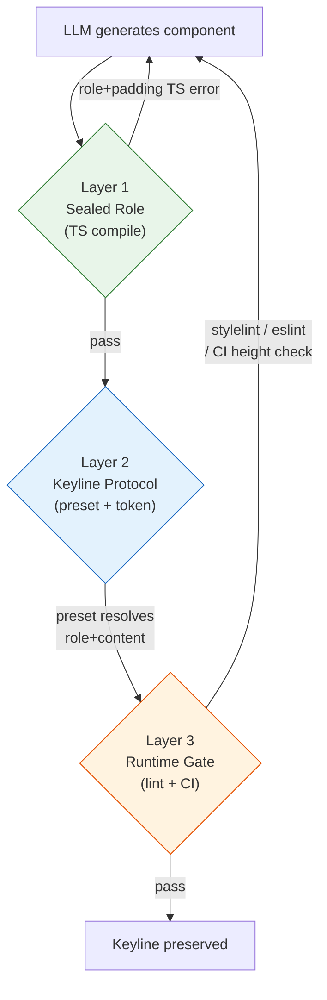

# Keyline Guardian: LLM이 keyline을 유지하면서 컴포넌트를 만들 수 있는 3층 방어 아키텍처

## 1. Problem

현재 ax() 디자인 시스템은 `role` 축으로 control(36px), item(28px), badge(20px)의 keyline을 선언적으로 관리한다. 그러나 LLM이 새 컴포넌트를 생성할 때 keyline을 깨뜨리는 **5가지 실패 모드**가 반복된다.

1. **content 누락**: `role: 'control'`만 선언하고 `content: 'text'`를 빠뜨려 padding 비율이 깨짐
2. **module.css override**: `.myButton { padding: 12px 20px }` 같은 last-mile CSS가 role의 소유 속성을 덮어씀
3. **style={} 인라인**: `style={{ height: 40 }}`로 role이 정한 min-height를 무시
4. **ad-hoc gap/shape**: `role: 'control'`인 요소에 `gap: 'lg'`나 `shape: 'xl'`을 함께 선언하여 role의 내부 공간 체계를 훼손
5. **cross-component 정렬 실패**: 같은 행에 놓인 control과 item의 leading edge가 다른 padding으로 어긋남

현재 방어 수단은 세 가지다. `ax()` 타입이 기본 축 조합을 검증하고, `keylineCheck.mjs`가 정적 AST 분석으로 role 누락과 sizing override를 찾고, `PageKeylineTest`가 실측 높이를 비교한다. 그러나 타입은 role+padding 동시 사용을 허용하고, 정적 분석은 module.css를 완벽히 추적하지 못하며, 실측 테스트는 CI에 통합되지 않아 수동 확인에 의존한다. 어느 한 층도 5가지 실패를 모두 잡지 못한다.

## 2. Solution Overview

**Keyline Guardian**은 세 개의 독립된 방어 층으로 구성된다.

- **Layer 1 — Sealed Role**: TypeScript discriminated union으로 role 선택 시 padding/shape/gap을 `never`로 차단한다. 잡는 것: 타입 수준 축 충돌. 못 잡는 것: CSS override, 런타임 높이.
- **Layer 2 — Keyline Protocol**: preset 축 + CSS 토큰 + 레퍼런스 카탈로그로 올바른 조합을 최단 경로로 만든다. 잡는 것: cross-component 정렬, LLM의 빈 페이지 문제. 못 잡는 것: CSS override, 인라인 스타일.
- **Layer 3 — Runtime Gate**: stylelint + ESLint + CI 실측으로 우회를 감지한다. 잡는 것: module.css override, style={}, 렌더링 후 높이 초과.



## 3. Layer 1: Sealed Role (TS 타입 잠금)

현재 `Axes` 타입은 `role`과 `padding`/`shape`/`gap`을 동시에 허용한다. Sealed Role은 role을 선택하면 해당 축들을 `never`로 차단하는 discriminated union으로 바꾼다.

```typescript
// role이 소유하는 축을 차단
interface RoleSealed {
  padding?: 'none'  // 리셋만 허용
  shape?: never
  gap?: never
}

interface RoleAxes extends Omit<AxesBase, 'role' | 'padding' | 'shape' | 'gap'>, RoleSealed {
  role: Role
  content?: Content  // optional (ghost icon button 등)
}

interface NoRoleAxes extends Omit<AxesBase, 'role'> {
  role?: never
}

export type Axes =
  | (RoleAxes & { border?: BorderFull })
  | (RoleAxes & { border?: BorderSide; shape?: never })
  | (NoRoleAxes & { border?: BorderFull; shape?: Shape })
  | (NoRoleAxes & { border?: BorderSide; shape?: never })
  | (NoRoleAxes & { border?: never; shape?: Shape })
```

**잡는 것**: content 누락 시 IDE 경고(strict 모드), role+padding 충돌, role+shape 충돌, role+gap 충돌. LLM이 `ax({ role: 'control', padding: 'lg' })`를 생성하면 TypeScript가 즉시 에러를 낸다.

**못 잡는 것**: module.css에서 `.myControl { padding: 20px }`, `style={{ height: 44 }}` 인라인, 렌더링 후 높이 초과.

**Migration**: 현재 코드베이스에서 role과 shape를 동시 사용하는 파일은 2개뿐이다. `gmailWidgets.tsx`에서 `shape: 'xl'` 제거, `Carousel.tsx`에서 `shape: 'pill'` 제거. `@property`는 불필요하다 -- `@layer` 순서가 이미 recipe > component로 잡혀 있어 cascade 충돌이 없다.

## 4. Layer 2: Keyline Protocol (Preset + Token + Catalog)

### 4a. Preset 축

유의미한 5개 조합만 preset으로 제공한다.

```typescript
type Preset = 'text-control' | 'icon-control' | 'text-item' | 'text-badge' | 'field'
```

preset은 role + content 번들이다. `preset: 'text-control'`은 내부적으로 `role: 'control', content: 'text'`로 전개된다. interactive와 layout은 preset에 포함하지 않아 조합 유연성을 유지한다. preset이 있으면 role/content 개별 지정은 TS 에러가 된다. 기존 role+content 개별 지정 경로도 그대로 동작하여 advanced 사용자의 탈출구를 보존한다.

### 4b. Vertical Keyline Token

cross-component leading edge 정렬을 CSS 토큰으로 보장한다.

```css
:root {
  --keyline-control-start: var(--space-md);    /* 16px */
  --keyline-item-start:    calc(var(--space-xs) * 2);  /* 8px */
  --keyline-badge-start:   calc(var(--space-xs) * 2);  /* 8px */
}
```

`.rl-control`, `.rl-item` 등의 CSS 클래스가 이 토큰을 `var()`로 참조한다. 같은 패널 안에서 control과 item의 leading edge를 맞춰야 하면 컨테이너에서 토큰을 공유하면 된다. 값을 바꿀 곳은 토큰 하나뿐이다.

### 4c. Reference Catalog

LLM이 새 컴포넌트를 만들 때 참조할 레퍼런스 카탈로그를 `src/styles/KEYLINE_REFERENCE.ts`에 배치한다.

```typescript
export const KEYLINE_REFERENCE = {
  'text-button':    { preset: 'text-control', surface: 'action', interactive: 'button' },
  'icon-button':    { preset: 'icon-control', surface: 'ghost', interactive: 'button', layout: 'center' },
  'text-input':     { preset: 'text-control', surface: 'input', clamp: '1', width: 'full' },
  'list-item':      { preset: 'text-item', interactive: 'item', layout: 'row', width: 'full' },
  'section-header': { preset: 'text-item', textStyle: 'overline', text: 'muted' },
  'status-badge':   { preset: 'text-badge', surface: 'display', tone: 'accent-dim' },
  'combo-field':    { preset: 'field', surface: 'input' },
} as const
```

CLAUDE.md에 "새 컴포넌트 작성 시 `KEYLINE_REFERENCE`에서 가장 가까운 패턴을 참조하라"는 규칙을 추가한다. `keylineCheck.mjs --reference` 모드로 catalog 대비 이탈을 검출한다.

**잡는 것**: cross-component leading edge 불일치, cross-role 정렬, LLM의 "빈 페이지에서 시작" 문제.

**못 잡는 것**: module.css override, style={} 인라인, 런타임 높이 초과.

## 5. Layer 3: Runtime Gate (정적 lint + CI 실측)

Layer 1-2가 못 잡는 세 가지 구멍을 메운다.

### 5a. stylelint custom rule

module.css에서 role 소유 속성(`padding*`, `min-height`, `font-size`, `gap`, `border-radius`)을 사용하면 경고한다. 메시지는 "role 소유 속성입니다. role 축을 사용하세요." `pnpm lint:css`에 통합하여 기존 워크플로우를 변경하지 않는다. 기존 `keylineCheck.mjs`의 `SIZING_PROPS` 화이트리스트와 동일한 예외 목록을 공유한다.

### 5b. ESLint inline style guard

`style={{ }}` 패턴을 감지한다. CLAUDE.md에 `style={} 금지`가 명시되어 있지만 LLM은 규칙을 무시할 수 있다. 특히 `height`, `padding`, `fontSize`, `gap` 관련 인라인 스타일에 경고를 발생시킨다. `ax()`만 허용하는 규칙을 ESLint로 강제한다.

### 5c. CI keyline 실측 검증

기존 `PageKeylineTest`의 `classifyKeyline()` 로직과 `ROLE_EXPECTED` 테이블을 CI에 통합한다. `pnpm screenshot` 인프라(Puppeteer)로 모든 demo를 렌더링하고, 실측 높이를 `ROLE_EXPECTED`(`control: 36`, `item: 28`, `badge: 20`)와 비교한다. 허용 오차는 ±1px이며, 초과 시 CI가 실패한다. 이것이 최종 안전망이다.

**잡는 것**: module.css override, style={} 인라인, 렌더링 후 높이 초과, CSS cascade 버그.

## 6. 적대적 테스트 결과

| 시나리오 | Layer 1 | Layer 2 | Layer 3 | 합산 |
|----------|---------|---------|---------|------|
| content 누락 | ✓ | - | - | ✓ |
| module.css padding override | ✗ | ✗ | ✓ stylelint | ✓ |
| 다른 높이 (style={}) | △ | ✗ | ✓ eslint+CI | ✓ |
| ad-hoc gap (style={}) | ✗ | ✗ | ✓ eslint | ✓ |
| leading edge 불일치 | ✗ | ✓ token | ✓ CI 실측 | ✓ |
| role 없이 높이 직접 | △ | ✗ | ✓ CI 실측 | ✓ |
| 높이 초과 (badge 추가) | ✗ | ✗ | ✓ CI 실측 | ✓ |
| font-size 충돌 | ✗ | ✗ | ✓ CI 실측 | ✓ |
| cross-role 정렬 | ✗ | ✓ token | ✓ CI 실측 | ✓ |
| module.css !important | ✗ | ✗ | ✓ stylelint | ✓ |

10개 시나리오 모두 최소 하나의 Layer에서 잡힌다. Layer 3 단독으로도 7개를 잡지만, Layer 1-2가 **컴파일 타임에** 3개를 먼저 차단하여 피드백 루프를 단축한다.

## 7. 구현 로드맵 (4 Phase)

### Phase 0 (즉시, 코드 변경 없음)

- `src/styles/KEYLINE_REFERENCE.ts` 생성 (reference catalog)
- CLAUDE.md에 "새 컴포넌트 작성 시 KEYLINE_REFERENCE 참조" 규칙 추가
- 기존 `keylineCheck.mjs`에 `--reference` 플래그 추가

### Phase 1 (ax.ts 타입 변경)

- `Axes`를 `RoleAxes | NoRoleAxes` discriminated union으로 리팩토링
- migration: `gmailWidgets.tsx` shape 제거, `Carousel.tsx` shape 제거 (2파일)
- `keylineCheck.mjs`의 기존 role 검증은 그대로 유지

### Phase 2 (CSS 토큰 + Preset)

- `tokens.css`에 `--keyline-{role}-start` 토큰 추가
- `.rl-*` CSS가 토큰을 `var()`로 참조하도록 변경
- `ax.ts`에 `preset` 축 추가, `ax()` 함수에서 role+content로 전개
- preset과 role/content 개별 지정의 상호 배타 union 타입 추가

### Phase 3 (Runtime Gate)

- stylelint custom rule: role 소유 속성 가드 (`stylelint-plugin-keyline`)
- ESLint inline style rule: `style={{ }}` 패턴 경고
- `PageKeylineTest` CI 통합: Puppeteer 기반 실측 + `ROLE_EXPECTED` 비교 + ±1px tolerance

## 8. 핵심 인사이트

**"LLM에게 규칙을 가르치는 대신 시스템이 규칙을 강제한다."**

세 층은 각각 다른 철학으로 같은 목표를 달성한다.

- **Layer 1 (Sealed Role)**: **불가능하게** -- 잘못된 타입을 쓸 수 없다
- **Layer 2 (Keyline Protocol)**: **쉽게** -- 올바른 선택이 가장 짧은 경로다
- **Layer 3 (Runtime Gate)**: **잡히게** -- 우회해도 CI에서 발각된다

이것은 "Make Illegal States Unrepresentable" 원칙의 3계층 확장이다. 불가능한 것은 타입으로(Layer 1), 어려운 것은 API로(Layer 2), 나머지는 측정으로(Layer 3). 타입 시스템의 표현력이 닿는 곳까지 밀어 넣고, 닿지 않는 곳은 lint로 채우고, lint도 못 잡는 렌더링 결과는 실측으로 검증한다. 이 구조에서 LLM은 규칙을 "알" 필요 없이 규칙을 "따르게" 된다.
