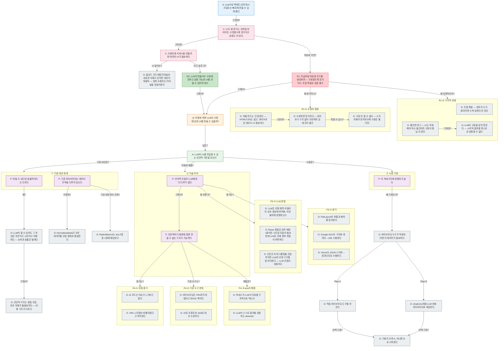

# AI 시대 이 프로젝트가 중요한 이유

## 피라미드

<!-- 이하 자동 생성 — 직접 수정 금지 -->

## 산문 검증

### Lv.1 핵심 주장

- LLM으로 백엔드/인프라/스크립트는 빠르게 만들 수 있게 됐다
- **그런데?** UI도 잘 만드는 것처럼 보이지만, 수정할수록 망가지고 검증도 안 된다
- **그런데?** 사용자향 서비스를 만들려면 여전히 UI가 필요하다
- **되고 싶은 건?** LLM이 만들어도 수정에 강하고 검증 가능한 UI를 만들 수 있어야 한다
- **그래서?** 어떻게 하면 LLM이 수정에 강한 UI를 만들 수 있을까?
- **답은?** LLM이 UI를 조립할 수 있는 선언적 기반을 닦는다
- **이대로 가면?** 지금처럼 자유형 코드를 생성하면 — 수정할수록 망가지고, 조합 폭발로 검증 불가
- **그래서?** 어떻게 하면 LLM이 수정에 강한 UI를 만들 수 있을까?

### Lv.2 논거 뼈대

- LLM으로 백엔드/인프라/스크립트는 빠르게 만들 수 있게 됐다
- **그런데?** UI도 잘 만드는 것처럼 보이지만, 수정할수록 망가지고 검증도 안 된다
- **그런데?** 사용자향 서비스를 만들려면 여전히 UI가 필요하다
- **되고 싶은 건?** LLM이 만들어도 수정에 강하고 검증 가능한 UI를 만들 수 있어야 한다
- **그래서?** 어떻게 하면 LLM이 수정에 강한 UI를 만들 수 있을까?
- **답은?** LLM이 UI를 조립할 수 있는 선언적 기반을 닦는다
  - **기존 대안은?** [① 기존 대안 한계]
  - **어떻게 해결?** [② 기술 우위]
  - **시장은?** [③ 시장 기회]
- **이대로 가면?** 지금처럼 자유형 코드를 생성하면 — 수정할수록 망가지고, 조합 폭발로 검증 불가
- **그래서?** 어떻게 하면 LLM이 수정에 강한 UI를 만들 수 있을까?
- **왜 망가지나?** [R1-① 수정의 함정]
- **왜 치명적인가?** [R1-② 구조적 한계]

### Lv.3 근거 전개

- LLM으로 백엔드/인프라/스크립트는 빠르게 만들 수 있게 됐다
- **그런데?** UI도 잘 만드는 것처럼 보이지만, 수정할수록 망가지고 검증도 안 된다
- **그런데?** 사용자향 서비스를 만들려면 여전히 UI가 필요하다
- **되고 싶은 건?** LLM이 만들어도 수정에 강하고 검증 가능한 UI를 만들 수 있어야 한다
- **그래서?** 어떻게 하면 LLM이 수정에 강한 UI를 만들 수 있을까?
- **답은?** LLM이 UI를 조립할 수 있는 선언적 기반을 닦는다
  - **기존 대안은?** [① 기존 대안 한계]
    - 만들 수 있다와 효율적이다는 다르다
    - 기존 라이브러리는 데이터 조작을 다루지 않는다
  - **어떻게 해결?** [② 기술 우위]
    - 선언적 조립이 LLM에게 더 다루기 쉽다
    - 선언적이기 때문에 잘못 만들 수 없는 구조가 가능하다
    - **그래서?** 선언적이기 때문에 잘못 만들 수 없는 구조가 가능하다
      - **증거는?** [P4-① 위험 증거]
      - **기존 도구는?** [P4-② 기존 도구 한계]
      - **해법은?** [P4-③ aria의 해법]
    - **왜 쉬운가?** [P3-① LLM 본질]
    - **증거는?** [P3-② 증거]
  - **시장은?** [③ 시장 기회]
    - 이 카테고리에 경쟁자가 없다
- **이대로 가면?** 지금처럼 자유형 코드를 생성하면 — 수정할수록 망가지고, 조합 폭발로 검증 불가
- **그래서?** 어떻게 하면 LLM이 수정에 강한 UI를 만들 수 있을까?
- **왜 망가지나?** [R1-① 수정의 함정]
- **왜 치명적인가?** [R1-② 구조적 한계]

### Lv.4 증거

- LLM으로 백엔드/인프라/스크립트는 빠르게 만들 수 있게 됐다
- **그런데?** UI도 잘 만드는 것처럼 보이지만, 수정할수록 망가지고 검증도 안 된다
- **그런데?** 사용자향 서비스를 만들려면 여전히 UI가 필요하다
- **UI 없이는?** 클로드 코드처럼 터미널로 성공한 사례도 있지만 대상이 개발자 — 일반 사용자는 터미널을 낯설어한다
- **되고 싶은 건?** LLM이 만들어도 수정에 강하고 검증 가능한 UI를 만들 수 있어야 한다
- **그래서?** 어떻게 하면 LLM이 수정에 강한 UI를 만들 수 있을까?
- **답은?** LLM이 UI를 조립할 수 있는 선언적 기반을 닦는다
  - **기존 대안은?** [① 기존 대안 한계]
    - 만들 수 있다와 효율적이다는 다르다
    - 기존 라이브러리는 데이터 조작을 다루지 않는다
    - **왜?** LLM이 할 수 있어도 그 작업은 토큰이고 시간이고 비용이다 — 능력과 효율은 별개다
    - **어떻게?** NormalizedData가 모든 데이터를 단일 형태로 통일한다
    - **기존 대안과의 관계?** Radix/BaseUI는 aria 5층 중 2층에 해당한다
  - **어떻게 해결?** [② 기술 우위]
    - 선언적 조립이 LLM에게 더 다루기 쉽다
    - 선언적이기 때문에 잘못 만들 수 없는 구조가 가능하다
    - **그래서?** 선언적이기 때문에 잘못 만들 수 없는 구조가 가능하다
      - **증거는?** [P4-① 위험 증거]
      - **기존 도구는?** [P4-② 기존 도구 한계]
      - **해법은?** [P4-③ aria의 해법]
    - **왜 쉬운가?** [P3-① LLM 본질]
    - **증거는?** [P3-② 증거]
  - **시장은?** [③ 시장 기회]
    - 이 카테고리에 경쟁자가 없다
    - **왜 기회인가?** 바이브코딩 도구가 작동하려면 이 레이어가 필요하다
- **이대로 가면?** 지금처럼 자유형 코드를 생성하면 — 수정할수록 망가지고, 조합 폭발로 검증 불가
- **그래서?** 어떻게 하면 LLM이 수정에 강한 UI를 만들 수 있을까?
- **왜 망가지나?** [R1-① 수정의 함정]
  - **그런데?** 수정하면 망가진다 — 유지보수 구조 없이 수정하면 금세 관리 불가
- **왜 치명적인가?** [R1-② 구조적 한계]
  - **그런데?** LLM이 고장을 감지 못한다 — 시각적 결과를 텍스트로 검증할 수 없다

### Lv.5 풀 트리

- LLM으로 백엔드/인프라/스크립트는 빠르게 만들 수 있게 됐다
- **그런데?** UI도 잘 만드는 것처럼 보이지만, 수정할수록 망가지고 검증도 안 된다
- **그런데?** 사용자향 서비스를 만들려면 여전히 UI가 필요하다
- **UI 없이는?** 클로드 코드처럼 터미널로 성공한 사례도 있지만 대상이 개발자 — 일반 사용자는 터미널을 낯설어한다
- **되고 싶은 건?** LLM이 만들어도 수정에 강하고 검증 가능한 UI를 만들 수 있어야 한다
- **그래서?** 어떻게 하면 LLM이 수정에 강한 UI를 만들 수 있을까?
- **답은?** LLM이 UI를 조립할 수 있는 선언적 기반을 닦는다
  - **기존 대안은?** [① 기존 대안 한계]
    - 만들 수 있다와 효율적이다는 다르다
    - 기존 라이브러리는 데이터 조작을 다루지 않는다
    - **왜?** LLM이 할 수 있어도 그 작업은 토큰이고 시간이고 비용이다 — 능력과 효율은 별개다
      - **그래서?** 선언적 구조는 중첩 조립 토큰 자체가 불필요하다 — 비용 구조가 다르다
    - **어떻게?** NormalizedData가 모든 데이터를 단일 형태로 통일한다
    - **기존 대안과의 관계?** Radix/BaseUI는 aria 5층 중 2층에 해당한다
  - **어떻게 해결?** [② 기술 우위]
    - 선언적 조립이 LLM에게 더 다루기 쉽다
    - 선언적이기 때문에 잘못 만들 수 없는 구조가 가능하다
    - **그래서?** 선언적이기 때문에 잘못 만들 수 없는 구조가 가능하다
      - **증거는?** [P4-① 위험 증거]
      - **기존 도구는?** [P4-② 기존 도구 한계]
      - **해법은?** [P4-③ aria의 해법]
    - **왜 쉬운가?** [P3-① LLM 본질]
    - **증거는?** [P3-② 증거]
  - **시장은?** [③ 시장 기회]
    - 이 카테고리에 경쟁자가 없다
    - **왜 기회인가?** 바이브코딩 도구가 작동하려면 이 레이어가 필요하다
      - **Plan A** 직접 바이브코딩 도구를 만든다
        - **선택 기준?** 기회가 오면 A, 아니면 B로 시작한다
      - **Plan B** shadcn/ui처럼 LLM 친화 라이브러리로 제공한다
        - **선택 기준?** 기회가 오면 A, 아니면 B로 시작한다
- **이대로 가면?** 지금처럼 자유형 코드를 생성하면 — 수정할수록 망가지고, 조합 폭발로 검증 불가
- **그래서?** 어떻게 하면 LLM이 수정에 강한 UI를 만들 수 있을까?
- **왜 망가지나?** [R1-① 수정의 함정]
  - **그런데?** 수정하면 망가진다 — 유지보수 구조 없이 수정하면 금세 관리 불가
    - **피할 수 있나?** 수정 안 할 수 없다 — 소프트웨어 유지보수에 수정은 불가피
- **왜 치명적인가?** [R1-② 구조적 한계]
  - **그런데?** LLM이 고장을 감지 못한다 — 시각적 결과를 텍스트로 검증할 수 없다

## 통계

📐 피라미드 현황: S1 C2 Q1 R11 R21 A1 P5 D27
📊 엣지: 31개

## 고아 노드

없음

## 갭

없음
