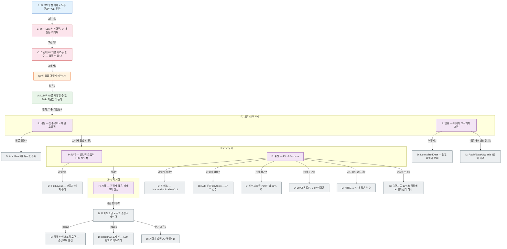

# AI 시대 이 프로젝트가 중요한 이유

## 피라미드

## 노드 목록

| ID | 타입 | 내용 | 연결 | 수평 |
|----|------|------|------|------|
| S1 | Situation | AI가 코드를 생성하는 시대. 모든 인프라가 CLI로 전환 중 — AI가 텍스트를 더 잘 다루기 때문 | → C1 | |
| C1 | Complication | UI는 본질적으로 LLM 비친화적이고, UI 개발은 더더욱 비친화적이다 | → C2 | |
| C2 | Complication | 그런데 UI 개발 니즈는 인간에게 필수 — 없앨 수 없다 | → Q1 | |
| Q1 | Question | 이 갭을 어떻게 메우나? | → A1 | |
| A1 | Answer | aria는 LLM이 UI를 개발할 수 있도록 기반을 닦는 프로젝트다 — CLI처럼 텍스트 전환이 아니라, UI라는 비친화적 영역을 LLM이 다룰 수 있는 형태로 재구성 | → P1, P2, P3 | |
| P1 | Proof | "할 수 있다"와 "매번 하는 게 효율적이다"는 다르다 — AI도 React를 써서 만드는 이유와 같다 | | 귀납 |
| P2 | Proof | Headless UI는 컴포넌트 행위만 — 데이터 조작(history/clipboard/crud)은 범위 밖. aria는 엔진+플러그인으로 데이터까지 소유 | → D2 | 귀납 |
| P3 | Proof | Headless UI의 hook 조립은 LLM 비친화적 — aria의 선언적 중첩/조립이 AI가 다루기 쉽다 | → D1 | 귀납 |
| D1 | Detail | FlatLayout — 중첩 JSX 대신 flat 엔티티 선언. 부품과 배치 분리. LLM이 노드를 스트리밍해도 조립 엔진이 유효한 DOM 생성 | | |
| D2 | Detail | NormalizedData — 어떤 외부 데이터든 transform 하나로 단일 형태 통일. engine/axis/plugin이 자동 작동 | | |
| P4 | Proof | LLM은 비결정적+조용한 에러가 가장 위험. aria는 Pit of Success — 잘못 만들 수 없는 구조로 품질을 구조적으로 보장 | | 귀납 |
| D3 | Detail | AI도 React를 직접 만들 수 있지만 React를 써서 만든다 — 비용 구조의 현실 증거 | | |
| D4 | Detail | 하네스 포함 시스템 — llms.txt + hooks + lint + CLI로 LLM이 우회 경로를 선택하는 것 자체를 차단 | | |
| D5 | Detail | LLM 친화적 devtools — LLM이 자기가 만든 결과를 검증할 수 있는 도구 | | |
| P5 | Proof | 시장에 5층 시스템 경쟁자 없음. 카테고리 선점 기회. FE 코드=상품, 바이브코딩 도구=팔릴 수 있는 도구 | → D7 | 귀납 |
| D6 | Detail | Radix/Base UI는 aria 시스템의 2층(엔진+UI 부품)에 해당. 경쟁이 아니라 포함 관계 | | |
| D7 | Detail | "짜잔하고 원하는 형태가 나오려면" 결정적 레이어가 필요 — 그 레이어가 aria | → D8, D9 | |
| D8 | Detail | Plan A: 직접 바이브 코딩 도구를 만든다. aria가 경쟁우위 엔진 | | |
| D9 | Detail | Plan B: shadcn/ui 포지션. LLM 친화적 라이브러리로 다른 도구들이 가져다 쓰게 | | |
| D10 | Detail | 분기 조건: 기회(투자/채용/파트너십)가 오면 A, 아니면 B. B를 하면서 A의 기회를 기다릴 수 있음 — B가 A의 포트폴리오 | | |
| D11 | Detail | [외부] AI 생성 코드는 인간 코드보다 1.7x 더 많은 주요 이슈 (CodeRabbit, 470 PR). 가드레일 없으면 6개월 내 버그 밀도 35-40% 증가 | P4→D11 | |
| D12 | Detail | [외부] 숙련 개발자가 AI 사용 시 실제로 19% 느려졌지만, 본인은 20% 빨라졌다고 느낌 — 체감/실제 괴리 | P4→D12 | |
| D13 | Detail | [외부] 바이브 코딩 도구(v0/Bolt/Lovable)는 70%까지 마법, 나머지 30%는 벽. 프로덕션 불가 | | |
| D14 | Detail | [외부] v0=프론트엔드만(shadcn/ui), Bolt=데모용 재작성 필요, Lovable=복잡해지면 벽 | | |

## 산문 검증

| # | 엣지 | 라벨 | 산문 | 판정 | 비고 |
|----|------|------|------|------|------|
| 1 | S1 → C1 | "그런데?" | "AI 코드생성 시대 — 그런데? — UI는 LLM 비친화적" | ✅ | 자연스러운 대비 |
| 2 | C1 → C2 | "그런데?" | "UI는 LLM 비친화적 — 그런데? — UI 개발 니즈는 필수" | ✅ | 자연스러운 전개 |
| 3 | C2 → Q1 | "그래서?" | "UI 개발 니즈는 필수 — 그래서? — 이 갭을 어떻게 메우나?" | ✅ | 자연스러운 질문 |
| 4 | Q1 → A1 | "답은?" | "이 갭을 어떻게 메우나? — 답은? — 기반을 닦는다" | ✅ | 자연스러운 해답 |
| 5 | A1 → G1 | "먼저, 기존 대안은?" | "기반을 닦는다 — 먼저, 기존 대안은? — 비용/범위 한계" | ✅ | 대비 구조: 약점 탐색 |
| 6 | G1 → G2 | "그래서 필요한 건?" | "기존 대안 한계 — 그래서 필요한 건? — 기술 우위(선언적 조립/품질보장)" | ✅ | 자연스러운 전개: 약 → 해결책 |
| 7 | G2 → G3 | "결국?" | "기술 우위 — 결국? — 시장 기회(경쟁자 없음)" | ✅ | 자연스러운 귀결: 기술 → 시장 |
| 8 | P5 → D7 | "어떤 형태로?" | "시장 기회 — 어떤 형태로? — 바이브코딩 도구의 결정적 레이어" | ✅ | 자연스러운 구체화 |
| 9 | D7 → D8 | "Plan A" | "결정적 레이어 — Plan A — 직접 바이브코딩 도구" | ✅ | 자연스러운 분기 옵션 1 |
| 10 | D7 → D9 | "Plan B" | "결정적 레이어 — Plan B — shadcn/ui 포지션 라이브러리" | ✅ | 자연스러운 분기 옵션 2 |
| 11 | D7 → D10 | "분기 조건?" | "결정적 레이어 — 분기 조건? — 기회가 오면 A, 아니면 B" | ✅ | 자연스러운 의사결정 기준 |
| 12 | P4 → D4 | "어떻게 차단?" | "Pit of Success — 어떻게 차단? — 하네스(llms.txt+hooks+lint+CLI)" | ✅ | 자연스러움. "차단"은 LLM의 우회 경로 차단 의미 |
| 13 | P4 → D5 | "어떻게 검증?" | "Pit of Success — 어떻게 검증? — LLM 친화 devtools" | ✅ | 자연스러운 검증 방법 |
| 14 | P4 → D13 | "현실 증거?" | "Pit of Success 필요 — 현실 증거? — 바이브코딩 70%마법 30%벽" | ✅ | 자연스러운 외부 증거 |
| 15 | P4 → D14 | "v0의 한계?" | "Pit of Success 필요 — v0의 한계? — v0=프론트만, Bolt=데모용" | ✅ | 자연스러운 기존 도구 한계 |
| 16 | P3 → D1 | "어떻게?" | "선언적 조립 LLM 친화 — 어떻게? — FlatLayout(부품/배치 분리)" | ✅ | 자연스러운 구체화 |
| 17 | P2 → D2 | "어떻게?" | "데이터 조작 포함 — 어떻게? — NormalizedData(단일 형태)" | ✅ | 자연스러운 구체화 |
| 18 | P2 → D6 | "기존 대안과의 관계?" | "데이터 조작 포함 — 기존 대안과의 관계? — Radix/BaseUI는 aria 2층에 해당" | ✅ | 자연스러운 포지셔닝 |
| 19 | P1 → D3 | "예를 들면?" | "비용 효율 — 예를 들면? — AI도 React를 써서 만든다" | ✅ | 자연스러운 구체 사례 |
| 20 | P1 → D11 | "데이터는?" | "비용 효율 — 데이터는? — AI코드 1.7x 더 많은 이슈" | ❌ | **라벨과 방향 모순**: "데이터는?"으로 P1(효율적)을 뒷받침하려는데, D11은 "더 많은 이슈"=**비효율**을 보여줌. 이는 P1을 거부하는 데이터. P1이 "낮은 질=높은 비용"을 의도했다면, D11은 증거가 될 수 있지만 P1 표현과 충돌. **개선**: (1) P1을 "낮은 질로 인한 숨겨진 비용"으로 재표현하고 라벨을 "비용 구조는?"로 변경, 또는 (2) 라벨을 "그런데 비용 구조는?"으로 명확히 하여 D11이 P1을 보충함을 명시 |
| 21 | P1 → D12 | "체감 vs 실제?" | "비용 효율 — 체감 vs 실제? — 숙련자 19% 느려짐, 20% 빨라졌다 착각" | ❌ | **라벨 질문과 답의 불일치**: "체감 vs 실제?"는 선의의 질문이지만, D12는 "착각의 위험"=**체감이 실제를 왜곡**함을 보여줌. 이는 P1("매번 효율적")을 **약화**시킴. **개선**: (1) P1을 "개발자는 효율적이라고 착각하지만 실제로는 비효율"로 재표현하고 D12를 연결하거나, (2) 라벨을 "위험: 착각이?"로 변경하여 P1의 함정을 명시, 또는 (3) D12를 P4(품질 보장)로 이동하여 "왜 Pit of Success가 필요한가"의 증거로 사용 |

**통계**: 19/21 ✅ (90.5%), 2/21 ❌ (9.5%)

## 정렬

- A1 → G1→G2→G3: **미괄식 체인** (점진 빌드업). 기존 한계(약) → 기술 우위(강) → 시장 기회(결론). 병렬이 아니라 체인으로 팬아웃 1.

## 고아 노드

재구성 시 연결이 끊긴 노드. 삭제하지 않고 보관 — 다른 곳에 연결되거나 새 피라미드의 재료가 될 수 있다.

| ID | 원래 타입 | 내용 | 비고 |
|----|----------|------|------|
| S2' | Situation | aria는 조작형 UI의 엔진을 만들고 있다 — ARIA/APG 기반, 키보드 우선, NormalizedData+Command 패턴 | S→C 연결이 부자연스러워 분리. A1의 전제에 가까움 |
| ~~S3'~~ | ~~Situation~~ | ~~AI도 React를 직접 만들 수 있지만 React를 써서 만든다~~ | → D3로 재배치 |
| S5' | Situation | UI 개발 니즈는 인간에게 필수 — 없앨 수 없다 | C2에 흡수됨 |
| C1' | Complication | AI가 생성하는 UI 코드는 "보이기만 하는" 수준이다 — 접근성, 키보드, 상태관리가 빠진 채로 나온다 | C1에 흡수됨. 더 구체적인 버전 |

## 갭

- [ ] P4 후보: 품질 보장 축 — AI가 aria 위에서 만들면 접근성/키보드가 자동 보장 (MECE 빈칸?)
- [ ] D: P1의 세부 없음 — 비용 축의 구체적 예시/수치. S3'를 D로 재활용?
- [x] 경쟁 구도 — Radix/BaseUI는 aria의 2층에 해당. 포함 관계. 카테고리 자체가 다름
- [x] 진짜 경쟁자 — 없음. 카테고리 선점
- [x] P1 D 채움 — D11(1.7x 이슈), D12(19% 느려짐) 외부 데이터
- [x] P4 D 채움 — D13(70% 벽), D14(v0/Bolt 한계) 외부 데이터
- [ ] P3 D 부족 — 형태 축 구체적 사례 (D1 외)
- [ ] S2'를 A1의 전제(P)로 재배치?
