# AI 시대 하네스 엔지니어링 특강

## 피라미드

```mermaid
graph TD
    %% ── 도입부 ──
    S1["S: FE 개발을 배운 취준생들이 AI 시대에 현업에 진입하려 한다"]
    S4["S: 작년까지만 해도 LLM은 보조도구, 내가 코딩하는게 메인이라는게 정배였다"]
    S2["S: LLM으로 개발하는 것이 기정사실화되고 있다"]
    C1["C: LLM 수준이 높아지면서 정말로 LLM만으로 코딩을 할 수 있게 되고 생산성이 높아진다는게 증명되고 있다"]
    C2["C: 원래는 코딩노동력이 필요해서 뽑았던 신입인데 그럴 필요가 줄어들면서 AI 시대에 주니어들에게는 새로운 채용 허들이 생겼다"]
    Q1["Q: 주니어도 AI를 활용해서 코딩하면 되지 않나요?"]

    S1 -->|"그런데"| S4
    S4 -->|"그런데"| S2
    S2 -->|"그래서"| C1
    C1 -->|"그래서"| C2
    C2 -->|"그래서"| Q1

    %% S3: 프레이밍용. 도입부 논증 체인에서 분리 — 특강 오프닝에서 사용
    S3["S: 나도 정답은 모르지만, AI를 실무에 더 많이 써본 경험은 있다"]
    S3 ~~~ Q1

    %% ── Q에서 R1/R2 분기 ──
    Q1 -->|"이렇게 하면?"| R1
    Q1 -->|"답은"| A1

    %% ── R1: 원하지 않는 결과 ──
    R1["R1: 하네스 없이 바이브 코딩만 하면, 만들수록 코드가 망가진다"]
    R1 -->|"왜?"| P4
    R1 -->|"왜?"| P5
    R1 -->|"왜?"| P6
    R1 -->|"왜?"| P7

    P4["P: 자연어는 모호함 그 자체인데, 개발은 하나라도 틀리면 안 돌아가는 0과 1의 세계다"]
    D3["D: 그런데도 돌아가는 건 인류가 쌓아온 추상화 계층 덕분이지, LLM이 잘해서가 아니다"]
    P4 -->|"그런데?"| D3

    P5["P: LLM은 비결정적 출력을 하도록 만들어졌다 — 결과의 방향성은 있지만 랜덤이고, 좋은 곳으로 수렴하도록 만들어진게 아니라서 반복하면 엔트로피가 높아진다"]
    D4["D: 디자인 없이 만들어달라고 하면 안 된다고 해야 하는데, LLM은 최선을 다해 만든다 — 토큰만 쪽쪽 빠져나간다"]
    P5 -->|"예를 들면?"| D4

    P6["P: 컨텍스트를 왕창 넣으면 해결될 줄 알았는데, 많이 넣을수록 오히려 바보가 된다"]
    D5["D: 골 픽세이션, 확증 편향, 자기 변호가 생긴다 — 주니어가 사회 초년기에 일 못하는 시행착오와 판박이다"]
    P6 -->|"구체적으로?"| D5

    P7["P: 내가 짠 코드를 내가 평가하면 잘했는지 못했는지 알 수 없다"]
    D6["D: 전임자가 못했나 보네요 — 그 전임자가 3분 전의 나라는 걸 모른다"]
    P7 -->|"예를 들면?"| D6

    %% 귀납: R1 → P4,P5,P6,P7 (독립 관찰)

    %% ── R2 = A: 원하는 결과 ──
    A1["A: 같은 AI를 써도 사람에 따라 효율이 다르기 때문이다"]

    %% A1의 근거: 왜 효율이 다른가
    A1 -->|"왜?"| P3
    A1 -->|"왜?"| P17

    P3["P: LLM은 예측 기계다 — 앞에 어떤 이야기를 넣느냐에 따라 뒤의 내용이 달라진다"]
    P3 -->|"구체적으로?"| P1
    P3 -->|"구체적으로?"| P2
    P1["P: 잘의 부재 — 숙련의 도달점이 있는 영역에서 평균만 출력한다"]
    P2["P: 좋은의 부재 — 취향이 갈리는 영역에서 판단을 못 한다"]
    P1 -->|"예를 들면?"| D2
    P2 -->|"예를 들면?"| D1
    D1["D: 랜딩페이지를 만들어달라고 하면 랜딩페이지처럼 생긴 걸 내놓지만, 제네릭하고 평범하다"]
    D2["D: 버그를 고쳐달라고 하면 에러는 사라지지만, 근본 원인이 아니라 증상만 패치한다"]

    P17["P: 좋은 Input을 잘 넣어줘야 원하는 것을 얻을 확률이 높아지는데, 이 두 축은 다른 능력이다"]
    P17 -->|"구체적으로?"| D25
    P17 -->|"구체적으로?"| D26
    D25["D: 좋은 Input = 경험에서 나온다. SOLID 같은 이론은 널렸지만 읽는다고 체화되지 않는다 — 주니어는 이걸 모른다"]
    D26["D: 잘 넣는 법 = 하네스 엔지니어링. 컨텍스트 많으면 압축하거나 새로 시작해라, 못 잡는 건 훅으로 잡아라 — 구체적이고 즉시 적용 가능하다"]
    D25 -->|"그래서"| A5
    D26 -->|"그래서"| A3

    %% P17이 A1→A3/A5의 다리. 안타깝게도 Input을 LLM이 넣으면 안 좋은 형태로 수렴 → R1과도 연결
    P17 -->|"안타깝게도"| P5

    %% A1에서 해법으로
    A1 -->|"그러면?"| A2
    A2["A: 그래도 안 쓸 수는 없다 — 캐즘을 넘긴 기술이고, 단순 코딩은 70-80% 작동하는 임계점을 돌파했다"]
    A2 -->|"왜?"| P18
    A2 -->|"왜?"| P19
    A2 -->|"근거는?"| D11
    A2 -->|"어떻게?"| A3
    A2 -->|"그래서 뭐가 남지?"| A5

    P18["P: 진화의 수레바퀴는 거꾸로 안 간다 — 쓸모와 편리를 이미 경험했다"]
    P18 -->|"예를 들면?"| D29
    D29["D: 이제 개발에서 필요한거 찾을때 구글을 잘 안간다. 아니 거의 안간다"]
    P19["P: 되는 것과 안 되는 것이 구분되기 시작했다 — 바이브 코딩이 가능한 영역이 생겼다"]
    P19 -->|"근거는?"| D30
    D30["D: SWE-bench 쉬운 문제는 78%쯤 풀리고 어려운 문제는 10-20%대 — 쉬운 건 되고 어려운 건 안 된다가 숫자로 보인다"]

    D11["D: SWE-bench 벤치마크 — 실제 GitHub 이슈를 AI가 해결하는 비율이 70-80%대에 도달했다"]

    %% ── A3: 하네스 엔지니어링 ──
    A3["A: 하네스 엔지니어링이다 — 내가 의도한 방향으로 수렴할 수 있게 해주는 장치. 스스로는 그쪽으로 갈 수 없으니까"]
    A3 -->|"수단은?"| D32
    A3 -->|"왜?"| P8
    A3 -->|"왜?"| P9
    A3 -->|"구체적으로?"| A4

    D32["D: 안 되는 것을 안 된다고 말하고, 지침과 규격으로 행동을 제한하는 것"]

    P8["P: 회사에 규칙이 없으면 어뷰저가 생기듯, LLM에 제약이 없으면 품질이 발산한다"]
    D7["D: 10시까지 오자는 약속이 아니라 지각하면 벌금이 규칙이다 — 단, 너무 빡빡하면 리추얼이 되어 토큰 소모처가 된다"]
    P8 -->|"예를 들면?"| D7

    P9["P: 반복되는 프롬프트를 매번 쓰게 하지 말고 함수처럼 한 번 작성해서 재사용한다 — 일관성의 문제"]
    P9 -->|"왜 함수인가?"| D27
    D27["D: AI의 처리량은 정해져 있다 — 컨텍스트+입력+출력이 같은 예산을 나눠 쓰므로, 컨텍스트를 늘리면 출력 품질이 줄어든다. 함수는 컨텍스트를 늘리��� 게 아니라 압축하는 것이다"]
    D27 -->|"즉"| P6

    A4["A: 계획과 실행을 분리하고, 컨텍스트를 의도적으로 제한해서 단계별로 시킨다"]
    A4 -->|"왜?"| P10
    A4 -->|"예를 들면?"| D8

    P10["P: 인턴을 부리듯 자료조사, 단순 테스트, 심미성 평가를 따로 시키면 실행 에이전트의 컨텍스트 소진을 막는다"]
    D8["D: 아이디어 → 계획 → 실행 → 평가, 이 순서를 워크플로로 고정한다 — 산출물이 있어야 다음 단계가 가능하다"]
    D9["D: 매번 말로 하다 보면 반복 패턴을 찾을 수 있다 — 그걸 스킬로 굳히고, 안티패턴을 발견하고, 벤치마킹으로 개선한다"]
    D8 -->|"그 다음?"| D9

    %% ── A5: 개발자에게 남는 것 ──
    %% 재배치: A5 자식 5→3, ①능력(P16→P11) ②태도(P12,P13) + D21 배경
    A5["A: AI 시대 개발자에게 남는 건 취향과 조예, 구조화와 설명 능력이다"]

    subgraph G1["①구조화 능력"]
        P16["P: 회사든 창업이든 둘 다에게 필요한 건 구조화 능력과 설명하는 능력 — 논리와 인과"]
        P11["P: 뭘 넣어야 하는지 아는 사람과 모르는 사람의 사고가 다르게 동작한다 — 틀려도 되니까 검색 대용, 대화상대로 생각정리가 된다"]
    end

    subgraph G2["②취향과 시행착오"]
        P12["P: 결혼정보회사가 후보를 줘도 선택은 내가 한다 — 그 판단을 남에게 미룰 건가?"]
        P13["P: 시행착오를 내가 해야 한다 — 기다린 사람에겐 노하우가 없다"]
    end

    A5 -->|"배경은?"| D21

    A5 -->|"먼저"| P16
    P16 -->|"구체적으로?"| P11

    A5 -->|"그리고"| P12
    P12 -->|"그리고"| P13
    D10["D: 기다리면 더 좋은 모델이 나오겠지라는 생각이 가장 위험한 함정이다 — 개발자들이 늘 새 프레임워크 나올까 봐 미루던 것과 같다"]
    P13 -->|"반론 차단"| D10

    %% ── 구 고아 → 연결 ──

    %% X1: 나영석 게임 → P3(예측 기계) 예시
    D12["D: 나영석 게임 — 겨울OO. LLM이 예측 기계라는 걸 가장 쉽게 설명하는 장치. 복선으로 이후 컨텍스트/하네스 설명에 재활용"]
    P3 -->|"예를 들면?"| D12

    %% X7: 바이브 코딩 → S2 구체화
    D13["D: 바이브 코딩 — 요청하면 코드가 나오는 세상"]
    S2 -->|"구체적으로?"| D13

    %% X8: 컨텍스트 엔지니어링 도구 → P6(컨텍스트 함정) 전단계
    D14["D: 컨텍스트 엔지니어링 시도 — claude.md, chain of thought 등 좋은 컨텍스트를 왕창 넣자는 접근"]
    P6 -->|"어떻게 시도했나?"| D14

    %% X9: 다양성/모르는 뇌 → P7(자기 평가 불가)의 해법 힌트 → A4로 연결
    P14["P: 인간이 함께 일하면 잘하는 이유는 다양성이다 — 모르는 뇌로 바라보면 새로운 시각이 나온다"]
    P7 -->|"해법은?"| P14
    P14 -->|"그래서?"| A4
    P14 -->|"원리는?"| D28
    D28["D: 자��가 한걸 자기가 평가하면 우호적으로 평가해. 사람도 그런데 AI도 그래. AI는 많이 본걸 따라가는 성향이 있으니까"]

    %% X10: 정보 안주고 시키기 → P10 확장
    D15["D: 일부러 정보를 안주고 일을 시키기 — 인턴·알바 수준이 되지만, 실행 에이전트의 컨텍스트 소진을 막는다. 이걸로 뭘 할 수는 없고 전달이 전부"]
    P10 -->|"구체적으로?"| D15

    %% X11: 대화상대 생각정리 → P11 예시
    D16["D: 대화상대가 생기면서 생각정리·문서 정리 수준으로 충분히 OK"]
    P11 -->|"예를 들면?"| D16

    %% X12: 특이점 안 옴 → A2 보강
    D17["D: 특이점은 오지 않았지만 임계점을 돌파했다 — 새로운 세상 2.0"]
    A2 -->|"단,"| D17

    %% X13: 촘촘/느슨/순서 → A4 조절법
    D18["D: 한번에 점프하나? 촘촘하게 느슨하게 순서바꿔서 — 워크플로 조절의 핵심"]
    A4 -->|"���절은?"| D18

    %% X14: 스킬 로드맵 → D9 다음
    D19["D: 로드맵 — 스킬을 만들자. 뭘? 실제로 나아지니?"]
    D9 -->|"착지점은?"| D19

    %% X15: 아무도 답 모른다 → P13(시행착오) 근거
    D20["D: 대 AI 하이프 시대 — AI 원리는 알지만 어떻게 해야 잘 하는지는 아무도 답을 모른다"]
    P13 -->|"왜?"| D20

    %% X16: 쉬운/어려운 구별 → A4 추가 근거
    P15["P: 쉬운 문제와 어려운 문제를 구별하는 감이 필요하다 — 없으면 템플릿 빈칸채우기로 구분 장치를 만든다"]
    A4 -->|"왜?"| P15
    P15 -->|"원리는?"| D31
    D31["D: 원리는 알아. 잘게 쪼개주면 시행착오 없이 일을 한다는 거잖아. 근데 어느 정도가 1턴이나 2턴만에 해결되는 수준인지는 감이야. 그 감이 경험"]

    %% X2: 개발자 역할 계층 → A5 배경
    D21["D: 개발자 역할 계층 — 불편→워크플로를 판다 / 쾌락 해킹 물건을 판다 / 서빙·유지보수 / 도구를 판다 / 인프라를 판다 / 복잡성을 줄인다"]
    A5 -->|"배경은?"| D21

    %% X3: 구조화+설명 → A5 추가 근거 (subgraph G1에서 선언됨, 연결도 위에서 완료)

    %% X4: 취향과 조예 갈래 → P12 확장
    D22["D: 개발자가 되고 싶다면 개발에 취향과 조예가 있어야 한다, 문제를 풀고 싶다면..."]
    P12 -->|"구체적으로?"| D22

    %% X5: 연애 비유 → P13 예시
    D23["D: 마치 연애 같은 것 — 방법은 많은데 내가 하면 안 되고, 남의 방식이 나한테 맞는다는 보장도 없다. 운도 환경도 시기도 방법도"]
    P13 -->|"예를 들면?"| D23

    %% X6: 패션 → P12 예시
    D24["D: 패션 — 취향을 가장 직관적으로 보여주는 비유"]
    P12 -->|"예를 들면?"| D24

    %% X17(개선 루프)은 D9에 이미 포함 — 합침
    %% X18(기다리면 무쓸모)은 D10에 이미 포함 — 합침

    %% ── 스타일: 신규 노드 ──
    style D12 fill:#eceff1,stroke:#455a64
    style D13 fill:#eceff1,stroke:#455a64
    style D14 fill:#eceff1,stroke:#455a64
    style P14 fill:#f3e5f5,stroke:#6a1b9a
    style D15 fill:#eceff1,stroke:#455a64
    style D16 fill:#eceff1,stroke:#455a64
    style D17 fill:#eceff1,stroke:#455a64
    style D18 fill:#eceff1,stroke:#455a64
    style D19 fill:#eceff1,stroke:#455a64
    style D20 fill:#eceff1,stroke:#455a64
    style P15 fill:#f3e5f5,stroke:#6a1b9a
    style D21 fill:#eceff1,stroke:#455a64
    style P16 fill:#f3e5f5,stroke:#6a1b9a
    style D22 fill:#eceff1,stroke:#455a64
    style D23 fill:#eceff1,stroke:#455a64
    style D24 fill:#eceff1,stroke:#455a64
    style P17 fill:#f3e5f5,stroke:#6a1b9a
    style D25 fill:#eceff1,stroke:#455a64
    style D26 fill:#eceff1,stroke:#455a64
    style P18 fill:#f3e5f5,stroke:#6a1b9a
    style P19 fill:#f3e5f5,stroke:#6a1b9a
    style D27 fill:#eceff1,stroke:#455a64
    style D28 fill:#eceff1,stroke:#455a64
    style D29 fill:#eceff1,stroke:#455a64
    style D30 fill:#eceff1,stroke:#455a64
    style D31 fill:#eceff1,stroke:#455a64
    style D32 fill:#eceff1,stroke:#455a64

    %% ── 스타일 ──
    style S1 fill:#e3f2fd,stroke:#1565c0
    style S2 fill:#e3f2fd,stroke:#1565c0
    style S3 fill:#e3f2fd,stroke:#1565c0
    style S4 fill:#e3f2fd,stroke:#1565c0
    style C1 fill:#fce4ec,stroke:#c62828
    style C2 fill:#fce4ec,stroke:#c62828
    style Q1 fill:#fff3e0,stroke:#e65100
    style R1 fill:#ffcdd2,stroke:#b71c1c
    style A1 fill:#e8f5e9,stroke:#2e7d32
    style A2 fill:#e8f5e9,stroke:#2e7d32
    style A3 fill:#e8f5e9,stroke:#2e7d32
    style A4 fill:#e8f5e9,stroke:#2e7d32
    style A5 fill:#e8f5e9,stroke:#2e7d32
    style P1 fill:#f3e5f5,stroke:#6a1b9a
    style P2 fill:#f3e5f5,stroke:#6a1b9a
    style P3 fill:#f3e5f5,stroke:#6a1b9a
    style P4 fill:#f3e5f5,stroke:#6a1b9a
    style P5 fill:#f3e5f5,stroke:#6a1b9a
    style P6 fill:#f3e5f5,stroke:#6a1b9a
    style P7 fill:#f3e5f5,stroke:#6a1b9a
    style P8 fill:#f3e5f5,stroke:#6a1b9a
    style P9 fill:#f3e5f5,stroke:#6a1b9a
    style P10 fill:#f3e5f5,stroke:#6a1b9a
    style P11 fill:#f3e5f5,stroke:#6a1b9a
    style P12 fill:#f3e5f5,stroke:#6a1b9a
    style P13 fill:#f3e5f5,stroke:#6a1b9a
    style D1 fill:#eceff1,stroke:#455a64
    style D2 fill:#eceff1,stroke:#455a64
    style D3 fill:#eceff1,stroke:#455a64
    style D4 fill:#eceff1,stroke:#455a64
    style D5 fill:#eceff1,stroke:#455a64
    style D6 fill:#eceff1,stroke:#455a64
    style D7 fill:#eceff1,stroke:#455a64
    style D8 fill:#eceff1,stroke:#455a64
    style D9 fill:#eceff1,stroke:#455a64
    style D10 fill:#eceff1,stroke:#455a64
    style D11 fill:#eceff1,stroke:#455a64
    style P1 fill:#f3e5f5,stroke:#6a1b9a
    style P2 fill:#f3e5f5,stroke:#6a1b9a
    style P3 fill:#f3e5f5,stroke:#6a1b9a
    style D1 fill:#eceff1,stroke:#455a64
    style D2 fill:#eceff1,stroke:#455a64
    style A1 fill:#e8f5e9,stroke:#2e7d32
```

<!-- 이하 자동 생성 — 직접 수정 금지 -->

## 산문 검증

### Lv.1 핵심 주장

- FE 개발을 배운 취준생들이 AI 시대에 현업에 진입하려 한다
- 나도 정답은 모르지만, AI를 실무에 더 많이 써본 경험은 있다
- **그런데** 작년까지만 해도 LLM은 보조도구, 내가 코딩하는게 메인이라는게 정배였다
- **그런데** LLM으로 개발하는 것이 기정사실화되고 있다
- **그래서** LLM 수준이 높아지면서 정말로 LLM만으로 코딩을 할 수 있게 되고 생산성이 높아진다는게 증명되고 있다
- **그래서** 원래는 코딩노동력이 필요해서 뽑았던 신입인데 그럴 필요가 줄어들면서 AI 시대에 주니어들에게는 새로운 채용 허들이 생겼다
- **그래서** 주니어도 AI를 활용해서 코딩하면 되지 않나요?
- **이렇게 하면?** 하네스 없이 바이브 코딩만 하면, 만들수록 코드가 망가진다
- **답은** 같은 AI를 써도 사람에 따라 효율이 다르기 때문이다
- **그러면?** 그래도 안 쓸 수는 없다 — 캐즘을 넘긴 기술이고, 단순 코딩은 70-80% 작동하는 임계점을 돌파했다
- **어떻게?** 하네스 엔지니어링이다 — 내가 의도한 방향으로 수렴할 수 있게 해주는 장치. 스스로는 그쪽으로 갈 수 없으니까
- **그래서 뭐가 남지?** AI 시대 개발자에게 남는 건 취향과 조예, 구조화와 설명 능력이다
- **구체적으로?** 계획과 실행을 분리하고, 컨텍스트를 의도적으로 제한해서 단계별로 시킨다

### Lv.2 논거 뼈대

- FE 개발을 배운 취준생들이 AI 시대에 현업에 진입하려 한다
- 나도 정답은 모르지만, AI를 실무에 더 많이 써본 경험은 있다
- **그런데** 작년까지만 해도 LLM은 보조도구, 내가 코딩하는게 메인이라는게 정배였다
- **그런데** LLM으로 개발하는 것이 기정사실화되고 있다
- **그래서** LLM 수준이 높아지면서 정말로 LLM만으로 코딩을 할 수 있게 되고 생산성이 높아진다는게 증명되고 있다
- **그래서** 원래는 코딩노동력이 필요해서 뽑았던 신입인데 그럴 필요가 줄어들면서 AI 시대에 주니어들에게는 새로운 채용 허들이 생겼다
- **그래서** 주니어도 AI를 활용해서 코딩하면 되지 않나요?
- **이렇게 하면?** 하네스 없이 바이브 코딩만 하면, 만들수록 코드가 망가진다
- **답은** 같은 AI를 써도 사람에 따라 효율이 다르기 때문이다
- **그러면?** 그래도 안 쓸 수는 없다 — 캐즘을 넘긴 기술이고, 단순 코딩은 70-80% 작동하는 임계점을 돌파했다
- **어떻게?** 하네스 엔지니어링이다 — 내가 의도한 방향으로 수렴할 수 있게 해주는 장치. 스스로는 그쪽으로 갈 수 없으니까
- **그래서 뭐가 남지?** AI 시대 개발자에게 남는 건 취향과 조예, 구조화와 설명 능력이다
- **구체적으로?** 계획과 실행을 분리하고, 컨텍스트를 의도적으로 제한해서 단계별로 시킨다

### Lv.3 근거 전개

- FE 개발을 배운 취준생들이 AI 시대에 현업에 진입하려 한다
- 나도 정답은 모르지만, AI를 실무에 더 많이 써본 경험은 있다
- **그런데** 작년까지만 해도 LLM은 보조도구, 내가 코딩하는게 메인이라는게 정배였다
- **그런데** LLM으로 개발하는 것이 기정사실화되고 있다
- **그래서** LLM 수준이 높아지면서 정말로 LLM만으로 코딩을 할 수 있게 되고 생산성이 높아진다는게 증명되고 있다
- **그래서** 원래는 코딩노동력이 필요해서 뽑았던 신입인데 그럴 필요가 줄어들면서 AI 시대에 주니어들에게는 새로운 채용 허들이 생겼다
- **그래서** 주니어도 AI를 활용해서 코딩하면 되지 않나요?
- **이렇게 하면?** 하네스 없이 바이브 코딩만 하면, 만들수록 코드가 망가진다
  - **왜?** 자연어는 모호함 그 자체인데, 개발은 하나라도 틀리면 안 돌아가는 0과 1의 세계다
  - **왜?** LLM은 비결정적 출력을 하도록 만들어졌다 — 결과의 방향성은 있지만 랜덤이고, 좋은 곳으로 수렴하도록 만들어진게 아니라서 반복하면 엔트로피가 높아진다
  - **왜?** 컨텍스트를 왕창 넣으면 해결될 줄 알았는데, 많이 넣을수록 오히려 바보가 된다
  - **왜?** 내가 짠 코드를 내가 평가하면 잘했는지 못했는지 알 수 없다
    - **해법은?** 인간이 함께 일하면 잘하는 이유는 다양성이다 — 모르는 뇌로 바라보면 새로운 시각이 나온다
- **답은** 같은 AI를 써도 사람에 따라 효율이 다르기 때문이다
  - **왜?** LLM은 예측 기계다 — 앞에 어떤 이야기를 넣느냐에 따라 뒤의 내용이 달라진다
    - **구체적으로?** 잘의 부재 — 숙련의 도달점이 있는 영역에서 평균만 출력한다
    - **구체적으로?** 좋은의 부재 — 취향이 갈리는 영역에서 판단을 못 한다
  - **왜?** 좋은 Input을 잘 넣어줘야 원하는 것을 얻을 확률이 높아지는데, 이 두 축은 다른 능력이다
- **그러면?** 그래도 안 쓸 수는 없다 — 캐즘을 넘긴 기술이고, 단순 코딩은 70-80% 작동하는 임계점을 돌파했다
  - **왜?** 진화의 수레바퀴는 거꾸로 안 간다 — 쓸모와 편리를 이미 경험했다
  - **왜?** 되는 것과 안 되는 것이 구분되기 시작했다 — 바이브 코딩이 가능한 영역이 생겼다
- **어떻게?** 하네스 엔지니어링이다 — 내가 의도한 방향으로 수렴할 수 있게 해주는 장치. 스스로는 그쪽으로 갈 수 없으니까
  - **왜?** 회사에 규칙이 없으면 어뷰저가 생기듯, LLM에 제약이 없으면 품질이 발산한다
  - **왜?** 반복되는 프롬프트를 매번 쓰게 하지 말고 함수처럼 한 번 작성해서 재사용한다 — 일관성의 문제
- **그래서 뭐가 남지?** AI 시대 개발자에게 남는 건 취향과 조예, 구조화와 설명 능력이다
  - **먼저** 회사든 창업이든 둘 다에게 필요한 건 구조화 능력과 설명하는 능력 — 논리와 인과
    - **구체적으로?** 뭘 넣어야 하는지 아는 사람과 모르는 사람의 사고가 다르게 동작한다 — 틀려도 되니까 검색 대용, 대화상대로 생각정리가 된다
  - **그리고** 결혼정보회사가 후보를 줘도 선택은 내가 한다 — 그 판단을 남에게 미룰 건가?
    - **그리고** 시행착오를 내가 해야 한다 — 기다린 사람에겐 노하우가 없다
- **구체적으로?** 계획과 실행을 분리하고, 컨텍스트를 의도적으로 제한해서 단계별로 시킨다
  - **왜?** 인턴을 부리듯 자료조사, 단순 테스트, 심미성 평가를 따로 시키면 실행 에이전트의 컨텍스트 소진을 막는다
  - **왜?** 쉬운 문제와 어려운 문제를 구별하는 감이 필요하다 — 없으면 템플릿 빈칸채우기로 구분 장치를 만든다

### Lv.4 증거

- FE 개발을 배운 취준생들이 AI 시대에 현업에 진입하려 한다
- 나도 정답은 모르지만, AI를 실무에 더 많이 써본 경험은 있다
- **그런데** 작년까지만 해도 LLM은 보조도구, 내가 코딩하는게 메인이라는게 정배였다
- **그런데** LLM으로 개발하는 것이 기정사실화되고 있다
  - **구체적으로?** 바이브 코딩 — 요청하면 코드가 나오는 세상
- **그래서** LLM 수준이 높아지면서 정말로 LLM만으로 코딩을 할 수 있게 되고 생산성이 높아진다는게 증명되고 있다
- **그래서** 원래는 코딩노동력이 필요해서 뽑았던 신입인데 그럴 필요가 줄어들면서 AI 시대에 주니어들에게는 새로운 채용 허들이 생겼다
- **그래서** 주니어도 AI를 활용해서 코딩하면 되지 않나요?
- **이렇게 하면?** 하네스 없이 바이브 코딩만 하면, 만들수록 코드가 망가진다
  - **왜?** 자연어는 모호함 그 자체인데, 개발은 하나라도 틀리면 안 돌아가는 0과 1의 세계다
    - **그런데?** 그런데도 돌아가는 건 인류가 쌓아온 추상화 계층 덕분이지, LLM이 잘해서가 아니다
  - **왜?** LLM은 비결정적 출력을 하도록 만들어졌다 — 결과의 방향성은 있지만 랜덤이고, 좋은 곳으로 수렴하도록 만들어진게 아니라서 반복하면 엔트로피가 높아진다
    - **예를 들면?** 디자인 없이 만들어달라고 하면 안 된다고 해야 하는데, LLM은 최선을 다해 만든다 — 토큰만 쪽쪽 빠져나간다
  - **왜?** 컨텍스트를 왕창 넣으면 해결될 줄 알았는데, 많이 넣을수록 오히려 바보가 된다
    - **구체적으로?** 골 픽세이션, 확증 편향, 자기 변호가 생긴다 — 주니어가 사회 초년기에 일 못하는 시행착오와 판박이다
    - **어떻게 시도했나?** 컨텍스트 엔지니어링 시도 — claude.md, chain of thought 등 좋은 컨텍스트를 왕창 넣자는 접근
  - **왜?** 내가 짠 코드를 내가 평가하면 잘했는지 못했는지 알 수 없다
    - **예를 들면?** 전임자가 못했나 보네요 — 그 전임자가 3분 전의 나라는 걸 모른다
    - **해법은?** 인간이 함께 일하면 잘하는 이유는 다양성이다 — 모르는 뇌로 바라보면 새로운 시각이 나온다
      - **원리는?** 자��가 한걸 자기가 평가하면 우호적으로 평가해. 사람도 그런데 AI도 그래. AI는 많이 본걸 따라가는 성향이 있으니까
- **답은** 같은 AI를 써도 사람에 따라 효율이 다르기 때문이다
  - **왜?** LLM은 예측 기계다 — 앞에 어떤 이야기를 넣느냐에 따라 뒤의 내용이 달라진다
    - **구체적으로?** 잘의 부재 — 숙련의 도달점이 있는 영역에서 평균만 출력한다
      - **예를 들면?** 버그를 고쳐달라고 하면 에러는 사라지지만, 근본 원인이 아니라 증상만 패치한다
    - **구체적으로?** 좋은의 부재 — 취향이 갈리는 영역에서 판단을 못 한다
      - **예를 들면?** 랜딩페이지를 만들어달라고 하면 랜딩페이지처럼 생긴 걸 내놓지만, 제네릭하고 평범하다
    - **예를 들면?** 나영석 게임 — 겨울OO. LLM이 예측 기계라는 걸 가장 쉽게 설명하는 장치. 복선으로 이후 컨텍스트/하네스 설명에 재활용
  - **왜?** 좋은 Input을 잘 넣어줘야 원하는 것을 얻을 확률이 높아지는데, 이 두 축은 다른 능력이다
    - **구체적으로?** 좋은 Input = 경험에서 나온다. SOLID 같은 이론은 널렸지만 읽는다고 체화되지 않는다 — 주니어는 이걸 모른다
    - **구체적으로?** 잘 넣는 법 = 하네스 엔지니어링. 컨텍스트 많으면 압축하거나 새로 시작해라, 못 잡는 건 훅으로 잡아라 — 구체적이고 즉시 적용 가능하다
- **그러면?** 그래도 안 쓸 수는 없다 — 캐즘을 넘긴 기술이고, 단순 코딩은 70-80% 작동하는 임계점을 돌파했다
  - **왜?** 진화의 수레바퀴는 거꾸로 안 간다 — 쓸모와 편리를 이미 경험했다
    - **예를 들면?** 이제 개발에서 필요한거 찾을때 구글을 잘 안간다. 아니 거의 안간다
  - **왜?** 되는 것과 안 되는 것이 구분되기 시작했다 — 바이브 코딩이 가능한 영역이 생겼다
    - **근거는?** SWE-bench 쉬운 문제는 78%쯤 풀리고 어려운 문제는 10-20%대 — 쉬운 건 되고 어려운 건 안 된다가 숫자로 보인다
  - **근거는?** SWE-bench 벤치마크 — 실제 GitHub 이슈를 AI가 해결하는 비율이 70-80%대에 도달했다
  - **단,** 특이점은 오지 않았지만 임계점을 돌파했다 — 새로운 세상 2.0
- **어떻게?** 하네스 엔지니어링이다 — 내가 의도한 방향으로 수렴할 수 있게 해주는 장치. 스스로는 그쪽으로 갈 수 없으니까
  - **수단은?** 안 되는 것을 안 된다고 말하고, 지침과 규격으로 행동을 제한하는 것
  - **왜?** 회사에 규칙이 없으면 어뷰저가 생기듯, LLM에 제약이 없으면 품질이 발산한다
    - **예를 들면?** 10시까지 오자는 약속이 아니라 지각하면 벌금이 규칙이다 — 단, 너무 빡빡하면 리추얼이 되어 토큰 소모처가 된다
  - **왜?** 반복되는 프롬프트를 매번 쓰게 하지 말고 함수처럼 한 번 작성해서 재사용한다 — 일관성의 문제
    - **왜 함수인가?** AI의 처리량은 정해져 있다 — 컨텍스트+입력+출력이 같은 예산을 나눠 쓰므로, 컨텍스트를 늘리면 출력 품질이 줄어든다. 함수는 컨텍스트를 늘리��� 게 아니라 압축하는 것이다
- **그래서 뭐가 남지?** AI 시대 개발자에게 남는 건 취향과 조예, 구조화와 설명 능력이다
  - **배경은?** 개발자 역할 계층 — 불편→워크플로를 판다 / 쾌락 해킹 물건을 판다 / 서빙·유지보수 / 도구를 판다 / 인프라를 판다 / 복잡성을 줄인다
  - **먼저** 회사든 창업이든 둘 다에게 필요한 건 구조화 능력과 설명하는 능력 — 논리와 인과
    - **구체적으로?** 뭘 넣어야 하는지 아는 사람과 모르는 사람의 사고가 다르게 동작한다 — 틀려도 되니까 검색 대용, 대화상대로 생각정리가 된다
      - **예를 들면?** 대화상대가 생기면서 생각정리·문서 정리 수준으로 충분히 OK
  - **그리고** 결혼정보회사가 후보를 줘도 선택은 내가 한다 — 그 판단을 남에게 미룰 건가?
    - **그리고** 시행착오를 내가 해야 한다 — 기다린 사람에겐 노하우가 없다
      - **반론 차단** 기다리면 더 좋은 모델이 나오겠지라는 생각이 가장 위험한 함정이다 — 개발자들이 늘 새 프레임워크 나올까 봐 미루던 것과 같다
      - **왜?** 대 AI 하이프 시대 — AI 원리는 알지만 어떻게 해야 잘 하는지는 아무도 답을 모른다
      - **예를 들면?** 마치 연애 같은 것 — 방법은 많은데 내가 하면 안 되고, 남의 방식이 나한테 맞는다는 보장도 없다. 운도 환경도 시기도 방법도
    - **구체적으로?** 개발자가 되고 싶다면 개발에 취향과 조예가 있어야 한다, 문제를 풀고 싶다면...
    - **예를 들면?** 패션 — 취향을 가장 직관적으로 보여주는 비유
- **구체적으로?** 계획과 실행을 분리하고, 컨텍스트를 의도적으로 제한해서 단계별로 시킨다
  - **왜?** 인턴을 부리듯 자료조사, 단순 테스트, 심미성 평가를 따로 시키면 실행 에이전트의 컨텍스트 소진을 막는다
    - **구체적으로?** 일부러 정보를 안주고 일을 시키기 — 인턴·알바 수준이 되지만, 실행 에이전트의 컨텍스트 소진을 막는다. 이걸로 뭘 할 수는 없고 전달이 전부
  - **예를 들면?** 아이디어 → 계획 → 실행 → 평가, 이 순서를 워크플로로 고정한다 — 산출물이 있어야 다음 단계가 가능하다
  - **���절은?** 한번에 점프하나? 촘촘하게 느슨하게 순서바꿔서 — 워크플로 조절의 핵심
  - **왜?** 쉬운 문제와 어려운 문제를 구별하는 감이 필요하다 — 없으면 템플릿 빈칸채우기로 구분 장치를 만든다
    - **원리는?** 원리는 알아. 잘게 쪼개주면 시행착오 없이 일을 한다는 거잖아. 근데 어느 정도가 1턴이나 2턴만에 해결되는 수준인지는 감이야. 그 감이 경험

### Lv.5 풀 트리

- FE 개발을 배운 취준생들이 AI 시대에 현업에 진입하려 한다
- 나도 정답은 모르지만, AI를 실무에 더 많이 써본 경험은 있다
- **그런데** 작년까지만 해도 LLM은 보조도구, 내가 코딩하는게 메인이라는게 정배였다
- **그런데** LLM으로 개발하는 것이 기정사실화되고 있다
  - **구체적으로?** 바이브 코딩 — 요청하면 코드가 나오는 세상
- **그래서** LLM 수준이 높아지면서 정말로 LLM만으로 코딩을 할 수 있게 되고 생산성이 높아진다는게 증명되고 있다
- **그래서** 원래는 코딩노동력이 필요해서 뽑았던 신입인데 그럴 필요가 줄어들면서 AI 시대에 주니어들에게는 새로운 채용 허들이 생겼다
- **그래서** 주니어도 AI를 활용해서 코딩하면 되지 않나요?
- **이렇게 하면?** 하네스 없이 바이브 코딩만 하면, 만들수록 코드가 망가진다
  - **왜?** 자연어는 모호함 그 자체인데, 개발은 하나라도 틀리면 안 돌아가는 0과 1의 세계다
    - **그런데?** 그런데도 돌아가는 건 인류가 쌓아온 추상화 계층 덕분이지, LLM이 잘해서가 아니다
  - **왜?** LLM은 비결정적 출력을 하도록 만들어졌다 — 결과의 방향성은 있지만 랜덤이고, 좋은 곳으로 수렴하도록 만들어진게 아니라서 반복하면 엔트로피가 높아진다
    - **예를 들면?** 디자인 없이 만들어달라고 하면 안 된다고 해야 하는데, LLM은 최선을 다해 만든다 — 토큰만 쪽쪽 빠져나간다
  - **왜?** 컨텍스트를 왕창 넣으면 해결될 줄 알았는데, 많이 넣을수록 오히려 바보가 된다
    - **구체적으로?** 골 픽세이션, 확증 편향, 자기 변호가 생긴다 — 주니어가 사회 초년기에 일 못하는 시행착오와 판박이다
    - **어떻게 시도했나?** 컨텍스트 엔지니어링 시도 — claude.md, chain of thought 등 좋은 컨텍스트를 왕창 넣자는 접근
  - **왜?** 내가 짠 코드를 내가 평가하면 잘했는지 못했는지 알 수 없다
    - **예를 들면?** 전임자가 못했나 보네요 — 그 전임자가 3분 전의 나라는 걸 모른다
    - **해법은?** 인간이 함께 일하면 잘하는 이유는 다양성이다 — 모르는 뇌로 바라보면 새로운 시각이 나온다
      - **원리는?** 자��가 한걸 자기가 평가하면 우호적으로 평가해. 사람도 그런데 AI도 그래. AI는 많이 본걸 따라가는 성향이 있으니까
- **답은** 같은 AI를 써도 사람에 따라 효율이 다르기 때문이다
  - **왜?** LLM은 예측 기계다 — 앞에 어떤 이야기를 넣느냐에 따라 뒤의 내용이 달라진다
    - **구체적으로?** 잘의 부재 — 숙련의 도달점이 있는 영역에서 평균만 출력한다
      - **예를 들면?** 버그를 고쳐달라고 하면 에러는 사라지지만, 근본 원인이 아니라 증상만 패치한다
    - **구체적으로?** 좋은의 부재 — 취향이 갈리는 영역에서 판단을 못 한다
      - **예를 들면?** 랜딩페이지를 만들어달라고 하면 랜딩페이지처럼 생긴 걸 내놓지만, 제네릭하고 평범하다
    - **예를 들면?** 나영석 게임 — 겨울OO. LLM이 예측 기계라는 걸 가장 쉽게 설명하는 장치. 복선으로 이후 컨텍스트/하네스 설명에 재활용
  - **왜?** 좋은 Input을 잘 넣어줘야 원하는 것을 얻을 확률이 높아지는데, 이 두 축은 다른 능력이다
    - **구체적으로?** 좋은 Input = 경험에서 나온다. SOLID 같은 이론은 널렸지만 읽는다고 체화되지 않는다 — 주니어는 이걸 모른다
    - **구체적으로?** 잘 넣는 법 = 하네스 엔지니어링. 컨텍스트 많으면 압축하거나 새로 시작해라, 못 잡는 건 훅으로 잡아라 — 구체적이고 즉시 적용 가능하다
- **그러면?** 그래도 안 쓸 수는 없다 — 캐즘을 넘긴 기술이고, 단순 코딩은 70-80% 작동하는 임계점을 돌파했다
  - **왜?** 진화의 수레바퀴는 거꾸로 안 간다 — 쓸모와 편리를 이미 경험했다
    - **예를 들면?** 이제 개발에서 필요한거 찾을때 구글을 잘 안간다. 아니 거의 안간다
  - **왜?** 되는 것과 안 되는 것이 구분되기 시작했다 — 바이브 코딩이 가능한 영역이 생겼다
    - **근거는?** SWE-bench 쉬운 문제는 78%쯤 풀리고 어려운 문제는 10-20%대 — 쉬운 건 되고 어려운 건 안 된다가 숫자로 보인다
  - **근거는?** SWE-bench 벤치마크 — 실제 GitHub 이슈를 AI가 해결하는 비율이 70-80%대에 도달했다
  - **단,** 특이점은 오지 않았지만 임계점을 돌파했다 — 새로운 세상 2.0
- **어떻게?** 하네스 엔지니어링이다 — 내가 의도한 방향으로 수렴할 수 있게 해주는 장치. 스스로는 그쪽으로 갈 수 없으니까
  - **수단은?** 안 되는 것을 안 된다고 말하고, 지침과 규격으로 행동을 제한하는 것
  - **왜?** 회사에 규칙이 없으면 어뷰저가 생기듯, LLM에 제약이 없으면 품질이 발산한다
    - **예를 들면?** 10시까지 오자는 약속이 아니라 지각하면 벌금이 규칙이다 — 단, 너무 빡빡하면 리추얼이 되어 토큰 소모처가 된다
  - **왜?** 반복되는 프롬프트를 매번 쓰게 하지 말고 함수처럼 한 번 작성해서 재사용한다 — 일관성의 문제
    - **왜 함수인가?** AI의 처리량은 정해져 있다 — 컨텍스트+입력+출력이 같은 예산을 나눠 쓰므로, 컨텍스트를 늘리면 출력 품질이 줄어든다. 함수는 컨텍스트를 늘리��� 게 아니라 압축하는 것이다
- **그래서 뭐가 남지?** AI 시대 개발자에게 남는 건 취향과 조예, 구조화와 설명 능력이다
  - **배경은?** 개발자 역할 계층 — 불편→워크플로를 판다 / 쾌락 해킹 물건을 판다 / 서빙·유지보수 / 도구를 판다 / 인프라를 판다 / 복잡성을 줄인다
  - **먼저** 회사든 창업이든 둘 다에게 필요한 건 구조화 능력과 설명하는 능력 — 논리와 인과
    - **구체적으로?** 뭘 넣어야 하는지 아는 사람과 모르는 사람의 사고가 다르게 동작한다 — 틀려도 되니까 검색 대용, 대화상대로 생각정리가 된다
      - **예를 들면?** 대화상대가 생기면서 생각정리·문서 정리 수준으로 충분히 OK
  - **그리고** 결혼정보회사가 후보를 줘도 선택은 내가 한다 — 그 판단을 남에게 미룰 건가?
    - **그리고** 시행착오를 내가 해야 한다 — 기다린 사람에겐 노하우가 없다
      - **반론 차단** 기다리면 더 좋은 모델이 나오겠지라는 생각이 가장 위험한 함정이다 — 개발자들이 늘 새 프레임워크 나올까 봐 미루던 것과 같다
      - **왜?** 대 AI 하이프 시대 — AI 원리는 알지만 어떻게 해야 잘 하는지는 아무도 답을 모른다
      - **예를 들면?** 마치 연애 같은 것 — 방법은 많은데 내가 하면 안 되고, 남의 방식이 나한테 맞는다는 보장도 없다. 운도 환경도 시기도 방법도
    - **구체적으로?** 개발자가 되고 싶다면 개발에 취향과 조예가 있어야 한다, 문제를 풀고 싶다면...
    - **예를 들면?** 패션 — 취향을 가장 직관적으로 보여주는 비유
- **구체적으로?** 계획과 실행을 분리하고, 컨텍스트를 의도적으로 제한해서 단계별로 시킨다
  - **왜?** 인턴을 부리듯 자료조사, 단순 테스트, 심미성 평가를 따로 시키면 실행 에이전트의 컨텍스트 소진을 막는다
    - **구체적으로?** 일부러 정보를 안주고 일을 시키기 — 인턴·알바 수준이 되지만, 실행 에이전트의 컨텍스트 소진을 막는다. 이걸로 뭘 할 수는 없고 전달이 전부
  - **예를 들면?** 아이디어 → 계획 → 실행 → 평가, 이 순서를 워크플로로 고정한다 — 산출물이 있어야 다음 단계가 가능하다
    - **그 다음?** 매번 말로 하다 보면 반복 패턴을 찾을 수 있다 — 그걸 스킬로 굳히고, 안티패턴을 발견하고, 벤치마킹으로 개선한다
      - **착지점은?** 로드맵 — 스킬을 만들자. 뭘? 실제로 나아지니?
  - **���절은?** 한번에 점프하나? 촘촘하게 느슨하게 순서바꿔서 — 워크플로 조절의 핵심
  - **왜?** 쉬운 문제와 어려운 문제를 구별하는 감이 필요하다 — 없으면 템플릿 빈칸채우기로 구분 장치를 만든다
    - **원리는?** 원리는 알아. 잘게 쪼개주면 시행착오 없이 일을 한다는 거잖아. 근데 어느 정도가 1턴이나 2턴만에 해결되는 수준인지는 감이야. 그 감이 경험

## 통계

📐 피라미드 현황: S4 C2 Q1 R11 R20 A5 K0 P19 D32
📊 엣지: 68개

## 고아 노드

| ID | 타입 | 내용 |
|----|------|------|
| S3 | Situation | 나도 정답은 모르지만, AI를 실무에 더 많이 써본 경험은 있다 |

## 갭

- [ ] ⚖️ A2(그래도 안 쓸 수는 없다 — 캐즘을 …) 아래 자식 6개 — 재배치 검토
