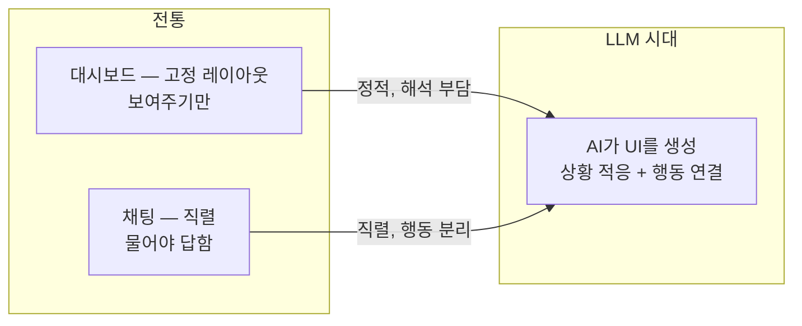
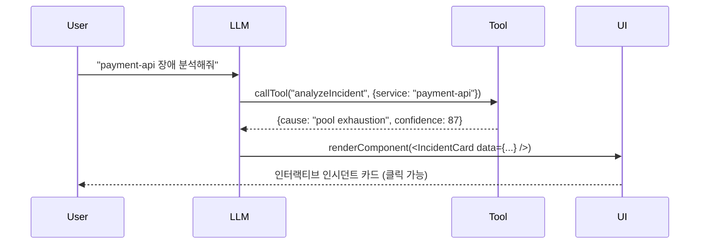
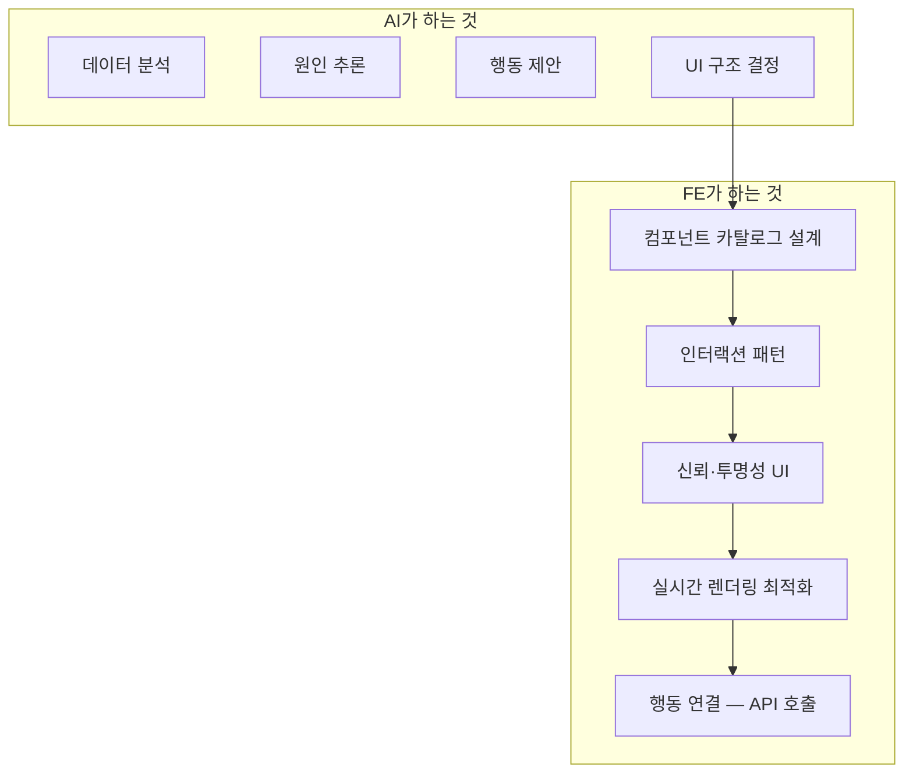

# LLM 시대의 UI 패러다임 — 채팅을 넘어서

> 작성일: 2026-03-25
> 맥락: 클라우드팀 FE로서 AI 기반 전사 도구를 제안하기 위해, "LLM 시대에 UI가 어떻게 변하고 있는가"를 조사

> **Situation** — LLM이 텍스트 분석·요약·추론을 해결하면서, 전통 대시보드의 "정보 정리" 역할이 약해졌다.
> **Complication** — 그런데 대부분의 AI UI는 여전히 "채팅 + 사이드 패널"에 머물러 있고, FE의 독점적 가치가 불분명하다.
> **Question** — 채팅을 넘어서는 AI UI 패러다임은 무엇이고, FE 전문가만이 제안할 수 있는 것은 무엇인가?
> **Answer** — 3개의 패러다임(Generative UI, Agentic UI, Ambient UI)이 부상 중이며, 핵심은 "AI가 UI를 생성하고, 사람은 의도만 전달하는" 구조다. FE의 역할은 이 생성된 UI의 품질·신뢰·행동 연결을 보장하는 것이다.

---

## Why — 왜 새로운 UI 패러다임이 필요한가

### 채팅의 한계

채팅 인터페이스는 LLM의 첫 번째 UI였지만 근본적 한계가 있다:

- **의도 표현 부담이 사용자에게 집중됨** — 뭘 물어야 하는지 아는 사람만 쓸 수 있다
- **직렬 구조** — 한 번에 하나만 보여줌, 동시 비교 불가
- **행동과 분리** — 분석 결과를 읽고, 다른 도구에서 실행해야 함
- **맥락 소실** — 긴 대화에서 앞의 내용을 잊음

### 전통 대시보드의 한계

반대로 대시보드는 "동시에 보여주는" 건 잘하지만:

- **고정 레이아웃** — 디자이너가 미리 결정, 상황 적응 불가
- **해석은 사람 몫** — 데이터를 보여줄 뿐, 의미는 사람이 파악
- **행동과 분리** — 여전히 대시보드에서 보고, 다른 곳에서 실행

---

## How — 3개의 부상하는 패러다임

### 1. Generative UI — AI가 컴포넌트를 생성

**정의:** LLM이 텍스트 대신 UI 컴포넌트를 직접 출력하는 것.

Google Research의 정의: "AI 모델이 콘텐츠뿐 아니라 전체 사용자 경험을 생성하는 것." 사용자 프롬프트에 맞춘 웹 페이지, 게임, 도구, 애플리케이션을 동적으로 만든다.

**3가지 구현 수준:**

| 수준 | 설명 | 예시 |
|------|------|------|
| **Static** | 미리 만든 컴포넌트 셋에서 선택 | Vercel AI SDK — tool → React 컴포넌트 매핑 |
| **Declarative** | 구조화된 UI 명세(JSON)로 생성 | Google A2UI — 컴포넌트 카탈로그에서 조합 |
| **Open-Ended** | 임의의 HTML/JS를 직접 생성 | Claude Artifacts — 전체 앱을 인라인 렌더링 |

**핵심 메커니즘 (Vercel AI SDK 기준):**
1. 개발자가 tool을 정의 (함수 + React 컴포넌트)
2. LLM이 맥락에 따라 어떤 tool을 호출할지 결정
3. tool 결과가 React 컴포넌트로 렌더링

### 2. Agentic UI — AI가 레이아웃을 결정

**정의:** 사용자가 목표를 말하면, 에이전트가 필요한 UI를 스스로 구성하는 것.

전통 UI와의 핵심 차이:

| 전통 UI | Agentic UI |
|--------|-----------|
| 사용자가 각 행동을 매핑 | 사용자가 결과를 말하면 에이전트가 경로 결정 |
| 개발자가 모든 상태를 미리 설계 | 에이전트가 상태에 따라 UI를 패치 |
| 고정 내비게이션 | 목표 기반 동적 흐름 |

**CopilotKit의 3가지 표면:**
- **Chat (Threaded):** 에이전트 응답이 카드/블록으로 인라인 표시
- **Chat+ (Co-Creator):** 채팅 + 동적 캔버스가 나란히
- **Chatless:** 에이전트가 API로 소통, 앱이 네이티브로 렌더링 — 대화 없이

**AG-UI 프로토콜:** CopilotKit이 주도하는 표준. SSE 기반 이벤트 프로토콜로, 에이전트 ↔ 프론트엔드 간 상태·의도·인터랙션을 양방향 스트리밍. Oracle, Google이 참여.

### 3. Ambient UI — AI가 맥락에 따라 자동 표시

**정의:** 사용자가 요청하지 않아도, AI가 현재 맥락에서 필요한 정보를 자동으로 시각화하는 것.

Claude의 최근 진화가 이 방향:
- **Artifacts (2024):** 사이드 패널에 코드/문서 생성 — "가져가서 쓰는 것"
- **Interactive Visuals (2026.03):** 대화 흐름 안에 인라인 시각화 — "그 자리에서 쓰는 것"

핵심 전환: "사용자가 아티팩트를 요청" → "AI가 시각화가 텍스트보다 낫다고 판단하면 자동 생성"

```mermaid
graph TB
  subgraph "진화 방향"
    A["채팅 (텍스트만)"]
    B["Artifacts (사이드 패널)"]
    C["Generative UI (인라인 컴포넌트)"]
    D["Ambient UI (자동 생성)"]
  end
  A -->|"사이드 패널 추가"| B
  B -->|"인라인으로 이동"| C
  C -->|"자동 트리거"| D

  style D fill:#1A2A3A,stroke:#2C84DB
```

---

## What — 실제 사례와 프로토콜 스택

### 2026년 AI 에이전트 프로토콜 스택

| 프로토콜 | 역할 | 주도 |
|---------|------|------|
| **MCP** | 에이전트 ↔ 외부 도구/데이터 연결 | Anthropic |
| **A2A** | 에이전트 ↔ 에이전트 통신 | Google |
| **AG-UI** | 에이전트 ↔ 프론트엔드 연결 | CopilotKit |
| **A2UI** | 에이전트가 생성하는 UI 명세 포맷 | Google |

FE 개발자에게 가장 중요한 건 **AG-UI + A2UI**: 에이전트가 프론트엔드와 소통하고, UI를 생성하는 표준.

### 실제 제품 사례

| 제품 | 패러다임 | FE가 하는 것 |
|------|---------|------------|
| **Claude Interactive Visuals** | Ambient | AI가 판단하여 인라인 시각화 자동 생성 |
| **Vercel v0** | Generative (Open-Ended) | 프롬프트 → 전체 React 앱 생성 |
| **CopilotKit CoAgents** | Agentic | 에이전트 상태 → React 훅으로 바인딩 |
| **Google A2UI** | Declarative | 에이전트가 JSON 명세 → 클라이언트가 네이티브 렌더링 |
| **ChatGPT Canvas** | Co-Creator | 대화 + 편집 캔버스 나란히 |

### A2UI의 핵심 설계: 보안 + 네이티브

A2UI는 에이전트가 임의의 HTML을 생성하지 않는다. 대신:
- **신뢰할 수 있는 컴포넌트 카탈로그**에서만 선택
- JSON 명세로 전달 → 클라이언트가 네이티브 렌더링
- 스타일링·보안은 클라이언트가 통제
- 멀티 플랫폼 (Web, Flutter, Angular, 네이티브 모바일)

이는 보안과 일관성을 유지하면서 에이전트에게 UI 생성 권한을 주는 균형점이다.

---

## If — 프로젝트/팀에 대한 시사점

### 인시던트 인터페이스에 적용한다면

현재 프로토타입 = 전통 대시보드 (고정 레이아웃 + AI 텍스트). 이것을 3가지 패러다임으로 전환하면:

| 패러다임 | 인시던트 UI 변환 |
|---------|----------------|
| **Generative** | LLM이 장애 유형에 따라 다른 컴포넌트를 선택·조합. DB 문제면 connection 그래프, 네트워크면 트레이스 맵 |
| **Agentic** | "장애 해결해줘" → 에이전트가 분석·시각화·행동을 순서대로 진행, 사람은 승인만 |
| **Ambient** | oncall이 터미널에서 작업하는 동안, 관련 메트릭·과거 사례가 자동으로 사이드에 표시 |

### FE 전문가의 독점적 역할

AI가 "무엇을 보여줄지" 결정하더라도:
1. **컴포넌트 카탈로그** — AI가 고를 수 있는 위젯 세트를 FE가 설계
2. **인터랙션 패턴** — 클릭·드릴다운·키보드 동작을 FE가 구현
3. **신뢰 UI** — confidence 표시, 추론 과정 투명화, 에러 핸들링
4. **행동 연결** — "Revert" 버튼이 실제 API를 호출하는 것

### 제안할 수 있는 구체적 아이템

| 아이템 | 패러다임 | 설명 |
|-------|---------|------|
| **Incident Copilot** | Agentic (Chatless) | 장애 감지 → 에이전트가 분석 + 대응 UI를 자동 구성, 사람은 승인 |
| **Ops Component Catalog** | Generative (Static) | 에이전트가 조합할 수 있는 운영 위젯 라이브러리 (메트릭 카드, 서비스 맵, 로그 뷰어) |
| **AG-UI Adapter** | 프로토콜 | 내부 AI 에이전트를 프론트엔드에 연결하는 표준 어댑터 |

---

## Insights

- **"Chatless"가 가장 강력한 패러다임일 수 있다**: CopilotKit의 3번째 표면. 대화 없이 에이전트가 API로 소통하고 앱이 네이티브로 렌더링. 인시던트 대응처럼 "빨리 행동해야 하는" 맥락에서는 채팅할 여유가 없다. Chatless agentic UI가 정답일 수 있다.

- **A2UI의 "컴포넌트 카탈로그" 모델이 FE의 새 역할을 정의한다**: AI가 UI를 생성하는 시대에 FE는 "화면을 만드는 사람"이 아니라 "AI가 고를 수 있는 위젯을 설계하는 사람"이 된다. 이건 디자인 시스템의 자연스러운 진화다.

- **프로토콜 전쟁이 시작됐다**: AG-UI, A2UI, MCP Apps — 모두 "에이전트가 UI를 어떻게 만드는가"를 표준화하려 한다. 2026년 현재 승자는 없지만, FE가 이 레이어에 일찍 올라타면 조직 내 기술 리더십을 확보할 수 있다.

- **Google 연구 결과: Generative UI가 텍스트를 압도한다**: 인간 평가자들이 Generative UI 출력을 일반 텍스트/마크다운 LLM 응답, 심지어 Google 검색 상위 결과보다 강하게 선호했다. "전문 디자이너가 만든 웹사이트"만이 더 높은 평가를 받았다.

---

## Sources

| # | 출처 | 유형 | 핵심 내용 |
|---|------|------|----------|
| 1 | [Vercel AI SDK — Generative UI](https://ai-sdk.dev/docs/ai-sdk-ui/generative-user-interfaces) | 공식 문서 | tool → React 컴포넌트 매핑으로 LLM이 UI를 생성하는 패턴 |
| 2 | [Google Research — Generative UI](https://research.google/blog/generative-ui-a-rich-custom-visual-interactive-user-experience-for-any-prompt/) | 연구 | AI가 전체 UX를 생성, 인간 평가에서 텍스트 응답을 압도 |
| 3 | [Google A2UI](https://developers.googleblog.com/introducing-a2ui-an-open-project-for-agent-driven-interfaces/) | 공식 블로그 | 에이전트가 신뢰 컴포넌트 카탈로그에서 UI를 조합하는 선언적 포맷 |
| 4 | [CopilotKit — Generative UI](https://www.copilotkit.ai/generative-ui) | 공식 문서 | Chat / Chat+ / Chatless 3가지 표면, AG-UI 프로토콜 |
| 5 | [AG-UI Protocol](https://docs.ag-ui.com/) | 프로토콜 스펙 | SSE 기반 에이전트 ↔ 프론트엔드 양방향 이벤트 프로토콜 |
| 6 | [Claude Interactive Visuals](https://www.mindstudio.ai/blog/claude-on-demand-generative-ui-vs-canvas-artifacts) | 분석 | Artifacts → Generative UI → Ambient 인라인 시각화 진화 |
| 7 | [Artium — Beyond Chat](https://artium.ai/insights/beyond-chat-how-ai-is-transforming-ui-design-patterns) | 블로그 | 채팅 너머 AI UI 패턴: 컨텍스트 블록, 거버너 요소, 마일스톤 마커 |
| 8 | [AI Agent Protocol Stack 2026](https://medium.com/@visrow/a2a-mcp-ag-ui-a2ui-the-essential-2026-ai-agent-protocol-stack-ee0e65a672ef) | 분석 | MCP + A2A + AG-UI + A2UI 4개 프로토콜 역할 분담 |

---

## Walkthrough

> 이 조사 결과를 프로젝트에서 직접 확인하려면?

1. **Vercel AI SDK Generative UI 데모** — `https://ai-sdk-preview-rsc-genui.vercel.app/`에서 tool → React 컴포넌트 렌더링 체험
2. **AG-UI 프로토콜 문서** — `https://docs.ag-ui.com/`에서 이벤트 구조와 상태 관리 패턴 확인
3. **현재 프로토타입과 비교** — `/incident` 라우트의 고정 레이아웃 vs Generative UI의 동적 컴포넌트 선택
4. **Chatless 패러다임 적용 시나리오** — 인시던트 알림 → 에이전트가 상황에 맞는 위젯을 자동 조합 → 사람은 승인만
