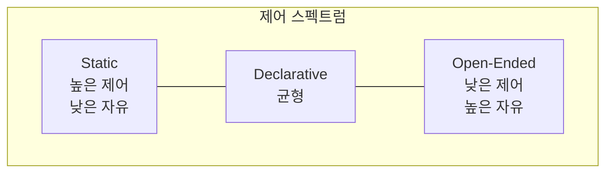

# Generative Interactive UI — AI가 만드는 인터랙티브 인터페이스

> 작성일: 2026-03-25
> 맥락: 채팅 블록 UI가 미래라는 결론 도출 후, "정적 블록을 넘어 인터랙티브 위젯을 생성하는" 실제 사례와 기술 조사

> **Situation** — Generative UI가 텍스트 대신 UI 컴포넌트를 출력하는 것으로 정착됨.
> **Complication** — 대부분의 구현은 정적 카드/테이블 수준이고, 클릭·드래그·실시간 데이터를 다루는 "인터랙티브" 수준은 아직 초기.
> **Question** — Gen Interactive UI의 실제 사례는 무엇이고, 어떤 기술 스택으로 구현되며, 어디까지 왔는가?
> **Answer** — 3개 계층(정적 → 선언적 → 오픈엔드)으로 진화 중이며, Thesys C1(전용 API), CopilotKit MCP Apps(iframe 샌드박스), Claude Interactive Visuals(인라인 HTML)가 대표 사례. 핵심은 "컴포넌트 카탈로그 + 상태 관리 + 이벤트 핸들링"을 AI에게 어디까지 맡기느냐의 스펙트럼.

---

## Why — 왜 "인터랙티브"가 중요한가

Generative UI의 1세대는 "텍스트 대신 카드를 보여주는" 수준이었다. 날씨 tool → 날씨 카드. 주식 tool → 차트 이미지. 이건 정적 렌더링이고, 사용자가 할 수 있는 건 "읽기"뿐이다.

진짜 가치는 **사용자가 생성된 UI와 상호작용**할 때 나온다:
- 차트의 특정 구간을 드래그해서 줌인
- 폼에 값을 입력해서 에이전트에게 피드백
- 버튼을 눌러서 실제 API 실행
- 테이블을 정렬/필터해서 데이터 탐색

```mermaid
graph LR
  subgraph "Gen UI 진화"
    A["1세대<br>정적 카드"]
    B["2세대<br>선언적 폼/테이블"]
    C["3세대<br>완전 인터랙티브"]
  end
  A -->|"읽기만"| B
  B -->|"입력+선택"| C
  style C fill:#1A2A3A,stroke:#2C84DB
```



---

## How — 3개 계층의 기술 구현

### 계층 1: Static (Controlled) — 미리 만든 컴포넌트 선택

| 항목 | 내용 |
|------|------|
| 원리 | 개발자가 React 컴포넌트 세트를 만들어 놓으면, 에이전트가 tool calling으로 선택 |
| 인터랙션 | 컴포넌트 내부 인터랙션만 가능 (미리 구현된 것) |
| 대표 | Vercel AI SDK, CopilotKit AG-UI |
| 장점 | 품질 보장, 보안, 디자인 일관성 |
| 한계 | 미리 안 만든 건 못 보여줌 |

### 계층 2: Declarative — JSON 명세로 UI 조합

| 항목 | 내용 |
|------|------|
| 원리 | 에이전트가 JSON으로 UI 구조를 기술 → 프론트가 네이티브로 렌더링 |
| 인터랙션 | 폼 입력, 버튼 클릭, 셀렉터 → 이벤트가 에이전트에게 돌아감 |
| 대표 | Google A2UI, Open-JSON-UI (OpenAI) |
| 장점 | 크로스플랫폼 (Web, Flutter, Angular), 보안 (임의 코드 실행 없음) |
| 한계 | 명세에 정의된 위젯만 사용 가능, 복잡한 인터랙션 표현 어려움 |

**A2UI vs Open-JSON-UI:**
- A2UI: 구조가 장황하지만 렌더링 정확. LLM이 생성하기 어려움
- Open-JSON-UI: 토큰 효율적, LLM이 생성하기 쉬움, 실패율 낮음

### 계층 3: Open-Ended — 전체 UI 직접 생성

| 항목 | 내용 |
|------|------|
| 원리 | LLM이 HTML/CSS/JS를 직접 생성 → iframe 샌드박스에서 실행 |
| 인터랙션 | 제한 없음 — 클릭, 드래그, 애니메이션, 실시간 데이터 |
| 대표 | Claude Interactive Visuals, CopilotKit MCP Apps, Thesys C1 |
| 장점 | 무한한 표현력, 사전 정의 불필요 |
| 한계 | 품질 불균일, 보안 위험 (샌드박스 필수), 스타일 불일치 |



---

## What — 실제 사례와 데모

### 1. Claude Interactive Visuals (2026.03)

- **형태:** 대화 인라인으로 HTML/SVG 인터랙티브 시각화 자동 생성
- **인터랙션:** 클릭(주기율표 원소), 조작(복리 계산 그래프), 애니메이션(물리 시뮬레이션)
- **특징:** Artifact와 달리 "임시" — 대화가 진행되면 변형/소멸. 별도 요청 없이 AI가 자동 판단하여 생성
- **기술:** HTML 직접 생성, 인라인 렌더링
- **링크:** claude.com/blog/claude-builds-visuals

### 2. Thesys C1 + Crayon SDK

- **형태:** OpenAI 호환 API가 텍스트 대신 구조화된 UI 컴포넌트를 반환
- **인터랙션:** 폼 입력, 버튼 클릭, 테이블 정렬, 차트 조작 — 모든 컴포넌트에 이벤트 핸들러 내장
- **특징:** Radix 프리미티브 + shadcn/ui 위에 구축, WCAG 접근성 준수
- **기술:** 6단계 파이프라인 (의도 분석 → LLM → 구조화 응답 → SDK 렌더링 → 스트리밍 표시)
- **데모:** demo.thesys.dev
- **플레이그라운드:** console.thesys.dev/playground

### 3. CopilotKit Generative UI (AG-UI + MCP Apps)

- **형태:** 3가지 표면 — Chat(인라인), Chat+(사이드 캔버스), Chatless(네이티브)
- **인터랙션:**
  - AG-UI(정적): 미리 만든 React 컴포넌트를 에이전트가 선택
  - A2UI(선언적): 캘린더, 폼, 리스트를 JSON으로 생성
  - MCP Apps(오픈엔드): Excalidraw 캔버스에서 다이어그램 편집, 저장, 실시간 내보내기
- **데모:** go.copilotkit.ai/gen-ui-demo
- **코드:** github.com/CopilotKit/generative-ui

### 4. Google Gemini Generative UI

- **형태:** Gemini 3 Pro가 HTML/CSS/JS를 직접 생성하여 브라우저에서 렌더링
- **인터랙션:** 패션 어드바이저, 인터랙티브 교육(프랙탈, 수학 게임), 분자 시각화, 갤러리
- **평가 결과:** 인간 평가에서 텍스트/마크다운 응답과 Google 검색 상위 결과를 모두 압도. 전문 디자이너 웹사이트만 더 높음
- **링크:** research.google/blog/generative-ui...

### 5. Flutter GenUI SDK

- **형태:** Gemini 또는 다른 LLM과 Flutter 위젯 시스템을 연결
- **특징:** 모바일 네이티브 인터랙티브 UI 생성, Material/Cupertino 위젯 사용
- **링크:** blog.flutter.dev/rich-and-dynamic-user-interfaces...

### 6. Microsoft Fabric Copilot Dashboard

- **형태:** 데이터 테이블 선택 → AI가 Real-Time Dashboard 자동 생성
- **인터랙션:** 실시간 데이터 바인딩, 필터, 드릴다운
- **특징:** 엔터프라이즈 BI 영역에서의 Generative Interactive UI

---

## If — 프로젝트에 대한 시사점

### interactive-os 컴포넌트 카탈로그와의 관계

현재 우리 논의: "에이전트가 골라 쓸 수 있는 블록 라이브러리"를 만든다. 이것은 정확히 **계층 1(Static/Controlled)** 모델이다.

| 계층 | 우리에게 의미 | 실행 가능성 |
|------|------------|-----------|
| **Static** | interactive-os UI 컴포넌트를 에이전트 tool로 등록 | 즉시 가능 — 기존 컴포넌트 활용 |
| **Declarative** | A2UI/Open-JSON-UI 렌더러를 만들어 에이전트가 JSON으로 UI 기술 | 중기 — 명세 파서 필요 |
| **Open-Ended** | LLM이 생성한 HTML을 iframe에서 실행 | 장기 — 보안 샌드박스 필요 |

### Thesys의 접근이 시사하는 것

Thesys는 Radix + shadcn/ui 위에 "AI가 선택할 수 있는 컴포넌트 카탈로그"를 구축했다. interactive-os가 같은 역할을 할 수 있다:

```
Thesys: Radix → shadcn/ui → Crayon → C1 API
우리:   Aria primitives → interactive-os UI → ???  → AI Agent
                                              ↑ 여기를 만드는 것
```

"???"에 해당하는 것 = **에이전트가 호출할 수 있는 tool 인터페이스 + 이벤트 콜백 시스템**

### 인시던트 인터페이스 프로토타입에 적용한다면

현재 프로토타입 = 정적 mock 데이터. 이것을 진짜 generative interactive로 바꾸려면:

1. 각 블록(LogViewer, MetricBar, CausalChain 등)을 AG-UI tool로 등록
2. 에이전트가 분석 진행 중 적절한 tool을 호출 → 블록이 스트리밍
3. 블록 내부 인터랙션(클릭, 드릴다운)이 에이전트에게 이벤트로 돌아감
4. 에이전트가 추가 분석 → 새 블록 생성

---

## Insights

- **Thesys가 "전용 LLM API"를 만든 이유:** 일반 LLM에 "UI 컴포넌트를 JSON으로 뱉어줘"라고 하면 실패율이 높다. Thesys는 LLM 자체를 UI 생성에 특화시킨 API(C1)를 만들었다. 이건 "범용 LLM + 프롬프트"가 아니라 "UI 생성 전용 모델"이라는 방향을 시사.

- **A2UI의 "토큰 비용" 문제가 Open-JSON-UI를 낳았다:** A2UI는 구조가 정확하지만 LLM이 생성하기 어렵고 토큰을 많이 소비. 이에 대한 반응으로 Open-JSON-UI가 등장 — 토큰 효율성과 LLM 생성 용이성 우선. 두 진영의 트레이드오프가 아직 해소되지 않음.

- **Claude Interactive Visuals의 "임시성"이 핵심 설계 결정:** Artifact = 영구물(다운로드/공유), Interactive Visual = 대화 중 임시(진행되면 변형/소멸). "인터랙티브하지만 영구적이지 않다"는 개념이 새로운 UI 카테고리를 정의.

- **"300개 팀이 Thesys를 사용 중":** Generative Interactive UI가 더 이상 컨셉이 아님. 프로덕션에서 쓰이고 있고, 전용 인프라(C1 API)가 사업이 되고 있음.

---

## Sources

| # | 출처 | 유형 | 핵심 내용 |
|---|------|------|----------|
| 1 | [Claude Interactive Visuals](https://claude.com/blog/claude-builds-visuals) | 공식 블로그 | 대화 인라인 인터랙티브 HTML 시각화, Artifact와 구분 |
| 2 | [Thesys C1 Architecture](https://www.thesys.dev/blogs/generative-ui-architecture) | 기술 블로그 | UI 생성 전용 API, 6단계 파이프라인, Crayon 디자인 시스템 |
| 3 | [Thesys Demo](https://demo.thesys.dev/) | 데모 | C1 API로 생성된 인터랙티브 UI 실제 사례 |
| 4 | [Thesys Playground](https://console.thesys.dev/playground) | 도구 | C1 API 직접 테스트 가능한 플레이그라운드 |
| 5 | [CopilotKit Generative UI](https://www.copilotkit.ai/generative-ui) | 공식 문서 | Static/Declarative/Open-ended 3계층, AG-UI 프로토콜 |
| 6 | [CopilotKit Gen UI Examples](https://github.com/CopilotKit/generative-ui) | 코드 | AG-UI, A2UI, MCP Apps 3가지 패턴 예제 코드 |
| 7 | [CopilotKit Gen UI Demo](https://go.copilotkit.ai/gen-ui-demo) | 데모 | 인터랙티브 generative UI 라이브 데모 |
| 8 | [Google Generative UI Research](https://research.google/blog/generative-ui-a-rich-custom-visual-interactive-user-experience-for-any-prompt/) | 연구 | Gemini 기반 전체 UX 생성, 인간 평가에서 텍스트 응답 압도 |
| 9 | [CopilotKit Guide 2026](https://www.copilotkit.ai/blog/the-developer-s-guide-to-generative-ui-in-2026) | 가이드 | 2026년 현재 Gen UI 프레임워크 전체 비교 |
| 10 | [Flutter GenUI](https://blog.flutter.dev/rich-and-dynamic-user-interfaces-with-flutter-and-generative-ui-178405af2455) | 공식 블로그 | 모바일 네이티브 Generative UI SDK |
| 11 | [AG-UI Generative UI Specs](https://docs.ag-ui.com/concepts/generative-ui-specs) | 스펙 | A2UI vs Open-JSON-UI 비교, AG-UI 위에서의 동작 |

---

## Walkthrough

> 이 주제를 직접 체험하려면?

1. **Thesys Playground** — console.thesys.dev/playground에서 프롬프트 입력 → 인터랙티브 UI 실시간 생성 체험
2. **CopilotKit Demo** — go.copilotkit.ai/gen-ui-demo에서 AG-UI + A2UI + MCP Apps 3가지 패턴 비교
3. **Claude Interactive Visuals** — claude.ai에서 "주기율표를 인터랙티브하게 보여줘" 입력 → 인라인 인터랙티브 시각화
4. **현재 프로토타입** — /incident 라우트에서 채팅 블록 + 컨텍스트 패널 구조 확인, Static 계층의 기초 형태
