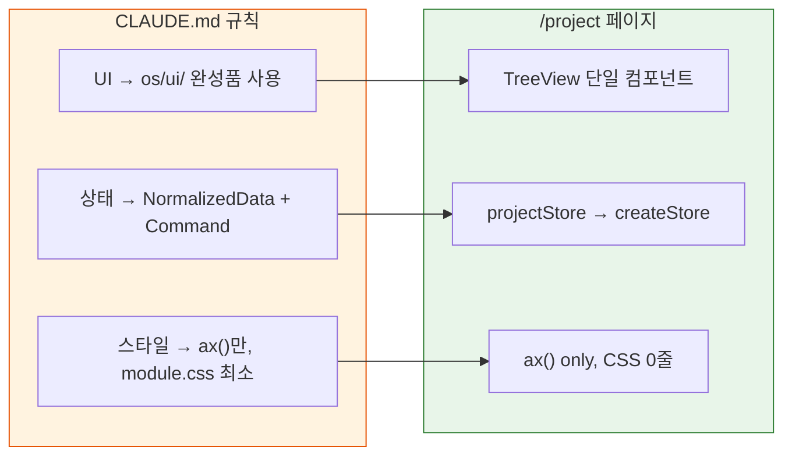
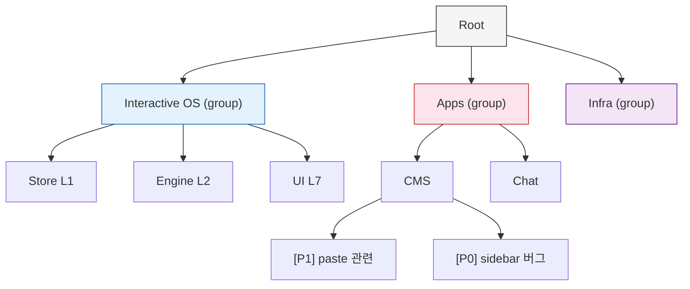
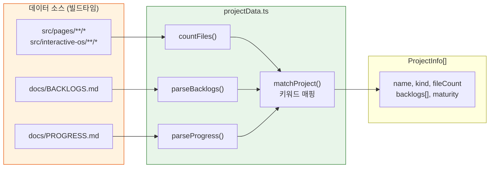
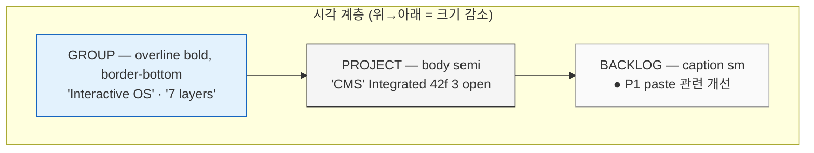
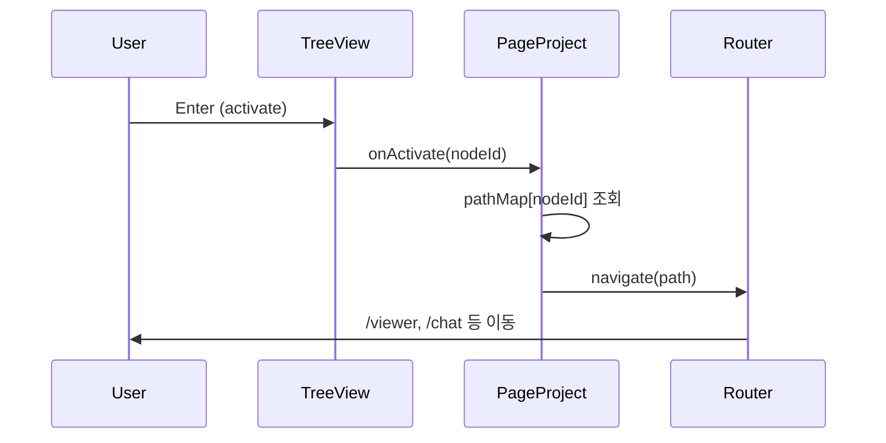

# /project 페이지 — 디자인 의사결정 근거

> 작성일: 2026-04-05
> 맥락: `/project` 라우트는 프로젝트 전체 조감도를 TreeView로 보여주는 내부 도구다

> - 3개 파일(data/store/page), custom CSS 0줄, os 컴포넌트만으로 구성된 최소 페이지
> - "프로젝트 메타데이터를 런타임에 추출하여 TreeView에 NormalizedData로 주입"하는 구조
> - 왜 이 형태가 되었는가?
> - os 레이어 검증 + 실제 개발 워크플로우 지원이라는 두 목적이 구조를 결정했다

---

## os 레이어의 실전 검증 도구가 필요했다

이 페이지의 1차 동기는 **os 기반 개발 원칙의 실증**이다.

프로젝트에는 CMS, Viewer, Chat 등 복잡한 앱이 이미 있지만, 이들은 역사적으로 축적된 코드라 os 원칙을 순수하게 따르지 않는 부분이 있다. `/project`는 **처음부터 os만으로 만든 페이지**로서, TreeView + NormalizedData + ax()의 조합이 실제로 동작함을 증명한다.

→ custom CSS가 0줄인 것은 "ax()로 충분하다"는 설계 가설의 직접적 증거다.

---

## TreeView를 선택한 이유: 데이터가 3계층 트리다

데이터 구조가 **Group → Project → Backlog** 3단이므로, ListBox(평면)가 아니라 TreeView(계층)가 자연스럽다.

| 대안 | 기각 이유 |
|------|----------|
| ListBox 평면 | 16+ 프로젝트를 그룹 없이 나열하면 os/app 구분 불가 |
| Grid/Table | 열이 적고(이름, 파일수, 백로그), 행 확장이 필요 → 트리가 적합 |
| Kanban | 상태(maturity)별 분류도 가능하나, 계층 관계를 잃음 |

초기 PRD는 ListBox를 고려했으나(`projectData.ts` 주석: "Project (ListBox item)"), 그룹 분리와 백로그 드릴다운 요구가 추가되면서 TreeView로 전환했다.

→ 컴포넌트 선택은 "데이터 형태가 결정한다"는 원칙을 따랐다.

---

## 데이터 추출 전략: import.meta.glob + 마크다운 파싱

**왜 DB나 API가 아닌 파일 시스템인가?** 이 프로젝트는 단일 개발자의 모노레포다. 파일 수는 `import.meta.glob`이 빌드타임에 알려주고, 백로그와 성숙도는 이미 마크다운으로 관리 중이다. 별도 인프라 없이 **이미 있는 것을 읽는다.**

키워드 매핑(`PROJECT_KEYWORDS`)은 97~124줄에 하드코딩되어 있다. 백로그 텍스트에 "CMS", "Viewer" 등의 키워드가 포함되면 해당 프로젝트에 자동 분류한다. 정확도보다 **zero-config**를 우선한 결정이다.

→ "데이터 모델 먼저, 상태관리 소멸" 피드백 원칙과 일치한다. 데이터가 이미 존재하므로 추출만 하면 된다.

---

## renderItem 3분기: 타입별 시각 계층을 ax()로 구분

renderItem은 `type` 필드로 3가지 렌더링을 분기한다:

| type | controlSize | textStyle | 시각 단서 |
|------|------------|-----------|----------|
| `group` | md | overline + bold | `border: 'bottom'`, 카운트 뱃지 |
| `project` | md | body + semi | maturity 컬러, fileCount, open/done 카운트 |
| `backlog` | sm | caption | StatusIndicator(P0=error, P1=warning, P2=info) |

**P0 표면화**: `hasP0 === true`면 프로젝트 이름이 `text: 'danger'`로 빨갛게 표시된다. 백로그를 열지 않아도 긴급한 프로젝트가 보인다. 이는 `/improve` 태스크에서 추가된 의사결정이다.

**maturity 컬러 매핑**: Concept=muted, Prototype=warning, Validated=accent, Integrated=success, Production=bright. chroma ladder 피드백 원칙(긴급도 = 채도)의 변형으로, 성숙도가 높을수록 밝아진다.

→ ax() 축 조합만으로 3계층 시각 분리가 가능함을 보여준다. module.css last-mile이 불필요했다.

---

## activate → navigate: TreeView가 런처가 된다

`pathMap`은 `projectStore.ts`에서 빌드 시 생성된다. 프로젝트 노드에만 경로가 있고, 그룹/백로그 노드는 무시된다.

이 결정의 근거: 프로젝트 목록을 보는 사람은 **곧 해당 프로젝트로 이동하고 싶다.** 조감도(read)와 이동(navigate)을 한 화면에서 해결한다. ActivityBar에서 `/project`로 오고, `/project`에서 각 앱으로 간다 — 허브 패턴이다.

→ TreeView의 activate 시맨틱이 "선택"이 아니라 "실행"인 점을 활용한 자연스러운 UX다.
