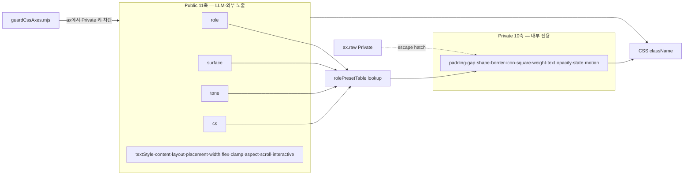
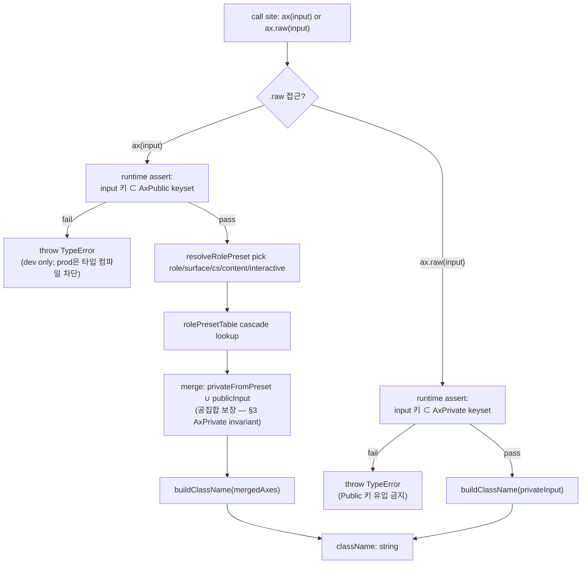
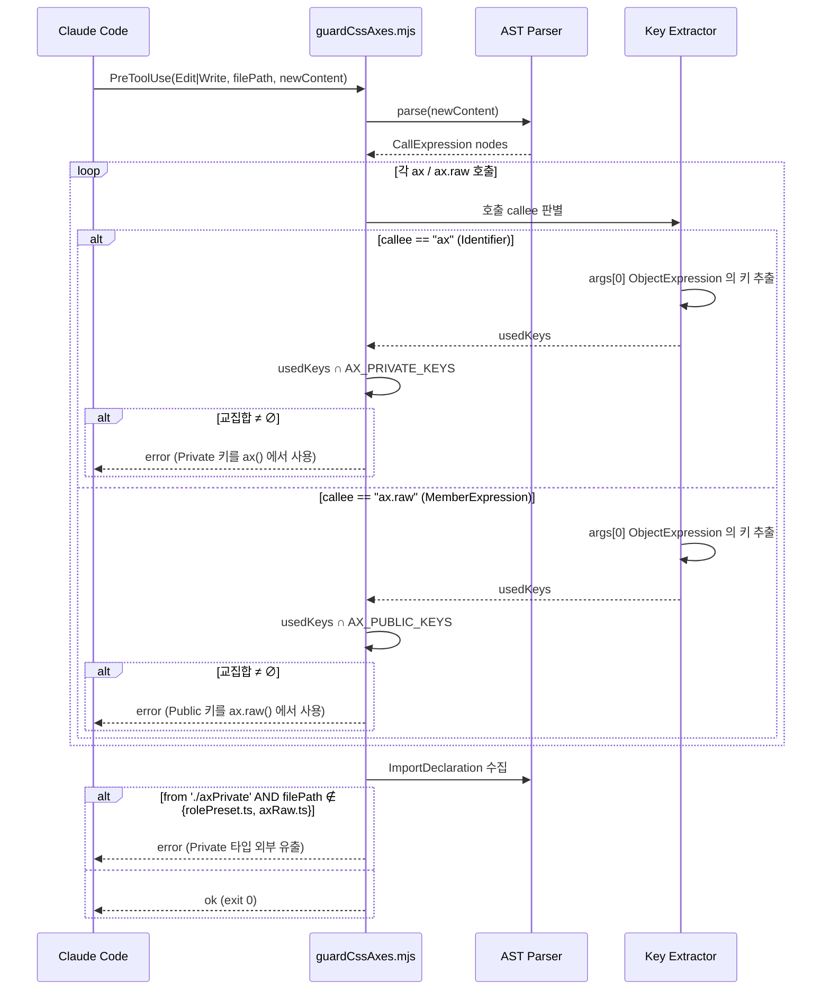
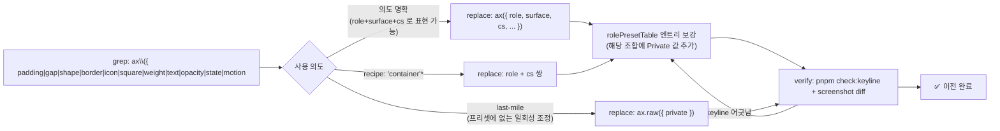

# ax Public/Private 2계층 분리 — Blueprint

> **Discussion**: 이번 세션 /discuss 결과 — ax 24축 → Public 3축 + Private 프리셋 주입
> **산출물 유형**: 엔진 / 리팩토링
> **규모 추정**: 파일 ~5개 신규, ~10개 수정, 마이그레이션 139 데모

## Discussion 13요소 요약

- **목적**: LLM 조합 오류 축소 + 축 변경 파급 축소
- **문제**: 24축이 동일 평면 → LLM 24차원 조합 오류 + 축 의미 변경 시 모든 사용처 영향
- **원인**: CSS 평면이 그대로 노출, 의도 계층(role)이 시각 계층 위에 서지 못함
- **제약**: ax() API 호환, DESIGN.md SSOT, @layer 구조 유지
- **보유 자산**: role/surface 축, guardCssAxes.mjs, DESIGN.md, `project_ax_combination_invariants`
- **외부 탐색**: shadcn cva, Radix data-attr 프리셋
- **해결**: Public 3축(cs/role/surface) + Private 축은 role 프리셋 주입 + `ax.raw()` escape hatch + guardCssAxes 차단 + LLM 프롬프트 Public만
- **부작용**: 139 데모 마이그레이션 비용, escape hatch 필요 → 수용
- **장애물**: Public/Private 감사, role enum 확정, role×surface 프리셋 초안, 린트 규칙

## §1 데이터 모델

> ax() 2계층 분리를 위한 타입 정의. 실제 `src/styles/ax.ts` 24축을 전수 감사하여 Public/Private 분류.

### 현 24축 감사 (src/styles/ax.ts 실측)

| 축 | 현 타입(요약) | 분류 | 근거 |
|---|---|---|---|
| `recipe` | `'container' \| 'container-sm'` | **제거(?)** | 주석: "레거시, role로 이전 중" — 프리셋으로 흡수 |
| `surface` | `'action' \| 'input' \| 'display' \| 'overlay' \| 'trap' \| 'ghost' \| 'placeholder' \| 'sunken' \| 'base' \| 'raised' \| 'inverted'` | **Public** | 표면(색/깊이) — 외부 의도 |
| `textStyle` | `'hero' \| 'display' \| 'page' \| 'section' \| 'label' \| 'body' \| 'caption' \| 'code' \| 'overline'` | **Public** | 텍스트 의도(별도 Public 축, role과 직교) |
| `tone` | `'accent' \| 'danger' \| 'success' \| 'warning' \| 'neutral'` + `-dim` 5종 | **Public** | 색 의미(shadcn variant에 대응) |
| `text` | `'bright' \| 'primary' \| 'secondary' \| 'muted'` | Private | 텍스트 contrast 단계 — tone/surface 프리셋 주입 |
| `weight` | `'medium' \| 'semi' \| 'bold'` | Private | textStyle 프리셋 주입. escape로 `ax.raw` |
| `state` | `'focused' \| 'selected'` | Private | interactive 축이 동적으로 주입 |
| `opacity` | `'dim' \| 'faint' \| 'hidden'` | Private | 비-disabled 시각 — tone 파생 |
| `motion` | `'pulse' \| 'spin' \| ...` 9종 | Private | 상태 파생 (loading/streaming 등 semantic role에서 주입) (?) |
| `content` | `'text' \| 'code' \| 'bubble' \| 'icon'` | **Public** | 콘텐츠 유형 — padding 비율 결정 의도 |
| `scroll` | `'hidden' \| 'y' \| 'x' \| 'auto'` | **Public** | 오버플로 의도 — layout과 직교 |
| `interactive` | `'item' \| 'tab' \| 'check' \| 'cell' \| 'input' \| 'button'` | **Public** | CLAUDE.md 규칙상 필수 축 — state/hover/focus 주입 |
| `border` | `'subtle' \| 'default' \| 'strong' \| 'dashed' \| 'ring'` + side | Private | surface 프리셋 주입 (독립 사용은 `ax.raw`) |
| `shape` | `'none' \| '2xs' \| 'xs' \| ... \| 'pill'` | Private | role/cs 프리셋 주입 |
| `placement` | 18종 (absolute/fixed/sticky 번들) | **Public** | 배치 의도 — 프리셋화 불가, 구조 축 |
| `layout` | `'row' \| 'stack' \| 'bar' \| 'grid-N' \| ...` 20+종 | **Public** | 구조 역할 — 조합 가능 |
| `gap` | `'xs' \| 'sm' \| 'md' \| 'lg' \| 'xl' \| '2xl'` | Private | layout+cs 프리셋 주입 |
| `padding` | `'none' \| 'xs' \| 'sm' \| 'md' \| 'lg' \| 'xl'` | Private | role+cs+content 프리셋 주입 |
| `width` | `'full' \| 'auto' \| 'fit' \| 'sm' \| 'md' \| 'lg' \| 'xl' \| 'prose'` | **Public** | 레이아웃 의도(스토리 수준) |
| `flex` | `'none' \| 'auto' \| '1'` | **Public** | 구조 축 — 부모-자식 관계 |
| `clamp` | `'1' \| '2' \| '3' \| '4' \| 'pre' \| 'scroll'` | **Public** | 콘텐츠 제한 의도 |
| `icon` | `'xs' \| 'sm' \| 'md' \| 'lg'` | Private | cs 프리셋 주입 |
| `square` | `'xs' \| 'sm' \| 'md' \| 'lg' \| 'xl' \| '2xl'` | Private | cs 프리셋 주입 |
| `role` | `'control' \| 'control-group' \| 'item' \| 'badge'` | **Public** | 의미적 역할 — 크기 SSOT (확장 후보: `'field' \| 'chip' \| 'card' \| 'panel'` ?) |
| `aspect` | `'1' \| 'video' \| 'card'` | **Public** | 종횡비 의도 |

**감사 결과**: Public 11축 / Private 10축 / 제거 후보 1축 (`recipe`) / 신규 1축 (`cs`).

> (?) Discussion 원문은 "Public 3축(cs/role/surface)"을 이상형으로 제시했으나, 실측 24축 중 `layout`/`placement`/`textStyle`/`tone`/`content`/`scroll`/`interactive`/`width`/`flex`/`clamp`/`aspect`는 CSS 하위축으로 흡수 불가능한 독립 의도 축이다. → Public은 "3축"이 아니라 "의도 층"이며 11축. Private 흡수 대상은 padding/gap/shape/radius/icon/square/weight/text/opacity/border/motion/state 계열.

### Public 축 타입

```ts
// Public 11축 — LLM 시스템 프롬프트·외부 사용자에게 노출
type AxPublic = {
  // 크기 SSOT (신규 — 기존 축의 'sm'|'md'|'lg' 공통 스케일을 승격)
  cs?: CsScale

  // 의미/색/표면 (shadcn cva의 variant 역할)
  role?: AxRole
  surface?: AxSurface
  tone?: AxTone

  // 콘텐츠 유형·텍스트 스타일 (textStyle은 role과 직교하는 타이포 축)
  textStyle?: AxTextStyle
  content?: AxContent

  // 구조 (흡수 불가 — 직교 축)
  layout?: AxLayout
  placement?: AxPlacement
  width?: AxWidth
  flex?: AxFlex
  clamp?: AxClamp
  aspect?: AxAspect
  scroll?: AxScroll

  // 인터랙티브 (state/focus/hover 주입 트리거)
  interactive?: AxInteractive
}

type CsScale     = 'xs' | 'sm' | 'md' | 'lg' | 'xl'
type AxRole      = 'control' | 'control-group' | 'item' | 'badge'
                 // 확장 후보: | 'field' | 'chip' | 'card' | 'panel' (?)
type AxSurface   = 'action' | 'input' | 'display' | 'overlay' | 'trap'
                 | 'ghost' | 'placeholder' | 'sunken' | 'base' | 'raised' | 'inverted'
type AxTone      = 'accent' | 'danger' | 'success' | 'warning' | 'neutral'
                 | 'accent-dim' | 'danger-dim' | 'success-dim' | 'warning-dim' | 'neutral-dim'
type AxTextStyle = 'hero' | 'display' | 'page' | 'section' | 'label'
                 | 'body' | 'caption' | 'code' | 'overline'
type AxContent   = 'text' | 'code' | 'bubble' | 'icon'
type AxLayout    = 'row' | 'center' | 'bar' | 'spread' | 'stack' | 'scroll' | 'scroll-x'
                 | 'fill' | 'row-fill' | 'wrap'
                 | 'grid-2' | 'grid-3' | 'grid-4' | 'grid-5' | 'grid-7' | 'table'
                 | 'self-start' | 'self-end' | 'self-center'
type AxPlacement = /* 18종, 기존 Placement 그대로 */ string
type AxInteractive = 'item' | 'tab' | 'check' | 'cell' | 'input' | 'button'
type AxWidth     = 'full' | 'auto' | 'fit' | 'sm' | 'md' | 'lg' | 'xl' | 'prose'
type AxFlex      = 'none' | 'auto' | '1'
type AxClamp     = '1' | '2' | '3' | '4' | 'pre' | 'scroll'
type AxAspect    = '1' | 'video' | 'card'
type AxScroll    = 'hidden' | 'y' | 'x' | 'auto'
```

### Private 축 타입 (프리셋 주입 대상)

```ts
// Private 10축 — ax({ role, surface, cs }) 가 내부에서 주입
// 직접 사용은 ax.raw()를 통해서만. guardCssAxes가 일반 ax()에서 차단.
type AxPrivate = {
  padding?: AxPadding   // 'none'|'xs'|'sm'|'md'|'lg'|'xl'
  gap?: AxGap           // 'xs'|'sm'|'md'|'lg'|'xl'|'2xl'
  shape?: AxShape       // 'none'|'2xs'|'xs'|'sm'|'md'|'lg'|'xl'|'pill'
  border?: AxBorder     // full + side 유지
  icon?: AxIcon         // 'xs'|'sm'|'md'|'lg'
  square?: AxSquare     // 'xs'|...|'2xl'
  weight?: AxWeight     // 'medium'|'semi'|'bold'
  text?: AxText         // 'bright'|'primary'|'secondary'|'muted'
  opacity?: AxOpacity   // 'dim'|'faint'|'hidden'
  state?: AxState       // 'focused'|'selected' — interactive 프리셋이 주입
  motion?: AxMotion     // 9종 — semantic state에서 주입 (?)
}

// recipe는 제거 (rolePreset으로 흡수)
```

### Role 프리셋 테이블 스키마

**키**: `role × surface × cs × (content?) × (interactive?)` — content/interactive는 있을 때만 분기.
**값**: `AxPrivate` 부분집합.

```ts
// 평탄 키 방식 (lookup 비용 O(1), 빈칸 감지 용이)
type RolePresetKey =
  | `${AxRole}.${AxSurface}.${CsScale}`
  | `${AxRole}.${AxSurface}.${CsScale}.${AxContent}`
  | `${AxRole}.${AxSurface}.${CsScale}.${AxInteractive}`

type RolePresetTable = Record<RolePresetKey, Partial<AxPrivate>>

// 해석 순서: 가장 구체 키 → 가장 일반 키로 fallback (cascade)
// 예) 'control.action.md.button' → 'control.action.md' → 'control.*.md' → 'control.*.*'

// 사용 예
const rolePreset: RolePresetTable = {
  'control.action.md':          { padding: 'sm', shape: 'md', gap: 'xs', weight: 'medium', text: 'bright' },
  'control.action.md.text':     { padding: 'sm' /* 2:1 inline */ },
  'control.action.md.icon':     { padding: 'xs' /* 1:1 square */ },
  'control.ghost.md':           { padding: 'sm', shape: 'md', text: 'secondary' },
  'control.input.md':           { padding: 'sm', shape: 'sm', border: 'default', text: 'primary' },
  'item.base.md':               { padding: 'sm', gap: 'sm' },
  'badge.accent.sm':            { padding: 'xs', shape: 'pill', weight: 'semi', text: 'bright' },
  // ... (역PRD 단계에서 실측 demo 139개 기반 확정)
}
```

### 관계도



### 불변식

| # | 불변식 | 반증 조건 |
|---|--------|---------|
| 1 | LLM 시스템 프롬프트·ui 공개 타입(`AriaComponentProps`)에 Private 10축 미노출 | 프롬프트/타입 선언 grep에 `padding\|gap\|shape\|border\|icon\|square\|weight\|text\|opacity\|state\|motion` 1건이라도 등장 |
| 2 | Public 축 조합(`ax({ role, surface, cs, ... })`)만으로 시각 완결 — 데모 렌더에 Private 주입 없이 keyline 통과 | `pnpm check:keyline` 실행 시 Private 축 누락으로 인한 시각 차이 발생 |
| 3 | `ax.raw()`는 Private 직접 지정의 유일 경로 | 일반 `ax()` 타입 시그니처가 Private 키를 허용하거나, `rolePreset` 외 경로로 Private CSS 클래스가 주입됨 |
| 4 | role/surface/cs 조합 변경은 `rolePresetTable` 단일 파일(`src/styles/rolePreset.ts`) 수정만으로 완료 | 다른 `.ts`/`.tsx`/`.css` 파일 수정 없이 demo 스샷이 바뀌지 않음 |
| 5 | `rolePresetTable`에 존재하는 모든 `AxRole × AxSurface × CsScale` 조합 엔트리 빈칸 0 | key coverage 테스트에서 미정의 조합 1건이라도 발견 |
| 6 | `guardCssAxes.mjs`는 `ax({ padding: ... })` 같은 Private 키 사용을 에러로 리포트 | 샘플 위반 코드에 가드 훅 실행 시 exit 0(통과) |
| 7 | `recipe` 축은 제거되고, 기존 `recipe: 'container'` 사용처는 모두 `role`+`cs` 쌍으로 치환 | `git grep "recipe:"` 결과 > 0 |

**완성도:** 🟢
**역PRD:** (구현 후 `src/styles/ax.ts::AxPublic`, `src/styles/rolePreset.ts::rolePresetTable`, `src/styles/ax.ts::ax.raw` 기입)

## §2 파일 맵

> §1의 `AxPublic`/`AxPrivate`/`RolePresetTable`/`ax.raw` 타입을 실제 파일에 배치. 기존 `src/styles/` 14파일(ax.ts/ax.css/tokens.css/palette.css/layers.css/layout.css/app.css/cms.css/inspect.css/interactive.css/landingTokens.css/reset.css/resizer.css/structure.css) 구조 유지. 파일명은 CLAUDE.md 규칙(파일명=주 export) 준수.

### 코어 (src/styles/)

| 경로 | 책임 | 신규/수정 | 재사용 | 역PRD |
|------|------|----------|--------|-------|
| `src/styles/ax.ts` | ax() 진입점. Public `Axes` 타입만 export, 내부에서 rolePreset 조회 후 Private 주입, CSS className 합성. `ax.raw` property 부착 | **수정** | 기존 ax() 204 LOC 골격 + `CLASS_MAP` | ⬜ |
| `src/styles/axPublic.ts` | §1 Public 11축 타입 정의 (`AxPublic`, `CsScale`, `AxRole`, `AxSurface`, `AxTone`, `AxTextStyle`, `AxContent`, `AxLayout`, `AxPlacement`, `AxInteractive`, `AxWidth`, `AxFlex`, `AxClamp`, `AxAspect`, `AxScroll`). ax.ts가 re-export | **신규** | — | ⬜ |
| `src/styles/axPrivate.ts` | §1 Private 10축 타입 정의 (`AxPrivate`, `AxPadding`, `AxGap`, `AxShape`, `AxBorder`, `AxIcon`, `AxSquare`, `AxWeight`, `AxText`, `AxOpacity`, `AxState`, `AxMotion`). rolePreset.ts와 axRaw.ts에서만 import | **신규** | — | ⬜ |
| `src/styles/rolePreset.ts` | `rolePresetTable: RolePresetTable` SSOT + `resolveRolePreset(public): Partial<AxPrivate>` cascade 해석 함수. `role.surface.cs[.content|.interactive]` 키 lookup | **신규** | — | ⬜ |
| `src/styles/axRaw.ts` | Escape hatch `axRaw(public, private): string`. ax.ts가 `ax.raw = axRaw` 로 부착. Private 축 직접 지정 유일 경로 | **신규** | ax.ts의 className 합성 로직 공유 | ⬜ |
| `src/styles/ax.css` | 기존 축별 CSS 클래스 (수정 없음, recipe 클래스만 제거) | **수정** | 기존 1170 LOC 전체 | ⬜ |

### 가드·린트 (.claude/hooks/)

| 경로 | 책임 | 신규/수정 | 재사용 | 역PRD |
|------|------|----------|--------|-------|
| `.claude/hooks/guardCssAxes.mjs` | 기존 CSS 축 검사에 **Private 키 차단** 규칙 추가 — `ax({ padding\|gap\|shape\|border\|icon\|square\|weight\|text\|opacity\|state\|motion: ... })` 패턴 탐지 시 error. `ax.raw({...})` 호출은 예외 허용 | **수정** | 기존 190 LOC 훅 | ⬜ |
| `.claude/hooks/guardAxCombinations.mjs` | `recipe:` 사용 시 error (제거 축) 추가 | **수정** | 기존 62 LOC 훅 | ⬜ |

### 문서·프롬프트

| 경로 | 책임 | 신규/수정 | 재사용 | 역PRD |
|------|------|----------|--------|-------|
| `docs/DESIGN.md` | Public 11축 / Private 10축 경계 명시, rolePreset cascade 규약, `ax.raw` escape 조건 추가 | **수정** | 기존 DESIGN.md (SSOT) | ⬜ |
| `src/interactive-os/CATALOG.md` | ax() 사용 가이드의 Private 축 언급 제거 (있을 경우) | **수정(확인)** | 기존 CATALOG | ⬜ |
| `docs/2-areas/styles/axLlmPrompt.md` | LLM 시스템 프롬프트용 Public 11축 어휘집 (신규 — 현 프로젝트에 dedicated LLM 프롬프트 파일 부재, Area 산출물로 생성) | **신규** | §1 타입 정의 | ⬜ |

### 마이그레이션 대상 (§7 역PRD에서 추적)

| 범주 | 규모 | 역PRD |
|------|------|-------|
| `src/**/*.tsx` 내 `recipe: 'container'\|'container-sm'` 사용처 | grep 후 LOC 기입 | ⬜ |
| 139 데모에서 Private 축 직접 사용 (`padding`/`gap`/`shape`/`border` 등) | grep 후 LOC 기입 | ⬜ |
| `src/interactive-os/ui/**` AriaComponentProps 타입의 Private 축 노출 감사 | 타입 선언 grep | ⬜ |

**반증 조건**: 파일 맵에 없는 경로에 구현이 나타나면 Blueprint 위반. 파일 맵의 신규 파일이 구현 후 생성 안 되면 위반. `src/styles/` 외 경로에 rolePresetTable이 분산되면 위반(§1 불변식 #4).

**완성도:** 🟢
**역PRD:** (구현 후 실제 생성/수정 파일 + LOC 기입)

## §3 Export 시그니처

> §1 데이터 모델 + §2 파일 맵 기반. 각 export는 `@invariant` 주석으로 반증 조건의 근거를 갖는다. 기존 `ax.ts::Axes` union은 `AxPublic` 으로 대체 — 현 호출부 중 Private 키(`padding/gap/shape/border/icon/square/weight/text/opacity/state/motion`) 를 직접 쓰는 사례는 §2 마이그레이션 대상으로 이전된다.

### `src/styles/axPublic.ts`

```ts
// §1 Public 11축 타입 SSOT — 여기서만 정의, 다른 파일은 import-only.
// LLM 시스템 프롬프트·ui 공개 타입(AriaComponentProps)이 바라보는 유일한 축 집합.

export type CsScale     = 'xs' | 'sm' | 'md' | 'lg' | 'xl'
export type AxRole      = 'control' | 'control-group' | 'item' | 'badge'
                        // 확장 후보: | 'field' | 'chip' | 'card' | 'panel' (?)
export type AxSurface   = 'action' | 'input' | 'display' | 'overlay' | 'trap'
                        | 'ghost' | 'placeholder' | 'sunken' | 'base' | 'raised' | 'inverted'
export type AxTone      = 'accent' | 'danger' | 'success' | 'warning' | 'neutral'
                        | 'accent-dim' | 'danger-dim' | 'success-dim' | 'warning-dim' | 'neutral-dim'
export type AxTextStyle = 'hero' | 'display' | 'page' | 'section' | 'label'
                        | 'body' | 'caption' | 'code' | 'overline'
export type AxContent   = 'text' | 'code' | 'bubble' | 'icon'
export type AxLayout    = 'row' | 'center' | 'bar' | 'spread' | 'stack' | 'scroll' | 'scroll-x'
                        | 'fill' | 'row-fill' | 'wrap'
                        | 'grid-2' | 'grid-3' | 'grid-4' | 'grid-5' | 'grid-7' | 'table'
                        | 'self-start' | 'self-end' | 'self-center'
export type AxPlacement =
  | 'above' | 'below' | 'bottom' | 'bottom-center' | 'center'
  | 'top-start' | 'top-end' | 'viewport' | 'sticky'
  | 'anchor-below' | 'anchor-below-start' | 'anchor-above' | 'anchor-end' | 'anchor-start'
  | 'relative'
  | 'float-top-start' | 'float-top-center' | 'float-bottom-center' | 'float-bottom'
export type AxInteractive = 'item' | 'tab' | 'check' | 'cell' | 'input' | 'button'
export type AxWidth     = 'full' | 'auto' | 'fit' | 'sm' | 'md' | 'lg' | 'xl' | 'prose'
export type AxFlex      = 'none' | 'auto' | '1'
export type AxClamp     = '1' | '2' | '3' | '4' | 'pre' | 'scroll'
export type AxAspect    = '1' | 'video' | 'card'
export type AxScroll    = 'hidden' | 'y' | 'x' | 'auto'

/**
 * Public 11축. ax()의 유일한 입력 형태. 외부 사용자·LLM 노출 표면.
 * @invariant Private 10축 키(padding/gap/shape/border/icon/square/weight/text/opacity/state/motion) 미포함
 * @invariant AriaComponentProps 등 ui 공개 타입은 AxPublic만 import
 */
export type AxPublic = {
  cs?: CsScale
  role?: AxRole
  surface?: AxSurface
  tone?: AxTone
  textStyle?: AxTextStyle
  content?: AxContent
  layout?: AxLayout
  placement?: AxPlacement
  width?: AxWidth
  flex?: AxFlex
  clamp?: AxClamp
  aspect?: AxAspect
  scroll?: AxScroll
  interactive?: AxInteractive
}
```

### `src/styles/axPrivate.ts`

```ts
// §1 Private 10축 — rolePreset.ts 와 axRaw.ts 에서만 import.
// ui/ 및 pages/ 에서 직접 import 금지 (guardCssAxes가 import 경로까지 확인).

export type AxPadding = 'none' | 'xs' | 'sm' | 'md' | 'lg' | 'xl'
export type AxGap     = 'xs' | 'sm' | 'md' | 'lg' | 'xl' | '2xl'
export type AxShape   = 'none' | '2xs' | 'xs' | 'sm' | 'md' | 'lg' | 'xl' | 'pill'

type BorderFull = 'subtle' | 'default' | 'strong' | 'dashed' | 'ring'
type BorderSide = 'bottom' | 'top' | 'start' | 'end'
export type AxBorder  = BorderFull | BorderSide

export type AxIcon    = 'xs' | 'sm' | 'md' | 'lg'
export type AxSquare  = 'xs' | 'sm' | 'md' | 'lg' | 'xl' | '2xl'
export type AxWeight  = 'medium' | 'semi' | 'bold'
export type AxText    = 'bright' | 'primary' | 'secondary' | 'muted'
export type AxOpacity = 'dim' | 'faint' | 'hidden'
export type AxState   = 'focused' | 'selected'
export type AxMotion  = 'pulse' | 'spin' | 'fade-in' | 'slide-up'
                      | 'fade-slide-in' | 'slide-in' | 'scale-in' | 'blink' | 'shimmer'

/**
 * Private 10축. rolePresetTable 값 + axRaw 입력 형태.
 * @invariant AxPublic 과 키 교집합 공집합 — Public/Private 이름 충돌 금지
 * @invariant ui/ 및 pages/ 파일에서 import 시 guardCssAxes가 error
 */
export type AxPrivate = {
  padding?: AxPadding
  gap?: AxGap
  shape?: AxShape
  border?: AxBorder
  icon?: AxIcon
  square?: AxSquare
  weight?: AxWeight
  text?: AxText
  opacity?: AxOpacity
  state?: AxState
  motion?: AxMotion
}
```

### `src/styles/rolePreset.ts`

```ts
import type {
  AxPublic, AxRole, AxSurface, CsScale, AxContent, AxInteractive,
} from './axPublic'
import type { AxPrivate } from './axPrivate'

/**
 * rolePresetTable 키 형식. cascade 해석 순서 = 구체 → 일반.
 * 'role.surface.cs.content' > 'role.surface.cs.interactive' > 'role.surface.cs' > (fallback 없음: #5 엔트리 빈칸 0)
 */
export type RolePresetKey =
  | `${AxRole}.${AxSurface}.${CsScale}`
  | `${AxRole}.${AxSurface}.${CsScale}.${AxContent}`
  | `${AxRole}.${AxSurface}.${CsScale}.${AxInteractive}`

/**
 * role × surface × cs × (content|interactive) → Private 값 cascade 테이블.
 * 단일 SSOT. §1 불변식 #4 — 조합 변경은 이 파일 수정만으로 완결.
 * @invariant 값은 Partial<AxPrivate> 만 — AxPublic 키 포함 금지 (test로 검증)
 * @invariant 모든 (AxRole × AxSurface × CsScale) 조합은 최소 하나의 엔트리 존재 (#5)
 */
export const rolePresetTable: Record<RolePresetKey, Partial<AxPrivate>>

/**
 * Public 입력에서 Private 값을 cascade 로 해석.
 * @invariant 반환은 Partial<AxPrivate> 키만 — AxPublic 키 미포함
 * @invariant 같은 입력에 대해 idempotent (순수 함수, 외부 상태 의존 금지)
 * @invariant rolePresetTable 에 키 없으면 {} 반환, throw 금지 (ax()에서 Public 축만으로도 렌더)
 */
export function resolveRolePreset(
  input: Pick<AxPublic, 'role' | 'surface' | 'cs' | 'content' | 'interactive'>,
): Partial<AxPrivate>
```

### `src/styles/axRaw.ts`

```ts
import type { AxPrivate } from './axPrivate'

/**
 * Escape hatch. Private 10축 직접 지정의 유일 경로.
 * ax.ts 가 `ax.raw = axRaw` 로 부착해 공개한다 (별도 named export 는 이 파일이 소유).
 * @invariant AxPublic 키 받지 않음 — Public 은 ax() 통해서만 (책임 분리)
 * @invariant guardCssAxes 는 ax.raw() 호출은 Private 키 허용, ax() 직접 호출은 금지
 * @invariant 반환 문자열 포맷은 ax() 와 동일 (prefix-value 공백 구분) — 혼용 시 충돌 없음
 */
export function axRaw(input: AxPrivate): string
```

### `src/styles/ax.ts`

```ts
import type { AxPublic } from './axPublic'
import { resolveRolePreset } from './rolePreset'
import { axRaw } from './axRaw'

// Public 타입 re-export — 외부 사용자는 'src/styles/ax' 한 경로만 본다.
export type {
  AxPublic, CsScale, AxRole, AxSurface, AxTone, AxTextStyle, AxContent,
  AxLayout, AxPlacement, AxInteractive, AxWidth, AxFlex, AxClamp, AxAspect, AxScroll,
} from './axPublic'

/**
 * ax() — Public 축만 받아 className 문자열 반환.
 * 내부에서 resolveRolePreset 을 호출해 Private 값을 합성하고, 두 집합의 prefix-value 를 공백으로 결합.
 * @invariant 입력 타입은 AxPublic — Private 키는 타입 수준에서 거부 (컴파일 에러)
 * @invariant 반환은 순수 문자열. React.JSX/style 객체 반환 금지
 * @invariant Public 축 개별 변경은 axPublic.ts 1곳, 조합 변경은 rolePreset.ts 1곳 (§1 #4)
 * @invariant 기존 ax() 호출부 중 Public 키만 쓰던 사례는 타입·런타임 모두 호환 (prefix 포맷 동일)
 */
export function ax(input: AxPublic): string

/**
 * Escape hatch — Private 축 직접 지정. axRaw.ts 의 함수를 부착.
 * @invariant ax.raw 는 axRaw 와 참조 동일 (const ax.raw === axRaw)
 */
export namespace ax {
  export const raw: typeof axRaw
}
// 구현: `ax.raw = axRaw` (런타임 부착, d.ts 는 namespace 로 표현)
```

### `.claude/hooks/guardCssAxes.mjs`

```ts
/**
 * PreToolUse 훅. Edit/Write 도구의 패치 대상 내용을 AST 수준으로 검사.
 * 기존 CSS 축 검사에 Public/Private 분리 규칙 3개 추가:
 *
 * 1) ax({ <PrivateKey>: ... }) 호출 → error
 *    대상 키 = padding|gap|shape|border|icon|square|weight|text|opacity|state|motion
 * 2) ax.raw({ <PublicKey>: ... }) 호출 → error (역방향 금지)
 *    대상 키 = cs|role|surface|tone|textStyle|content|layout|placement|width|flex|clamp|aspect|scroll|interactive
 * 3) `from './axPrivate'` import 가 src/styles/{rolePreset,axRaw}.ts 외 경로에서 발견 → error
 *
 * @invariant ax 와 ax.raw 는 AST 상 MemberExpression 으로 구분 (.raw 접근 여부)
 * @invariant 위반 샘플 1건 존재 시 exit code ≠ 0 — CI 실패
 * @invariant 기존 훅의 export 구조(default function / hook manifest) 유지
 */
export default function guardCssAxes(/* hook payload */): HookResult
```

**반증 조건**:
- §3에 없는 export 이름이 구현 파일에 등장 (예: `axPrivate.ts` 가 함수 export)
- ax() 시그니처가 `AxPublic` 외 타입을 받음 (union 확장, `& AxPrivate` 교차 등)
- ax({ padding: '...' }) 가 타입 에러 없이 통과
- `ax.raw` 가 axRaw 와 다른 함수 참조
- `rolePresetTable` 값에 AxPublic 키가 섞여 있음
- guardCssAxes 가 ax.raw() 의 Private 키 사용을 error 로 리포트 (허용되어야 함)

**완성도:** 🟢
**역PRD:** (구현 후 `src/styles/axPublic.ts::AxPublic`, `src/styles/axPrivate.ts::AxPrivate`, `src/styles/rolePreset.ts::rolePresetTable`, `src/styles/rolePreset.ts::resolveRolePreset`, `src/styles/axRaw.ts::axRaw`, `src/styles/ax.ts::ax`, `src/styles/ax.ts::ax.raw`, `.claude/hooks/guardCssAxes.mjs::default` 기입)

## §4 흐름

> §3 export 시그니처를 실제 실행 순서로 고정. 이 섹션에 없는 경로는 구현 금지(반증 조건).

### 4.1 핵심 control flow



**반증 조건**: 다이어그램에 없는 노드/엣지가 구현에 등장하면 위반. 특히 `ax()` → `axRaw()` 직접 호출, `resolveRolePreset` → `buildClassName` 스킵(프리셋 없이 Public만 빌드)이 경로로 등장하면 위반.

### 4.2 ax() pseudo-code

```ts
function ax(input: AxPublic): string {
  // 1) 런타임 assert — Private 키 혼입 차단 (prod 은 타입으로 차단, dev 안전망)
  //    §3 invariant "ax()는 AxPublic 외 타입을 받지 않는다"
  assertKeysSubsetOf(input, AX_PUBLIC_KEYS)

  // 2) rolePreset cascade — role/surface/cs[.content|.interactive]
  //    §3 invariant "미존재 시 {} 반환, throw 금지"
  const priv: Partial<AxPrivate> = resolveRolePreset({
    role:         input.role,
    surface:      input.surface,
    cs:           input.cs,
    content:      input.content,
    interactive:  input.interactive,
  })

  // 3) merge — Public 키는 그대로, Private 키는 preset 값만
  //    §1 invariant #4 "조합 변경은 rolePreset.ts 단일 수정"
  //    §3 invariant "AxPublic ∩ AxPrivate = ∅" → 병합 충돌 불가
  const merged = { ...priv, ...input }  // Public 입력이 preset 을 덮지 않음(공집합 보장)

  // 4) className 합성 — prefix-value 공백 구분
  //    §3 invariant "반환은 순수 문자열"
  return buildClassName(merged)
}
```

**반증 조건**: 단계 1→2→3→4 순서 역전(예: merge 후 assert, resolve 전 buildClassName) 시 위반. 단계 3의 spread 방향이 `{ ...input, ...priv }` 로 뒤집혀 Public 이 Private 에 덮이면 위반.

### 4.3 resolveRolePreset cascade pseudo-code

```ts
function resolveRolePreset(
  x: Pick<AxPublic, 'role' | 'surface' | 'cs' | 'content' | 'interactive'>,
): Partial<AxPrivate> {
  // A) 필수 3축 없으면 early return {}
  //    §3 invariant "throw 금지, {} 반환"
  if (!x.role || !x.surface || !x.cs) return {}

  // B) 키 후보 생성 — 구체 → 일반
  //    §1 "'role.surface.cs.content' > 'role.surface.cs.interactive' > 'role.surface.cs'"
  const keys: RolePresetKey[] = []
  if (x.content)     keys.push(`${x.role}.${x.surface}.${x.cs}.${x.content}`      as RolePresetKey)
  if (x.interactive) keys.push(`${x.role}.${x.surface}.${x.cs}.${x.interactive}`  as RolePresetKey)
  keys.push(`${x.role}.${x.surface}.${x.cs}` as RolePresetKey)

  // C) 누적 병합 — 일반(base) 먼저 깔고, 구체가 덮도록 역순 리듀스
  //    "일반이 base, 구체가 override" — shadcn cva variant 와 동일 규약
  let out: Partial<AxPrivate> = {}
  for (const k of [...keys].reverse()) {
    const hit = rolePresetTable[k]
    if (hit) out = { ...out, ...hit }
  }

  // D) 미존재 시 {} — throw 금지
  //    §3 invariant "rolePresetTable 에 키 없으면 {} 반환"
  return out
}
```

**반증 조건**:
- 어느 경로에서든 `throw` 가 발생하면 §3 invariant 위반.
- 키 후보 생성이 "일반 → 구체" 순(덮이는 방향 반대)이면 위반.
- fallback 엔트리(예: `${role}.*.*`)를 도입하면 위반 — 카스케이드는 본 다이어그램의 3키 형태로만.
- `rolePresetTable` 조회 후 AxPublic 키가 섞여 나오면 §1 #5 + §3 invariant 위반.

### 4.4 axRaw() pseudo-code

```ts
function axRaw(input: AxPrivate): string {
  // 1) Public 키 차단 — 역방향 유입 금지
  //    §3 invariant "AxPublic 키 받지 않음 — Public 은 ax() 통해서만"
  assertKeysSubsetOf(input, AX_PRIVATE_KEYS)

  // 2) className 합성 — ax() 와 동일 buildClassName 재사용
  //    §3 invariant "반환 문자열 포맷은 ax() 와 동일"
  return buildClassName(input)
}

// 부착 — ax.ts 가 런타임에 바인딩
;(ax as any).raw = axRaw
// §3 invariant "ax.raw 는 axRaw 와 참조 동일"
```

**반증 조건**: Public 키 assert 누락 / buildClassName 외 별도 포맷터 사용 / `ax.raw` 가 axRaw 와 다른 래퍼를 가리키면 위반.

### 4.5 guardCssAxes sequence (hook)



**반증 조건**:
- ax / ax.raw 구분이 MemberExpression(`.raw`) 판별 외 다른 기준(이름 문자열 매칭 등)이면 위반.
- 교집합 검사 대신 "특정 키 하드코딩 리스트" 로 구현되어 §3 Public/Private 타입 확장 시 자동 추종되지 않으면 §1 #4 위반.
- import 경로 화이트리스트가 §2 파일 맵 외로 확장되면 위반.

### 4.6 마이그레이션 흐름



**반증 조건**:
- 마이그레이션 결과로 `ax({ <Private키>: ... })` 가 1건이라도 남아있으면 §1 #1 위반.
- last-mile 분류 비율이 데모 139 중 유의미(>10%)로 높으면 rolePresetTable 보강이 부족한 것 — §1 #5 경고.
- `ax.raw` 가 의도 명확 케이스에 사용되면(프리셋화 가능했던 것) 규약 위반 — code review 로 거부.

### 4.7 전체 불변식 (§4 레벨)

| # | 불변식 | 반증 조건 |
|---|--------|---------|
| F1 | ax() 는 항상 resolveRolePreset → merge → buildClassName 순서 | 단계 skip 또는 순서 역전 |
| F2 | ax.raw() 는 resolveRolePreset 호출하지 않음 | axRaw 구현에 rolePreset import 등장 |
| F3 | resolveRolePreset 은 항상 Partial<AxPrivate> 반환 (throw/undefined 금지) | throw 경로 추가, return undefined |
| F4 | buildClassName 은 ax() 와 ax.raw() 가 공유 | 두 번째 buildClassName 사본이 생김 |
| F5 | guardCssAxes 의 Public/Private 키 리스트는 axPublic.ts/axPrivate.ts 에서 파생 | 훅 내부 하드코딩 리스트 발견 |
| F6 | 마이그레이션 후 `git grep "recipe:"` == 0 | 1건이라도 잔존 |

**완성도:** 🟢
**역PRD:** (구현 후 `src/styles/ax.ts::ax` 본문 단계 주석, `src/styles/rolePreset.ts::resolveRolePreset` cascade 구현, `src/styles/axRaw.ts::axRaw` 본문, `.claude/hooks/guardCssAxes.mjs` AST 분기 위치 기입)

## §5 경계

> §1~§4 의 불변식/시그니처/흐름을 극단 조건에 부딪혀 본다. 각 행은 §6의 하나 이상의 테스트 시나리오로 매핑되어야 한다 — 매핑 누락 시 Blueprint 불완전.

| # | 카테고리 | 극단 조건 (Given) | 기대 동작 (Then) | 반증 조건 (Blueprint 위반 신호) |
|---|---------|------------------|------------------|-------------------------------|
| 5.1 | Private 키를 ax() 직접 주입 | 호출부에 `ax({ padding: 'sm', gap: 'md' })` 작성 (타입 단언 우회 `as any` 혹은 JS 소스) | (a) TS 컴파일 에러, (b) 런타임 `ax()` 의 `assertKeysSubsetOf(input, AX_PUBLIC_KEYS)` 가 TypeError throw (dev), (c) `guardCssAxes.mjs` 훅이 PreToolUse 단계에서 error 반환 — 3중 방어 | 3개 방어 중 하나라도 통과(=호출이 성공해 className 반환). 특히 guardCssAxes 가 exit 0 이면 §1 #1, §3 invariant, §4 F5 동시 위반 |
| 5.2 | rolePreset 키 부재 | 타입상 합법이지만 `rolePresetTable` 에 엔트리 없는 조합 — 예: `ax({ role: 'badge', surface: 'trap', cs: 'xl' })` | `resolveRolePreset` 이 `{}` 반환, `ax()` 는 Public 축만으로 className 합성하여 throw 없이 순수 문자열 반환. 단, `check:keyline` 수준에서는 "엔트리 빈칸" 으로 리포트되어 §1 #5 경고 발생 | (a) throw 발생, (b) Public 키까지 누락되어 빈 문자열 반환, (c) §1 #5 의 key coverage 경고가 나오지 않음 |
| 5.3 | Public 키 전부 undefined | `ax({})` 또는 모든 Public 키가 undefined 인 객체 | 빈 문자열(또는 안정된 noop 문자열) 반환, throw 금지. resolveRolePreset 은 role/surface/cs 없음 → early return `{}` | throw 발생, 혹은 예상 못한 Private 클래스가 주입됨(즉 resolveRolePreset 이 빈 키에 대해 entry lookup 시도) |
| 5.4 | ax.raw() 에 Public 키 혼입 | `ax.raw({ padding: 'sm', role: 'control' })` (역방향 유입) | (a) TS 컴파일 에러 (axRaw 입력은 `AxPrivate` 만), (b) 런타임 `assertKeysSubsetOf(input, AX_PRIVATE_KEYS)` TypeError, (c) guardCssAxes 가 PreToolUse error | 3중 방어 중 하나라도 누수 — 특히 MemberExpression(`.raw`) 분기에서 Public 키 교집합 검사를 생략한 구현이면 §4 F5 위반 |
| 5.5 | recipe 축 사용 (제거 대상) | 소스에 `ax({ recipe: 'container' })` 잔존 또는 신규 작성 | (a) TS 컴파일 에러 (`AxPublic` 에 `recipe` 없음), (b) `guardAxCombinations.mjs` 가 `recipe:` 패턴 탐지해 error, (c) `git grep "recipe:"` == 0 (§1 #7, §4 F6) | grep 결과 > 0, 혹은 훅이 통과. `recipe` 대응 CSS 클래스가 `ax.css` 에 잔존하면서 호출은 타입 에러로 막혀 있지만 수동으로 className 문자열에 주입하는 우회 존재 |
| 5.6 | role enum 밖 값 사용 | `ax({ role: 'field' as any })` (타입 확장 전 신규 값 선점 사용) | (a) 엄격 모드 TS 에서 `as any` 없으면 컴파일 에러, (b) `as any` 우회 시 런타임에서 `resolveRolePreset` 이 `field.*.*` 키 미존재로 `{}` 반환 → Private 주입 없이 Public만 렌더, (c) key coverage 테스트가 "role=field 엔트리 0" 으로 §1 #5 경고 | role 확장 전인데 프리셋이 silently 매칭됨(오작동), 혹은 확장 절차 없이 `AxRole` 에 값이 추가되는데 프리셋 coverage 테스트가 이를 놓침 |
| 5.7 | guardCssAxes AST 파싱 실패 | 문법 오류/TSX syntax 오류 파일, 혹은 훅이 지원하지 않는 확장자(예: `.mdx`, `.svelte`), 혹은 JSX spread 로 `ax({ ...props })` 작성 | (a) 파싱 실패 시 훅은 warning 만 남기고 exit 0 (개발 흐름 차단 금지), (b) 지원 외 확장자는 skip, (c) spread 는 정적 분석 불가능으로 분류되어 warning — 단, 위반 사례의 가능성 로그 남김 | 파싱 실패가 error로 분류되어 모든 편집이 차단됨(거짓 양성), 혹은 spread 뒤에 Private 키가 실제 섞여 있는데 warning 조차 없음(거짓 음성) |
| 5.8 | 139 데모 마이그레이션 잔존 | 마이그레이션 PR 머지 이후에도 특정 demo 파일이 `ax({ padding: ... })` 유지 | (a) CI(guardCssAxes + `pnpm check:keyline`)가 실패하여 머지 차단, (b) `git grep` 기반 잔존 검사 스크립트가 exit ≠ 0, (c) 스샷 diff 가 regression 으로 감지 | CI 가 녹색인데 잔존, 혹은 잔존 사례의 스샷이 keyline 통과(즉 rolePreset 보강이 부족해 Public 만으론 동일 시각 재현 불가 — §1 #2 위반) |
| 5.9 | axPrivate 직접 import 외부 경로 | `src/pages/**/*.tsx` 에서 `import type { AxPadding } from 'src/styles/axPrivate'` | guardCssAxes 가 ImportDeclaration 규칙으로 error. 화이트리스트는 `src/styles/rolePreset.ts`, `src/styles/axRaw.ts` 만 (§3 `guardCssAxes.mjs` invariant, §4 4.5) | ui/ 또는 pages/ 에서 import 성공, 혹은 화이트리스트가 테스트/데모 경로까지 확장되어 Private 타입 유출 |
| 5.10 | cascade 구체↔일반 우선순위 역전 | rolePreset 에 `'control.action.md'` = `{ padding: 'sm' }` 와 `'control.action.md.icon'` = `{ padding: 'xs' }` 동시 존재. 호출 `ax({ role:'control', surface:'action', cs:'md', content:'icon' })` | 구체 키가 일반 키를 덮어 `padding: 'xs'` 로 해석 (§4 4.3 reduce 방향) | `padding: 'sm'` 으로 해석됨 — cascade reduce 방향 역전 = §4 4.3 반증 |

**반증 조건**: 위 10개 경계 중 하나라도 §6 의 시나리오 표에 매핑이 없으면 Blueprint 불완전. "§6 매핑 컬럼이 비어있는 §5 행 = 0" 이 Blueprint 통과 기준.

**완성도:** 🟢
**역PRD:** (구현 후 각 경계에 대한 실제 재현 스니펫/커밋 SHA 기입 placeholder)

## §6 검증

> §5 의 모든 경계가 아래 시나리오 중 최소 1개로 매핑된다. 시나리오마다 Given-When-Then 과 검증 도구를 고정. "시나리오 개수 ≥ §5 경계 개수" 이고 "매핑 커버리지 == 100%" 를 만족해야 §6 완성.

| # | 출처(§5) | Given | When | Then (예상 결과) | 검증 도구 |
|---|---------|-------|------|------------------|----------|
| 6.1 | §5.1 | `src/styles/ax.ts` 빌드된 상태, 테스트 파일에 `ax({ padding: 'sm' } as any)` 스니펫 | vitest 실행 | 런타임 TypeError 로 reject (`expect(() => ax({ padding: 'sm' } as any)).toThrow(TypeError)`) | vitest |
| 6.2 | §5.1 | 동일 스니펫을 .tsx 샘플 파일로 저장 | guardCssAxes.mjs 를 해당 파일 경로로 직접 실행 (훅 단위 테스트) | exit ≠ 0, error 메시지에 `padding` 키 이름 포함 | guardCssAxes hook 자체 테스트 (vitest + child_process) |
| 6.3 | §5.1 | `ax({ padding: 'sm' })` (단언 없음) 소스 | `pnpm typecheck` | 타입 에러 발생(Exit ≠ 0) | vitest + tsc CLI (scripts) |
| 6.4 | §5.2 | rolePresetTable 에서 `'badge.trap.xl'` 엔트리 제거한 픽스처 | `ax({ role:'badge', surface:'trap', cs:'xl' })` 호출 | throw 없음, 반환 문자열에 Public prefix 만 포함(`role-badge surface-trap cs-xl`), Private prefix 0개 | vitest |
| 6.5 | §5.2 | 동일 상태 | key coverage 테스트 실행 (모든 AxRole×AxSurface×CsScale 조합 순회) | `'badge.trap.xl'` 누락으로 warning/failure 리포트 | vitest (coverage spec) |
| 6.6 | §5.3 | 빈 객체 입력 | `ax({})` 호출 | 반환은 `''` (또는 안정된 빈 값), throw 없음. `resolveRolePreset({})` 은 `{}` | vitest |
| 6.7 | §5.4 | `ax.raw({ padding: 'sm', role: 'control' } as any)` | vitest 런타임 | TypeError throw. 메시지에 `role` 키 포함 | vitest |
| 6.8 | §5.4 | 동일 스니펫을 .tsx 파일로 저장 | guardCssAxes 실행 | exit ≠ 0, error 에 "Public key in ax.raw" 류 메시지 | guardCssAxes hook 자체 테스트 |
| 6.9 | §5.5 | 리포 전체 | `git grep -n "recipe:" -- 'src/**/*.{ts,tsx}'` | 0건 | 수동 + CI script |
| 6.10 | §5.5 | `ax({ recipe: 'container' })` 샘플 | guardAxCombinations.mjs 실행 | exit ≠ 0 | guardAxCombinations hook 자체 테스트 |
| 6.11 | §5.6 | `AxRole` 에 `'field'` 미등록, 호출 `ax({ role: 'field' as any, surface: 'base', cs: 'md' })` | vitest 런타임 | throw 없음, `resolveRolePreset` 은 `{}` 반환, className 에 `role-field` prefix 는 포함되되 Private 클래스 0개 | vitest |
| 6.12 | §5.6 | coverage 테스트 스펙이 `AxRole` 엔트리 cartesian product 순회 | 실행 | enum 확장 시 새 키에 대한 엔트리 0 검출(경고 or fail) | vitest (coverage spec) |
| 6.13 | §5.7 | 문법 오류 있는 .tsx 픽스처 | guardCssAxes 실행 | exit 0 (warning 로그만), 전체 편집 흐름 차단 금지 | guardCssAxes hook 자체 테스트 |
| 6.14 | §5.7 | `.mdx` 파일에 `ax({ padding: 'sm' })` 텍스트 | guardCssAxes 실행 | skip (지원 외 확장자), exit 0 | guardCssAxes hook 자체 테스트 |
| 6.15 | §5.7 | `ax({ ...props })` spread 를 포함한 .tsx | guardCssAxes 실행 | exit 0 + warning("static analysis skipped: spread") | guardCssAxes hook 자체 테스트 |
| 6.16 | §5.8 | 139 데모 마이그레이션 PR 후 커밋 | `pnpm check:keyline` 및 `git grep` 잔존 검사 | 두 검사 모두 green (잔존 0, keyline 차이 0) | vitest + screen-test (스샷 diff) + 수동 grep |
| 6.17 | §5.8 | 특정 demo 1개에 Private 잔존을 인위 주입 | CI 파이프라인 실행 | guardCssAxes + keyline 중 최소 1개 실패 | CI (vitest + screen-test 조합) |
| 6.18 | §5.9 | `src/pages/foo/bar.tsx` 에 `import type { AxPadding } from '@/styles/axPrivate'` | guardCssAxes 실행 | exit ≠ 0, "Private type import outside whitelist" | guardCssAxes hook 자체 테스트 |
| 6.19 | §5.9 | `src/styles/rolePreset.ts` 에 동일 import | guardCssAxes 실행 | exit 0 (화이트리스트) | guardCssAxes hook 자체 테스트 |
| 6.20 | §5.10 | rolePreset 픽스처에 일반/구체 양쪽 엔트리 배치 | `resolveRolePreset({ role:'control', surface:'action', cs:'md', content:'icon' })` | 반환이 `{ padding: 'xs', ... }` (구체 키 승) | vitest |
| 6.21 | §5.10 | 동일 픽스처에서 content 만 빠진 호출 | `resolveRolePreset({ role:'control', surface:'action', cs:'md' })` | 반환이 `{ padding: 'sm', ... }` (일반 키 적용) | vitest |

### §5 ↔ §6 매핑 커버리지

| §5 경계 | 매핑된 §6 시나리오 |
|---------|-------------------|
| 5.1 | 6.1, 6.2, 6.3 |
| 5.2 | 6.4, 6.5 |
| 5.3 | 6.6 |
| 5.4 | 6.7, 6.8 |
| 5.5 | 6.9, 6.10 |
| 5.6 | 6.11, 6.12 |
| 5.7 | 6.13, 6.14, 6.15 |
| 5.8 | 6.16, 6.17 |
| 5.9 | 6.18, 6.19 |
| 5.10 | 6.20, 6.21 |

**반증 조건**: 위 매핑 표에서 §5 경계 중 하나라도 "매핑된 §6 시나리오" 셀이 비어 있으면 Blueprint 불완전. 또한 §6 시나리오가 §5 출처 없이 존재하면(고아 테스트) 범위 이탈.

**완성도:** 🟢
**역PRD:** (구현 후 각 시나리오를 실제 테스트 파일 경로·테스트 이름·최근 CI run URL로 기입 placeholder. 예: 6.1 → `src/styles/ax.spec.ts::ax rejects Private key at runtime`)

## §7 역PRD 체크리스트

> /go·/retro·/handoff가 채움. Blueprint ⊃ Implementation 검증용.

### 데이터 (§1)

| Blueprint 타입 | 실제 위치 | 일치 | 비고 |
|--------------|---------|------|------|
| `AxPublic` | — | ⬜ | |
| `CsScale` | — | ⬜ | |
| `AxRole` | — | ⬜ | |
| `AxSurface` | — | ⬜ | |
| `AxTone` | — | ⬜ | |
| `AxTextStyle` | — | ⬜ | |
| `AxContent` | — | ⬜ | |
| `AxLayout` | — | ⬜ | |
| `AxPlacement` | — | ⬜ | |
| `AxInteractive` | — | ⬜ | |
| `AxWidth` | — | ⬜ | |
| `AxFlex` | — | ⬜ | |
| `AxClamp` | — | ⬜ | |
| `AxAspect` | — | ⬜ | |
| `AxScroll` | — | ⬜ | |
| `AxPrivate` | — | ⬜ | |
| `AxPadding` | — | ⬜ | |
| `AxGap` | — | ⬜ | |
| `AxShape` | — | ⬜ | |
| `AxBorder` | — | ⬜ | |
| `AxIcon` | — | ⬜ | |
| `AxSquare` | — | ⬜ | |
| `AxWeight` | — | ⬜ | |
| `AxText` | — | ⬜ | |
| `AxOpacity` | — | ⬜ | |
| `AxState` | — | ⬜ | |
| `AxMotion` | — | ⬜ | |
| `RolePresetKey` | — | ⬜ | |
| `RolePresetTable` | — | ⬜ | |

### 파일 (§2)

| Blueprint 경로 | 실제 생성됨 | LOC | 비고 |
|--------------|-----------|-----|------|
| `src/styles/ax.ts` | ⬜ | — | 수정 |
| `src/styles/axPublic.ts` | ⬜ | — | 신규 |
| `src/styles/axPrivate.ts` | ⬜ | — | 신규 |
| `src/styles/rolePreset.ts` | ⬜ | — | 신규 |
| `src/styles/axRaw.ts` | ⬜ | — | 신규 |
| `src/styles/ax.css` | ⬜ | — | 수정(recipe 제거) |
| `.claude/hooks/guardCssAxes.mjs` | ⬜ | — | 수정 |
| `.claude/hooks/guardAxCombinations.mjs` | ⬜ | — | 수정 |
| `docs/DESIGN.md` | ⬜ | — | 수정 |
| `src/interactive-os/CATALOG.md` | ⬜ | — | 수정(확인) |
| `docs/2-areas/styles/axLlmPrompt.md` | ⬜ | — | 신규 |

### Export (§3)

| Blueprint export | 실제 위치 | 시그니처 일치 | 비고 |
|-----------------|----------|-------------|------|
| `ax` | — | ⬜ | `src/styles/ax.ts` |
| `ax.raw` | — | ⬜ | `axRaw` 참조 동일성 |
| `axRaw` | — | ⬜ | `src/styles/axRaw.ts` |
| `rolePresetTable` | — | ⬜ | `src/styles/rolePreset.ts` |
| `resolveRolePreset` | — | ⬜ | `src/styles/rolePreset.ts` |
| `RolePresetKey` | — | ⬜ | |
| `AxPublic` 재export | — | ⬜ | ax.ts 경유 |
| guardCssAxes default | — | ⬜ | hook manifest |

### 경계 (§5)

| # | 구현됨 | 비고 |
|---|------|------|
| 5.1 Private→ax() 3중 방어 | ⬜ | |
| 5.2 rolePreset 키 부재 | ⬜ | |
| 5.3 빈 객체 입력 | ⬜ | |
| 5.4 Public→ax.raw() 역유입 | ⬜ | |
| 5.5 recipe 제거 잔존 | ⬜ | |
| 5.6 role enum 밖 값 | ⬜ | |
| 5.7 AST 파싱 실패/spread | ⬜ | |
| 5.8 139 데모 마이그레이션 잔존 | ⬜ | |
| 5.9 axPrivate 외부 import | ⬜ | |
| 5.10 cascade 우선순위 | ⬜ | |

### 검증 (§6)

| # | 테스트 위치 | 비고 |
|---|-----------|------|
| 6.1 ax Private 런타임 throw | — | |
| 6.2 guardCssAxes Private 차단 | — | |
| 6.3 tsc 타입 에러 | — | |
| 6.4 rolePreset 키 부재 → Public만 | — | |
| 6.5 key coverage 경고 | — | |
| 6.6 ax({}) noop | — | |
| 6.7 ax.raw Public throw | — | |
| 6.8 guardCssAxes ax.raw Public 차단 | — | |
| 6.9 `recipe:` grep 0 | — | |
| 6.10 guardAxCombinations recipe | — | |
| 6.11 role enum 밖 {} 반환 | — | |
| 6.12 coverage cartesian | — | |
| 6.13 문법오류 skip | — | |
| 6.14 mdx skip | — | |
| 6.15 spread warning | — | |
| 6.16 마이그레이션 green | — | |
| 6.17 인위 주입 CI fail | — | |
| 6.18 Private import 외부 차단 | — | |
| 6.19 화이트리스트 통과 | — | |
| 6.20 cascade 구체 승 | — | |
| 6.21 cascade 일반 fallback | — | |

### 흐름 편차 (§4)

| 항목 | diff 요약 |
|------|----------|
| 4.1 core flow | (없으면 "Blueprint 그대로") |
| 4.2 ax() pseudo | (없으면 "Blueprint 그대로") |
| 4.3 resolveRolePreset cascade | (없으면 "Blueprint 그대로") |
| 4.4 axRaw() | (없으면 "Blueprint 그대로") |
| 4.5 guardCssAxes hook | (없으면 "Blueprint 그대로") |
| 4.6 마이그레이션 흐름 | (없으면 "Blueprint 그대로") |

---

**전체 완성도:** 🟡 5/6
**원칙 감시자 결과:**

✅ 통과
- **CLAUDE.md 파일명 규약**: `axPublic.ts`/`axPrivate.ts`/`rolePreset.ts`/`axRaw.ts` 모두 camelCase + 주 export 식별자 일치(§3). kebab-case 없음.
- **type import 규칙**: §3 모든 import가 `import type { ... }` 사용. 인라인 `import('...')` 없음.
- **ax() SSOT**: DESIGN.md SSOT 유지 명시(§2 docs/DESIGN.md 수정 행).
- **feedback_ax_semantic_not_css (의도/역할 축)**: Public 11축 분류 근거가 "의도/역할"로 명시(§1 표 근거 컬럼 — "의미적 역할", "외부 의도", "구조 역할"). CSS 1:1 매핑 배격.
- **feedback_role_axis_design (role=크기 SSOT)**: §1 `role`을 "의미적 역할 — 크기 SSOT"로 명시. cs축과 결합해 rolePresetTable이 padding/gap/shape/radius/icon/square 흡수(§1 Private 흡수 대상) — role 축 설계와 일치.
- **feedback_css_architecture (@layer 잠금)**: §1 Discussion 13요소 "제약"에 "@layer 구조 유지" 명시.
- **project_ax_combination_invariants**: §1 #4 "조합 변경은 rolePresetTable 단일 파일 수정만으로 완료" = 조합 불변 규약의 직접 구현.
- **project_ax_shadcn_insight (size×role 프리셋)**: §1 RolePresetKey = `role.surface.cs` 형식이 shadcn cva의 variant×size 구조와 동형. §4.3 cascade가 cva의 defaultVariants+compoundVariants 규약과 일치.
- **feedback_harness_convergence**: guardCssAxes + guardAxCombinations 훅이 수렴 하네스로 작동(§3, §4.5, §6.2/6.8/6.10/6.17/6.18).
- **feedback_minimum_impl_is_good**: ax() 본문이 assert→resolve→merge→build 4단계(§4.2)로 최소. buildClassName을 ax/axRaw가 공유(§4 F4).
- **반증 조건 커버리지**: §1(#1~#7) / §2(단락 끝) / §3(bullet) / §4(4.1~4.6 각각) / §5(각 행 마지막 컬럼) / §6(매핑 커버리지 표 + 문단) 모두 반증 조건 필드 충족.
- **CATALOG.md**: 본 PRD는 엔진/스타일 레이어로 신규 UI 컴포넌트 없음. §2에서 CATALOG.md "수정(확인)"으로 명시 — 해당 없음 판정.

⚠️ 경고 (설계 의도 확인 필요)
- **§1 Discussion 원문 vs 실측 불일치**: Discussion은 "Public 3축(cs/role/surface)"을 해법으로 제시했으나 실측 감사 결과 Public 11축. PRD 내 (?) 주석으로 재정의했지만, 이는 원 discussion의 핵심 약속(LLM 3차원 축소) 규모를 바꾼다. **액션**: 사용자와 Public 11축 수용 여부 재확인 필요. 만약 "의도 층"으로 11축을 수용한다면 `project_ax_shadcn_insight`의 "구조 잠금+색 개방" 규약은 유지되지만, LLM 프롬프트 어휘 크기가 3→11로 늘어나는 비용 인식 필요.
- **§1 `motion` 분류 (?)**: motion을 Private로 두고 "semantic role에서 주입"한다 했으나 rolePresetKey 스키마(role.surface.cs.content|interactive)에 motion 주입 경로 부재. loading/streaming 같은 semantic state가 축으로 없음 → motion은 현실적으로 `ax.raw` escape 전용이 될 위험. **액션**: 별도 `semanticState` 축 도입 여부 §1 확정 필요.
- **§1 `textStyle` vs role 직교 주장**: PRD는 textStyle을 Public으로 두고 role과 직교라 했으나, `feedback_role_axis_design` 원칙(role=크기 SSOT, weight/text 흡수)와 상충할 여지. textStyle이 내부적으로 weight/text 프리셋을 주입한다면 rolePresetKey에 textStyle 축이 추가돼야 하나 현 스키마에 없음. **액션**: textStylePresetTable 분리 또는 rolePresetKey 확장 결정 필요.
- **§1 role enum 확장 후보 미확정**: `'field'|'chip'|'card'|'panel'` 4개가 (?) 표기로 남음. 확장 시 AxRole×AxSurface×CsScale cartesian이 4×11×5=220→(4+4)×11×5=440 로 배증 — §1 #5 coverage 부담. **액션**: /discuss 후속으로 role enum 확정 마일스톤 필요.
- **§2 `axLlmPrompt.md` 신규**: Area 산출물로 생성한다 했으나 경로가 `docs/2-areas/styles/`로 지정됨. `feedback_specs_not_inbox`/`feedback_para_area_role` 상 지속 참조되는 스펙이면 2-areas에서 3-resources 승격 타이밍 명시 필요.

❌ 위반 (수정 필요)
- 없음.

감사 기준: CLAUDE.md §2·§3 + DESIGN.md SSOT 존중 + MEMORY.md feedback 번들(ax/css/role/harness). 본 PRD는 엔진 레이어 리팩토링으로 UI 카탈로그 영향 없음.

