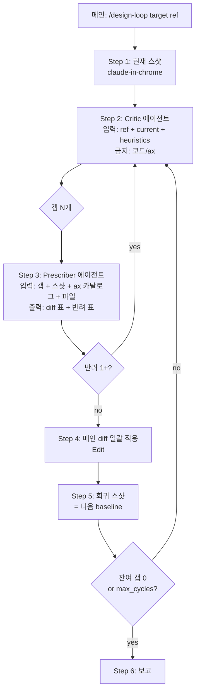

# design-loop — PRD

> **Discussion**: 본 세션 (2026-04-18). /improve 5사이클 답답함 → Critic/Prescriber 2-에이전트 분리 도출
> **산출물 유형**: 스킬·훅
> **규모 추정**: 신규 4개 (스킬 1 + 프롬프트 2 + Reference INDEX 1), 수정 0, 재사용 K개 (claude-in-chrome, screenshot.mjs, ax 카탈로그)

## §0 요구사항 (from discuss)

- **해결책 ⑪**: Reference Setup(1회) + 사이클(N회) — 메인이 Critic 에이전트 디스패치(스샷+ref+heuristics → 갭 N개) → Prescriber 에이전트 디스패치(갭+스샷+ax 카탈로그+파일 → `파일:라인 × ax({old}) → ax({new})` diff 표) → 메인은 적용만 → screen-test 회귀
- **제약 ⑦**: (a) ax 좌표계 SSOT (b) LLM에 결정 안 시킴 (`feedback_llm_surface_three_layer`) (c) 새 ax 축 신설 금지 (d) "있는 걸로 만든다"
- **보유 자산 ⑧**: Agent tool, ax/DESIGN.md/rolePreset.ts, screenshot.mjs (Puppeteer), claude-in-chrome MCP, /go·/team·/improve 스킬, Reference 스샷 3장 (이미 저장됨)
- **외부 근거 ⑨**: Anthropic Evaluator-Optimizer 패턴, Percy baseline diff, design-lint 토큰 강제

**기존 부품 차별화 (사용자 명시)**: improve-design 스킬은 (1) reference 미입력 자유 탐지, (2) 수정자=메인 = 추측 누출 — 이게 5사이클 답답함의 구조적 원인. design-loop는 reference-driven + Prescriber 분리로 두 결함을 동시 해소하는 별도 스킬.

## §1 책임 분해

| # | 책임 | 파일 경로 | 레이어 | 기존/신규 | 의존 |
|---|------|---------|-------|---------|------|
| 1 | Reference 인덱스 — Mac Finder 스샷 zone 매핑 (sidebar/toolbar/sortbar/treegrid/preview) | `docs/2-areas/styles/refs/finder/INDEX.md` | docs | 신규 | — |
| 2 | Critic 프롬프트 템플릿 — 입력: 스샷+ref+heuristics 7원리, 출력: 갭 N개 (zone × ref 대비 무엇 × heuristic 분류). 금지: 코드/ax 카탈로그 | `.claude/skills/design-loop/critic.md` | skill | 신규 | 1 |
| 3 | Prescriber 프롬프트 템플릿 — 입력: 갭 + 현재 스샷 + DESIGN.md + ax.ts + rolePreset.ts + zone별 파일, 출력: `파일:라인 × ax({old}) → ax({new}) × 근거` diff 표. 반려권 보유 | `.claude/skills/design-loop/prescriber.md` | skill | 신규 | — |
| 4 | 사이클 오케스트레이션 — 스킬 본체. 1) 스샷 (claude-in-chrome) 2) Critic 디스패치 3) Prescriber 디스패치 4) diff 적용 5) 회귀 스샷 6) 종료 조건 (잔여 갭 0 or 3회) | `.claude/skills/design-loop/SKILL.md` | skill | 신규 | 1, 2, 3 |
| 5 | 첫 적용 검증 — viewer 1 사이클 통과 | (실행 산출물) | 검증 | — | 4 |

### 탐색 증거

- `Bash ls /Users/user/Desktop/plugin-repo/skills/` → 39 스킬 확인, `design-loop` 부재
- `Read improve-design/SKILL.md` → 90% 매칭하나 (a) reference 입력 없음 (b) 수정자=메인 → **사용자 결정**: 기존 방식 한계로 신규 정의 (대화 컨텍스트 2026-04-18)
- `Read screen-test/SKILL.md` → 기능 검증, 디자인 비대상
- `Read design-extract/SKILL.md` → 토큰 추출 단발성, 사이클 부재
- `Read design-review/SKILL.md` → manifest 기반, 사이클 부재
- `Read CLAUDE.md` → "있는 걸로 만든다" 1원칙, ax SSOT, ui/items/panels/cells 우선
- `ls docs/2-areas/styles/refs/finder/` → 스샷 3장 저장 완료 (01-list-view-full-toolbar.png, 02-list-view-search.png, 03-column-view-preview.png)
- `feedback_llm_surface_three_layer`: 메인은 매핑만, LLM이 결정 안 함
- `feedback_naming_design_neutral`: ax 축 디자인-중립
- `feedback_axis_minimum_via_subset_expansion`: 신규 신설 전 기존 진화 먼저 (사용자 명시 거부 → 신규 정당화 완료)

**완성도**: 🟢 (1파일 1책임, 의존 무순환, 레이어 정합)

## §2 Contract

### `docs/2-areas/styles/refs/finder/INDEX.md`

```markdown
# Finder Reference Index

| File | Zones | View Mode | Notes |
|------|-------|-----------|-------|
| 01-list-view-full-toolbar.png | sidebar, toolbar(full), column-header, treegrid | List | 4 view-mode 토글 풀 노출 |
| 02-list-view-search.png | toolbar(search-active) | List | 검색 활성 시 view-mode 축소 (progressive disclosure) |
| 03-column-view-preview.png | sidebar, miller-columns, preview | Column | preview pane = thumbnail + 정보 표 + bottom action bar |

## Zone × ax 단서 매핑

| Zone | 핵심 시각 단서 | 추정 ax 영역 |
|------|------------|-----------|
| sidebar | 그룹 라벨 caption tone-dim, row 작은 아이콘+텍스트, hover bg subtle | NavList + ListItem + groupLabel ax |
| toolbar | overlay glass cluster, view-mode 토글, search expanded variable width | FinderToolbar control-group.overlay |
| column-header | 굵기 약한 헤더 + sort affordance, divider thin | TreeGrid header (현재 SortBarWidget) |
| treegrid | row 작은 아이콘, 텍스트 1줄, 종류/시간 caption tone-dim | TreeGrid + FileIcon |
| preview | thumbnail surface raised, 정보 표 caption×body, bottom action bar | FilePanel (도메인) |

## Heuristics (Refactoring UI 7원리 + Nielsen)

1. 위계 — primary text vs secondary tone-dim
2. 대비 — actionable surface 자주 raised, container 자주 base
3. 정렬 — flex bar 끝맞춤, gap 일관
4. 일관성 — 같은 의미 = 같은 ax 조합
5. 여백 — padding 콘텐츠 ≥ 입력 ≥ 바
6. 색 절약 — accent 1채널, neutral 다수
7. 깊이 — overlay/raised는 actionable에만
```

### `.claude/skills/design-loop/critic.md`

```markdown
# Critic 프롬프트 템플릿

## 역할
너는 디자인 비평자다. **스샷과 reference만 본다. 코드와 ax 카탈로그는 보지 않는다.**

## 입력
- Reference 스샷: {ref_paths}
- 현재 스샷: {current_path}
- 직전 baseline 스샷 (있으면): {baseline_path}
- Heuristics 7원리: 위계/대비/정렬/일관성/여백/색절약/깊이
- Zone 매핑: {INDEX.md 발췌}

## 출력 (Markdown 표)

| # | Zone | Ref 대비 무엇이 | Heuristic 분류 | 심각도 |
|---|------|-------------|------------|------|
| 1 | sidebar | ref는 그룹 라벨 caption+tone-dim인데 현재는 body 강도 | 위계 | high |
| 2 | toolbar | ref는 검색 활성 시 view-mode 축소 / 현재는 항상 노출 | 일관성 | mid |

## 규칙
- 갭은 zone 단위로 명시. "전체적으로"·"느낌상"·"좀 더" 금지
- 매 갭마다 ref 대비 *무엇이 다른가*를 픽셀/구조 수준으로 서술
- ax 축 이름·코드 경로 언급 금지 (Prescriber 영역)
- 심각도 high(기능적 차이)/mid(시각 위계)/low(미세 polish) 3단계
- baseline 있으면 마지막에 "회귀 발생 갭" 별도 표시
```

### `.claude/skills/design-loop/prescriber.md`

```markdown
# Prescriber 프롬프트 템플릿

## 역할
너는 비평을 코드 좌표로 번역한다. **미감 평가는 하지 않는다.** Critic의 갭 표를 받아 ax diff로 변환만 한다.

## 입력
- Critic 갭 표: {gaps}
- 현재 스샷: {current_path}
- DESIGN.md (조합 규칙)
- src/styles/ax.ts (13축 + Public preset)
- src/styles/rolePreset.ts (size×role 프리셋)
- Zone별 파일: {file_paths}

## 출력 (Markdown 표)

| Gap# | 파일:라인 | ax({old}) | ax({new}) | 근거 (DESIGN.md/rolePreset 인용) |
|------|---------|---------|---------|---------------------------|
| 1 | NavList.tsx:34 | `{textStyle:'overline', tone:'neutral-dim', cs:'xs'}` | `{textStyle:'caption', tone:'neutral-dim', cs:'xs'}` | DESIGN.md §typography: 그룹 라벨은 caption tier |

## 반려권 (Critic 갭 모호 시)

| Gap# | 반려 사유 | Critic에게 묻고 싶은 것 |
|------|---------|------------------|
| 3 | "위계가 약함" — 어느 위계? | sidebar 그룹 라벨 vs 아이템 / cs 차이 / textStyle 차이? |

반려가 1건 이상이면 다음 사이클은 Critic 재실행으로 시작.

## 규칙
- ax 13축 외 값 금지 (hex/px 직접 입력 금지). 토큰 외이면 반려
- 새 ax 축 제안 금지 — 기존 13축 + Public preset에서만
- 모든 diff에 *근거 인용* 필수 (DESIGN.md 섹션·rolePreset 키)
- guardOsPatterns hook 위반 (예: ax({padding:...}), surface+layout:'fill') 사전 회피 — control-group surface로 대체
- 1 갭 = 1 행 이상 (분해 가능). 1 행 = 1 파일 변경
```

### `.claude/skills/design-loop/SKILL.md`

```markdown
---
name: design-loop
description: Reference-driven 2-에이전트 디자인 수렴 루프. Critic(스샷+ref만 봄, 코드 모름)이 갭을 자연어로 도출하고 Prescriber(갭+ax 카탈로그)가 코드 diff로 번역. 메인은 적용만. /improve의 추측 1칸 이동 한계를 reference 좌표 + 처방 분리로 해소. "디자인 수렴", "finder 수준으로", "/design-loop" 등을 말할 때 사용.
---

# design-loop — Reference-driven Critic/Prescriber 사이클

## 전제
- Reference 스샷이 `docs/2-areas/styles/refs/{name}/` + `INDEX.md` 존재
- dev server 실행 중 (localhost:5173)
- claude-in-chrome MCP 연결

## ARGUMENTS
- target: 라우트 (예: `/viewer`)
- ref: reference 폴더명 (예: `finder`)
- max_cycles: 기본 3

## Step 1: 현재 스샷
claude-in-chrome → target 라우트 캡처 → tmp 저장. 5 zone이 다 보이는 전체 + zone별 zoom 3~5장.

## Step 2: Critic 디스패치
Agent(subagent_type=general-purpose, prompt=critic.md 템플릿 + 입력 채움). reference 폴더 + INDEX.md + 현재 스샷 + (있으면) baseline.

산출: 갭 표 (zone × ref 대비 × heuristic × 심각도).

## Step 3: Prescriber 디스패치
Agent(subagent_type=general-purpose, prompt=prescriber.md 템플릿 + 입력 채움). Critic 갭 + 스샷 + DESIGN.md + ax.ts + rolePreset.ts + zone별 파일 (Read).

산출: diff 표 (파일:라인 × ax old → new × 근거) + 반려 표 (있으면).

반려 1건 이상 → Critic 재실행 (Step 2)으로 복귀.

## Step 4: 적용
메인이 diff 표 일괄 적용 (Edit). 직관 추측 0. ax 외 값이 1건이라도 있으면 Prescriber 재실행 요청.

## Step 5: 회귀 스샷 + 다음 사이클
새 스샷 = baseline. Critic에게 baseline diff와 함께 재투입.

## Step 6: 종료
잔여 갭 0 또는 max_cycles 도달. 미해결 갭은 사용자 보고.

## 보고
- 사이클 수
- 사이클당 변경 N
- 잔여 갭
- 회귀 발생 갭
```

**완성도**: 🟢 (4 신규 파일 contract 완비, ARGUMENTS/입출력 명시)

## §3 WHY

**근본 이유**: /improve 5사이클의 답답함 = "스샷 → 비평 → 처방"을 1인이 융합 수행 → 비평 모호함이 검증 없이 처방 추측으로 흐름. 사이클당 1~3 변경의 *방향 없는 1칸 이동*만 누적.

**책임 분해 정당성**:
1. **Critic ↔ Prescriber 분리** = Anthropic Evaluator-Optimizer 패턴. 비평자가 코드를 못 보면 처방으로의 추측 누출 차단됨
2. **Reference 입력** = "목표 좌표"를 명시하여 사이클이 *방향 있는 N칸 점프*로 변환됨
3. **Prescriber 토큰 강제** = design-lint/Locofy 정신, ax SSOT 정합. 처방 출력이 ax 외 값 0건이면 회귀 위험 차단
4. **반려권** = 비평 모호함이 다음 단계로 전파되지 않도록 게이트

**기존 improve-design을 진화하지 않는 이유 (사용자 결정)**: 기존 방식이 5사이클 답답함의 구조적 원인 → 신규 분리가 정당.

## §4 HOW



## §5 WHAT (의존 순서)

### W1. Reference INDEX (§1.1)

**의존**: —
**파일**: `docs/2-areas/styles/refs/finder/INDEX.md`

§2의 Contract `INDEX.md` 본문을 그대로 작성.

**검증**: 수동 — 3 png 파일 매핑이 zone 5개와 1:1 대응 + heuristics 7원리 명시.

### W2. Critic 프롬프트 (§1.2)

**의존**: W1 (INDEX.md를 참조)
**파일**: `.claude/skills/design-loop/critic.md`

§2의 Contract `critic.md` 본문을 그대로 작성. 변수 placeholder는 `{ref_paths}` 형태로 SKILL.md가 채움.

**검증**: 수동 — 출력 표 컬럼 4개(zone, 무엇이, heuristic, 심각도) + 코드/ax 언급 금지 명시.

### W3. Prescriber 프롬프트 (§1.3)

**의존**: —
**파일**: `.claude/skills/design-loop/prescriber.md`

§2의 Contract `prescriber.md` 본문을 그대로 작성.

**검증**: 수동 — 출력 표 컬럼 4개(파일:라인, old, new, 근거) + 반려권 + ax 외 값 금지 명시.

### W4. SKILL.md (§1.4)

**의존**: W1, W2, W3
**파일**: `.claude/skills/design-loop/SKILL.md`

§2의 Contract `SKILL.md` 본문을 그대로 작성. ARGUMENTS 3개 (target/ref/max_cycles), Step 1~6.

**검증**: 수동 — 6 step 모두 누가/무엇으로/어떤 산출 명시.

### W5. 첫 적용 — viewer 1 사이클 (§1.5)

**의존**: W4
**산출**: 1 사이클 끝난 후
- Critic 갭 N개
- Prescriber diff 표 + 적용 commit
- 회귀 스샷
- 보고: "사이클 1 완료. 변경 N개. 잔여 갭 M개"

**검증**: 회귀 스샷이 reference에 더 가까워졌는지 사용자 육안 확인. M < N 이면 수렴 작동.

## §6 원칙 감시자 결과

| 검사 | 결과 |
|------|------|
| CLAUDE.md "있는 걸로" | 기존 4 design 스킬 모두 검증, 사용자 명시 거부로 신규 정당화 |
| 파일명 컨벤션 | INDEX.md (대문자 OK, 인덱스 관례), critic/prescriber/SKILL .md (skill 관례) |
| 레이어 의존 | docs → skill (단방향) ✓ |
| Placeholder | `(?)`/"TBD"/"적절히" 0건 |
| `feedback_llm_surface_three_layer` (LLM 결정 X) | 메인=적용만, Critic=관찰, Prescriber=매핑 — 3 모두 결정 아님 |
| `feedback_axis_minimum_via_subset_expansion` (subset 확장 우선) | 사용자 명시 거부로 신규 정당 |
| `feedback_skill_commit_to_plugin_repo` | `.claude/skills/`는 plugin-repo symlink → plugin 레포 commit 자동 |
| ax 13축만 사용 | Prescriber 출력에 강제, 위반 시 반려 |
| guardOsPatterns 호환 | Prescriber 규칙에 hook 위반 사전 회피 명시 |

**위반 0건.**

---

**전체 완성도**: 🟢 6/6
