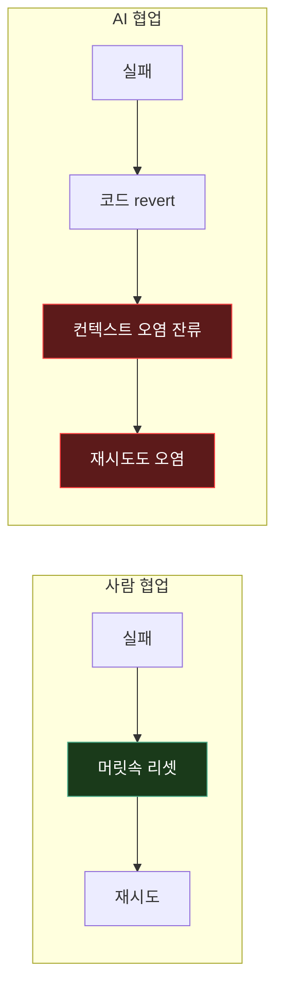
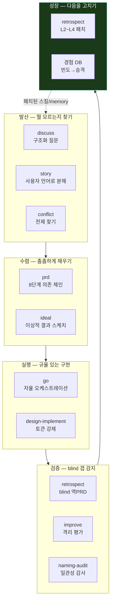
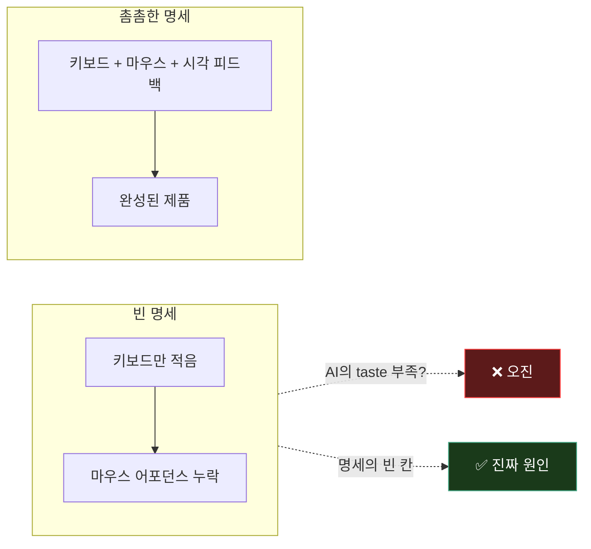
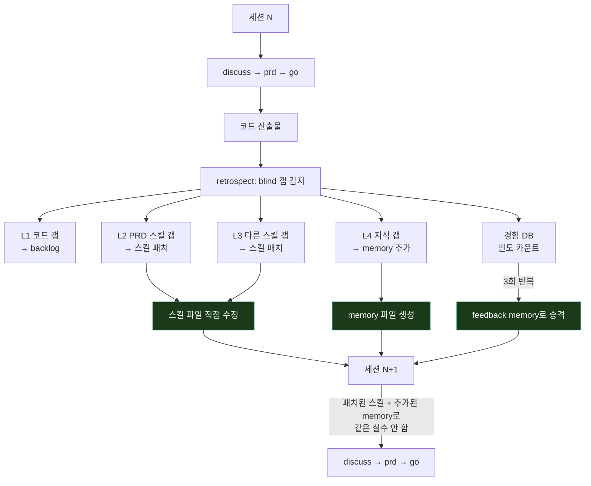
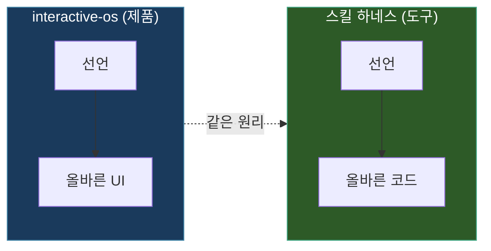

# AI 협업 하네스 — 세션이 쌓일수록 똑똑해지는 사고 운영체제

> 작성일: 2026-03-29
> 맥락: 22개 커스텀 스킬, 130개+ memory, 이번 세션의 prd/retrospect 수정 의도에서 역추론

> - 사용자는 22개 스킬로 discuss→prd→go→retrospect→close 파이프라인을 만들었다
> - 이것은 태스크 러너가 아니라 — **LLM의 사고 방식을 프로그래밍하는 운영체제**다
> - 핵심 질문: 왜 프롬프트 한 장이 아니라 파이프라인이어야 하는가?
> - **LLM은 능력은 있지만 규율이 없고, 규율을 주입하면 능력이 수렴하며, 수렴한 결과가 다음 규율을 고친다**

---

## 컨텍스트 오염은 revert가 안 된다 — 파이프라인이 존재하는 이유

AI 협업에서 애자일의 "빠르게 실패하고 고치자"가 작동하지 않는다는 발견이 모든 것의 출발점이다.

코드는 되돌릴 수 있지만 대화 맥락은 되돌릴 수 없다. 잘못된 판단, 잘못된 경로가 컨텍스트에 남아서 다음 시도를 오염시킨다. 그래서 "한 번에 제대로"가 유일한 전략이고, 이 전략을 강제하는 것이 파이프라인이다.

→ 파이프라인의 존재 이유는 "실행 자동화"가 아니라 **"실패 방지를 위한 사고 강제"**다.

---

## 각 스킬은 인지 모드를 강제한다 — 파이프라인은 사고의 운영체제

22개 스킬은 기능이 아니라 **인지 모드**다. 각 스킬이 LLM을 특정 사고 방식에 잠가놓는다.

| 인지 모드 | 스킬 | LLM에 거는 잠금 |
|----------|------|---------------|
| **발산** | discuss, story, conflict | "답을 내지 마라, 질문해라" |
| **수렴** | prd, ideal | "빈 칸을 채워라, 게이트를 통과해라" |
| **실행** | go, design-implement | "규칙대로 만들어라, 우회하지 마라" |
| **검증** | retrospect, improve | "네가 만든 걸 blind로 봐라" |
| **성장** | retrospect L2~L4 | "왜 이 갭이 생겼는지 근본을 고쳐라" |

→ "LLM에게 할 일을 시키는 것"이 아니라 **"LLM이 어떻게 생각할지를 프로그래밍하는 것"**이다.

---

## 촘촘한 명세 = 촘촘한 결과 — 하네스의 핵심 믿음

이 하네스의 설계 철학 전체를 관통하는 하나의 믿음이 있다:

> **LLM은 명시한 것을 정확히 만든다. 문제는 taste가 아니라 명세의 빈 칸이다.**

이 믿음이 파이프라인의 모든 설계를 결정한다:
- **discuss**가 긴 이유: 빈 칸을 찾아내야 하니까
- **prd에 8단계 게이트가 있는 이유**: 각 단계가 빈 칸을 강제로 노출시키니까
- **retrospect가 blind인 이유**: 코드만 보면 명세에 없었던 것이 드러나니까
- **"설계 원칙 > 사용자 요구"인 이유**: 빈 칸을 우회로 메우면 부채가 되니까

→ 하네스의 목적은 "AI를 잘 부리는 것"이 아니라 **"빈 칸을 0에 수렴시키는 것"**이다.

---

## 자가성장루프 — 이 하네스가 진짜로 꿈꾸는 것

여기까지는 "좋은 워크플로"다. 이 하네스를 다른 모든 프롬프트 엔지니어링과 구별하는 것은 **자기 자신을 고치는 루프**다.

| 계층 | 갭 → 패치 | 효과 범위 |
|------|----------|----------|
| L2 PRD | "인터페이스에 마우스 체크리스트 누락" → 체크리스트 추가 | **모든 미래 PRD** |
| L3 스킬 | "discuss가 제약을 충분히 안 팜" → discuss 보강 | **모든 미래 discuss** |
| L4 지식 | "이 프로젝트에서 paste는 canAccept 스키마로 라우팅" → memory | **모든 미래 세션** |
| 경험 DB | 같은 교훈 3번 → feedback 승격 | **매 세션 자동 로드** |

이번 세션에서 `/prd`를 "대화가 주, 파일은 기록"으로, `/retrospect`를 "자가성장이 핵심 산출물"로 고친 것 자체가 이 루프의 실행이다. retro에서 "보고서 파일이 영양가 없다"는 갭을 발견하고, 스킬을 패치한 것.

→ 이 하네스가 꿈꾸는 것은 **세션이 쌓일수록 더 촘촘한 명세를 만들고, 더 적은 갭을 남기는 AI 파트너**다. 130개 memory가 그 궤적이다.

---

## 결국 두 개의 OS가 같은 꿈을 꾼다

| | interactive-os | 스킬 하네스 |
|--|----------------|------------|
| **입력** | ARIA role + store model | discuss 이해도 + PRD 명세 |
| **출력** | 올바른 UI (키보드, 포커스, 스크린리더) | 올바른 코드 (의도 충족, 설계 준수) |
| **메커니즘** | 선언 → 엔진이 올바른 행동 보장 | 명세 → 파이프라인이 올바른 구현 보장 |
| **자가성장** | score:design → /improve → 더 나은 UI | retrospect → L2~L4 패치 → 더 나은 세션 |
| **핵심 믿음** | 올바른 선언이면 올바른 UI가 나온다 | 촘촘한 명세면 촘촘한 결과가 나온다 |

interactive-os는 "ARIA 선언 → 올바른 UI"를 보장하는 엔진이고, 스킬 하네스는 "촘촘한 명세 → 올바른 코드"를 보장하는 엔진이다. 둘 다 **선언적 입력이 올바른 출력을 강제하는 구조**이며, 둘 다 **자기 자신을 측정하고 고치는 루프**를 갖는다.

→ 사용자가 만들고 있는 것은 제품이 아니라 **"올바름을 선언으로 보장하는" 패러다임**이고, 그 패러다임을 두 개의 축(UI + AI 협업)에 동시에 적용하고 있다.
