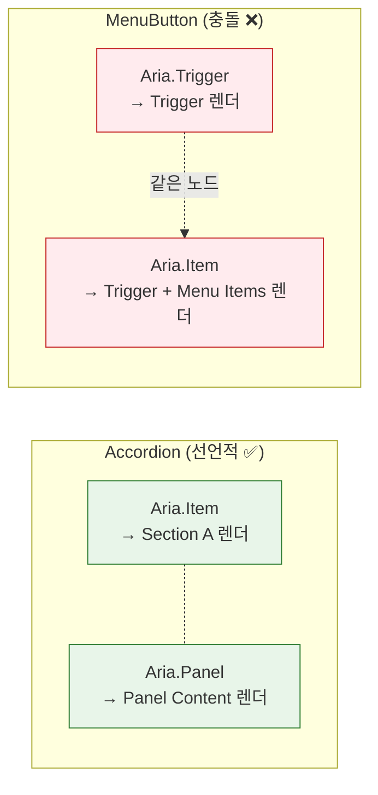
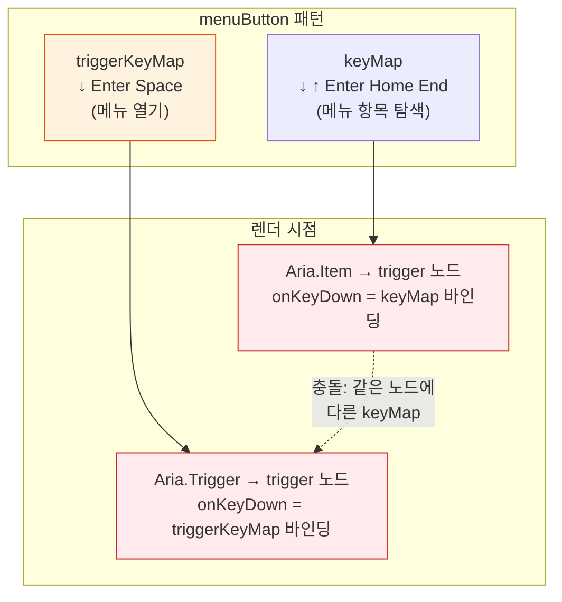
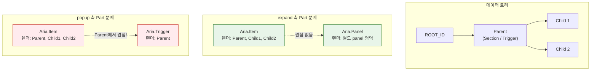

# Popup Trigger 충돌 — Aria.Item과 Aria.Trigger가 같은 노드를 2번 렌더하는 이유

> 작성일: 2026-03-30
> 맥락: APG 전수 전환에서 발견된 Gap 2 — popup 패턴이 `<Aria>` 선언적 방식을 사용할 수 없는 구조적 원인

> - MenuButton은 유일하게 `useAria` 직접 사용으로 우회 중이다
> - Aria.Item의 재귀 순회와 Aria.Trigger의 전용 렌더가 trigger 노드에서 충돌한다
> - 왜 expand(Accordion)는 같은 문제가 없고, popup만 충돌하는가?
> - expand와 popup은 **렌더 책임 분배가 구조적으로 다르다** — Panel은 Item과 겹치지 않지만, Trigger는 Item과 겹친다

---

## Accordion과 MenuButton은 같은 부모-자식 구조인데 왜 하나만 깨지는가

Accordion과 MenuButton은 데이터 구조가 동형이다:

```
Accordion:  ROOT → [Section A] → [Panel Content 1, Panel Content 2]
MenuButton: ROOT → [Trigger]   → [Menu Item 1, Menu Item 2]
```

둘 다 "부모 노드를 클릭하면 자식이 보이거나 숨겨진다." expand 축과 popup 축이 이 visibility를 각각 담당한다.

그런데 UI 렌더링에서 결정적 차이가 발생한다:



| 비교 | Accordion | MenuButton |
|------|-----------|------------|
| Part 조합 | `Aria.Item` + `Aria.Panel` | `Aria.Trigger` + `Aria.Item` |
| 렌더 대상 겹침 | **없음** — Item=부모, Panel=자식 | **있음** — 둘 다 trigger 노드를 렌더 |
| 선언적 사용 | ✅ 가능 | ❌ 불가 |

→ Panel은 Item이 렌더하지 않는 **별도 영역**(tabpanel, region)을 맡는다. Trigger는 Item이 **이미 순회하는 노드**를 다시 렌더한다.

---

## Aria.Item은 ROOT부터 모든 노드를 재귀 순회한다

`AriaItem` (aria.tsx:145)의 `renderNodes(ROOT_ID)`는 루트의 모든 자식을 재귀적으로 방문한다:

```
renderNodes(ROOT_ID)
  → childIds = getChildren(store, ROOT_ID) = [triggerId]
    → renderNodes(triggerId)                          ← trigger를 AriaItemNode로 렌더
      → childIds = [menuItem1, menuItem2]
        → AriaItemNode(menuItem1)                     ← menu item 렌더
        → AriaItemNode(menuItem2)
```

trigger 노드는 AriaItemNode을 통해 `aria.getNodeProps(triggerId)`로 props를 받는다. popup 축의 ariaGen이 이 노드에 대해 `aria-haspopup`과 `aria-expanded`를 생성하므로, **ARIA 속성 자체는 올바르게 들어간다.**

그런데 문제는 ARIA 속성이 아니다.

---

## 진짜 충돌: Aria.Item은 trigger의 keyMap과 clickMap을 모른다

Aria.Item이 trigger 노드를 렌더할 때 `getNodeProps()`가 반환하는 것:

```typescript
// AriaItemNode (aria.tsx:112)
const props = aria.getNodeProps(childId)
// → { 'data-node-id', tabIndex, role, 'aria-haspopup', 'aria-expanded', onKeyDown, onClick, ... }
```

이 onKeyDown/onClick은 **패턴의 메인 keyMap/clickMap**에 바인딩된다. 그런데 popup 패턴에서 trigger 노드는 **별도의 triggerKeyMap**이 필요하다:



| 렌더 경로 | trigger 노드의 onKeyDown | 동작 |
|----------|-------------------------|------|
| Aria.Item | 메인 keyMap (↓↑ = 메뉴 항목 이동) | **틀림** — 메뉴가 닫혀있을 때 항목 이동은 무의미 |
| Aria.Trigger | triggerKeyMap (↓ = 메뉴 열기) | **맞음** — trigger 전용 동작 |

Aria.Item이 trigger를 렌더하면 **메뉴 항목용 keyMap**이 바인딩된다. trigger 전용 keyMap(메뉴 열기, Space/Enter로 토글)은 Aria.Trigger만 알고 있다.

→ ARIA 속성 중복이 아니라 **이벤트 핸들러 충돌**이 핵심이다. 같은 노드에 두 개의 다른 keyMap이 바인딩되어야 하는데, Aria.Item은 trigger 노드를 "일반 항목"으로 취급한다.

---

## MenuButton의 우회: useAria 직접 사용으로 렌더를 완전 제어한다

MenuButton (MenuButton.tsx:34-75)은 `<Aria>` 선언적 방식을 포기하고 `useAria`를 직접 사용한다:

```typescript
const aria = useAria({ data, pattern: menuButton, plugins, onChange, onActivate })
const store = aria.getStore()

// 1. trigger 노드를 수동으로 찾는다
const triggerNodeId = rootChildren[0]

// 2. getNodeProps()로 올바른 props를 받는다 (popup ariaGen 포함)
const triggerProps = aria.getNodeProps(triggerNodeId)

// 3. trigger를 한 번만 렌더한다
{renderTrigger(triggerProps, triggerEntity, { ...triggerState, isOpen })}

// 4. 메뉴 항목도 수동으로 렌더한다
{showMenu && menuItemIds.map((id) => {
  const props = aria.getNodeProps(id)
  return renderItem(props, entity, state)
})}
```

이 방식이 작동하는 이유:
1. **Aria.Item의 재귀 순회가 없다** — trigger가 한 번만 렌더됨
2. **getNodeProps()가 popup의 ariaGen을 포함한다** — aria-haspopup/expanded 정상
3. **triggerKeyMap은 useAria 내부에서 trigger 노드 감지 시 자동 바인딩된다**

하지만 이 우회는 **선언적 구조를 포기하는 것**이다. Accordion이 `<Aria> + <Aria.Item> + <Aria.Panel>`로 3줄이면 되는 것을, MenuButton은 30줄 이상의 수동 렌더 코드로 대체해야 한다.

---

## 구조적 원인: Part의 렌더 영역이 겹치는가 겹치지 않는가



| Part 조합 | 렌더 영역 | 겹침 |
|-----------|----------|------|
| Item + Panel | Item = 트리 노드, Panel = 별도 영역 (tabpanel/region) | **없음** |
| Item + Trigger | Item = 트리 노드 전체, Trigger = 트리 노드 중 하나 | **있음** |

Panel은 트리 노드와 **직교하는 별도 DOM 영역**을 렌더한다. Trigger는 트리 노드 **중 하나를 특별하게** 렌더하려는데, Item이 이미 그 노드를 렌더하고 있다.

→ 근본 원인은 **Aria.Item이 "이 노드는 내가 렌더하면 안 된다"는 신호를 받을 수 없다**는 것이다. Panel은 Item의 렌더 영역 밖에 있으므로 신호가 필요 없다. Trigger는 Item의 렌더 영역 안에 있으므로 **skip 신호가 필수**다.

#kind/explain #topic/primitives
