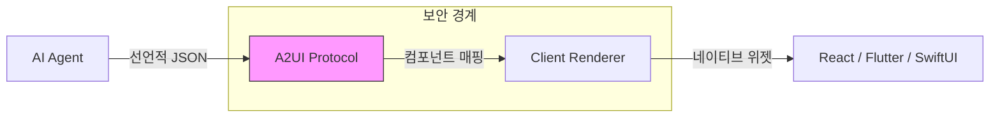
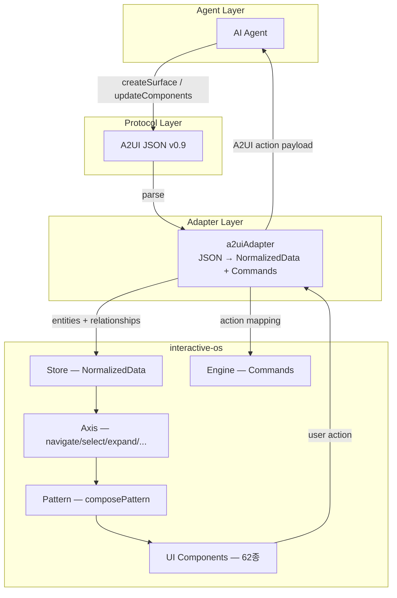

# A2UI (Agent-to-UI) Protocol — 에이전트가 선언적 JSON으로 UI를 말하는 프로토콜

> 작성일: 2026-04-04
> 맥락: interactive-os의 ARIA-first UI 컴포넌트가 A2UI 렌더러가 될 수 있는지 매핑 가능성 분석

> **Situation** — AI 에이전트가 UI를 생성하는 표준이 없어 각 프레임워크마다 독자 구현이 난립한다.
> **Complication** — Google이 A2UI v0.9를 공개했고, 에이전트→UI 선언적 프로토콜이 사실상 표준 후보가 되었다. 그러나 접근성(ARIA)은 로드맵에만 있고 미구현이다.
> **Question** — A2UI의 컴포넌트/이벤트/데이터 모델이 우리 interactive-os와 얼마나 매핑되는가?
> **Answer** — Basic Catalog 18종 중 14종이 우리 UI 62종에 직접 매핑되며, 데이터 모델(flat ID + path 바인딩)도 NormalizedData와 구조적으로 유사하다. 우리가 "ARIA-first A2UI 렌더러"를 만들 수 있는 조건이 갖춰져 있다.

---

## Why — 에이전트에게 UI 언어가 필요한 이유

에이전트가 텍스트만 반환하면 클라이언트가 UI를 추측해야 한다. 에이전트가 임의 코드를 보내면 보안이 무너진다. A2UI는 이 사이에서 "선언적 JSON — 실행 불가, 렌더링만 가능"이라는 포지션을 잡았다.



핵심 설계 원칙 4가지:
1. **Security-First**: 선언적 데이터 포맷, 실행 코드 아님. 클라이언트가 승인된 컴포넌트 카탈로그만 허용
2. **LLM-Optimized**: flat component list + ID 참조. 증분 업데이트와 프로그레시브 렌더링에 유리
3. **Framework-Agnostic**: 같은 JSON이 React, Flutter, Lit 등에서 렌더링
4. **Extensible Registry**: 커스텀 카탈로그로 자체 컴포넌트 등록 가능

---

## How — 작동 원리

### 메시지 모델 (v0.9)

서버→클라이언트 메시지 4종:

| 메시지 | 역할 |
|--------|------|
| `createSurface` | UI 캔버스 초기화. `surfaceId`, `catalogId`, `theme`, `sendDataModel` |
| `updateComponents` | 컴포넌트 flat list 전달 (adjacency list 구조) |
| `updateDataModel` | JSON Pointer `path`로 데이터 CRUD |
| `deleteSurface` | surface 제거 |

클라이언트→서버 메시지 2종:

| 메시지 | 역할 |
|--------|------|
| `action` | 사용자 인터랙션. `name`, `surfaceId`, `sourceComponentId`, `timestamp`, `context` |
| `error` | 검증 실패. `code`, `path`, `message` |

### 데이터 모델 & 바인딩

```mermaid
graph TB
    subgraph "Agent (Server)"
        UM[updateDataModel]
    end
    
    subgraph "Data Model (Client)"
        DM["/booking/date": "2026-04-04"<br/>"/booking/size": 4]
    end
    
    subgraph "Component"
        C["DateTimeInput<br/>value: {path: '/booking/date'}"]
    end
    
    UM -->|"JSON Pointer path"| DM
    DM <-->|"Two-Way Binding"| C
    C -->|"action event"| Agent2[Agent]
```

- **Read**: 컴포넌트가 `path`로 Data Model에서 값을 pull
- **Write**: 사용자 입력이 로컬 Data Model을 즉시 업데이트
- **Sync**: `sendDataModel: true`이면 매 action에 전체 data model이 메타데이터로 첨부 (stateless agent 지원)

### Adjacency List 구조

A2UI는 중첩 JSON 트리가 아닌 **flat list + ID 참조**:

```json
[
  { "id": "root", "component": "Column", "children": ["header", "content"] },
  { "id": "header", "component": "Text", "text": "Hello", "variant": "h1" },
  { "id": "content", "component": "Button", "child": "btn-label", "action": { "event": { "name": "submit" } } },
  { "id": "btn-label", "component": "Text", "text": "Submit" }
]
```

→ 이것은 우리 `NormalizedData`의 `entities` + `relationships`와 구조적으로 동일하다.

### 이벤트 모델: Server Event vs Local FunctionCall

```json
// Server Event — 에이전트에게 전달
{ "action": { "event": { "name": "submit_reservation", "context": { "time": { "path": "/reservationTime" } } } } }

// Local FunctionCall — 클라이언트에서 실행
{ "action": { "functionCall": { "call": "openUrl", "args": { "url": "https://..." } } } }
```

- `checks`: 조건부 validation. 실패하면 버튼 자동 disable
- 내장 함수: `required`, `regex`, `formatString`, `formatNumber`, `formatDate`, `and/or/not`

### 카탈로그 & 커스텀 컴포넌트

카탈로그 = JSON Schema 파일. 에이전트는 스키마에 맞게 생성, 클라이언트는 스키마로 검증.

```typescript
// 클라이언트 카탈로그 등록 (TypeScript)
const MY_CATALOG = {
  ListBox: {
    type: () => import('./ListBox'),
    bindings: ({ properties }) => [inputBinding('items', properties.items)]
  }
}
```

- 기존 Basic Catalog을 `$ref`로 확장하거나 cherry-pick 가능
- 미지원 컴포넌트는 graceful fallback
- `assemble_catalog.py`로 번들링

### 트랜스포트

A2A, AG-UI, MCP, SSE+JSON-RPC, WebSocket, REST 모두 지원. A2A에서는 `mimeType: "application/json+a2ui"` DataPart로 래핑.

---

## What — Basic Catalog 컴포넌트 전체 목록

### A2UI Basic Catalog (18종) ↔ interactive-os UI 매핑

| A2UI 컴포넌트 | 역할 | 주요 props (v0.9) | 우리 UI 매핑 | 매핑 난이도 |
|---------------|------|-------------------|-------------|------------|
| **Text** | 텍스트 표시 | `text`, `variant`(h1-h5,caption,body) | MarkdownViewer / CodeBlock | ✅ 직접 |
| **Image** | 이미지 | `url`, `fit`, `variant` | (없음 — HTML img) | ⚠️ 신규 |
| **Icon** | 아이콘 | `name` | indicators/ | ✅ 직접 |
| **Divider** | 구분선 | `axis` | (CSS로 처리) | ✅ trivial |
| **Row** | 가로 레이아웃 | `children`, `justify`, `align` | ax() row | ✅ 직접 |
| **Column** | 세로 레이아웃 | `children`, `justify`, `align` | ax() column | ✅ 직접 |
| **List** | 스크롤 목록 | `children`, `direction`, `align` | ListBox / Feed | ✅ 직접 |
| **Card** | 컨테이너 | `child` | (ax() surface) | ✅ 직접 |
| **Tabs** | 탭 인터페이스 | `tabItems`[{title, child}] | TabList + TabGroup | ✅ 직접 |
| **Modal** | 오버레이 | `entryPointChild`, `contentChild` | Dialog / AlertDialog | ✅ 직접 |
| **Button** | 액션 트리거 | `child`, `variant`, `action` | Button | ✅ 직접 |
| **TextField** | 텍스트 입력 | `label`, `value`, `textFieldType` | TextInput / Composer | ✅ 직접 |
| **CheckBox** | 불리언 토글 | `label`, `value` | Checkbox / CheckboxMixed | ✅ 직접 |
| **Slider** | 범위 입력 | `value`, `minValue`, `maxValue` | Slider | ✅ 직접 |
| **DateTimeInput** | 날짜/시간 | `value`, `enableDate`, `enableTime` | DatePicker / CalendarGrid | ✅ 직접 |
| **ChoicePicker** | 선택 | `options`, `selections`, `maxAllowed` | RadioGroup / ListBox | ✅ 직접 |
| **AudioPlayer** | 오디오 | `url` 등 | (없음) | ⚠️ 신규 |
| **Video** | 비디오 | `url` 등 | (없음) | ⚠️ 신규 |

**결과: 18종 중 15종 직접 매핑, 3종(Image, Audio, Video)만 신규.**

### 우리에겐 있지만 A2UI에 없는 컴포넌트 (커스텀 카탈로그 후보)

| 우리 UI | ARIA 패턴 | A2UI 확장 가치 |
|---------|-----------|---------------|
| TreeView / TreeGrid | tree / treegrid | ✅ 높음 — 파일 탐색기, 계층 데이터 |
| Combobox / QuickOpen | combobox | ✅ 높음 — 검색 + 선택 |
| Menubar / MenuButton | menubar / menu | ✅ 높음 — 앱 메뉴 |
| Table / Grid | table / grid | ✅ 높음 — 데이터 그리드 |
| Toolbar | toolbar | ✅ 중간 |
| Accordion / DisclosureGroup | disclosure | ✅ 중간 |
| Kanban / SpatialView | 커스텀 | ⚠️ 도메인 특화 |
| Breadcrumb / NavList | navigation | ✅ 중간 |
| Toaster / Tooltip | alert / tooltip | ✅ 낮음 |

→ 우리가 커스텀 카탈로그로 등록하면 A2UI 에코시스템에서 가장 풍부한 ARIA 컴포넌트 셋이 된다.

### 데이터 모델 구조 비교

| | A2UI | interactive-os |
|---|------|---------------|
| **구조** | flat JSON + JSON Pointer path | `NormalizedData`: entities Record + relationships Record |
| **ID** | 문자열 `id` | 문자열 entity key |
| **참조** | `ComponentId` (단일), `ChildList` (배열/템플릿) | `relationships[parentId] = childId[]` |
| **슬롯** | `child` (단일 자식) | `slots[parentId][slotName] = childId` |
| **바인딩** | JSON Pointer `/path/to/value` | Command 패턴으로 불변 업데이트 |
| **CRUD** | `updateDataModel` + path | Command 실행 (engine) |

핵심 차이: A2UI는 **mutable path 바인딩**, 우리는 **immutable command 패턴**. 어댑터가 A2UI의 path write를 우리 command로 변환하면 된다.

### Axis 매핑

| 우리 axis | A2UI 대응 | 비고 |
|-----------|----------|------|
| **navigate** | 없음 | A2UI에 키보드 내비게이션 개념 없음 |
| **select** | ChoicePicker `selections` | 단일/다중 선택만 |
| **expand** | 없음 | A2UI에 tree expand 없음 |
| **activate** | Button `action` | event/functionCall |
| **tab** | Tabs `tabItems` | 구조적 매핑 |
| **value** | Slider/TextField `value` | two-way binding |
| **checked** | CheckBox `value` | boolean |
| **edit** | TextField `textFieldType` | 부분적 |
| **popup** | Modal | entryPoint/content 패턴 |

→ **navigate, expand가 A2UI에 완전히 부재**. 이것이 우리의 핵심 차별점이다.

---

## If — 프로젝트 시사점

### 통합 아키텍처



### 어댑터가 해야 할 일 (4가지)

1. **Component Mapping**: A2UI `component` 타입 → 우리 UI 컴포넌트 resolve
2. **Data Transform**: A2UI flat list → `NormalizedData` 변환 (ID→entity, children→relationships)
3. **Action Bridge**: 우리 UI의 axis 이벤트 → A2UI `action` payload 생성
4. **Binding Sync**: A2UI `updateDataModel` → engine command 변환

### 전략적 포지션

1. **Basic Catalog 렌더러** = 진입점. 15종 직접 매핑으로 빠르게 구현
2. **커스텀 ARIA Catalog** = 차별점. TreeView, Combobox, Grid 등을 A2UI 카탈로그로 등록 → "에이전트가 트리뷰를 말할 수 있게 되는" 유일한 렌더러
3. **접근성 자동 부여** = 해자(moat). A2UI 스펙에 ARIA가 없으므로, 우리 axis가 자동으로 키보드/스크린리더를 부여하는 것 자체가 경쟁 우위

### 리스크

- A2UI v0.9는 아직 draft. v1.0에서 스펙이 바뀔 수 있음 → **어댑터를 얇게 유지**해야
- A2UI의 mutable binding과 우리 immutable command의 충돌 → 어댑터에서 변환 복잡도
- 미디어 컴포넌트(Image, Audio, Video) 3종 신규 필요

---

## Insights

- **A2UI의 adjacency list = 우리 NormalizedData**: "flat list + ID 참조"라는 A2UI의 핵심 설계가 우리 store 구조와 거의 동형(isomorphic)이다. 이것은 우연이 아니라, 둘 다 "LLM이 증분 생성하기 쉬운 구조"를 추구한 결과다.
- **navigate 축의 부재가 A2UI의 가장 큰 빈칸**: A2UI는 "어떤 컴포넌트를 보여줄까"만 정의하고 "어떻게 탐색할까"는 클라이언트에 위임한다. 우리 axis 시스템이 이 빈칸을 정확히 메운다.
- **카탈로그 확장이 진짜 기회**: A2UI Basic Catalog에 TreeView/Grid/Combobox가 없다는 건, 에이전트가 이런 복잡한 UI를 "말할 수 없다"는 뜻이다. 우리가 이 어휘를 카탈로그로 등록하면 에이전트의 UI 표현력 자체를 확장하는 셈.
- **sendDataModel: true와 stateless agent 패턴**: 매 action에 전체 data model을 보내는 방식은, 우리 채팅 모듈의 Gen UI 블록이 상태를 유지하는 방식과 자연스럽게 결합된다.

---

## Sources

| # | 출처 | 유형 | 핵심 내용 |
|---|------|------|----------|
| 1 | [A2UI Official — What is A2UI?](https://a2ui.org/introduction/what-is-a2ui/) | 공식 문서 | 프로토콜 개요, 설계 원칙 |
| 2 | [A2UI Specification v0.9](https://a2ui.org/specification/v0.9-a2ui/) | 공식 스펙 | 메시지 타입, 데이터 모델, 함수 시스템 |
| 3 | [A2UI Specification v0.8](https://a2ui.org/specification/v0.8-a2ui/) | 공식 스펙 | 안정 버전 메시지 형식 |
| 4 | [Component Gallery](https://a2ui.org/reference/components/) | 공식 레퍼런스 | 18종 컴포넌트 전체 props |
| 5 | [Components & Structure](https://a2ui.org/concepts/components/) | 공식 문서 | adjacency list, ChildList, 템플릿 |
| 6 | [Client-to-Server Actions](https://a2ui.org/concepts/client_to_server_actions/) | 공식 문서 | 이벤트 모델, action payload, data sync |
| 7 | [Catalogs](https://a2ui.org/concepts/catalogs/) | 공식 문서 | 커스텀 카탈로그, 컴포넌트 등록 |
| 8 | [GitHub — google/A2UI](https://github.com/google/A2UI) | 소스 | 레포 구조, 렌더러, 에이전트 SDK |
| 9 | [Google Developers Blog](https://developers.googleblog.com/introducing-a2ui-an-open-project-for-agent-driven-interfaces/) | 공식 블로그 | 출시 배경, 유스케이스 |
| 10 | [CopilotKit — A2UI + AG-UI](https://www.copilotkit.ai/blog/build-with-googles-new-a2ui-spec-agent-user-interfaces-with-a2ui-ag-ui) | 에코시스템 | A2UI + AG-UI 통합 사례 |

---

## Walkthrough

> A2UI와 우리 프로젝트의 매핑을 직접 확인하려면?

1. **A2UI 스펙 진입**: [v0.9 스펙](https://a2ui.org/specification/v0.9-a2ui/)에서 `updateComponents` 예제를 읽는다
2. **우리 store와 비교**: `src/interactive-os/store/types.ts`의 `NormalizedData`를 열고, A2UI의 flat component list가 entities + relationships로 어떻게 변환되는지 머릿속으로 매핑한다
3. **컴포넌트 대조**: `src/interactive-os/ui/` 디렉토리를 열고, 위 매핑 테이블의 15종이 실제로 존재하는지 확인한다
4. **커스텀 카탈로그 구상**: A2UI Basic Catalog에 없는 TreeView, Combobox, Grid를 JSON Schema로 정의하면 어떤 props가 필요한지 스케치한다
