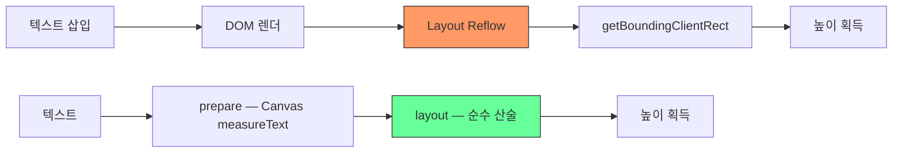
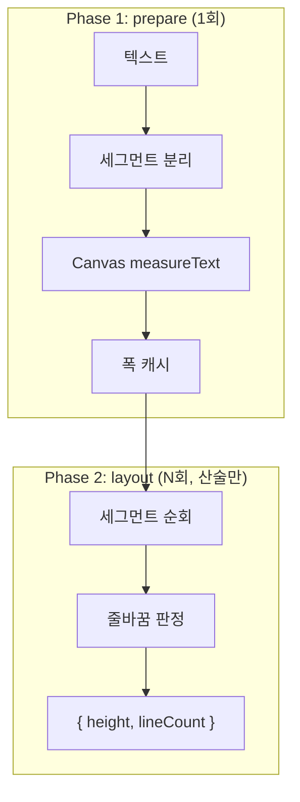

# Pretext — DOM-free 텍스트 측정/레이아웃 엔진

> 작성일: 2026-04-04
> 맥락: interactive-os 프로젝트에 적용 가능한 외부 라이브러리 평가

> **Situation** — 브라우저 텍스트 측정은 `getBoundingClientRect`/`offsetHeight` 등 DOM reflow를 유발하며, 대량 텍스트에서 성능 병목이 된다.
> **Complication** — AI 스트리밍 채팅, 가상 리스트, Canvas/SVG 렌더링 등에서 DOM 의존 없는 빠른 텍스트 레이아웃 수요가 증가한다.
> **Question** — Pretext가 우리 interactive-os 아키텍처에서 어떤 접점을 가지는가?
> **Answer** — 텍스트 측정 특화 도구로, 채팅 모듈 스트리밍 UI와 가상 리스트 높이 계산에 한정적으로 유용하다. ARIA/인터랙션 레이어와는 직접적 접점이 없다.

---

## Why — 브라우저 텍스트 측정의 비용

브라우저에서 텍스트 높이를 알려면 DOM에 렌더한 뒤 측정해야 한다. 이 과정은 layout reflow를 유발하며, 수백 개 항목을 측정하면 수백 ms가 소요된다.



Cheng Lou(react-motion 창시자)가 만든 Pretext는 Canvas의 `measureText()` API로 글꼴 엔진에서 문자 폭을 한 번 읽고 캐시한 뒤, 이후 모든 레이아웃을 순수 산술로 계산한다. DOM reflow 대비 300-600x 빠르다.

---

## How — 2단계 API 구조

### Core API

| 함수 | 역할 | 비용 |
|------|------|------|
| `prepare(text, font, options?)` | 텍스트 세그먼트 분리 + Canvas 측정 + 캐시 | ~19ms / 500개 배치 |
| `layout(prepared, maxWidth, lineHeight)` | 캐시된 폭으로 줄 수/높이 산출 | ~0.09ms |

```typescript
import { prepare, layout } from '@chenglou/pretext'

const prepared = prepare('AGI 春天到了. بدأت الرحلة 🚀', '16px Inter')
const { height, lineCount } = layout(prepared, containerWidth, 20)
```

### Advanced API

| 함수 | 용도 |
|------|------|
| `prepareWithSegments()` | 세그먼트 구조 포함 prepare |
| `layoutWithLines()` | 개별 라인 데이터 반환 |
| `walkLineRanges()` | 라인별 순회 (문자열 미생성) |
| `layoutNextLine()` | 이터레이터 — 가변 폭 레이아웃용 |
| `measureNaturalWidth()` | 고유 너비(intrinsic width) 계산 |

### Inline Flow API (실험적)

혼합 인라인 런(다른 폰트, atomic pill 등)을 처리:

```typescript
import { prepareInlineFlow, walkInlineFlowLines } from '@chenglou/pretext/inline-flow'

const prepared = prepareInlineFlow([
  { text: 'Ship ', font: '500 17px Inter' },
  { text: '@maya', font: '700 12px Inter', break: 'never', extraWidth: 22 },
])
walkInlineFlowLines(prepared, 320, line => { /* fragment 순회 */ })
```



---

## What — 주요 사용 사례 4가지

1. **가상 리스트 / Masonry** — 마운트 전 텍스트 높이 예측으로 layout shift 제거
2. **AI 스트리밍 채팅** — 토큰마다 버블 크기를 DOM reflow 없이 계산, 60fps 유지
3. **Text-around-shape** — `layoutNextLine()`으로 임의 형상 주변 텍스트 리플로우
4. **Canvas/SVG 렌더링** — DOM 없이 줄 위치 계산

### 제약

- `white-space: normal` + `overflow-wrap: break-word` 기준
- `system-ui` 폰트는 macOS에서 부정확 — 명명된 폰트 사용 필요
- CJK, 아랍어, 히브리어, 태국어, 한국어 등 다국어 지원
- ~15KB, 순수 TypeScript, WASM/네이티브 모듈 없음

---

## If — 프로젝트 시사점

### 접점 분석

| 우리 레이어 | Pretext 관련성 | 판단 |
|------------|--------------|------|
| store/engine/axis/pattern | 없음 | ARIA 인터랙션과 무관 |
| primitives (useAria) | 없음 | 키보드/포커스 패턴과 무관 |
| **ui — StreamFeed** | **중간** | 스트리밍 텍스트 높이 예측에 유용 |
| **pages — PageAgentChat** | **중간** | AI 채팅 버블 크기 계산에 유용 |
| ui — TreeView/ListBox | **낮음** | 가상 스크롤 시 높이 예측 가능 |

### 결론

**당장 도입할 이유는 약하다.** 이유:

1. **우리 프로젝트의 핵심은 인터랙션(ARIA/키보드)이지 텍스트 레이아웃이 아니다.** Pretext가 해결하는 문제(텍스트 측정 성능)는 우리의 주요 병목이 아님.

2. **채팅 모듈에서 제한적 가치.** `PageAgentChat`의 스트리밍 UI에서 버블 크기 예측에 쓸 수 있지만, 현재 CSS 기반 레이아웃으로 충분히 동작 중.

3. **가상 리스트가 필요해지면 재검토.** 수천 개 항목의 가변 높이 가상 스크롤을 구현할 때 `prepare()` → `layout()`으로 높이를 미리 계산하면 실질적 이점이 있다.

### 도입이 유의미해지는 시점

- 채팅 모듈이 수백 개 메시지를 가상 스크롤로 렌더할 때
- Canvas/SVG 기반 커스텀 렌더러를 만들 때
- 텍스트 측정이 프로파일링에서 병목으로 잡힐 때

---

## Insights

- **Cheng Lou의 설계 철학이 인상적**: "측정은 1회, 레이아웃은 산술만" — 이 2단계 분리는 우리 engine의 `prepare → execute` 패턴과 구조적으로 유사하다.
- **Inline Flow API가 진짜 가치**: 단순 텍스트 높이보다, 혼합 인라인 런(멘션 pill, 볼드 혼합 등)의 레이아웃이 더 어려운 문제인데 이걸 해결하고 있다.
- **15KB로 이 기능은 인상적**: 의존성 0, WASM 없이 순수 TS로 다국어 텍스트 세그멘테이션까지 처리.

---

## Sources

| # | 출처 | 유형 | 핵심 내용 |
|---|------|------|----------|
| 1 | [GitHub - chenglou/pretext](https://github.com/chenglou/pretext) | 공식 저장소 | API 문서, 소스 코드 |
| 2 | [README.md](https://github.com/chenglou/pretext/blob/main/README.md) | 공식 문서 | API 시그니처, 제약 사항 |
| 3 | [Pretext.js](https://pretextjs.dev/) | 공식 사이트 | 개요 및 데모 |
| 4 | [Hacker News 토론](https://news.ycombinator.com/item?id=47556290) | 커뮤니티 | 성능 벤치마크, 사용 사례 논의 |
| 5 | [Simon Willison 소개](https://simonwillison.net/2026/Mar/29/pretext/) | 블로그 | 라이브러리 배경 설명 |
| 6 | [TechBriefly - userland layout engines](https://techbriefly.com/2026/03/31/pretext-signals-a-shift-toward-userland-layout-engines/) | 분석 기사 | userland 레이아웃 엔진 트렌드 |

---

## Walkthrough

> Pretext를 직접 체험하려면?

1. `npm install @chenglou/pretext` 후 간단한 스크립트 작성
2. `prepare('한국어 텍스트 테스트', '16px sans-serif')` 호출하여 PreparedText 획득
3. `layout(prepared, 200, 24)` — 200px 폭에서의 높이/줄 수 확인
4. 브라우저 DevTools에서 `performance.now()`로 DOM 측정 vs Pretext 속도 비교

#kind/note #topic/library
