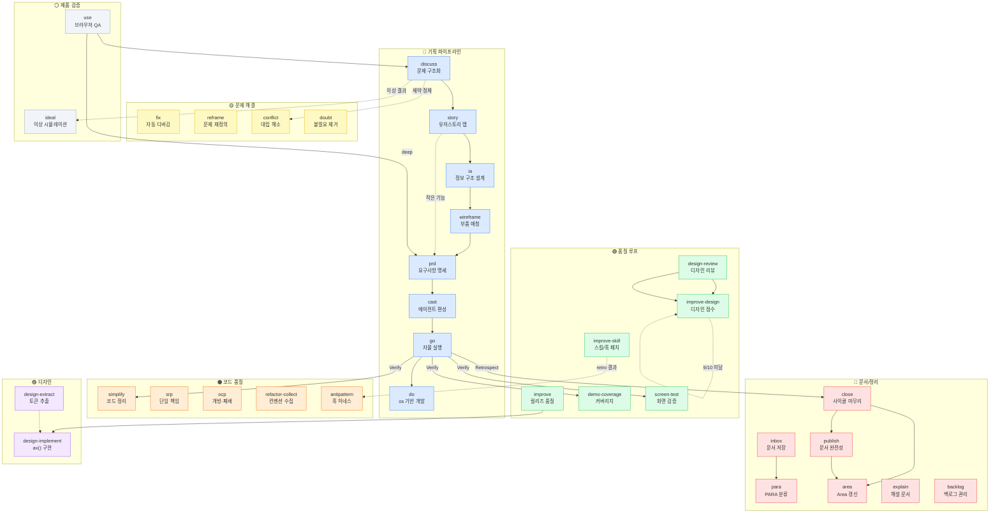

# 스킬 워크플로우 전체 시각화 — 2026-04-08

## 배경

보유한 모든 스킬의 연결 관계와 파이프라인을 시각화하여, 전체 워크플로우의 구조를 한눈에 파악한다. 3명의 탐색 에이전트(a-f, g-p, q-z)와 1명의 평가 에이전트가 조사한 결과를 종합했다.

## 스킬 인벤토리 (32개)

| 분류 | 스킬 |
|------|------|
| **기획 파이프라인** | discuss, story, ia, wireframe, prd, cast, go, do |
| **품질 루프** | improve, improve-design, improve-skill, demo-coverage, screen-test, design-review |
| **디자인** | design-extract, design-implement |
| **문제 해결** | fix, reframe, conflict, doubt |
| **코드 품질** | simplify, srp, ocp, refactor-collect, antipattern |
| **문서/정리** | inbox, para, publish, area, close, explain, backlog |
| **제품 검증** | use |
| **유틸리티** | ideal |

## 전체 워크플로우



## 핵심 파이프라인 3개

### 1. 메인 기획→실행 파이프라인
```
discuss → story → ia → wireframe → prd → cast → go → do
                                                  ↓
                                        verify (screenTest, simplify, demoCov)
                                                  ↓
                                        retrospect → close → publish → area
```

### 2. 제품 검증 루프
```
use (브라우저 QA) → discuss → prd → go → ... (메인 파이프라인 합류)
```

### 3. 디자인 품질 루프
```
design-extract → design-implement → design-review → improve-design ⟳ (9/10+까지)
```

## 독립 스킬 (파이프라인 밖)

| 스킬 | 진입 조건 |
|------|-----------|
| fix | 고장 신고 |
| reframe | 수정 방향 불만 |
| conflict | A vs B 딜레마 |
| doubt | 불필요한 것 제거 |
| srp / ocp | 파일 책임 점검 |
| refactor-collect | 코드리뷰 중 |
| antipattern | 안티패턴 발견 |
| explain | 해설 요청 |
| backlog | "나중에" |
| ideal | 이상 결과 시뮬레이션 |

## 다음 행동

- 이 다이어그램을 기반으로 누락된 연결이나 불필요한 스킬이 없는지 `/doubt` 검증
- 파이프라인 진입점 가이드 문서 작성 (어떤 상황에서 어떤 스킬로 시작?)

#kind/note #topic/tooling
