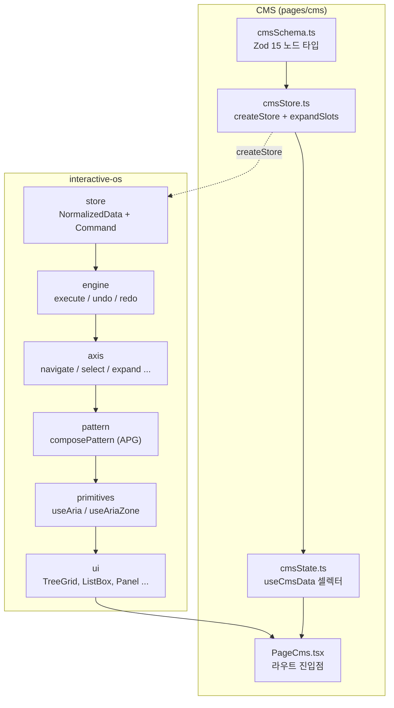
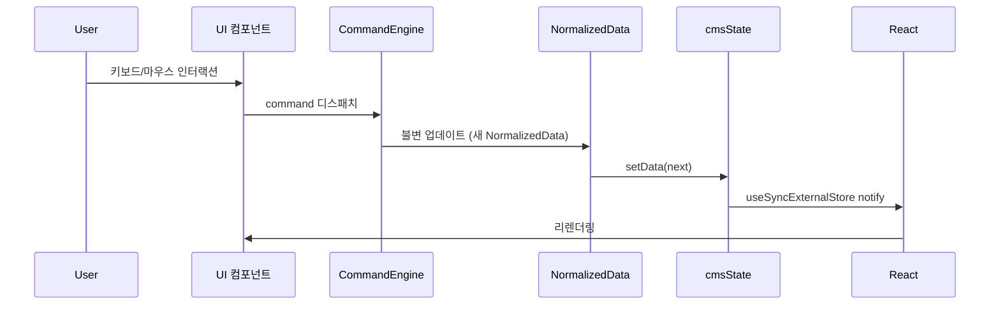

# CMS 모듈 아키텍처

## 시스템 개요

CMS 모듈은 Visual CMS 랜딩 페이지를 구동하는 편집 시스템이다. Zod 스키마(15개 노드 타입)가 데이터 모델의 SSOT이며, NormalizedData 플랫 맵에 모든 엔티티를 정규화하여 저장한다. 사용자의 모든 변경은 Command 패턴을 통해 불변 업데이트로 처리되고, useSyncExternalStore 기반 셀렉터가 React 렌더링을 구동한다.

## 레이어 다이어그램

## 핵심 모듈

| 모듈 | 책임 | 의존 |
|------|------|------|
| `cmsSchema.ts` | Zod 15개 노드 타입 정의, canAccept/validate/fieldsOf 파생 | zod, store/types |
| `cmsStore.ts` | NormalizedData 초기 데이터 생성, 슬롯 확장(expandAllSlots) | createStore, cmsSchema |
| `cmsState.ts` | useSyncExternalStore 기반 반응형 셀렉터 (useCmsData) | cmsStore |
| `PageCms.tsx` | `/` 라우트 진입점, UI 컴포넌트 조립 | cmsState, ui/* |
| `store/createStore` | NormalizedData 플랫 맵 생성, 트리 순회 유틸 | - |
| `engine/createCommandEngine` | Command 실행/undo/redo, Plugin 합성 | store |
| `pattern/composePattern` | axis 조합으로 APG 패턴 생성 | axis |
| `primitives/useAria` | engine + pattern을 React에 바인딩 | engine, pattern |

## 데이터 흐름

## 설계 결정

| 결정 | 이유 | 대안 |
|------|------|------|
| Zod 스키마를 SSOT으로 사용 | validate, canAccept, fieldsOf를 하나의 선언에서 파생하여 불일치 제거 | TypeScript 타입 + 별도 검증 로직 |
| NormalizedData 플랫 맵 | O(1) 조회, 불변 업데이트 용이, 트리 깊이에 무관한 성능 | 중첩 트리 객체 |
| Command 패턴 | undo/redo 자연스럽게 지원, 변경 이력 추적, Plugin 합성 가능 | 직접 state 조작 (setState) |
| useSyncExternalStore | React 18 공식 API, tearing 방지, 외부 store 연동에 최적 | useState + useEffect 구독 |
| expandAllSlots 후처리 | 복합 엔티티의 슬롯 자식을 플랫 맵에 통합하여 균일한 순회 보장 | 렌더 시점에 동적 슬롯 해석 |
| ui/ 완성품만 pages에서 사용 | primitives 직접 사용 금지로 일관된 ARIA/인터랙션 품질 보장 | 각 page에서 useAria 직접 호출 |
