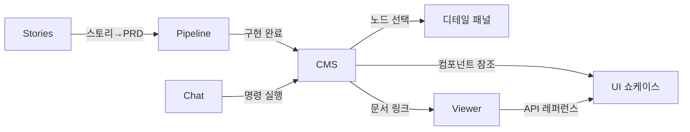

# Information Architecture — Aria CMS

## 사이트맵

```
/                       CMS (Visual CMS 에디터)
  ├─ sidebar            트리 네비게이션
  ├─ canvas             노드 캔버스
  └─ detail-panel       속성 편집 패널
/viewer/*               문서 & 메타 쇼케이스
/ui/*                   UI 완성품 쇼케이스
/chat                   Agent 채팅
/pipeline               파이프라인 대시보드
/stories                유저스토리 맵
```

## 네비게이션 구조

| 레벨 | 위치 | 요소 | 설명 |
|------|------|------|------|
| Primary | 상단 탭바 | CMS · Viewer · UI · Chat · Pipeline · Stories | 라우트 간 전환 |
| Secondary | CMS 좌측 사이드바 | 트리뷰 (TreeGrid) | 노드 계층 탐색 |
| Contextual | CMS 우측 디테일 패널 | 속성 폼, 액션 버튼 | 선택 노드 편집 |

## 화면별 콘텐츠 모델

| 화면 | 주요 콘텐츠 | 사용자 액션 | 진입점 |
|------|-------------|-------------|--------|
| `/` CMS | 15종 노드 트리 + 캔버스 | 생성, 편집, 이동, 삭제, undo/redo | 랜딩 (기본) |
| `/viewer/*` | 마크다운 문서, 머메이드 다이어그램 | 탐색, 검색, Lightbox 확대 | 탭바, CMS 내 링크 |
| `/ui/*` | UI 컴포넌트 데모 | 인터랙션 테스트, 코드 확인 | 탭바 |
| `/chat` | 메시지 스트림, 인터랙티브 블록 | 질의, 명령 실행 | 탭바 |
| `/pipeline` | 트리 x 단계 매트릭스 | 상태 확인, 단계 진행 | 탭바 |
| `/stories` | 유저스토리 맵 (backbone + walking skeleton) | 스토리 추가/우선순위 지정 | 탭바 |

## 정보 흐름



- **CMS → Detail**: 사이드바 트리에서 노드 선택 시 우측 패널에 속성 표시
- **CMS ↔ Viewer**: CMS 노드에 연결된 문서를 Viewer에서 열람
- **Stories → Pipeline → CMS**: 기획(스토리) → 실행(파이프라인) → 결과물(CMS 노드) 순환
- **Chat → CMS**: Agent가 CMS 노드를 직접 조작 가능

#kind/note
