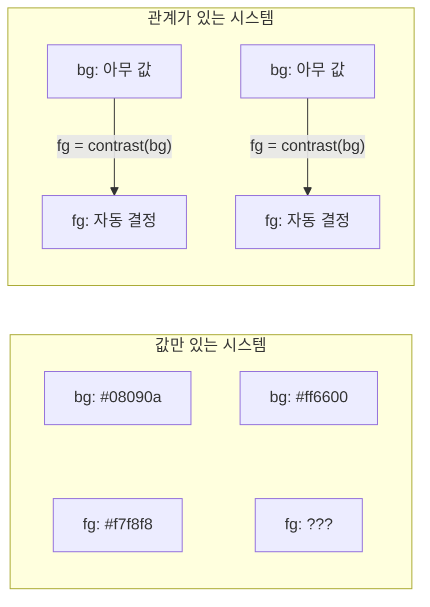

# 디자인 시스템 불변량 — 값이 아니라 값 사이의 관계를 잠그는 것

> 작성일: 2026-04-11
> 맥락: ax() 시스템에 pit of success를 도입하기 위한 discuss 중

> - 불변량(invariant)은 **개별 값이 아니라, 값과 값 사이의 수학적 관계**다
> - shadcn과 Linear는 이 관계를 CSS에 인코딩해서 "깰 수 없게" 만들었다
> - ax()에는 값은 많지만 관계가 거의 없다 — 그래서 조합이 깨질 수 있다
> - 불변량을 도입한다 = **개발자가 하나만 결정하면 나머지가 따라오는 관계를 만든다**

---

## 왜 "예쁜 값"을 아무리 모아도 시스템이 안 되는가

디자인 시스템을 만들 때 흔한 접근: 예쁜 색상 팔레트를 고르고, 좋은 폰트 사이즈를 정하고, 적당한 spacing을 잡는다. 값 하나하나는 다 좋다. 그런데 조합하면 어색하다.

이유: **값이 좋은 것과, 값 사이의 관계가 좋은 것은 별개**이기 때문이다.



| 구분 | 설명 |
|------|------|
| 왼쪽 | bg를 바꾸면 fg를 **수동으로** 맞춰야 한다. 빼먹으면 깨진다 |
| 오른쪽 | bg를 바꾸면 fg가 **자동으로** 따라온다. 깨질 수가 없다 |

**이 "자동으로 따라오는 관계"가 불변량이다.**

→ 디자인 불변량 = **입력값이 바뀌어도 깨지지 않는, 값 사이의 고정된 관계**

---

## shadcn이 잠근 3가지 관계

### 불변량 1: 페어링 — surface가 있으면 foreground도 있다

`--primary`를 빨간색으로 바꾸든 파란색으로 바꾸든, `--primary-foreground`도 함께 정의해야 한다. Button은 항상 `bg-primary text-primary-foreground`로 하드코딩.

**관계**: `fg = pair(bg)`. 값은 자유, 관계는 고정.

### 불변량 2: 비율 파생 — 하나만 바꾸면 7개가 따라온다

```css
--radius-sm: calc(var(--radius) * 0.6);
--radius-xl: calc(var(--radius) * 1.4);
```

`--radius`를 바꾸면 sm/xl의 **비율은 불변**. 개발자가 결정하는 건 1개, 나머지 6개는 수학이 결정.

**관계**: `radius_n = radius * ratio_n`. 시드 1개, 파생 N개.

### 불변량 3: 소비 잠금 — 컴포넌트의 토큰 참조가 고정

Button이 `bg-primary`를 쓰는 건 코드에 박혀 있다. 테마 작성자가 값은 바꿀 수 있지만, 참조 경로는 바꿀 수 없다.

**관계**: `component.bg = token[role]`. 소비 경로가 고정.

→ 36개 변수의 값만 잘 넣으면, 모든 컴포넌트가 자동으로 일관.

---

## Linear가 잠근 관계: 레벨 물리학

bg-level 0~4가 정적 계층이자 동적 상태 시스템.

```
Level 0 (#08090a) → Level 1 (#0f1011) → Level 2 (#141516) → Level 3 (#191a1b) → Level 4 (#28282c)
```

**불변량**: `hover_color = current_level + 1`.

hover 색상을 따로 정의할 필요가 없다. Level 2 위 요소가 hover되면 Level 3. **위치가 상태를 결정한다.**

텍스트도 4단계(primary/secondary/tertiary/quaternary). 어떤 배경 위에서든 위계 유지.

→ Linear의 불변량 = **깊이가 올라가면 밝아지고, 상태가 바뀌면 한 칸 이동**

---

## ax()에 없는 것: 관계

tone이 `--_bg`, `--_fg`, `--_bg-hover`, `--_bg-active` 4개를 주입하지만, 4개를 전부 소비하는 surface는 `sf-action` 하나뿐.

```
ax({ tone: 'accent', surface: 'action' })  → bg=파랑, fg=흰색 ✅
ax({ tone: 'accent', surface: 'display' }) → bg=파랑, fg=inherit ❓
```

**관계가 없으니 깨지는 것이다.**

shadcn에서는 불가능 — 항상 `bg-X text-X-foreground` 페어로 소비하니까.

---

## 한 문장 정리

| 개념 | 정의 |
|------|------|
| **불변량** | 값이 뭐든 유지되는 **값 사이의 관계** |
| **pit of success** | 불변량이 CSS에 인코딩되어 **깨고 싶어도 못 깨는** 상태 |
| **ax()에 없는 것** | tone→surface 관계가 action에서만 완성. 나머지 surface에서 fg 끊김 |

#kind/explain #topic/styles
