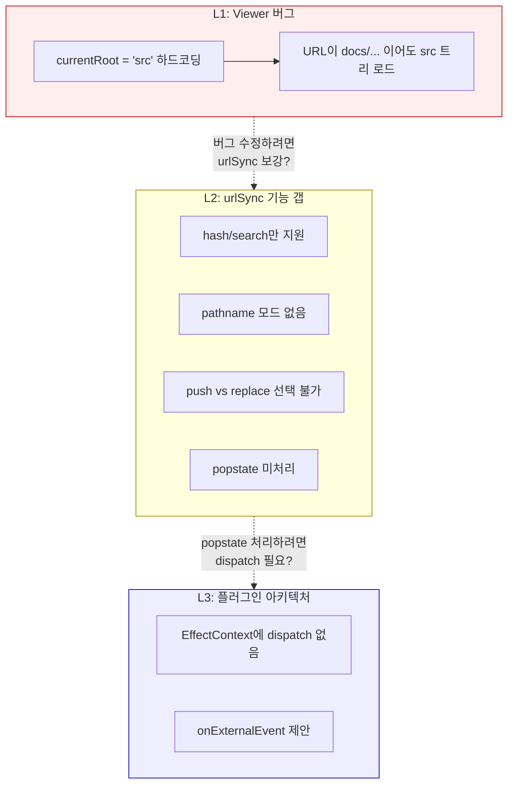
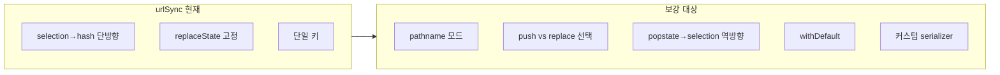
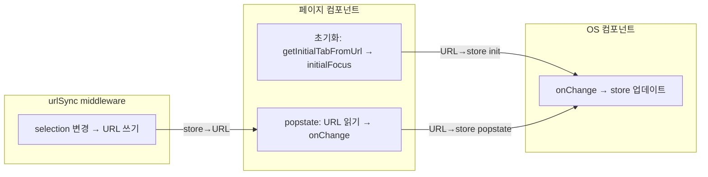

# urlSync 보강 논의의 실제 문제 — 3층을 구별하지 못했다

> 작성일: 2026-04-11
> 맥락: viewer URL 딥링크 미작동에서 출발한 urlSync 보강 논의

> - 문제가 3개인데 1개인 것처럼 논의했다
> - L1(viewer 버그)은 urlSync과 무관하다 — `currentRoot` 초기값 파싱 누락
> - L2(urlSync 기능 갭)는 실재한다 — pathname 모드, push/replace 선택, popstate 없음
> - L3(EffectContext dispatch)는 L2를 풀기 위해 필요하다고 가정했지만, 실제로는 middleware만으로 store→URL이 되고, URL→store는 이미 있는 `getInitialTabFromUrl` 패턴의 확장이다

---

## 3층이 하나로 뒤섞인 것이 혼란의 본질이다



| 층 | 색 | 설명 |
|----|-----|------|
| L1 빨강 | Viewer 버그 — 즉시 수정 가능 | `currentRoot` useState 초기값 |
| L2 노랑 | urlSync 기능 갭 — 플러그인 보강 | pathname, push/replace, popstate |
| L3 파랑 | 아키텍처 확장 — 필요 없음 | onExternalEvent는 존재하지 않는 문제의 해법 |

논의가 L1에서 출발해서 L3까지 점프한 뒤, "L3가 안 되니까 전부 페이지 레벨로" 라고 L2까지 포기한 것이 줏대 없이 흔들린 원인이다.

---

## L1은 urlSync과 무관하다 — useState 초기값 1줄 문제

`PageViewer.tsx:61`의 `useState('src')`가 URL을 무시한다.

```typescript
// 현재: 하드코딩
const [currentRoot, setCurrentRoot] = useState('src')

// 수정: URL에서 파싱
const [currentRoot, setCurrentRoot] = useState(() => {
  const seg = window.location.pathname.split('/')[2]
  return seg === 'docs' ? 'docs' : 'src'
})
```

이건 urlSync 플러그인과 무관하게 지금 바로 고칠 수 있는 버그다. 플러그인 아키텍처 논의가 필요한 문제가 아니다.

→ L1을 L2와 묶어서 논의한 것이 범위 팽창의 시작점이었다.

---

## L2는 실재한다 — urlSync 소비자 2곳이 동일한 한계를 공유한다

현재 urlSync 소비자:

| 소비처 | 사용법 | 한계 |
|--------|--------|------|
| `PagePipeline.tsx:145` | `plugins={[urlSync()]}` — hash로 탭 동기화 | push 없음, 뒤로가기 불가 |
| `PageThemeCreator.tsx:78` | `plugins={[urlSync()]}` — hash로 탭 동기화 | 동일 |

표준 라이브러리(nuqs, TanStack Router, use-query-params) 대비 누락 기능:



→ urlSync 보강은 의미 있는 작업이다.

---

## L3은 존재하지 않는 문제였다 — popstate→store는 dispatch가 필요 없다

"popstate에서 dispatch가 필요하니까 EffectContext를 확장해야 한다"는 전제가 거짓이었다.

실제 소비 패턴:



| 방향 | 책임 | 이미 있는 것 |
|------|------|-------------|
| store→URL | urlSync middleware | 있음 (확장 필요) |
| URL→store (init) | getInitialTabFromUrl 유틸 | 있음 |
| URL→store (popstate) | 페이지 useEffect + onChange | onChange는 있음, popstate 리스너만 추가 |

3자 분업이 이미 있는 개념만으로 완성된다. `onExternalEvent`도, `EffectContext.dispatch`도 필요 없다.

---

## 액션 플랜

1. **L1 즉시 수정**: `currentRoot` URL 파싱
2. **L2 urlSync 보강**: pathname 모드 + push/replace 옵션 + serializer
3. **L2 popstate**: `useUrlSync` 훅 또는 페이지 레벨 popstate → onChange 패턴 정립
4. **L3 불필요**: EffectContext, onExternalEvent 확장 없음

#kind/explain
